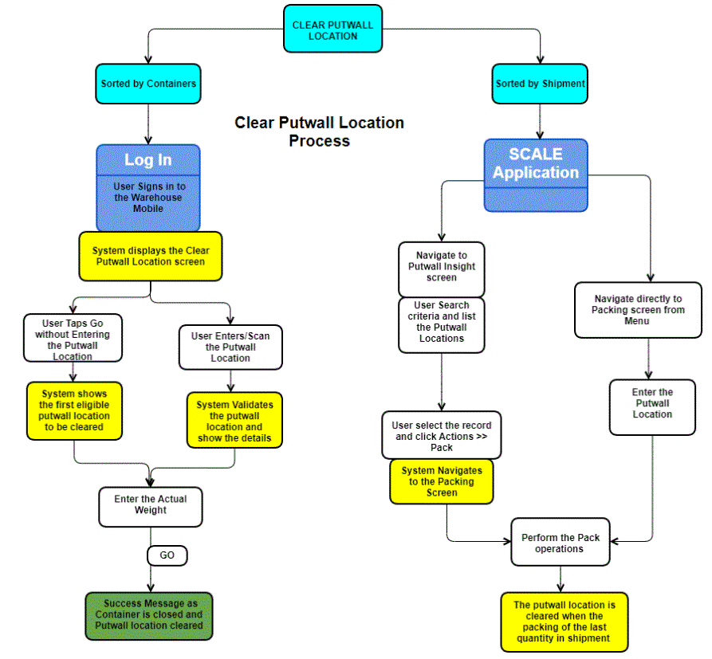

        
        <h1 data-source-node="n56">Warehouse Mobile - Clear Putwall Location</h1>
        
This feature enables user to clear the putwall location for which the sorting has been completed. Usually this operation is performed back of the wall where the putwall (Cubbies) are cleared for further processing.

        
 

        
<b data-source-node="n60">Clear putwall location condition</b>
        

        
The system will determine the locations that ready to be cleared using the following conditions. 

        <ul data-source-node="n62">
            <li data-source-node="n63">Shipment trailing status is greater or equal to <b data-source-node="n64">Packing Pending</b></li>
            <li data-source-node="n65">All the shipment details  are  completed sorted.</li>
        </ul>
        
The clear putwall is primarily performed with Packing screen for shipment in the web application and Clear Putwall in the Warehouse Mobile for container.

        
 

        <h4 data-source-node="n68">Topics Discussed</h4>
        <ul data-source-node="n69">
            <li data-source-node="n70"><a href="#Packing" data-source-node="n71">Clear Putwall Location- shipment.</a>
            </li>
            <li data-source-node="n72"><a href="#User" data-source-node="n73">Clear Putwall Location - Containers</a>
            </li>
            <li data-source-node="n74"><a href="#Process" data-source-node="n75">Process Flow</a>
            </li>
        </ul>
        <h4 data-source-node="n76">Clear Putwall Location - Shipment.</h4>
        
In this process the shipment that is completed sorted to a putwall location can be cleared using packing screen. You can initiate the packing by scanning the putwall location, 

        
 

        
<b data-source-node="n81">Configurations</b>
        

        
The following configurations need to be set.

        <ul data-source-node="n83">
            <li data-source-node="n84"><b data-source-node="n85">Packing Preferences</b> - Set the user packing preference with the Initiation field to Putwall Location.</li>
        </ul>
        
The putwall can be cleared in two ways.

        <ul data-source-node="n87">
            <li data-source-node="n88">Navigate in <b data-source-node="n89">Menu &gt;&gt;Shipping &gt;&gt; Packing</b>. In the packing screen, enter/scan the Putwall Location Or</li>
            <li data-source-node="n90">
                
Navigate to <b data-source-node="n92">Menu &gt;&gt; Shipping &gt;&gt; Putwall Insight</b> screen. Read <a href="2755b39d16d7150ac381808895d023b90f2e186ba8398a9aa4cbbfef1f8bfa53.html" data-source-node="n93">Putwall Insight</a> screen information.

                <ul data-source-node="n94">
                    <li data-source-node="n95">Enter and list the putwall location using the search criteria. Read <a href="9b67b9530e31965bd804c9ba287844c4c4e58e604703f6bffbfb9b24b1d819ac.html" data-source-node="n96">Packing</a> for more information.</li>
                    <li data-source-node="n97">Select the required putwall, <b data-source-node="n98">Actions &gt;&gt; Pack</b>. Note: The pack actions is enabled only for records that have been completed sorted. </li>
                    <li data-source-node="n99">
                        
System will clear the putwall location on packing the last quantity of the shipment and set the putwall location status to empty so that it can used to sort other shipments.

                    </li>
                </ul>
            </li>
        </ul>
        <blockquote data-source-node="n101">
            
Note: Users can also initiate the packing through the system menu (Menu &gt;&gt;Shipping &gt;&gt; Packing). Scan the putwall location to be cleared.

            <h4 data-source-node="n103">Clear Putwall Location - Containers</h4>
            
Clear the items that are sorted by containers to the putwall location. 

            <ol data-source-node="n106">
                <li value="1" data-source-node="n107">Log in to the Warehouse Mobile application.</li>
                <li value="2" data-source-node="n108">Select the <b data-source-node="n109">Clear Putwall Location</b> option from the Warehouse Mobile Main Menu.</li>
                <li value="3" data-source-node="n110">By default the first eligible putwall location is displayed to be cleared. User can enter/scan another <b data-source-node="n111">Putwall Location</b> and tap <b data-source-node="n112">Go</b></li>
                <li value="4" data-source-node="n113"> System displays the putwall location details like container ID, container type, system weight and actual weight.</li>
                <li value="5" data-source-node="n114"> Tap <b data-source-node="n115">Go</b> to close the container.</li>
                <li value="6" data-source-node="n116">A successful message is displayed indicating that container is closed and putwall location is cleared. </li>
                <li value="7" data-source-node="n117">System will then display next eligible putwall location to be cleared.</li>
            </ol>
            
 

            <h4 data-source-node="n119">Process Flow</h4>
            
 

            
Putwall clear has two key components, which can be performed in Warehouse Mobile application as well as from the main server application: 

            
Clearing in is the process of making putwall location empty. Putwall Clear is performed using the Warehouse Mobile - Clear Putwall Location and Putwall Insight screen in the application.

            
 

            
 

            
 

        </blockquote>
    