        
        <h1 data-source-node="n56">Processing RF Work (Override Pick)</h1>
        

        
<b data-source-node="n59">Processing RF Work:</b>
        

        <ul data-source-node="n60">
            <li data-source-node="n61"><a href="5ea80956b207057fdc2d841bb836a676ef62f554f56c6da1c57f1997b9f84e20.html" data-source-node="n62">Rules/Notes</a>
            </li>
            <li data-source-node="n63"><i data-source-node="n64">Override Pick</i>
            </li>
            <li data-source-node="n65"><a href="e2d4bbba10f9ff2aa02c583aab6ac5e721271b175fdb8758262f8518af94634d.html" data-source-node="n66">User/System Directed</a>
            </li>
            <li data-source-node="n67"><a href="7bee072967fa6d8550d6aff19880085a557ea4ef4de79277487df5fc1a7a96b5.html" data-source-node="n68">Group User</a>
            </li>
            <li data-source-node="n69"><a href="98a53fc6d787c072639a97bdd10e73a749a614c210f369cb920b61d6fc3d9385.html" data-source-node="n70">Pick Into Container</a>
            </li>
        </ul>
        

        
 

        
 

        
This topic discusses the overriding pick functionality, and outlines some examples to illustrate this concept.

        
 

        
 

        <h4 data-source-node="n77">Related Topics...</h4>
        
<a href="76770f4602f9b9e52b4fce3fb8973ffa25b3e882ead4fd0e2faea14766f877a3.html" data-source-node="n79">Work Process Summary</a>
        

        
<a href="63fce052573d8abfe6a45fd191ff6881a7d4e4dc8d037ecdc124418e157ec3fb.html" data-source-node="n81">Work Execution Setup Overview</a>
        

        
<a href="d114e048049d66584a42a020611a6659f5b2950e0912f87d395e30d98dbed9c0.html" data-source-node="n83">RF Work Execution Process Diagram</a>
        

        
<a href="1a75d6a66c308c9a7c8aa7ace1121d4ccbd75226aab7bf5a08209b9a5fdfa3c5.html" data-source-node="n85">Identifying a Quality Measures Reason Code</a>
        

        
<a href="cd3741887f8caeefd25da429127f48789337e8470ee9bf0b3d304849b963314c.html" data-source-node="n87">Assigning/Unassigning an Instruction 
 to a Team/User</a>
        

        
<a href="5b89491720e798c06ed1da2542cf04bdb137db52f5d20e794ddd87a79ea3c360.html" data-source-node="n89">Releasing Work Units</a>
        

        
<a href="00ca466d783430afb255a0d1a294cd97aefa4bd773b8306b0ba3b966ce55a529.html" data-source-node="n91">Processing Picking Management Work</a>
        

        
<a href="2a849da2c18bc5244f4e44f5346f871a765c86c96d43a011314a5857cfea60c5.html" data-source-node="n93">Processing Work</a>
        

        
<a href="af12a877ef6e18f7b653ab2e0bacbd54768b13e3f6be1c6103a1f3990d10bd5a.html" data-source-node="n95">Performing a Group Pick (Paper-Based)</a>
        

        
<a href="36ddea2cb1a2d426e4d2b4466e6783f35f6a43ac4b9e1c6fa9dc66f21e08d695.html" data-source-node="n97">GS1 RF Processing</a>
        

        
<a href="c3f65ac4de2fc3dce97e4180f4db0eaaa010a10166193e50df4370c1ee3c7799.html" style="font-weight: normal" data-source-node="n99">Inventory Attributes - Introduction</a>
        

        
<a href="5ca3cbb6b64b4c2e715765ba8a62f17f1b60ed19db5a7c1d31d560d5af493a8f.html" data-source-node="n101">Using Inventory Attributes (Full Screen)</a>
        

        
<a href="8b4ea1511cabbc4ffdc3f55e9e2be35a1b2fcdea91d0088e93891ce192d7e6e5.html" data-source-node="n103">Using Inventory Attributes (RF)</a>
        

        
 

        
 

        
The following is discussed on this topic:

        
- <a href="#OverridePickOptions" data-source-node="n108">Override Pick Options</a>

        
- <a href="#OverridePickGenRules" data-source-node="n110">Override Pick General Rules</a>

        
- <a href="#OverrideLPlessQty" data-source-node="n112">Override License Plate With Less Quantity</a>

        
- <a href="#AutoLicenseOverridePick" data-source-node="n114">Automatic Defaulting of License Plate during Override Pick</a>

        
- <a href="#AutoLotOverridePick" data-source-node="n116">Automatic Defaulting of Lot during Override Pick</a>

        
- <a href="#PartialPickOverride" data-source-node="n118">Performing a Partial Pick When Overriding</a>

        
 

        
 

        

        
 

        
 

        <h4 data-source-node="n124">Override Pick Options</h4>
        
The following override pick options are available during the picking process. These options are defined in the Work Special Handling Window:  

        
 

        
 

        <h5 data-source-node="n129">License Plate</h5>
        
You can override the license plate from which you are going to pick if license plate override is active on your work special handling record. The user would scan a different LP value (than the one currently assigned to the work instruction) in the LP field, and the system will treat this as an override of the original LP value. When you then press OK or Short Pick, the system will validate the new LP value. However, if either of the LP’s have any Suspense Quantity, then the override of the LP will not be allowed.  

        
 

        
 

        <h5 data-source-node="n133">Location</h5>
        
You can override the pick location from which you are going to pick product if location override is active on your work special handling record. The user would scan a different location ID (than the one currently assigned to the work instruction) in the Location field, and the system will treat this as an override of the original location value. When you then press OK or Short Pick, the system will validate that the new location has the correct item quantity to pick from. Note that you would likely have to override the original LP as well when you want to choose a new pick location. For non-license plate tracked locations, an override is allowed as long as the location being overridden to has enough available quantity (subtracting out the suspense quantity) to complete the override.

        
 

        
 

        <h5 data-source-node="n137">Lot</h5>
        
You can override the lot ID of the item you are going to pick if lot override is active on your work special handling record. The user would scan a different lot ID (than the one currently assigned to the item on the work instruction) in the Lot field, and the system will treat this as an override of the original lot value. When you then press OK or Short Pick, the system will validate the item's new lot ID.

        
 

        
 

        <h5 data-source-node="n141">Shipping Container</h5>
        
You can override the shipping container that you are picking into, if the allow shipping container override setting is active on your work special handling record. Note this is only for use when picking into shipping container.

        
 

        
 

        

        
 

        
 

        <h4 data-source-node="n148">Override Pick General Rules</h4>
        
Below are the rules that the system applies when you attempt to override during a pick:

        
 

        
 

        <h5 data-source-node="n153">License Plate</h5>
        
 

        
The override license plate must:

        <ul data-source-node="n156">
            <li data-source-node="n157"> Contain the ITEM   </li>
            <li data-source-node="n160">Reside in the same LOCATION as the original license plate (unless location override is allowed)  </li>
            <li data-source-node="n163">Match the QUANTITY (if the "allow different quantity" work special handling setting is not selected) </li>
        </ul>
        
 

        
When the License Plate is overridden:

        <ul data-source-node="n167">
            <li data-source-node="n168">The location inventory, work instructions, and relevant records are updated to reflect the override license plate (shipment allocation, shipment line, shipping containers, replenishment, work order, inventory management).</li>
        </ul>
        
 

        <h5 data-source-node="n170">Location</h5>
        
 

        
The override location must:

        <ul data-source-node="n173">
            <li data-source-node="n174">Contain the ITEM (with enough quantity)  </li>
            <li data-source-node="n177">Contain the LOT</li>
        </ul>
        
 

        
When the location is overridden:

        <ul data-source-node="n180">
            <li data-source-node="n181">The location inventory, work instructions, and relevant records are updated to reflect the override location (shipment allocation, shipment line, shipping containers, replenishment, work order, inventory management).</li>
        </ul>
        
 

        <h5 data-source-node="n183">Lot</h5>
        
 

        
The override lot must:

        <ul data-source-node="n186">
            <li data-source-node="n187"> Be tied to the ITEM  </li>
            <li data-source-node="n190">Reside in the same LOCATION (unless location override is allowed)  </li>
            <li data-source-node="n193">Have enough QUANTITY</li>
        </ul>
        
The override lot must not:

        <ul data-source-node="n195">
            <li data-source-node="n196">Be allocated at the destination location. This restriction is applicable only when the replenishment destination location is non-LP tracked location, and the allocated quantity is greater than on hand quantity.</li>
        </ul>
        
 

        
When the Lot is overridden:

        <ul data-source-node="n199">
            <li data-source-node="n200">The location inventory, work instructions, and relevant records are updated to reflect the override Lot (shipment allocation, shipment line, shipping containers, replenishment, work order, inventory management).</li>
        </ul>
        
 

        

        
 

        
 

        <h4 data-source-node="n205">Override License Plate With Less Quantity</h4>
        

        The quantity does not need to match if the "Allow different quantity override" setting is selected on your work special handling record. In this case, the override is allowed if the available quantity on the license plate being overridden to is greater than or equal to the pick quantity, OR the available quantity plus allocated quantity on the license plate being overridden to is greater than or equal to the pick quantity, and there is enough available quantity on the original license plate to move all allocated quantity from the license plate being overridden to, to the original license plate.

        
 

        

         
        <i style="text-decoration: underline" data-source-node="n210">Example 1</i>

        
 

        
- LP1 has on hand quantity 36 with Shipment1 allocated for quantity 20.

        
- LP2 has on hand quantity 24 with Shipment2 allocated for quantity 4.

        
- When user performs pick for Shipment1, overrides to LP2.

        
- <b data-source-node="n216">Override is allowed</b> with no change to allocations for LP2, since there was enough available quantity to handle the override.

        
 

        

            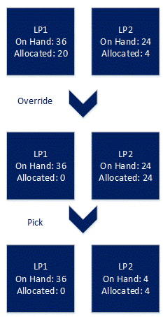
        

        
 

        
 

        
 

        
<u style="font-style: italic" data-source-node="n224">Example 2</u>
        

        
 

        
- LP1 has on hand quantity 36 with Shipment1 allocated for quantity 20.

        
- LP2 has on hand quantity 22 with Shipment2 allocated for quantity 19.

        
- When user performs pick for Shipment1, overrides to LP2.

        
- <b data-source-node="n230">Override is allowed</b> since the allocated quantity on LP2 is less than or equal to quantity being overridden.  Allocation from LP2 is moved to LP1.

        
 

        

            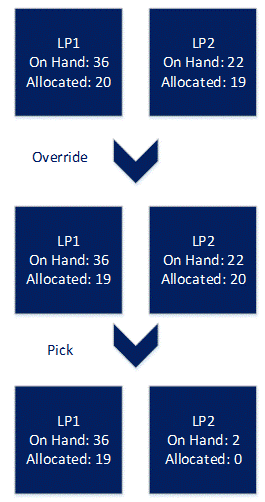
        

        
 

        
 

        
 

        
<u style="font-style: italic" data-source-node="n238">Example 3</u>
        

        
 

        
- LP1 has on hand quantity 36 with Shipment1 allocated for quantity 20.

        
- LP2 has on hand quantity 24 with Shipment2 allocated for quantity 24.

        
- When user performs pick for Shipment1, overrides to LP2.

        
- <b data-source-node="n244">Override is allowed</b> since the available quantity on LP1 plus the quantity being overridden is greater than or equal to the allocated quantity on LP2. Allocation from LP2 is moved to LP1.

        
 

        

            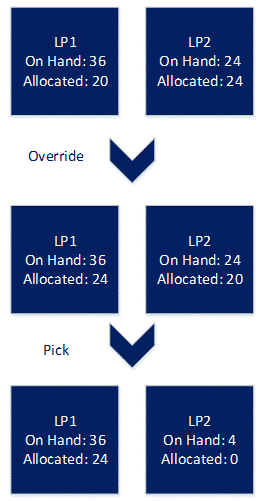
        

        
 

        
 

        
 

        
<u style="font-style: italic" data-source-node="n252">Example 4</u>
        

        
 

        
- LP1 has on hand quantity 36 with Shipment1 allocated for quantity 20.  Shipment2 allocated for quantity 16.

        
- LP2 has on hand quantity 24 with Shipment3 allocated for quantity 24.

        
- When user performs pick for Shipment1, overrides to LP2.

        
- <b data-source-node="n258">Override is not allowed</b> since the available quantity on LP1 plus the quantity being overridden is less than the allocated quantity on LP2.

        
 

        

            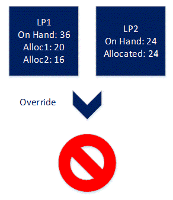
        

        
 

        
 

        
 

        
<u style="font-style: italic" data-source-node="n266">Example 5</u>
        

        
 

        
- LP1 has on hand quantity 36 with Shipment1 allocated for quantity 20.

        
- LP2 has on hand quantity 16 with nothing allocated.

        
- When user performs pick for Shipment1, overrides to LP2.

        
- <b data-source-node="n272">Override is not allowed</b> since the quantity on LP2 is less than the quantity being overridden.  User would have to perform a partial pick in order to complete this override.

        
 

        

            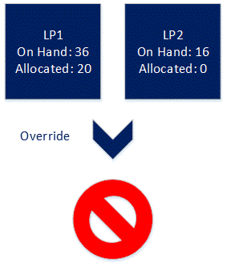
        

        
 

        
 

        

        
 

        
 

        <h4 data-source-node="n281">Automatic Defaulting of License Plate during Override Pick</h4>
        
 

        
When you enter or scan a new location in order to override the current pick, the system can default the license plate in certain instances. When you change the location value to pick from a different location than requested, the system will check to determine whether the license plate should be defaulted. The system will default the license plate when all of the following conditions are met:

        <ul data-source-node="n285">
            <li data-source-node="n286">
                
The new location entered is license plate tracked  

            </li>
            <li data-source-node="n290">The user is not required to scan the license plate (license plate verification is inactive)  </li>
            <li data-source-node="n293">
                
The new location entered contains a single license plate

            </li>
        </ul>
        
 

        

        
 

        
 

        <h4 data-source-node="n299">Automatic Defaulting of Lot during Override Pick</h4>
        
 

        
When you enter or scan a new location in order to override the current pick, the system can default the lot in certain instances. When you change the location value to pick from a different location than requested, the system will check to determine whether the lot should be defaulted. The system will default the lot when all of the following conditions are met:

        <ul data-source-node="n303">
            <li data-source-node="n304">
                
The item being picked is lot tracked  

            </li>
            <li data-source-node="n308">
                
The user is not required to scan the lot (lot verification is inactive)  

            </li>
            <li data-source-node="n312">
                
The new location entered does not track license plates and there is a single lot in the location, or the new location entered does track license plates and there is a single license plate in the location that contains a single lot value

            </li>
        </ul>
        
 

        
The system can default the lot when you enter or scan a new license plate either in the existing pick location or in the new location. When you change the license plate value to pick from a different license plate than requested, the system will check to determine whether the lot should be defaulted. The system will default the lot in this scenario when all of the following conditions are met: 

        <ul data-source-node="n316">
            <li data-source-node="n317">
                
The item being picked is lot tracked  

            </li>
            <li data-source-node="n321">
                
The user is not required to scan the lot (lot verification is inactive)  

            </li>
            <li data-source-node="n325">
                
The new license plate entered contains a single lot value

            </li>
        </ul>
        
 

        

        
 

        
 

        <h4 data-source-node="n331">Performing a Partial Pick When Overriding</h4>
        
The system allows you to perform a partial pick when doing an override.  All the validations are the same as a full pick, except that they will be based on the partial picked quantity.  If the validation passes, the system will split the work instruction and allocation request for the partial quantity and update that record with the override location/license plate/lot information. The remaining quantity's work instruction will still have the original location/license plate/lot information.

        
 

        
 

        
<u style="font-style: italic" data-source-node="n337">Example 1</u>
        

        
 

        
- LP1 has on hand quantity 36 with Shipment1 allocated for quantity 20.

        
- LP2 has on hand quantity 16 with nothing allocated.

        
- When user performs partial pick of 16 for Shipment1, by overriding to LP2.

        
- <b data-source-node="n343">Override is allowed</b> since there is enough available quantity on the new LP 2 and no allocations to move.  The system will split the instruction and leave the remaining 4 allocated on LP1.

        
 

        

            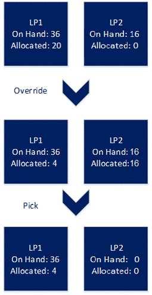
        

        
 

        
 

        
 

        
<u style="font-style: italic" data-source-node="n351">Example 2</u>
        

        
 

        
- LP1 has on hand quantity 36 with Shipment1 allocated for quantity 20.

        
- LP2 has on hand quantity 16 with 4 allocated.

        
- When user performs partial pick of 12 for Shipment1, by overriding to LP2.

        
- <b data-source-node="n357">Override is allowed</b> since there is enough available quantity on the new LP 2 even with allocated quantity.  The system will split the instructions for shipment1 by overriding the 12 quantity to LP2 and leave the remaining 8 allocated on LP1.

        
 

        

            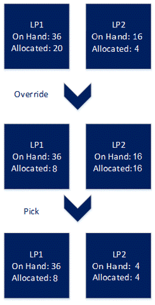
        

        
 

        
 

        
 

        
<u style="font-style: italic" data-source-node="n365">Example 3</u>
        

        
 

        
- LP1 has on hand quantity 36 with Shipment1 allocated for quantity 20.

        
- LP2 has on hand quantity 16 with 16 allocated.

        
- When user performs partial pick of 16 for Shipment1, by overriding to LP2.

        
- <b data-source-node="n371">Override is allowed.</b> We will swap the allocated quantities between LP1 and LP2 because the quantity allocated on LP2 is less than or equal to the available quantity on LP1. The system will split the instructions and leave the remaining 4 quantity allocated to LP1.

        
 

        

            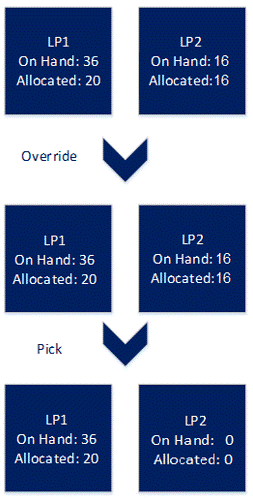
        

        
 

        
 

        
 

        
<u style="font-style: italic" data-source-node="n379">Example 4</u>
        

        
 

        
- LP1 has on hand quantity 36 with Shipment1 allocated for quantity 20.

        
- LP2 has on hand quantity 18 with 18 allocated.

        
- When user performs partial pick of 18 for Shipment1, by overriding to LP2.

        
- <b data-source-node="n385">Override is allowed.</b> We will swap the allocated quantities between LP1 and LP2 because the quantity allocated on LP2 is less than or equal to the available quantity on LP1. The system will split the instructions and leave the remaining 2 quantity allocated to LP1.

        
 

        

            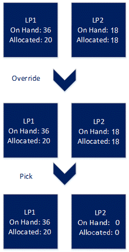
        

        
 

        
 

        
 

        
<u style="font-style: italic" data-source-node="n393">Example 5</u>
        

        
 

        
- LP1 has on hand quantity 36 with Shipment1 allocated for quantity 20.  Shipment2 allocates remaining 16.

        
- LP2 has on hand quantity 18 with 18 allocated.

        
- When user performs partial pick of 16 for Shipment1, by overriding to LP2.

        
- <b data-source-node="n399">Override is not allowed.</b> System should continue to error. This is because the allocated quantity on LP2 (18) is greater then available quantity on LP1 plus pick quantity (0+16).

        
 

        

            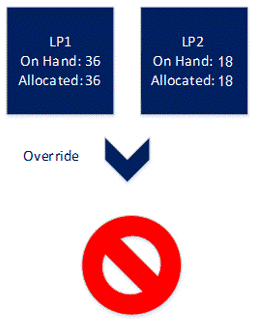
        

        
 

        
 

        
 

        
<i style="text-decoration: underline" data-source-node="n407">Example 6</i>
        

        
 

        
- LP1 has on hand quantity 36 with Shipment1 allocated for quantity 20. Shipment 2 allocates remaining16.

        
- LP2 has on hand quantity 18 with 18 allocated.

        
- When user performs partial pick of 18 for Shipment1, by overriding to LP2.

        
- <b data-source-node="n413">Override is allowed.</b> We will swap the allocated quantities between LP1 and LP2 because the quantity allocated on LP2 is less than or equal to the available quantity on LP1 plus pick quantity (0+18). The system will split the instructions and leave the remaining 2 quantity allocated to LP1.

        
 

        

            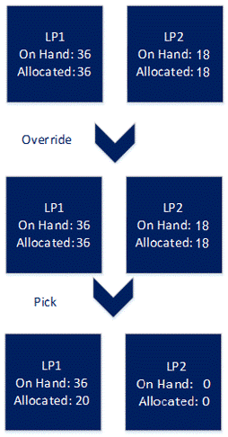
        

        
 

        
 

        
 

        
<u style="font-style: italic" data-source-node="n421">Example 7</u>
        

        
 

        
- LP1 has on hand quantity 36 with Shipment1 allocated for quantity 36.

        
- LP2 has on hand quantity 18 with 18 allocated for replenishment work to forward location.  Forward location has allocate in transit and has allocated 12 quantity to shipment2 work (dependent work).

        
- When user performs partial pick of 16 for Shipment1, by overriding to LP2.

        
- <b data-source-node="n427">Override is not allowed.</b> System should continue to error. This is because the allocated quantity on LP2 (18) has dependent work associated.

        
 

        

            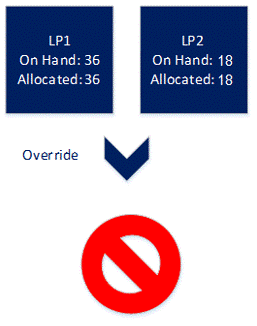
        

        
 

        
 

        
 

        
 

        
 

        
 

        
 

        
 

        
 

        
 

        
 

        
 

        
 

        
 

        
 

        
 

        
 

        
 

        
 

        
 

        
 

        
 

        
 

        
 

        
 

        
 

        
 

        
 

        
 

        
 

        
 

        
 

        
 

        
 

        
 

        
 

        
 

        
 

        
 

        
 

        
 

        
 

        
 

        
 

        
 

        
 

        
 

        
 

        
 

        
 

        
 

        
 

        
 

        
 

    