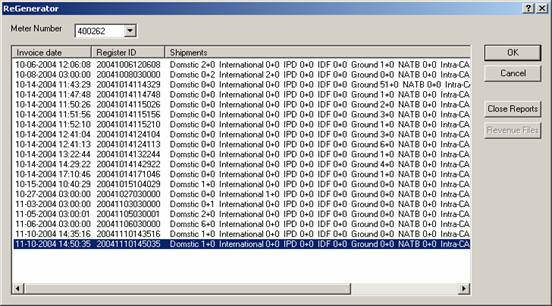

        
        <h1 data-source-node="n56">Reprinting a FedEx Manifest</h1>
        
This procedure will allow you to reprint a FedEx manifest document. 
 The FedEx utility "Report/Revenue ReGenerator" provides the 
 ability to regenerate the revenue file produced after a ‘Close’ operation 
 or to reprint a set of ‘End of Day’ reports. 

        
 

        
 

        <h4 data-source-node="n60">Procedures...</h4>
        <ol class="ol_1" data-source-node="n61">
            <li value="1" data-source-node="n62">Select <i data-source-node="n63">Start 
 | Programs | FedEx Ship Manager Server | Utilities | ReGenerator</i>, 
 and the following window will be displayed:    </li>
            <li value="2" data-source-node="n68">Select the appropriate 
 manifest/invoice date for which you wish to generate the revenue 
 file or End-Of-Day reports.  	-  To 
 generate the revenue files, click the Revenue Files button.  	- To generate the End-Of-Day reports, 
 click the Close Reports button.  The 
 reports will be released to a printer or placed in a directory based on 
 the Meter configuration.  </li>
            <li value="3" data-source-node="n74">Click Cancel 
 to close the application.</li>
        </ol>
        
 

        
 

        
 

        
 

        
 

        
 

        
 

        
 

        
 

        
 

        
 

        
 

        
 

        
 

        
 

        
 

        
 

        
 

        
 

        
 

        
 

        
 

        
 

        
 

        
 

    