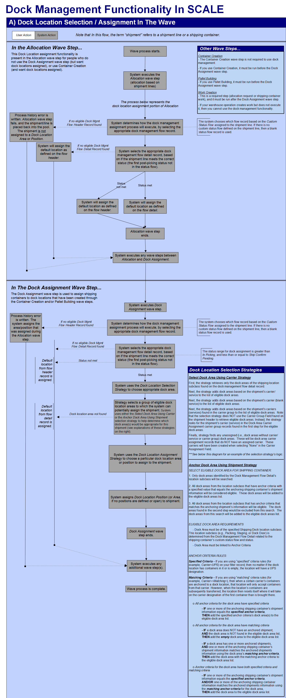
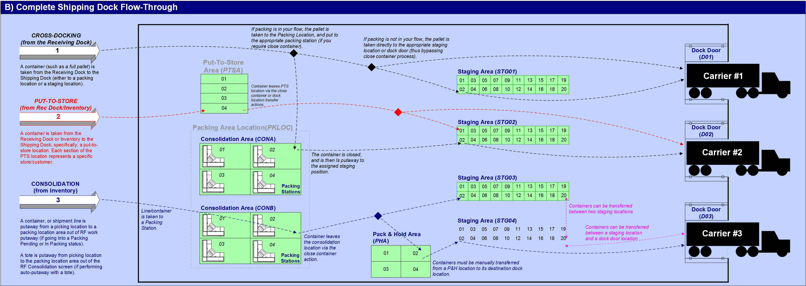
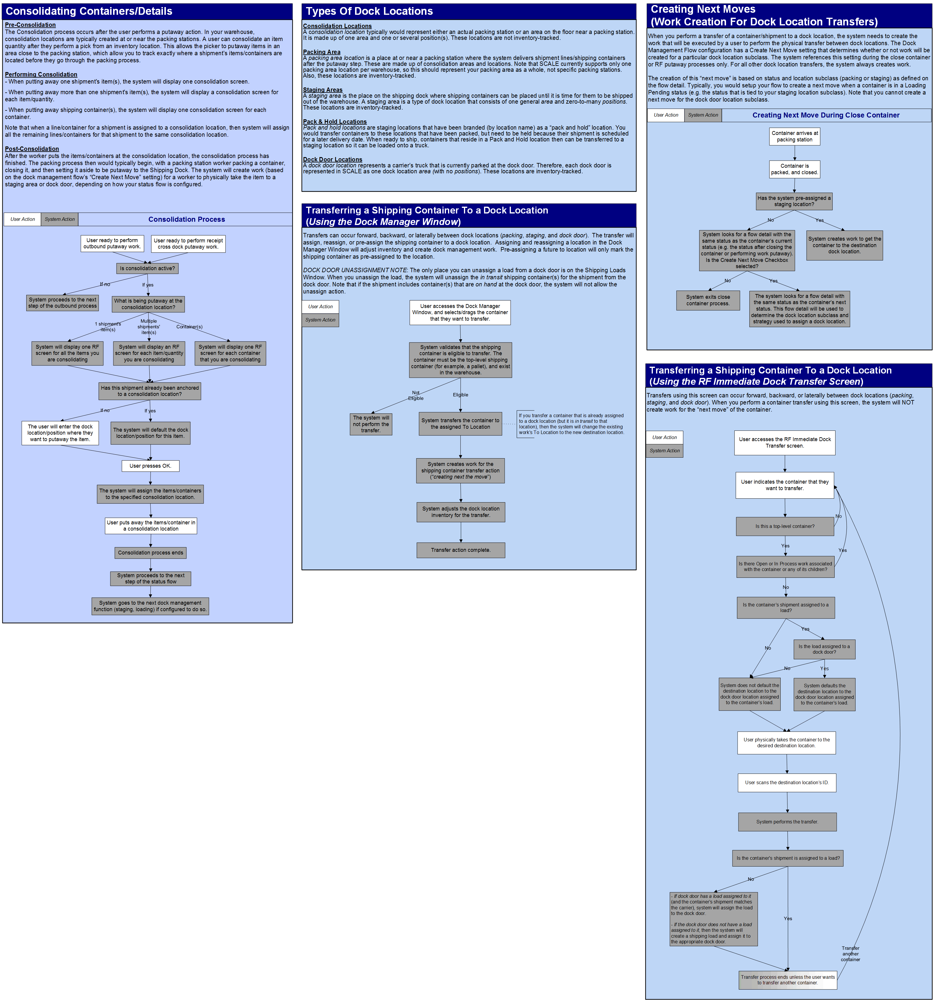

        
        <h1 data-source-node="n56">Dock Management Process Summary...</h1>
        
<a href="9857f2ac70834cdabe3e8245f2ee06c0451ed99523ada65852b8863953ad7b1c.html" style="font-style: normal;color: #000000;font-weight: bold" data-source-node="n58">Functionality</a>
        

        
<b data-source-node="n60">** Process Flows **</b>
        

        
 

        
 

        
The following process diagrams illustrate how the system uses dock management 
 to store items/containers at the shipping dock. 

        
 

        
        
 

        
Dock Location Strategy Assignment
        

        
 

        
<b data-source-node="n71">Assign One Dock Position Per Pallet</b>
        

        
 

        
First the assignment strategy will order the provided dock locations to facilitate assigning dock locations by Dock Location type (dock area or dock positions). This ordering may rearrange the list of eligible dock locations. Dock areas with dock positions will move to the top of the list, followed by dock areas without dock positions. Dock positions will be at the bottom of the list.

        
 

        
Dock Location Order: Dock areas with dock positions, Dock Areas without dock positions, Dock Positions

        
 

        
Next the system will attempt to assign shipments to dock area with dock positions.

        
 

        
Thereafter the system will attempt to assign shipment to dock areas without dock positions

        
 

        
Finally it will attempt to assign shipments to dock positions

        <ul data-source-node="n82">
            <li data-source-node="n83">If Open dock position, then assign to open dock position</li>
            <li data-source-node="n84">if closed dock position, then assign to closed dock position parent dock area</li>
        </ul>
        
 

        
Note: The select Dock Area using Carrier selection strategy will provide only dock areas. In this case, the assignment strategy will only see the dock areas. However if the strategy does not find any eligible dock areas, Dock Assignment will use the dock Management flow details default location. This default location can either be a dock area or dock position. When provided with a dock position, the assignment strategy will either assign to that dock position or the dock position parent dock area.

        
Dock Location Order

        
 

        
<b data-source-node="n90">Assign Dock Door to Shipping Load</b>
        

        
 

        
The assignment strategy first filter out the ineligible dock doors (dock doors assigned to open shipping loads) from the eligible dock doors provided from the selection strategy.

        
Thereafter the assignment strategy will assign the first dock door in the new list.

        
 

        
 

        

            
        

        
 

        

            
        

        
 

        
 

        
 

    