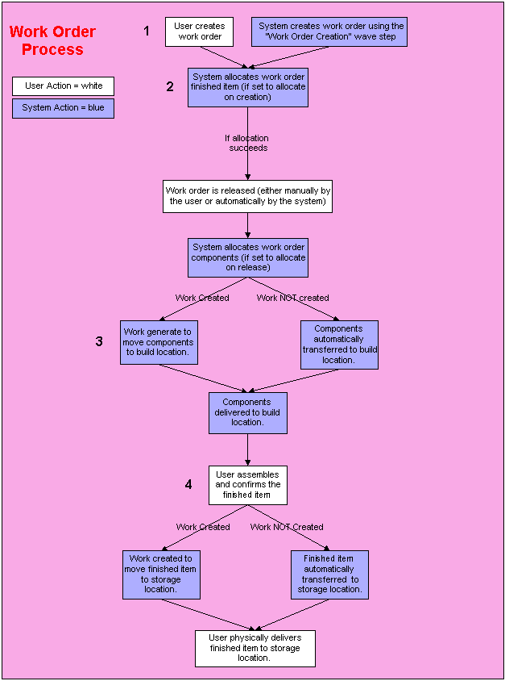

        
        <h1 data-source-node="n56">Work Order Process Summary</h1>
        
<a href="7ce64df7dccc3aa20a98d55da3bebc5982d6628fd234699353055014fb625c05.html" style="font-style: normal;color: #000000;font-weight: bold" data-source-node="n58">Functionality</a>
        

        
<b data-source-node="n60">** Process Flows **</b>
        

        
 

        
 

        
 

        
This process diagram illustrates how the system manages the movement 
 of work orders through the system. 

        
 

        

            
        

        
 

        
Work orders manage how a finished item will be assembled. They are defined 
 on the Work Order screen. All work order related information, 
 such as components and instructions, can be stored on a bill of material 
 record or manually entered when the work order is created.

        
 

        <h4 data-source-node="n71">Step 1: A work order is created.</h4>
        
An employee creates the work order on the Work Order screen; 
 or, the system creates a work order using the "Work Order Creation" 
 wave step:

        <ul type="disc" class="ul_1" data-source-node="n73">
            <li data-source-node="n74">
                
If a bill of material record exists 
 for this finished item, the system retrieves the finished item 
 values, component information and instructions from this record.

                
 

            </li>
            <li data-source-node="n77">If a bill of 
 material record does not exist, the user will need to provide the 
 finished item values, component information and instructions for this 
 work order. The system will not maintain this information for future work 
 orders.</li>
        </ul>
        
 

        <h4 data-source-node="n79">Step 2:The build components are allocated &amp; the work order is released.</h4>
        <ol class="ol_1" data-source-node="n80">
            <li value="1" data-source-node="n81">When the work order is created, the Work Allocation 
 Method system value is referenced to determine when components should 
 be allocated for a work order. If you want the system to allocate the 
 components immediately, this value should be set to "Allocate on 
 Work Order Creation." If you do not need to allocate the components 
 until the finished item can be assembled, this value should be set to 
 "Allocate on Work Order Release." Later, an employee can manually 
 allocate the components.   </li>
            <li value="2" data-source-node="n83">At this time, if the components were set to allocate 
 immediately, the system will increase the component quantity if these 
 two conditions are met: there is a quantity increase specified on the 
 component's bill of materials, and 
 the requested component quantity meets the minimum quantity required (also 
 defined on the BOM).  </li>
            <li value="3" data-source-node="n85">The employee releases the work order (if it was 
 not automatically released at the time of creation). Work orders are manually 
 released from the Work Order Insight screen. If the Work Allocation Method 
 value is set to "Allocate on Work Order Release," the system 
 now allocates the components, and performs the component quantity increase 
 (if appropriate) as described in step 2b.</li>
        </ol>
        
 

        <h4 data-source-node="n87">Step 3: The component parts are transferred to the build location.</h4>
        <ol class="ol_1" data-source-node="n88">
            <li class="li_1" value="1" data-source-node="n89">
                
The system references the user's 
 work order preference record to check the Create Work Checkbox.

                
 

            </li>
            <ul type="disc" class="ul_1" style="font-size: 10pt" data-source-node="n92">
                <li data-source-node="n93">
                    
If the checkbox is selected, 
 the system will check the work order component work criteria records to 
 see if any apply to this work order.

                    
 

                </li>
                
- If a record applies to 
 this work order, the system generates work to move the components 
 to the build location. The necessary inventory is allocated from the storage 
 location(s) and set as in transit to the build location. The user may generate 
 the Work Order Pick List to identify the appropriate components, pick 
 locations and build location, or he/she may complete the work on an RF 
 device.

                
 
-                     
                    If a 
 record does not apply to this work order, the system cannot create 
 work to move the allocated components. The user will need to deallocate 
 the build components, create a work criteria record to accommodate the 
 work order and select to allocate the components again.
               
                
 
<li data-source-node="n99">If the checkbox 
 is NOT selected, the system performs an inventory transaction to 
 move the components to the build location. Instead, the components are 
 removed from the storage location(s) On Hand Quantity and transferred 
 to the build location automatically. Usually when work is not created, 
 the user generates the Work Order Pick List to identify the appropriate 
 components, pick locations and build location.</li></ul>
            
 

            <li value="2" data-source-node="n101">The build components are physically delivered 
 to the build location.</li>
        </ol>
        
 

        <h4 data-source-node="n103">Step 4: The finished item is assembled and confirmed.</h4>
        <ol class="ol_1" data-source-node="n104">
            <li value="1" data-source-node="n105">
                
Employees use the instructions defined on the work order to assemble 
 the finished items. The Work Order Instruction List provides both instructions 
 and a list of the build components.

                
 

            </li>
            <li value="2" data-source-node="n108">
                
The system references the user's work order preference record to 
 check the Create Work Checkbox.

                
 

            </li>
            <ul type="disc" class="ul_1" style="font-size: 10pt" data-source-node="n111">
                <li data-source-node="n112">
                    
If the checkbox is selected, 
 the system will check the work order finished item work criteria records 
 to see if any apply to this work order.

                    
 

                </li>
                
- If a record applies to 
 this finished item, the system generates work to move the finished 
 items to the storage location(s). The necessary inventory is allocated 
 from the build location and set as in transit to the storage location. 
 The user may generate the Work Order Finished Item Putaway List to identify 
 the finished item and storage location(s), or he/she may complete the 
 work on an RF device.

                
 
-                     
                   If a 
 record does not apply to this finished item, the system cannot 
 create work to move the finished items to the appropriate storage location(s).
            
                
 
<li data-source-node="n118">
If the checkbox is NOT selected, 
 the system cannot create work to move the finished item to the appropriate 
 storage location(s). Instead, the items are removed from the build location's 
 On Hand Quantity and transferred to the storage location(s) automatically. 
 Usually when work is not created, the user generates the Work Order Finished 
 Item Putaway List to identify the appropriate finished item and putaway 
 locations.

 
</li></ul>
            <li value="3" data-source-node="n121">
                
The finished item is delivered to the build location. It can now 
 be allocated.

                
  

            </li>
        </ol>
        
 

        
 

        
 

        
 

        
 

        
 

        
 

        
 

        
 

        
 

    