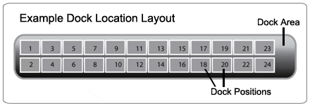

        
        <h1 data-source-node="n57">Creating Packing/Staging/Dock Door Locations</h1>
        
The purpose of a dock location is to track containers while they are on the shipping dock, from their arrival at the dock area until they are shipped out the warehouse dock door on a truck. 

        
 

        
Functionally, there are three variants of dock locations on your shipping dock: packing locations, staging locations, and dock door locations. A packing location typically consists of your warehouse's packing stations, and an area where product is dropped off to be packed. SCALE currently supports only one packing location per warehouse (which you are required to configure to use the application), and a packing location cannot have any positions. A staging location represents the part of the shipping dock where a shipment's containers reside (post-packing) until they are ready to be loaded onto a truck. A dock door location represents the actual warehouse door where a carrier's trailer is parked, waiting to be loaded with a shipment's containers. These containers are part of a shipping load, which is assigned to a dock door until it is load confirmed and the truck leaves the warehouse. 

        
 

        
In the system configurations, a dock location actually consists of two types of records created in the Location Window: one dock location area and zero-to-many dock location positions<i style="font-style: normal" data-source-node="n64"> (see the graphic below for a sample representation of this concept). Similar to inventory locations in your warehouse, dock locations are inventory tracked; however, they are required to be multi-item enabled and will not track license plates. Shipping containers are typically assigned to a dock location position, or to an area if there are no positions available. For more information on this assignment process, see the <a href="9857f2ac70834cdabe3e8245f2ee06c0451ed99523ada65852b8863953ad7b1c.html" data-source-node="n65">Dock Management Process Summary</a> topic. The relationship between an area and a position is defined in the configuration record of each position, as every position must have a parent dock area defined.</i>

        
 

        

            
            
        

        
 

        
 

        <h4 data-source-node="n71">Related Topics...</h4>
        
<a href="9857f2ac70834cdabe3e8245f2ee06c0451ed99523ada65852b8863953ad7b1c.html" data-source-node="n73">Dock Management Process Summary</a>
        

        
<a href="07edc31677cc85116035ff7f2dff1c2a3f7a1a38afdb4aaf867617691a7483ac.html" data-source-node="n75">Dock Management Setup</a>
        

        
<a href="0647e4eabceb836507240391e04a1529a5bb19faf3c5adf6ea08c38524dbfc8b.html" data-source-node="n77">Defining Locations</a>
        

        
 

        
 

        
<a class="MCDropDownHotSpot dropDownHotspot MCDropDownHotSpot_ MCHotSpotImage" data-source-node="n82">Field Descriptions...</a>
            

                
See the topic <a href="0647e4eabceb836507240391e04a1529a5bb19faf3c5adf6ea08c38524dbfc8b.html" data-source-node="n86">Defining Locations</a> for a list of fields that appear on the Location Window.

            

        

        
 

        
 

        <h4 data-source-node="n89">Required Configuration Fields...</h4>
        
Dock locations are created in a similar manner as other inventory locations in your warehouse. You will need to create these locations using the Location Window. Listed below are the fields that you will need to specifically address when creating a dock location:

        
 

        <table style="margin-left: 0;margin-right: auto" data-source-node="n92">
            <col style="width: 295px" data-source-node="n93">
            <col style="width: 188px" data-source-node="n94">
            <tbody data-source-node="n95">
                <tr data-source-node="n96">
                    <td style="font-size: 10pt;font-weight: normal;color: #000000;font-style: italic" data-source-node="n97">General Tab</td>
                    <td style="font-size: 10pt;color: #000000;font-weight: normal;font-style: italic" data-source-node="n98">Dock Tab</td>
                </tr>
                <tr data-source-node="n99">
                    <td style="font-size: 10pt" data-source-node="n100">Location Class (choose the value "Shipping")</td>
                    <td style="font-size: 10pt;font-style: normal" data-source-node="n101">Dock Area Field</td>
                </tr>
                <tr data-source-node="n102">
                    <td style="font-size: 10pt" data-source-node="n103">Location Subclass</td>
                    <td style="font-size: 10pt;font-style: normal" data-source-node="n104">Next Dock Area Field</td>
                </tr>
                <tr data-source-node="n105">
                    <td style="font-size: 10pt" data-source-node="n106"> </td>
                    <td style="font-size: 10pt;font-style: italic" data-source-node="n107">
                        
Position Field

                    </td>
                </tr>
                <tr data-source-node="n109">
                    <td style="font-size: 10pt" data-source-node="n110"> </td>
                    <td style="font-size: 10pt;font-style: normal" data-source-node="n111">Parent Dock Area Field</td>
                </tr>
                <tr data-source-node="n112">
                    <td style="font-size: 10pt" data-source-node="n113"> </td>
                    <td style="font-size: 10pt;font-style: normal" data-source-node="n114">Number of Rows Field</td>
                </tr>
            </tbody>
        </table>
        
 

        
 

        <h5 data-source-node="n117">Note For Warehouses That Do Not Track Inventory Or Use Locations...</h5>
        
Clients that do not track inventory or use locations 
will need to create a packing location and 
a dock management flow record that uses this 
location as the default location.  No flow details will need to be created for this record.  The RF putaway process 
will use this packing location when displaying the 
putaway location.

        
 

        
 

        
 

        
 

        
 

        
 

        
 

        
 

        
 

        
 

        
 

        
 

        
 

        
 

        
 

        
 

        
 

        
 

        
 

        
 

        
 

        
 

        
 

        
 

        
 

        
 

        
 

        
 

        
 

        
 

        
 

        
 

        
 

        
 

        
 

        
 

    