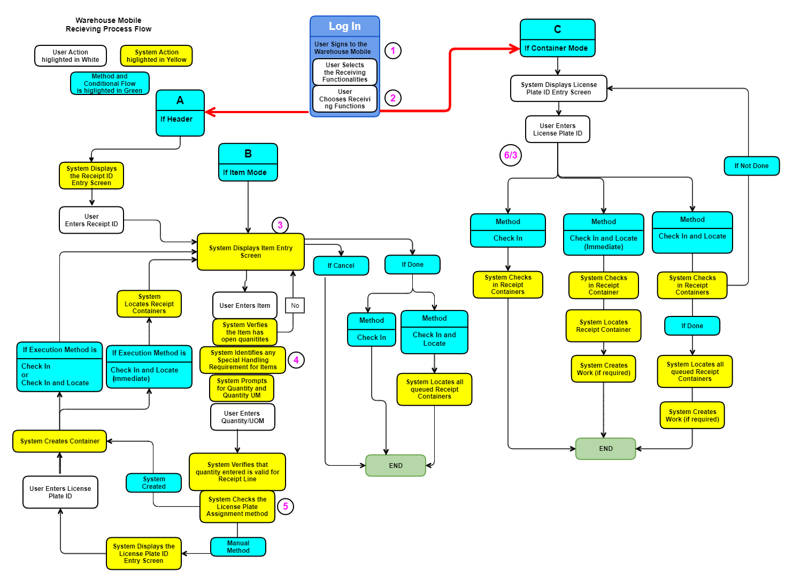

        
        <h1 data-source-node="n56">Using Warehouse Mobile - Receiving</h1>
        
Warehouse Mobile Receiving is the process of checking in and locating the product. 

        
<i data-source-node="n59">Check in</i> is the process of adding received product on to the receiving dock. During <i data-source-node="n60">check in</i>, the system creates a receipt container to support the quantity on a receipt line; the container can include either the entire line quantity or part of the quantity. <i data-source-node="n61">Locating</i> is the process of selecting the proper storage location(s) for the checked in product.

        
 

        <h4 data-source-node="n63">Related Topics...</h4>
        
<a href="b9c3ffa9a81498cb548bdb61d00ba2dd34e5bfb79695f24b28a31d26d9eb8369.html" style="font-weight: normal" data-source-node="n65">Receiving Process Summary</a>
        

        
<a href="47a8b05e23ca9439d5e313cb9e74b7502cb87d797f589658af45959f2d4dedb5.html" style="font-weight: normal" data-source-node="n67">Receiving Setup Overview</a>
        

        
<a href="819737ec46ea63973259964fb951c9f43b42c18355d46f4a5c9bb9992d45a21a.html" data-source-node="n69">Creating a Receipt/Receipt Line</a>
        

        
<a href="cdd035231269b9e86ef14a592f83a10888f073e35b300f82b60fe7301b4832ee.html" data-source-node="n71">Processing Receipts</a>
        

        
<a href="a357eac1f7ebf1b8fcf6edee90c086783da65f07d18fbdcc06236891e314cebc.html" data-source-node="n73">Checking In and Locating Product (Receipt Workbench)</a>
        

        
<a href="1e177683ead3d4dbf24684d72666831cb828dfcf3bec8775a1997fcba8c88b69.html" data-source-node="n75">Creating/Viewing Receipt 
 Appointments</a>
        

        
 

        <h4 data-source-node="n77">Warehouse Mobile screens</h4>
        <ul data-source-node="n78">
            <li data-source-node="n79"><a href="c0b8a4482e4b858f753b52028b7a8e806ba5240c1d5303379719af3082ece1a0.html" data-source-node="n80">Work Execution</a>
            </li>
            <li data-source-node="n81"><a href="b33a75f313a267b2873999318c8752e9ddbe07fbd8201653f8f3aa6b757253b5.html" data-source-node="n82">Close Container</a>
            </li>
            <li data-source-node="n83"><a href="4bf6394a506302ab51f0d295d2c6159739380cb3fe96ba50f65972a616dbcf87.html" data-source-node="n84">Close Putaway Group</a>
            </li>
            <li data-source-node="n85"><a href="e9ce2d02e2d39cac6a47697cf78ba14b45aaf87d69152dc75acae644a4ca56d2.html" data-source-node="n86">Cycle Count Work</a>
            </li>
        </ul>
        <h4 data-source-node="n87">Topics Discussed</h4>
        <ul data-source-node="n88">
            <li data-source-node="n89"><a href="#Receive" data-source-node="n90">Receiving Workflows</a>
                <ul data-source-node="n91">
                    <li data-source-node="n92"><a href="#Receiving_header" data-source-node="n93">Receiving by Header-Item initiation flow</a>
                    </li>
                    <li data-source-node="n94"><a href="#Receiving_LP" data-source-node="n95">Receiving by License Plate initiation flow</a>
                        <ul data-source-node="n96">
                            <li data-source-node="n97"><a href="#Inventory_attributes" data-source-node="n98">Add Inventory Attributes</a>
                            </li>
                        </ul>
                    </li>
                    <li data-source-node="n99"><a href="#QuickReceive" data-source-node="n100">Quick Receive</a> </li>
                    <li data-source-node="n101"><a href="#lot_confirm" data-source-node="n102">Lot Controlled Item check in (Header-Item initiation flow)</a>
                    </li>
                    <li data-source-node="n103">
                        
<a href="#Lot_LP" data-source-node="n105">Lot Controlled Item check in (License Plate flow)</a>
                        

                    </li>
                    <li data-source-node="n106"><a href="#lot_confirm" data-source-node="n107">Confirm Lot Update</a>
                    </li>
                    <li data-source-node="n108"><a href="#Mutilpe_LP" data-source-node="n109">Multiple license plate check in</a>
                    </li>
                    <li data-source-node="n110"><a href="#Nest" data-source-node="n111">Nest During Check in</a>
                    </li>
                    <li data-source-node="n112"><a href="#Parent_checkin" data-source-node="n113">Check in Parent receipt container</a>
                    </li>
                    <li data-source-node="n114"><a href="#Multiple_reciept_line" data-source-node="n115">Multiple Receipt Lines</a>
                    </li>
                    <li data-source-node="n116"><a href="#Reason_code" data-source-node="n117">Reason Code and Disposition Code</a>
                    </li>
                    <li data-source-node="n118"><a href="#Locate" data-source-node="n119">Locate Receipt Container</a>
                    </li>
                    <li data-source-node="n120"><a href="#Appointment" data-source-node="n121">Check in with scheduled appointment</a>
                    </li>
                    <li data-source-node="n122"><a href="#Blind" data-source-node="n123">Blind Receiving</a> </li>
                </ul>
            </li>
            <li data-source-node="n124"><a href="#Assign_putaway" data-source-node="n125">Assign Putaway Group.</a>
                <ul data-source-node="n126">
                    <li data-source-node="n127"><a href="#Receiving_putaway" data-source-node="n128">Receiving with  Putaway Group</a>
                    </li>
                    <li data-source-node="n129"><a href="#Assign_close_putaway" data-source-node="n130">Assign and close putaway group</a>
                    </li>
                </ul>
            </li>
            <li data-source-node="n131"><a href="#Create_WM_menu" data-source-node="n132">Create Receiving Preference using Warehouse Mobile Menu</a>
            </li>
            <li data-source-node="n133"><a href="#Check" data-source-node="n134">Check In and Locating Product (Warehouse Mobile)</a>
                <ul data-source-node="n135">
                    <li data-source-node="n136"><a href="#Execution" data-source-node="n137">Execution Method Descriptions</a>
                    </li>
                    <li data-source-node="n138"><a href="#Procedures" data-source-node="n139">Procedures</a>
                    </li>
                </ul>
            </li>
            <li data-source-node="n140"><a href="#Receive" data-source-node="n141">Receiving Warehouse Mobile Process Diagram</a>
            </li>
        </ul>
        
 

        <h4 data-source-node="n143">Receiving Workflows</h4>
        
 

        
The Receiving workflows are  described below.

        <h5 data-source-node="n147">Receiving by Header-Item initiation flow</h5>
        
Follow the steps for receipt check in by header-item initiation method.

        <ol data-source-node="n150">
            <li value="1" data-source-node="n151">Tap <b data-source-node="n152">Receiving</b> to view the <b data-source-node="n153">Select receiving preference</b> screen.</li>
            <li value="2" data-source-node="n154">Tap to select receiving preference as required. <b data-source-node="n155">Note</b>: In case default receiving preference is set in the User Profile settings, the system will not prompt user to select receiving preference.</li>
            <li value="3" data-source-node="n156">Enter or scan the <b data-source-node="n157">Receipt ID</b>.</li>
            <li value="4" data-source-node="n158">Tap <b data-source-node="n159">Go</b> to view the <b data-source-node="n160">Receipt Initiation</b> screen.</li>
            <li value="5" data-source-node="n161">Enter or scan the Item to view the <b data-source-node="n162">Receipt Check In</b> screen. You can view the details of the Item such as Item ID, description, Quantity and its UOM. Optionally you can choose to change the UOM from the drop-down list.</li>
            <li value="6" data-source-node="n163">Enter the <b data-source-node="n164">Quantity</b> and Tap <b data-source-node="n165">Go</b>. </li>
            <li value="7" data-source-node="n166">System will prompt for  reason code and disposition code if enabled in the receiving preference. Tap <b data-source-node="n167">Go</b>.</li>
            <li value="8" data-source-node="n168">It will re-direct to the <b data-source-node="n169">Receipt Initiation</b> screen after successful check in of the item. <ol data-source-node="n170"><li value="1" data-source-node="n171">
If LP assignment method is Manual, then user enters a license plate.
</li><li value="2" data-source-node="n173"> If LP assignment method is System, the system generates license plate.</li></ol></li>
        </ol>
        

            <h5 data-source-node="n175">Catch-Weight Entry in Header-Item Receiving</h5>
            
 

        

        <ul data-source-node="n177">
            <li data-source-node="n178">In Warehouse Mobile, catch-weight receiving is supported in the Header-Item initiation flow.</li>
            <li data-source-node="n179">After you enter the receipt ID, item, quantity, and any required receiving information, system proceeds to the Catch Weight Entry screen when the receipt line item is configured as a catch-weight item.</li>
            <li data-source-node="n180">If license plate assignment is system-generated, system creates the license plate and then prompts for catch weight entry for the license plate. Select the catch weight UOM and complete the entry. If multiple license plates are created, repeat catch weight entry for each license plate.</li>
            <li data-source-node="n181">If license plate assignment is manual, enter the license plate ID first. System then prompts for catch weight. Select the catch weight UOM and complete the entry. If multiple license plates are created, repeat these steps for each license plate.</li>
            <li data-source-node="n182">After catch weight entry is completed, system continues the receiving flow. If the receiving preference uses check in and locate or check in and locate (immediate), the system continues into locating and, when configured, putaway work creation while preserving the captured catch weight.</li>
        </ul>
        
 

        <h5 data-source-node="n184">Receiving by License Plate initiation flow</h5>
        
Follow the steps for receipt check in by License Plate initiation method.

        <ol data-source-node="n187">
            <li value="1" data-source-node="n188">Tap <b data-source-node="n189">Receiving</b> to view the <b data-source-node="n190">Select receiving preference</b> screen.</li>
            <li value="2" data-source-node="n191">Tap on receiving preference with license plate method.</li>
            <li value="3" data-source-node="n192">Enter or scan the <b data-source-node="n193">License Plate</b>.</li>
            <li value="4" data-source-node="n194">System will prompt for  reason code and disposition code if enabled in the receiving preference. Tap <b data-source-node="n195">Go</b></li>
            <li value="5" data-source-node="n196">Tap <b data-source-node="n197">Go</b>, Receipt Check in successful message displayed.</li>
            <li value="6" data-source-node="n198">Tap the <b data-source-node="n199">Done</b> button when checked in using the <i data-source-node="n200">Check in and Locate </i>method.</li>
        </ol>
        <h5 data-source-node="n201">Add inventory attributes</h5>
        
Users can add inventory attributes during receipt check in using header item and license plate initiation. 

        <h6 data-source-node="n204">Configuration</h6>
        
Users need to configure inventory attributes SRC file in the receiving preference. Follow the steps given below

        <ul data-source-node="n206">
            <li data-source-node="n207">Use an existing or create a new receiving preference with Header-Item initiation.</li>
            <li data-source-node="n208">Create a warehouse mobile screen flow using the ReceivingInventoryAttributes.json</li>
            <li data-source-node="n209">Open the Warehouse mobile menu insight screen, and map the warehouse mobile screen flow with the receiving preference.</li>
            <li data-source-node="n210">In case it is license plate initiation, then users need to use the ReceivingLicensePlateInventoryAttributes.json as screen flow and License Plate initiation method in the receiving preference.</li>
        </ul>
        <h6 data-source-node="n211">Steps</h6>
        <ul data-source-node="n212">
            <li data-source-node="n213">During the receipt check in, the system prompts the user to enter Inventory attributes 1 to 20.</li>
            <li data-source-node="n214">Enter the details and Tap <b data-source-node="n215">GO</b> to save the record.</li>
            <li data-source-node="n216">Optionally, <ul data-source-node="n217"><li data-source-node="n218">Tap <b data-source-node="n219">Go</b> to skip the inventory attribute record.</li><li data-source-node="n220">Select <b data-source-node="n221">Actions</b> &gt;&gt; <b data-source-node="n222">Done</b>  after saving one or more inventory attributes to complete check in process.</li></ul></li>
        </ul>
        <h5 data-source-node="n223">Receiving by Trailer ID - Item initiation flow</h5>
        
Follow the steps for receipt check in by Trailer ID - Item initiation method.

        <ol data-source-node="n226">
            <li value="1" data-source-node="n227">Tap <b data-source-node="n228">Receiving</b> to view the <b data-source-node="n229">Select receiving preference</b> screen.</li>
            <li value="2" data-source-node="n230">Tap on receiving preference with Trailer ID - Item method.</li>
            <li value="3" data-source-node="n231">If only one receipt for the trailer ID.<ol data-source-node="n232"><li value="1" data-source-node="n233">Enter or scan the <b data-source-node="n234">Trailer ID</b> and Tap Go. System prompts to enter the Item. Enter or scan the <b data-source-node="n235">Item ID</b> related to the Trailer.</li></ol></li>
            <li value="4" data-source-node="n236">If there are multiple receipts for the Trailer ID.<ol data-source-node="n237"><li value="1" data-source-node="n238">Enter or scan the <b data-source-node="n239">Trailer ID</b>. System prompts to enter the item. Enter or scan the item on multiple receipts. </li><li value="2" data-source-node="n240">System displays multiple receipt lines. Select required receipt line.</li></ol></li>
            <li value="5" data-source-node="n241">Enter the <b data-source-node="n242">Quantity</b> and Tap <b data-source-node="n243">GO</b>.</li>
            <li value="6" data-source-node="n244">System prompts for License Plate. Enter license plate and Tap Go.</li>
            <li value="7" data-source-node="n245">Successful receipt check in message is displayed.</li>
        </ol>
        
 

        <h5 data-source-node="n247">Receiving by Trailer ID - LP flow</h5>
        
Follow the steps for receipt check in by Trailer ID - License Plate method

        
 

        <ol data-source-node="n250">
            <li value="1" data-source-node="n251">Tap <b data-source-node="n252">Receiving</b> to view the <b data-source-node="n253">Select receiving preference</b> screen.</li>
            <li value="2" data-source-node="n254">Tap on receiving preference with Trailer ID - LP method.</li>
            <li value="3" data-source-node="n255">Enter or scan the <b data-source-node="n256">Trailer ID</b> and Tap Go. System prompts to enter the License Plate. Enter or scan the <b data-source-node="n257">License Plate</b> related to the Trailer.</li>
            <li value="4" data-source-node="n258">System will prompt for  reason code and disposition code if enabled in the receiving preference. Tap <b data-source-node="n259">Go</b></li>
            <li value="5" data-source-node="n260">Tap <b data-source-node="n261">Go</b>, Receipt Check in successful message displayed.</li>
            <li value="6" data-source-node="n262">Tap the <b data-source-node="n263">Done</b> button when checked in using the <i data-source-node="n264">Check in and Locate </i>method.</li>
        </ol>
        
 

        <h5 data-source-node="n266">Receiving by Header - License Plate flow</h5>
        
Follow the steps for receipt check in by Header - License Plate initiation method.

        <ol data-source-node="n269">
            <li value="1" data-source-node="n270">Tap <b data-source-node="n271">Receiving</b> to view the <b data-source-node="n272">Select receiving preference</b> screen.</li>
            <li value="2" data-source-node="n273">Tap on receiving preference with Header - License Plate method.</li>
            <li value="3" data-source-node="n274">Enter or scan the <b data-source-node="n275">Receipt ID</b> and Tap Go.</li>
            <li value="4" data-source-node="n276">Enter the license plate and Tap Go.<ol data-source-node="n277"><li value="1" data-source-node="n278">For lot controlled item, system prompts for Lot ID and Expiration Date.</li><li value="2" data-source-node="n279">Select the inventory status</li><li value="3" data-source-node="n280">For serial number item, system prompts for serial number.</li></ol></li>
            <li value="5" data-source-node="n281">Prompts the user to enter disposition code and reason code (if enabled in preferences).</li>
            <li value="6" data-source-node="n282">Click Actions &gt;&gt; Done to locate.</li>
            <li value="7" data-source-node="n283">Successful receipt check in and locate message is displayed.</li>
        </ol>
        <h5 data-source-node="n284">Receiving by Item flow</h5>
        
Follow the steps for receipt check in by  Item initiation method

        <ol data-source-node="n286">
            <li value="1" data-source-node="n287">Tap <b data-source-node="n288">Receiving</b> to view the <b data-source-node="n289">Select receiving preference</b> screen.</li>
            <li value="2" data-source-node="n290">Tap on receiving preference with Item initiation method.</li>
            <li value="3" data-source-node="n291">Enter or scan the <b data-source-node="n292">Item</b> and Tap Go. System prompts user to select the receipt line. Select the receipt line and Tap Go.</li>
            <li value="4" data-source-node="n293">Enter the <b data-source-node="n294">Quantity</b> and Tap <b data-source-node="n295">GO</b>.</li>
            <li value="5" data-source-node="n296">Tap the <b data-source-node="n297">Done</b> button when checked in using the <i data-source-node="n298">Check in and Locate </i>method.</li>
        </ol>
        
The receipt line selection is displayed when the entered Item

        <ul data-source-node="n300">
            <li data-source-node="n301">
                
Is associated with multiple companies across several open receipt lines

            </li>
            <li data-source-node="n303">
                
The related item cross-reference is linked to multiple open receipt lines

            </li>
        </ul>
        
 

        <h5 data-source-node="n306">Quick Receive</h5>
        
 

        
<b data-source-node="n310">Quick Receive - User</b>
        

        
Using this execution method, the system will check in container(s) that you scanned, and attempt to locate each according to the appropriate locating rule. The system will display a screen for each container displaying either the location it has located to, or asking the user to provide a location if none could be found. The system does not create putaway work using this method. Follow the steps for Quick Receive - User.  

        <ol data-source-node="n312">
            <li value="1" data-source-node="n313">Complete the check in process and select <b data-source-node="n314">Actions</b> &gt;&gt; <b data-source-node="n315">Done</b> to view the <b data-source-node="n316">Quick Receive</b> screen.</li>
            <li value="2" data-source-node="n317">If only one receipt container<ul data-source-node="n318"><li data-source-node="n319">Enter or scan the location. Tap <b data-source-node="n320">Go</b> and the system locates the receipt container to the location.</li></ul></li>
            <li value="3" data-source-node="n321">If there are multiple receipt containers.<ul data-source-node="n322"><li data-source-node="n323">Enter or scan the location for the first receipt container and Tap <b data-source-node="n324">Go</b>. The system locates the receipt container and then prompts the user to enter the location for the second receipt container.</li></ul></li>
            <li value="4" data-source-node="n325">Continue till all the receipt containers are located.</li>
            <li value="5" data-source-node="n326">In case the Check Digit and Location verifications are configured at the location, then the system will prompt user to check digit and location verification.</li>
        </ol>
        
<b data-source-node="n328">Quick Receive - System</b>
        

        
Using this execution method, the system will check in the container(s) that you enter, and attempt to locate each according to the appropriate locating rule. The system will display a screen for each container displaying either the location it has chosen to locate to, or asking the user to provide a location if none could be found. The system does not create putaway work using this method.

        
 

        
Bypass location capacity validation

        
Select the <b data-source-node="n333">Bypass Location Capacity Validation</b> checkbox on your Receiving Preferences, the system will ignore (bypass) the dimensions (length, width, height, weight), volume, and item location capacity validations. <a href="123b2e4aa0407f8d5354c10bf4d9a965db123b2b74b4aa76fe75818856b326b8.html" data-source-node="n334">Read for more information</a>. 

        
The system will operate in the following way

        <ul data-source-node="n336">
            <li data-source-node="n337">
                
Quick receive - User - This validations mentioned above will always be bypassed.

            </li>
            <li data-source-node="n339">
                
Quick Receive - System - The above will be bypassed only if the user is overriding the system selected location.

            </li>
        </ul>
        
Override System Selected Location Checkbox- 

        
When enabled the user should be able to enter an alternate putaway location (different than the system-selected location) during license plate check in (when using the Quick Receive-System execution method).

        
Note: You cannot use this setting when using the Quick Receive-User execution method.

        
 

        
Skip

        
The <b data-source-node="n347">Actions &gt;&gt; Skip</b>  navigates to the screen based on the following scenario. 

        
When  receiving 

        <ul data-source-node="n349">
            <li data-source-node="n350">single receipt container - system navigates back to the receipt entry screen.</li>
            <li data-source-node="n351">multiple receipt container - system navigates to the next receipt container.</li>
        </ul>
        <h5 data-source-node="n352"> Lot Controlled Item check in</h5>
        
 

        
Lot Controlled item with Lot Template

        
 

        
When receiving a lot controlled item (header item, License Plate and Blind receiving methods), warehouse mobile will display the <b data-source-node="n358">Enter Lot</b> screen when the item's lot template is configured. This screen allows user to enter the lot information for the item.

        <ul data-source-node="n359">
            <li data-source-node="n360">
                
 The <b data-source-node="n362">Enter Lot</b> screen is displayed if the Lot controlled item is configured with lot template.

            </li>
            <li data-source-node="n363">
                
Enter <b data-source-node="n365">Lot</b> and Tap <b data-source-node="n366">Go</b>. System will prompt for the Expiration Date.

            </li>
            <li data-source-node="n367">
                
Enter <b data-source-node="n369">Expiration Date</b> and Tap <b data-source-node="n370">Go</b>. If the lot template has Auto fill is configured, then the Lot and Expiration Date field value is auto populated. Custom Date format for Expiration date is also supported for auto fill.

            </li>
        </ul>
        

            
For Lot controlled item without lot template.

            <ol data-source-node="n373">
                <li value="1" data-source-node="n374">Lot field <ul data-source-node="n375"><li data-source-node="n376">Enter <b data-source-node="n377">Lot</b> and tap <b data-source-node="n378">Go</b>.</li></ul></li>
                <li value="2" data-source-node="n379">Expiration Date<ul data-source-node="n380"><li data-source-node="n381">Enter the <b data-source-node="n382">Expiration Date</b> and tap <b data-source-node="n383">Go</b>. Optionally users can also tap <b data-source-node="n384">Go</b> without entering the expiration date. </li></ul></li>
                <li value="3" data-source-node="n385">Frozen State<ul data-source-node="n386"><li data-source-node="n387">The system will prompt the frozen field. Select the <b data-source-node="n388">Yes</b> or <b data-source-node="n389">No</b>. By default system will have <b data-source-node="n390">No</b> selected. Select <b data-source-node="n391">Yes</b> and system will default the frozen inventory status to the inventory status page.</li></ul></li>
                <li value="4" data-source-node="n392">Inventory Status<ul data-source-node="n393"><li data-source-node="n394">Select the inventory status and tap <b data-source-node="n395">Go</b>.</li></ul></li>
            </ol>
        

        
When lot is not specified for a receipt line and entering an existing lot and the <b data-source-node="n397">Lot</b> is in the <b data-source-node="n398">Frozen</b> state.

        <ul data-source-node="n399">
            <li data-source-node="n400">In the lot entry screen, Tap <b data-source-node="n401">Go</b> and system will skip the expiration date, frozen state validation and move to the <b data-source-node="n402">Inventory Status</b> screen.</li>
            <li data-source-node="n403">Tap <b data-source-node="n404">Go</b> and complete the receipt check in.</li>
        </ul>
        
When lot is not specified for a receipt line for an existing lot and entering an existing lot, the system will populate the default <b data-source-node="n406">Expiration date, Frozen</b> and <b data-source-node="n407">Inventory Status</b> field.

        <ul data-source-node="n408">
            <li data-source-node="n409">In the lot entry screen, the (default date) in the Expiration date field in the Lot screen. This expiration date is defaulted from the date on the existing lot.</li>
            <li data-source-node="n410">Tap <b data-source-node="n411">Go</b> and the <b data-source-node="n412">frozen</b> state is highlighted in the screen.</li>
            <li data-source-node="n413">Tap <b data-source-node="n414">Go</b> and the inventory status is highlighted. Tap <b data-source-node="n415">Go</b> to check in the receipt. </li>
        </ul>
        <h5 data-source-node="n416">Confirm Lot Update</h5>
        
The confirm lot update screen is displays, in following scenarios when

        <ul data-source-node="n419">
            <li data-source-node="n420">The expiration date is changed for existing lot.</li>
            <li data-source-node="n421">Inventory status is changed from Frozen to Unfrozen state. </li>
            <li data-source-node="n422">The Frozen state from No to Yes.</li>
        </ul>
        
When you change the expiration date or Frozen inventory status, system prompts for the Confirm lot update screen to verify the changes. The Confirm lot update screen displays the Lot, item, description, company, warehouse, before expiration date, after expiration date, before inventory state and After inventory state, affected location and affected containers. 

        
 

        <h5 data-source-node="n425"><b data-source-node="n427">Multiple license plate check in</b>
        </h5>
        
Multiple License plate entry is for the following scenarios:

        <ul data-source-node="n429">
            <li data-source-node="n430">The item storage template is configured with Group during check in = No , then system will prompt for  multiple license plates when check in quantity has multiple UOM.</li>
            <li data-source-node="n431">When the entered quantity splits across multiple UMs, then the system prompts for multiple license plate entry. For example, if item UMs have 1 CS = 10 EA and 1 PL = 50 EA and entered quantity is 65 EA, then system will split into 3 receipt containers. One receipt container will be for 1 PL (50 EA), one will be for 1 CS (10 EA), and one will be for 5 EA. </li>
            <li data-source-node="n432">The item storage template is configured with Group during check in = yes, then system will prompt for  single license plate.</li>
        </ul>
        
Check in -System will prompt for lot, serial number, putaway group, reason code and disposition code for each license plate entry during check in.

        
 

        
Quantity split to multiple receipt container - When the check in quantity is spit into multiple receipt containers, then system will prompt for lot, expiration date, Frozen, serial number, inventory status, putaway group, reason code and disposition code entry for each container.

        
 

        
Quantity validation - Is performed when validate quantity option is selected in the work special handling.

        
 

        <h5 data-source-node="n439">Nest During Check in</h5>
        
 

        
Select the  <b data-source-node="n443">"Nest During Check In"</b> checkbox on your Receiving Preferences and the system will nest the container(s) on a receipt into one container. At the end of the check in process, the system will display a screen where you will enter a parent license plate ID, container type and locating rule.  The system then will nest the container(s) that you checked in during that “session” into the new container. Note that you can configure security for this process to skip nesting using the "WM Receiving Container Nesting" security option.

        <ul data-source-node="n444">
            <li data-source-node="n445">Cancel - Returns to the item entry screen. Receipt containers will be available for nesting.</li>
            <li data-source-node="n446">Skip - Returns to the receipt ID screen and user will loose all the checked in receipt containers will not be available for nesting. Skip option is enabled security permission &gt;&gt; Whs mobile - Receipt container &gt;&gt; Skip check box.</li>
        </ul>
        
<b data-source-node="n448">Note</b>: The Check in, Check in and Locate and Quick Receive - User execution methods are supported.

        
 

        <h5 data-source-node="n450">Check in Parent receipt container (nested)</h5>
        
 

        
The nested receipt containers are downloaded to the SCALE through XMLs. These XMLs may have one or more parent containers with multiple child containers.

        
Enter/Scan the license plate of the parent container. The system will automatically check in the child containers with the parent container.

        
If  the disposition code or reason code is enabled in the receiving preference, then system will prompt user to choose the disposition code/ reason code for each child container, one by one during check in.

        
 

        
<b data-source-node="n458">Note:</b> The following are supported

        <ul data-source-node="n459">
            <li data-source-node="n460">
                
Nested child containers for normal items.

            </li>
            <li data-source-node="n462">
                
Lot controlled items with lot specified in the receipt details.

            </li>
            <li data-source-node="n464">
                
Inbound and inventory tracked serial number items when the serial number is already specified in the interface.

            </li>
            <li data-source-node="n466">
                
Outbound tracked serial number items.

            </li>
        </ul>
        <h5 data-source-node="n468">Multiple Receipt Lines</h5>
        
When there are multiple receipt lines for an item, then system will show receipts lines in form of slider. For example if there are 3 receipt lines, then in the Select a Receipt Line screen, 1/3 shows the first receipt line. Slide the screen left to see the second (2/3 as mentioned in the screen).

        
 

        <h5 data-source-node="n472"><b data-source-node="n474">Serial Numbers</b>
        </h5>
        
The serial number tracked item  enables user to scan serial numbers based on the check in quantity. 

        <ul data-source-node="n476">
            <li data-source-node="n477">For one unit quantity, system will prompt you to enter the serial number only once.</li>
            <li data-source-node="n478">For multiple quantity, system will prompt for the serial numbers for all item quantity entered. System validates for unique serial numbers and duplicate serial numbers are not allowed.</li>
            <li data-source-node="n479">Serial number entry is automatically validated by the system. The Go button is disabled when we have a duplicate serial number entered.</li>
            <li data-source-node="n480">System will validate the serial number tracked items that are linked to serial number templates.</li>
        </ul>
        
 

        <h5 data-source-node="n482">Inbound QC</h5>
        
When an item is marked for quality control inspection in the item master, the system offers the option to route it to a QC location after check-in. Upon performing the check-in action, a prompt will appear, displaying the quantity being processed and the user can then choose to either confirm the routing of the required quantity to QC or cancel the check-in request.

        
Note: Header Item Flow is supported.

        
 

        
The system will prompt for QC inspection only if:

        <ul data-source-node="n487">
            <li data-source-node="n488">
                
Item is set as "Eligible" for inbound QC

            </li>
            <li data-source-node="n490">
                
receiving preference has "QC inspection active" enabled.

            </li>
        </ul>
        
 

        
During Receiving, the inbound QC flow is as follows.

        
 

        <ul data-source-node="n495">
            <li data-source-node="n496">
                
Enter <b data-source-node="n498">Receipt ID</b>, <b data-source-node="n499">Item</b>, and <b data-source-node="n500">Quantity</b> during receiving check in.

            </li>
            <li data-source-node="n501">
                
System prompts This item requires QC inspection. QC amount: &amp;1. Do you wish to continue?". Yes or No

            </li>
            <li data-source-node="n503">
                
No

                <ul data-source-node="n505">
                    <li data-source-node="n506">
                        
The prompt closes, and the user returns to the check-in page.

                    </li>
                    <li data-source-node="n508">
                        
user can Cancel, Modify Check-in Quantity, and Tap GO to proceed.

                    </li>
                </ul>
            </li>
            <li data-source-node="n510">
                
Yes

                <ul data-source-node="n512">
                    <li data-source-node="n513">
                        
The system processes the check-in and splits QC quantity and remaining quantity for the check-in process.

                    </li>
                    <li data-source-node="n515">
                        
On clicking Actions &gt;&gt; Done, the system submits for locating.

                    </li>
                </ul>
            </li>
        </ul>
        
Note:

        <ul data-source-node="n518">
            <li data-source-node="n519">
                
QC will be triggered only the first time a receipt line is checked in.

            </li>
            <li data-source-node="n521">
                
If there are multiple receipt lines for the same item, QC will be processed per receipt line.

            </li>
            <li data-source-node="n523">
                
If no Unit of Measure (UM) is configured for Inbound QC Amount, the system will use the base UM for calculation.

            </li>
        </ul>
        <h5 data-source-node="n525">Reason Code and Disposition Code</h5>
        
The reason code and disposition code can be entered by user during check in. Enable the reason and disposition code during check in using the <b data-source-node="n528">Receiving Preference&gt;&gt;Workbench</b> tab.   

        
The system prompts you to select the reason code and disposition code by tapping the text box or scanning.

        <ul data-source-node="n530">
            <li data-source-node="n531">Text box - Tap on the text box and the active reason and disposition codes are displayed in the drop-down. Select and tap <b data-source-node="n532">Go</b> to complete the check in.</li>
            <li data-source-node="n533">Scan - When you scan the item, the system will validate and populate the  disposition and reason codes. An error message will be displayed if the reason and disposition code is invalid.</li>
        </ul>
        
<b data-source-node="n535">Note: </b> System will prompt to enter the reason code. If the reason code is assigned to a disposition code, then  the disposition code field can be left blank.

        
 

        <h5 data-source-node="n537">Locate Receipt Containers</h5>
        
Users can locate receipt containers during check-in using the license plate initiation method with Check in and locate or Check in and Locate (immediate) execution method. The license plate which is in locate pending status can be processed with locate receipt containers.

        <ul data-source-node="n540">
            <li data-source-node="n541">Delayed Locating - When delayed locating is selected in the receipt containers locating rule, then the system will locate receipt containers to pre-locate location. </li>
            <li data-source-node="n542">Execute putaway groups - When the execute putaway groups are selected in the receiving preference, the locate receipt container process will initiate the putaway groups.</li>
        </ul>
        <h5 data-source-node="n543">Check in when receipt has an appointment in a different dock door than the one mentioned in Receiving Preferences.</h5>
        
If a receipt has an appointment at a dock door which is different than the one set in the user’s receiving preferences, then the system check in to the dock door based on appointment.

        
 The system will update the inventory at the dock door for which the check in is completed.

        
 

        <h5 data-source-node="n548">Blind Receiving </h5>
        
Blind receiving enables users to create a receipt directly without having to enter a receipt into the system. When the user enters the header and detail information (during the check in process), the system will create the header and detail records. This allows the user to check in quantity quickly. One can also use this method to add detail(s) to an existing receipt (as long as it is located in the user's default warehouse). Inventory attributes can also be captured during check in. Users can be set up to perform blind receiving according to their receiving preference configuration.

        
 

        
<b data-source-node="n553">Execute group putaway with Blind receiving</b>.

        
By selecting the Blind initiation method and selecting the Execute group putaway option, enables the Putaway groups.For example, when Blind receiving with Execute group putaway is enabled in the receiving preferences, and the checked-in license plate is located in a Putaway Group Location, the system prompts the creation of a putaway group and assigns the license plate to it.

        
 

        <h4 data-source-node="n556">Assign Putaway Group.</h4>
        
The Assign Putaway Group screen is displayed when the receiving preference has the <i data-source-node="n559">Check In and Locate (Immediate)</i> execution method and an existing putaway group is found for the located receipt container. 

        <ol data-source-node="n560">
            <li value="1" data-source-node="n561">Tap <b data-source-node="n562">Receiving</b> to view <b data-source-node="n563">Select receiving preference</b> screen.</li>
            <li value="2" data-source-node="n564">Tap to select receiving preference as required. <b data-source-node="n565">Note</b>: In case of default receiving preference is set in the User Profile settings, the system will not prompt user to select receiving preference.</li>
            <li value="3" data-source-node="n566">Enter or scan the <b data-source-node="n567">Receipt ID</b>.</li>
            <li value="4" data-source-node="n568">Tap <b data-source-node="n569">Go</b> to view <b data-source-node="n570">Receipt Initiation</b> screen.</li>
            <li value="5" data-source-node="n571">Enter or scan the Item to view <b data-source-node="n572">Receipt Check In</b> screen. Details of the Item such as Item ID, description, Quantity and its UOM. Optionally you can choose to change the UOM from the drop-down list.</li>
            <li value="6" data-source-node="n573">Enter the <b data-source-node="n574">Quantity</b> and tap <b data-source-node="n575">Go</b>. The Assign Putaway Group screen is displayed. Details such as Location, putaway Group ID, License Plate and Quantity is displayed.</li>
            <li value="7" data-source-node="n576">Tap <b data-source-node="n577">Go</b> to check in and navigate back to the Receipt Initiation screen.</li>
        </ol>
        <h5 data-source-node="n578">Assign Putaway Group with Multiple License Plates</h5>
        
Checking Multiple License Plate - The system will prompt the user to assign each license plate number to a putaway group when a work has multiple license plate created for check in. After all the license plate has been checked in, then the Assign Putaway screen will be displayed.

        
 

        
Check in Multiple license plate for multiple putaway groups - When we have multiple License Plate created for a work, then each LP can be assigned to different putaway group. 

        
 

        
Check in multiple License plate for multiple groups (Putaway Configuration different) - Multiple LP check in is allowed in a scenario, where each putaway location group has been configured with different group assignment id and group id. Also the group id  can be same for all putaway group location. Usually you will have the following scenario

        <ul data-source-node="n585">
            <li data-source-node="n586">Manual Group ID assignment</li>
            <li data-source-node="n587">Manual group id assignment without verification</li>
            <li data-source-node="n588">System group id assignment without verification</li>
            <li data-source-node="n589">System group id assignment with verify group ID</li>
        </ul>
        <h5 data-source-node="n590">Receiving with  Putaway Group</h5>
        
 The Assign Putaway Group screen will prompt for a new putaway group ID in the following scenarios.

        <ul data-source-node="n593">
            <li data-source-node="n594">
                
Assigning a putaway group will only prompt for a putaway group id when a putaway group is not found during locating and the group assignment method is Manual. If System group assignment method, then a putaway group id is auto generated.

            </li>
            <li data-source-node="n596">
                
Assigning a putaway group will prompt the user to verify the putaway group id for new or existing putaway group when Verify group id is checked on the Putaway location group configuration. This holds good for Manual and System group assignment method.

            </li>
        </ul>
        
Perform the following steps

        <ol data-source-node="n599">
            <li value="1" data-source-node="n600">Tap <b data-source-node="n601">Receiving</b> to view the <b data-source-node="n602">Select receiving preference</b> screen.</li>
            <li value="2" data-source-node="n603">Tap to select receiving preference as required. <b data-source-node="n604">Note</b>: In case a default receiving preference is set in the User Profile settings, the system will not prompt user to select receiving preference.</li>
            <li value="3" data-source-node="n605">Enter or scan the <b data-source-node="n606">Receipt ID</b>.</li>
            <li value="4" data-source-node="n607">Tap <b data-source-node="n608">Go</b> to view the <b data-source-node="n609">Receipt Initiation</b> screen.</li>
            <li value="5" data-source-node="n610">Enter or scan the Item to view the <b data-source-node="n611">Receipt Check In</b> screen. You can view the details of the Item such as Item ID, description, Quantity and its UOM. Optionally you can choose to change the UOM from the drop-down list.</li>
            <li value="6" data-source-node="n612">Tap <b data-source-node="n613">Go</b> to display the  <b data-source-node="n614">Assign Putaway Group</b> screen.</li>
            <li value="7" data-source-node="n615">Enter the new <b data-source-node="n616">putaway Group ID</b>, and tap <b data-source-node="n617">Go</b>.</li>
        </ol>
        <h5 data-source-node="n618">Assign and close putaway group</h5>
        
 

        
In the <b data-source-node="n622">Assign Putaway Group</b> screen, tap <b data-source-node="n623">Actions</b> &gt;&gt;<b data-source-node="n624">Assign and Close</b> to assign a license plate to the putaway group and then close the putaway group. We use this action when you are checking in the last license plate and simultaneously close the open putaway group.

        
 

        
Multiple putaway groups can be opened and closed when there a multiple license plates assigned to a putaway group and the quantity on the LPs exceed the maximum units.

        
 

        
Auto Close Putaway Group - When the Maximum Units value is specified in the Putaway Location Group configuration, the putaway group will automatically close once the total license plate quantity assigned to it equals or exceeds the specified Maximum Units limit.

        
 

        <h4 data-source-node="n630">Create Receiving Preference using Warehouse Mobile Menu</h4>
        
 

        
A new receiving preference can be created using the Warehouse Mobile menu insight screen. Read Create Warehouse Mobile menu.

        
 

        
New receiving preference will be added under the Receiving Menu. The following SRC screen flow can be set for the following

        <ul data-source-node="n636">
            <li data-source-node="n637">Receiving 30 - Receiving preference initiation method is Header-Item, then this will be set as SRC identifier.</li>
            <li data-source-node="n638">Receiving via License Plate (50) - Receiving preference for initiation method is License Plate.</li>
            <li data-source-node="n639">Null - if the receiving preference is other than Header item or license initiated method.</li>
        </ul>
        
Note: When the system is upgraded, then these existing receiving preference will be retained in the warehouse mobile menu. 

        
 

        <h4 data-source-node="n642">Check In and Locating Product (Warehouse Mobile)</h4>
        
 

        
During check in, the system accepts product on the receiving dock into 
 the warehouse. Using the warehouse mobile application, it allows you to locate the 
 product automatically after check in. The procedures below describe this 
 process.

        
 

        
<b data-source-node="n648">NOTE:</b> You cannot check in the receipt lines after a receipt has been closed (i.e. the Closed Date is specified).  However, you can still perform functions on existing receipt containers such as check-in, locate, and unlocate.

        <h4 data-source-node="n649"> </h4>
        <h5 data-source-node="n650">Execution Method Descriptions...  </h5>
        
The Execution Method Descriptions indicates the way you want the system to process the items that are 
 received into the warehouse:

        
 

        <table style="width: 100%" data-source-node="n656">
            <col data-source-node="n657">
            
            <col data-source-node="n658">
            
            <col data-source-node="n659">
            
            <col data-source-node="n660">
            
            <tbody data-source-node="n661">
                <tr data-source-node="n662">
                    <td style="font-weight: normal" data-source-node="n663">
                        
Execution method
                        

                        
 

                        
 

                    </td>
                    <td style="font-weight: normal" data-source-node="n668">
                        
Action
                        

                        
 

                        
 

                    </td>
                    <td style="font-weight: normal" data-source-node="n673">
                        
Processing
                        

                        
 

                        
 

                    </td>
                    <td style="font-weight: normal" data-source-node="n678">
                        
Putaway Work Created
                        

                        
 

                        
 

                    </td>
                </tr>
                <tr data-source-node="n683">
                    <td data-source-node="n684">
                        
Check In

                    </td>
                    <td data-source-node="n686">
                        
Check in only

                    </td>
                    <td data-source-node="n688">
                        
Done button

                    </td>
                    <td data-source-node="n690">
                        
No

                    </td>
                </tr>
                <tr data-source-node="n692">
                    <td data-source-node="n693">
                        
Check In and Locate

                    </td>
                    <td data-source-node="n695">
                        
Check in, locate

                    </td>
                    <td data-source-node="n697">
                        
Done button

                    </td>
                    <td data-source-node="n699">
                        
Yes (if configured)

                    </td>
                </tr>
                <tr data-source-node="n701">
                    <td data-source-node="n702">
                        
Check In and Locate (Immediate)

                    </td>
                    <td data-source-node="n704">
                        
Check in, Locate

                    </td>
                    <td data-source-node="n706">
                        
Immediate execution

                    </td>
                    <td data-source-node="n708">
                        
Yes (if Configured)

                    </td>
                </tr>
                <tr data-source-node="n710">
                    <td data-source-node="n711">
                        
Quick Receive (User)

                    </td>
                    <td data-source-node="n713">
                        
Check in, Locate

                    </td>
                    <td data-source-node="n715">
                        
Immediate execution

                    </td>
                    <td data-source-node="n717">
                        
No

                    </td>
                </tr>
            </tbody>
        </table>
        
 

        <h5 data-source-node="n720">Procedures</h5>
        
 

        
1. Sign in to Warehouse Mobile, 
 and tap <b data-source-node="n724">Receiving</b> in the main menu screen.

        
 

        
2. Select Receiving Preference: Select and <b data-source-node="n727">Tap</b>
 the receiving preference you want to use for this session. 
 Note that the system will automatically load a preference that is associated 
 with your user profile record. Receiving preferences shown on the Select Receiving Preferences selection screen can be authorized by the user from the Receiving Preference configuration screen.

        
 

        
3. Receipt Initiation Screen: The system 
 will display a screen to start the check in process, depending 
 on the initiation method defined in your receiving preference record: 

        
 

        <table style="width: 100%" data-source-node="n731">
            <col data-source-node="n732">
            
            <col data-source-node="n733">
            
            <tbody data-source-node="n734">
                <tr data-source-node="n735">
                    <td style="font-weight: normal" data-source-node="n736">
                        
Initiation Method
                        

                        
 

                        
 

                    </td>
                    <td style="font-weight: normal" data-source-node="n741">
                        
<b style="font-size: 12pt" data-source-node="n743">Value(s) User Enters</b>
                        

                        
 

                        
 

                    </td>
                </tr>
                <tr data-source-node="n746">
                    <td data-source-node="n747">
                        
Header-Item

                        
 

                    </td>
                    <td data-source-node="n750">
                        
Receipt ID

                        
 

                    </td>
                </tr>
                <tr data-source-node="n753">
                    <td data-source-node="n754">
                        
License Plate

                        
 

                    </td>
                    <td data-source-node="n757">
                        
License Plate ID

                        
 

                    </td>
                </tr>
                <tr data-source-node="n760">
                    <td data-source-node="n761">
                        
Header - License Plate

                    </td>
                    <td data-source-node="n763">
                        
Receipt ID

                        
 

                    </td>
                </tr>
                <tr data-source-node="n766">
                    <td data-source-node="n767">
                        
 

                        
Trailer ID - Item

                    </td>
                    <td data-source-node="n770">
                        
Trailer ID

                    </td>
                </tr>
                <tr data-source-node="n772">
                    <td data-source-node="n773">
                        
Item

                    </td>
                    <td data-source-node="n775">
                        
Item ID

                    </td>
                </tr>
            </tbody>
        </table>
        
 

        
Both these initiation methods support the serial number entry and confirm lot update process.

        
 

        
4. Item Cross Reference: (If cross references are used) when an item cross reference is entered in place of the item, the system will check in the receipt line associate with the item cross reference.

        
 

        
5. Main Check In Screen: Show the quantity and correct unit of measure for the product you want to check in. If there is an Item Unit of Measure record for the item you are checking in, the Item UOM field will indicate the conversion quantity next to a unit(s) of measure.

        
 

        
6. Start Check In/Locating Process: Tap GO. The system will check in the product. If there are multiple receipt lines for an item, then the system will prompt the user to select the receipt lines one by one.

        
 

        
7. Validations:  If Validations are configured, ensure you enter the following details

        <ul data-source-node="n787">
            <li class="li_1" data-source-node="n788">
                
License Plate Id: System will prompt for the license plate ID that you want to associate with this checked-in item. Enter the License Plate ID and tap Go. The system will create License Plate ID if you do not enter one.

                
 

            </li>
            <li data-source-node="n791">
                
Check in Verification: System will hide open quantity on the Check in screen when quantity verification is checked on work special handing for the receiving preference's work type

                
 

            </li>
            <li data-source-node="n794">
                
Check in License Plate: During check in, the user can be prompted to enter multiple license plate based on the item storage template group. for example, If the flag is set to No, then  during checking in multiple (3 cases) Unit of measure (UM), then system will prompt the user to enter three License plate. The check in quantity is also displayed when the system prompts for the license plate number.

                
 

            </li>
            <li data-source-node="n797">
                
Lot Controlled: During check in, if the Lot is not configured at the receipt line, then system will prompt to enter Lot ID. 

                <ul data-source-node="n799">
                    <li data-source-node="n800">For Header - Item method -On receipt check in, the system will prompt user  to manually generate LP. </li>
                    <li data-source-node="n801">For License Plate method - On receipt check in, enter the LP for the receipt container.</li>
                </ul>
                <blockquote data-source-node="n802">
                    
The system will then prompt the following for lot controlled item

                    <ul data-source-node="n804">
                        <li data-source-node="n805">Lot ID</li>
                        <li data-source-node="n806">Expiration Date</li>
                        <li data-source-node="n807">Frozen</li>
                        <li data-source-node="n808">Inventory Status</li>
                    </ul>
                </blockquote>
            </li>
        </ul>
        <h4 data-source-node="n809">Notes</h4>
        <ul data-source-node="n810">
            <li data-source-node="n811">The select receiving preference screen lists all the authorized receiving preferences. </li>
            <li data-source-node="n812">Header Item and License Plate Initiation method preferences are listed.</li>
            <li data-source-node="n813">Validation error message are displayed to the user when the action performed is not authorized.</li>
            <li data-source-node="n814">Tap information icon  for Item and Quantity label details screen.</li>
            <li data-source-node="n815">Change the UM before checking in by tapping the drop-down list. The available UM for the item will be listed for selection.<ul data-source-node="n816"><li data-source-node="n817">The default storage template UM is displayed for Item that do not have UM defined. Also in case if there is only one UM defined, then the drop-down list is disabled for selection.</li></ul></li>
            <li data-source-node="n818">Optionally choose to verify quantity while receiving. <ul data-source-node="n819"><li data-source-node="n820">Select Verify quantity in Work Special handling for the work type on the user receiving screen. In such a scenario , the Quantity label is hidden in the Receipt Check in screen</li><li data-source-node="n821">When Verify Quantity is not selected or Work special handling does not exist for receiving preference, then Quantity label is displayed in the Receipt Check in screen.</li></ul></li>
        </ul>
        
 

        <h4 data-source-node="n823">Receiving Warehouse Mobile Process Diagram</h4>
        
 

        
 

        

            
        

        <h4 data-source-node="n829">Receiving Process Description</h4>
        
 

        
Receiving has two key components, which can be performed in Warehouse Mobile application as well as from the main server application: 

        
Check in is the process of making received product inventory. During check in, the system creates a receipt container to support the quantity on a receipt line; the container can include either the entire line quantity or part of the quantity. Locating is the process of selecting the appropriate storage location(s) for the checked in product.

        
 

        
The important process steps are highlighted by numbers in the diagram.

        
 

        <h5 data-source-node="n836">1. Sign in to Warehouse Mobile</h5>
        
User signs into the Warehouse Mobile application in the device. The user is now ready to receive items at the dock and check in the products and locate to inventory locations in the warehouse.

        
 

        <h5 data-source-node="n839">2. Choosing Initiating method for Receipts</h5>
        
The user will have to choose the method for receiving process. The following are the initiation methods

        
 

        
Header - Item: In this method, the system prompts for receipt and then the user chooses the item they want to receive.

        
 

        
License plate: In this method, the system will ask for a license plate ID, and then the user can check in and locate or check in.

        
 

        <h5 data-source-node="n846">3. Check in Information</h5>
        
The system will prompt the user to enter the item that they want to check in. If an item has a cross-reference, the user will additionally have to select the item that they want to check in. The system will try to verify if this item has open quantity on the receipt ID. If it does, the system will continue to process the check in. If it does not, the system will return to the item entry screen. If there are multiple receipt lines for an item, then the system will prompt the user to select the receipt lines one by one.

        
 

        <h5 data-source-node="n849">4. Apply Special handling configuration to item and verifying the quantity</h5>
        
The system will reference any work special handling record, in order to identify any unique handling requirements of this item. A special handling record defines processing validations or restrictions required for a certain item. In receiving, typically one would use this type of record to assign a quantity verification to an item.

        
 

        
The system will then ask for the user to enter the quantity that they want to check in. After the user enters this quantity, the system will verify that the quantity entered is a valid for the receipt ID.

        
 

        <h5 data-source-node="n854">5. System assigns a license plate ID</h5>
        
The system then will make a decision as to how it will assign an ID to the receipt container. The license plate assignment method (on the user's receiving preference record) determines how the license plate ID will be assigned. System assignment will auto generate the license plate ID and manual assignment will prompt the user to enter a license plate ID.

        
 

        
System Generated: The system will automatically generate a license plate ID and create the container.

        <ul data-source-node="n858">
            <li data-source-node="n859">If using the Header Item  method, the system will display the Item Entry Screen again (B).</li>
            <li data-source-node="n860">If using the License Plate initiation method, the system will display the license plate entry screen (seen as step 6/3 in the diagram above).</li>
        </ul>
        <h5 data-source-node="n861">6. (6/3) System executes all containers.</h5>
        
 

        
Finally, the system will begin to execute the receipt container, based on the execution method of the user's preference.

        <ul data-source-node="n864">
            <li data-source-node="n865">If only checking in, the system will check in the container. The receiving process ends.</li>
            <li data-source-node="n866">If checking in and locating, the system queues up the checked in containers and does not locate until user selects Done. The receiving process ends. </li>
            <li data-source-node="n868">If checking in and locating (immediate), the system will check in and locate the container(s) that you enter, using the appropriate locating rule. The system will perform this action immediately, in "real-time." The system will also create work for the putaway actions (if the Create Putaway Work for this window is checked) generated from the locating process. </li>
        </ul>
    