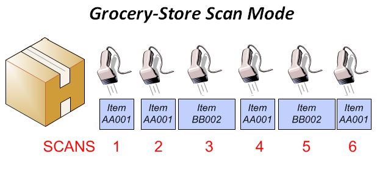
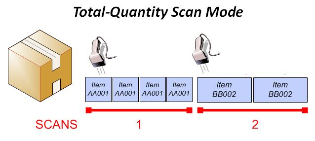

        
        <h1 data-source-node="n56">Using the RF Shipping Container QC Screen</h1>
        
The outbound quality control process involves taking a subset of the shipping  containers that are being shipped out of the warehouse, and inspecting the  contents in order to verify that they match what the system believes to be in  the container. If the container passes QC, then it would continue on through the  appropriate outbound status flow and eventually out the dock door. If the  container fails QC, then the item quantities in question would need to be  resolved before the container can move on to the next appropriate step in its  status flow.

        
 

        
You can use the RF Shipping Container QC Screen to inspect the item quantities that are in a container. The RF QC screen offers two types of scanning modes: <i data-source-node="n61">Grocery-Store</i> and <i data-source-node="n62">Total-Quantity</i>, which allow the user to quickly scan in item barcodes in order to efficiently evaluate a container's items. It is important to note that once a container has failed QC using an RF device, the system will assign a single reason code to the container (called <i data-source-node="n63">RF QC Failed Quantity</i>), and the container will have to be loaded into the full-screen <a href="c50fb44b95eba1ce592e78f136693443608d558c2299ade354a5b287a31a8e11.html" data-source-node="n64">QC Workbench</a> to reconcile this failed quantity. Also note that all of a container's contents must have been picked before a container is eligible for QC inspection.

        
 

        
In addition, you can also use this screen to manually mark a container to require QC inspection. If you have security permission to this action, when you scan a container that does not have QC, the system will ask if you want to mark the container for QC. This action is available when a container’s status is less than or equal to Ship Confirm Pending and greater than or equal to In Packing . The system uses the "Manual" QC assignment criteria record (shipped) to mark the QC assignment for manually-marked containers. 

        
 

        
 

        
 

        <h4 data-source-node="n70">Related Topics...</h4>
        
<a href="7fee83bedacc280d73ab8604d7da77e350970595a7d54a61a63799eeb27494ff.html" data-source-node="n72">Quality Control Process Summary</a>
        

        
<a href="07edc31677cc85116035ff7f2dff1c2a3f7a1a38afdb4aaf867617691a7483ac.html" data-source-node="n74">Quality Control Setup Overview</a>
        

        
<a href="c50fb44b95eba1ce592e78f136693443608d558c2299ade354a5b287a31a8e11.html" data-source-node="n76">Using the QC Workbench</a>
        

        
<a href="9b3aeb2b73ca0f5459e0c167e3d4c8b25e8016c25cadd138806137a857162956.html" data-source-node="n78">Using the VAS Container: Insight Screen</a>
        

        
<a href="9b67b9530e31965bd804c9ba287844c4c4e58e604703f6bffbfb9b24b1d819ac.html" data-source-node="n80">Packing a Container</a> 

        
<a href="dea9460d5d20c3a94c680eb9a0874d5d51fad31c0aea9f133fa482c1f91acf1a.html" data-source-node="n82">Closing a Container (RF)</a>
        

        
<a href="9e44fc4a2818a3126ea3add44e9b0cd8b6f99b7068fae02daff83da4050968b9.html" data-source-node="n84">Printing Paperwork</a>
        

        
 

        
 

        
<a class="MCDropDownHotSpot dropDownHotspot MCDropDownHotSpot_ MCHotSpotImage" data-source-node="n89">Field Descriptions...</a>
            

                
 

                
<a href="346c9b5e3732389c708f427fc1975337b166e15b4bc1fe350908cdc541c97b96.html" data-source-node="n94">Company</a>
                

                
<a href="aa3d226cfce757e66f98a6efa05bc9a636c8abd8b5d4f52c76e4c3f568330378.html" data-source-node="n96">Container ID</a>
                

                
<a href="76b0ba6fbfb2d444434314e8775313a17fcfe3769b96750f310566f732d520ae.html" data-source-node="n98">Item</a>
                

                
<a href="4ecb620add25490c565eec5de85107f772ae3da8957015add1541e8f10c8559d.html" data-source-node="n100">Lot</a>
                

                
<a href="1d20c17242d340813fcb73f20196b1e38b3ac3934def30df8f9531e43331d21f.html" data-source-node="n102">Reason Code</a>
                

                
<a href="a4beb4f80f759aea0e5ccbbb21d4616def2d7bfd7e9bc2fc1d9faafd0a01222e.html" data-source-node="n104">Result</a>
                

                
 

            

        

        
 

        
 

        
Discussed in this topic:

        
- <a href="#scanModes" data-source-node="n110">Scan Mode Descriptions</a>

        
- <a href="#groceryStore" data-source-node="n112">Performing a Grocery-Store Mode Scan</a>

        
- <a href="#totalQty" data-source-node="n114">Performing a Total-Quantity Mode Scan</a>

        
- <a href="#noteCompLot" data-source-node="n116">Scanning Company and/or Lot Items</a>

        
- <a href="#unknownItem" data-source-node="n118">Scanning Unknown Items</a>

        
- <a href="#qualHistory" data-source-node="n120">History Record Generation</a>

        
- <a href="#resolvingFailed" data-source-node="n122">Resolving Failed Item Quantities</a>

        
- <a href="#lotsSerials" data-source-node="n124">Inspecting Item Quantities With Lots, Serial Numbers, Catch Weights</a>

        
- <a href="#rescanning" data-source-node="n126">Rescanning a Failed Container</a>

        
- <a href="#closeCont" data-source-node="n128">Accessing RF Close Container From RF Shipping Container QC</a>

        
- <a href="#printing" data-source-node="n130">Printing Container Documents From RF Shipping Container QC</a>

        
 

        
 

        
 

        <h4 data-source-node="n134">Scan Mode Descriptions...</h4>
        
Below is a discussion of the two scanning modes that you can use with the RF Shipping Container QC Screen: "Grocery-Store" and "Total-Quantity". Note that in order to use these modes efficiently, you will need to program either an ENTER or TAB action to occur after a scan on your RF Device (see descriptions below for more details). In addition, if you are using a touch-enabled device (such as an Android tablet/device), the system will display onscreen buttons that allow the selection of these two modes.

        
 

        
 

        

        
 

        
 

        <h5 data-source-node="n142">Grocery-Store Scan Mode</h5>
        
The idea behind a Grocery-Store mode scan is that you would do a separate physical scan of each item instance that is packed into a container. Using this method, the system will count each scan as one single unit. In theory, this is the most accurate method of performing QC, since you are accounting for each item in the container with a separate scan.

        
 

        
The following are characteristics of Grocery-Store scans:

        <ul data-source-node="n147">
            <li data-source-node="n148">An ENTER button press (leaving the Item Field) triggers a Grocery-Store mode scan. Therefore, you would need to program the user’s RF device to automatically have an ENTER action occur after a scan.  </li>
            <li data-source-node="n151">If you are using a touch-enabled device, then the "Each" button on the screen will trigger a Grocery-Store mode scan.  </li>
            <li data-source-node="n154">If there is only one company, lot, or company/lot instance of an item packed into a container, the system will assume that you are scanning the correct company and/or lot value, and not prompt the user to provide this value  </li>
            <li data-source-node="n157">The item scans can be done in any order (like items do not have to be grouped together and scanned). The system will keep a running total of the item quantities that are scanned.  </li>
            <li data-source-node="n160">For each scan, the system assumes a quantity of 1, using the first sequence UM as defined on the item's unit of measure record.</li>
        </ul>
        
In the illustration below, suppose a container has packed 4 EA of Item AA001, and 2 EA of Item BB002. In a Grocery-Store mode scan, you would make a total of 6 separate scans to QC the item quantities:

        
 

        

            
        

        
 

        
 

        

        
 

        
 

        <h5 data-source-node="n170">Total-Quantity Scan Mode</h5>
        
The idea behind a Total-Quantity scan is that the user would first group together a “like” item quantity, indicate on the RF screen how many of this item is packed, and then scan the item’s barcode once. The system will then register the total count for that item, and the user can move on to the next item quantity in the container. Note that if you are still allowed to go back and scan another quantity of an item that you have already scanned.  For example, if you had a total of 4 EA of an item and on the first scan you only processed 3 of them, you can still go back later and scan the 4th.

        
 

        
The following are characteristics of Total-Quantity scans:

        <ul data-source-node="n175">
            <li data-source-node="n176">A TAB button press (leaving the Item Field) triggers a Total-Quantity mode scan. Therefore, you would need to program the user’s RF device to automatically have a TAB action occur after a scan.  </li>
            <li data-source-node="n179">If you are using a touch-enabled device, then the "Total" button on the screen will trigger a Total-Quantity mode scan.  </li>
            <li data-source-node="n182">A Total-Quantity scan makes no assumptions as to what company and/or lot values are packed into the container. The system will always prompt you to provide these values (with the exception of when you scan an item cross reference that is tied to a company; in this case, the system knows the company and does not need to prompt for the value). </li>
        </ul>
        
In the illustration below, suppose a container has packed 4 EA of Item AA001, and 2 EA of Item BB002. In a Total-Quantity mode scan, you would make a total of 2 scans to QC the item quantities: 

        
 

        

            
        

        
 

        
 

        

        
 

        
 

        <h4 data-source-node="n193">Performing a Grocery-Store Mode Scan...</h4>
        
The following procedures outline how to inspect a container's item quantities using the <a href="#desc_Grocery" style="font-style: italic" data-source-node="n196">Grocery-Store</a> scan mode. Note that the Grocery-Store flow assumes that you will be using an ENTER action to leave the Item field (either programmed to automatically occur after a scan, or manually-activated). Note that the quantity and unit of measure fields are never shown during a Grocery-Store mode scan, because the system always assumes 1 as the quantity value and EA (or whatever the item's base unit of measure is) as the UM value. 

        
 

        
Important Touch-Enabled Device Note

        <ul data-source-node="n199">
            <li data-source-node="n200">If you are using a touch-enabled device, then you will initiate a Grocery-Store mode scan by pressing the "Each" button after you have scanned your item ID. The steps below outline this scan mode on a regular RF device where the ENTER button has been programmed to be invoked after an item scan.</li>
        </ul>
        <ol data-source-node="n201">
            <li value="1" data-source-node="n202">Log on to an RF Device.  </li>
            <li value="2" data-source-node="n205">From the RF Main Menu, select the RF Shipping Container QC option.  </li>
            <li value="3" data-source-node="n208">Scan/enter a container ID. Note that this container must be pending QC (you cannot load a failed or completed container). However, if you have security to mark a container for QC, then the system will ask if you want to assign QC to this container.  If you press OK, the system will mark this container with QC and proceed to the item entry screen; if you press Cancel, the system will not assign QC to the container, and will return to the container initiation screen.  </li>
            <li value="4" data-source-node="n211">Scan/enter an item ID (or item cross-reference). Note that if your item is a basic item (not company/lot tracked), then after the item ID is scanned, the system will register the count and clear the value from the Item field (to be ready for the next scan).   - If you are scanning a basic item, you can skip to step 8.   - If you are scanning a company and/or lot tracked item, then proceed to the next step.  </li>
            <li value="5" data-source-node="n218">If appropriate, select a Company value.  </li>
            <li value="6" data-source-node="n221">If appropriate, enter a Lot value.  </li>
            <li value="7" data-source-node="n224">Press the OK Button. The system will register this item count, display the current count for this item in a message at the bottom of the screen, and clear the Item field to be ready for the next scan. Note that this count is not submitted for validation until the user presses the Complete button.  </li>
            <li value="8" data-source-node="n227">Repeat the steps above for each item/company/lot instance packed into the container.  </li>
            <li value="9" data-source-node="n230">When finished scanning items, press the Complete button. The system will evaluate the item quantities that you counted for this container.   If the container passes QC, the system will display a success message at the bottom of the container initiation screen view, listing the container ID and the QC result.  If the container fails, the system will display the Failure screen view, which lists the container ID, the QC result ("Failed"), and the reason code that was assigned ("RF QC Failed Quantity"). You will then have two choices to proceed:  - You can press OK to return to the container initiation screen. The system will display a message at the bottom of the container initiation view of the screen, listing the container ID and the QC result.  OR  - You can press the <a href="#rescanning" data-source-node="n241">Rescan</a> button to recount the container's item quantities.  </li>
        </ol>
        
 

        
Below is more detailed information on the behavior of fields/buttons during a Grocery-Store scan:

        
 

        
GROCERY-STORE SCAN REFERENCE

        <table style="border-spacing: 2px 2px;margin-left: 0;margin-right: auto" data-source-node="n247">
            <col style="width: 150px" data-source-node="n248">
            <col style="width: 185px" data-source-node="n249">
            <col style="width: 205px" data-source-node="n250">
            <col style="width: 216px" data-source-node="n251">
            <col style="width: 236px" data-source-node="n252">
            <tbody data-source-node="n253">
                <tr data-source-node="n254">
                    <td data-source-node="n255">
                        
 

                    </td>
                    <td data-source-node="n257">
                        
<i data-source-node="n259">Basic Item</i>
                        

                        
 

                    </td>
                    <td data-source-node="n261">
                        
<i data-source-node="n263">Company Item</i>
                        

                        
 

                    </td>
                    <td data-source-node="n265">
                        
<i data-source-node="n267">Lot Item</i>
                        

                        
 

                    </td>
                    <td data-source-node="n269">
                        
<i data-source-node="n271">Company &amp; Lot Item</i>
                        

                        
 

                    </td>
                </tr>
                <tr data-source-node="n273">
                    <td data-source-node="n274">
                        
Item ID Field

                        
 

                    </td>
                    <td style="font-size: 10pt" data-source-node="n277">
                        
Displayed

                        
 

                    </td>
                    <td style="font-size: 10pt" data-source-node="n280">
                        
Displayed

                        
 

                    </td>
                    <td style="font-size: 10pt" data-source-node="n283">
                        
Displayed

                        
 

                    </td>
                    <td style="font-size: 10pt" data-source-node="n286">
                        
Displayed

                        
 

                    </td>
                </tr>
                <tr data-source-node="n289">
                    <td data-source-node="n290">
                        
Company Field

                        
 

                        
 

                        
 

                        
 

                        
 

                        
 

                        
 

                        
 

                        
 

                    </td>
                    <td style="font-size: 10pt" data-source-node="n301">
                        
N/A

                        
 

                        
 

                        
 

                        
 

                        
 

                        
 

                        
 

                        
 

                        
 

                    </td>
                    <td style="font-size: 10pt" data-source-node="n312">
                        
Not Displayed 

                        
- if 1 company is packed, value is assumed

                        
- if item cross-reference is scanned, because company is tied to cross-reference

                        
 

                        
Displayed

                        
- if 2+ companies are packed

                        
 

                    </td>
                    <td style="font-size: 10pt" data-source-node="n320">
                        
N/A

                        
 

                        
 

                        
 

                        
 

                        
 

                        
 

                        
 

                        
 

                        
 

                    </td>
                    <td style="font-size: 10pt" data-source-node="n331">
                        
Not Displayed 

                        
 
- if 1 company is packed, value is assumed

                        
- if item cross-reference is scanned, because company is tied to cross-reference

                        
 

                        
Displayed

                        
- if 2+ companies are packed

                        
 

                    </td>
                </tr>
                <tr data-source-node="n339">
                    <td data-source-node="n340">
                        
Lot Field

                        
 

                        
 

                        
 

                        
 

                        
 

                    </td>
                    <td style="font-size: 10pt" data-source-node="n347">
                        
N/A

                        
 

                        
 

                        
 

                        
 

                        
 

                    </td>
                    <td style="font-size: 10pt" data-source-node="n354">
                        
N/A

                        
 

                        
 

                        
 

                        
 

                        
 

                    </td>
                    <td style="font-size: 10pt" data-source-node="n361">
                        
Not Displayed  

                        
 
- if 1 lot is packed, value is assumed

                        
 

                        
Displayed

                        
- if 2+ lots are packed

                        
 

                    </td>
                    <td style="font-size: 10pt" data-source-node="n368">
                        
Not Displayed  

                        
 
- if 1 lot is packed, value is assumed

                        
 

                        
Displayed 

                        
- if 2+ lots are packed

                        
 

                    </td>
                </tr>
                <tr data-source-node="n375">
                    <td data-source-node="n376">
                        
Qty / UM Fields

                        
 

                    </td>
                    <td style="font-size: 10pt" data-source-node="n379">
                        
Not Displayed

                        
 

                    </td>
                    <td style="font-size: 10pt" data-source-node="n382">
                        
Not Displayed

                        
 

                    </td>
                    <td style="font-size: 10pt" data-source-node="n385">
                        
Not Displayed

                        
 

                    </td>
                    <td style="font-size: 10pt" data-source-node="n388">
                        
Not Displayed

                        
 

                    </td>
                </tr>
                <tr data-source-node="n391">
                    <td data-source-node="n392">
                        
Unknown Item Entry

                        
 

                        
 

                        
 

                        
 

                        
 

                        
 

                        
 

                        
 

                        
 

                        
 

                        
 

                    </td>
                    <td style="font-size: 10pt" data-source-node="n405">
                        
1st Scan of

                        
unknown item:

                        
- Message displayed

                        
 

                        
2nd+ Scans of same unknown item:

                        
- No message
displayed

                        
 

                        
 

                        
 

                        
 

                        
 

                    </td>
                    <td style="font-size: 10pt" data-source-node="n417">
                        
1st Scan of unknown 

                        
item/company:

                        
- Company field displayed (if 

                        
2+ companies are defined in item 

                        
master)  

                        
- Message displayed

                        
 

                        
2nd+ scans of same unknown item/company:

                        
- No Company field displayed

                        
- No message
 displayed

                        
 

                    </td>
                    <td style="font-size: 10pt" data-source-node="n429">
                        
1st Scan of unknown item/lot
:

                        
- Lot field displayed 
 - Message displayed

                        
 

                        
2nd+ scans of same unknown item/lot:

                        
- No Lot field
 displayed

                        
- No message
 displayed

                        
 

                        
 

                        
 

                        
 

                    </td>
                    <td style="font-size: 10pt" data-source-node="n441">
                        
1st Scan of unknown item/comp/lot:

                        
- Company field displayed (if 2+ companies are defined in item master)

                        
- Lot field displayed

                        
- Message
 displayed

                        
 

                        
2nd+ scans of same unknown item/comp/lot:

                        
- No Company field
 displayed

                        
- No Lot field
 displayed

                        
- No message
 displayed

                        
 

                    </td>
                </tr>
                <tr data-source-node="n452">
                    <td data-source-node="n453">
                        
Each Button

                        
(after item scan)

                        
 

                        
 

                    </td>
                    <td style="font-size: 10pt" data-source-node="n458">
                        
Active
- After an item ID is scanned/counted

                        
 

                    </td>
                    <td style="font-size: 10pt" data-source-node="n461">
                        
Active
- After an item ID is scanned/counted

                        
 

                        
 

                    </td>
                    <td style="font-size: 10pt" data-source-node="n465">
                        
Active
- After an item ID is scanned/counted

                        
 

                        
 

                    </td>
                    <td style="font-size: 10pt" data-source-node="n469">
                        
Active
- After an item ID is scanned/counted

                        
 

                        
 

                    </td>
                </tr>
                <tr data-source-node="n473">
                    <td data-source-node="n474">
                        
Print Button 

                        
(during count)

                        
 

                    </td>
                    <td style="font-size: 10pt" data-source-node="n478">
                        
Active

                        
 

                        
 

                    </td>
                    <td style="font-size: 10pt" data-source-node="n482">Active
 

 
</td>
                    <td style="font-size: 10pt" data-source-node="n485">Active
 

 
</td>
                    <td style="font-size: 10pt" data-source-node="n488">Active
 

 
</td>
                </tr>
                <tr data-source-node="n491">
                    <td data-source-node="n492">
                        
Rescan Button

                        
 (after QC failed)

                        
 

                    </td>
                    <td style="font-size: 10pt" data-source-node="n496">
                        
Active

                        
- Until failure screen is closed

                        
 

                    </td>
                    <td style="font-size: 10pt" data-source-node="n500">Active

- Until failure screen is closed

 </td>
                    <td style="font-size: 10pt" data-source-node="n502">Active

- Until failure screen is closed

 </td>
                    <td style="font-size: 10pt" data-source-node="n504">Active

- Until failure screen is closed

 </td>
                </tr>
                <tr data-source-node="n506">
                    <td data-source-node="n507">
                        
Print Button 

                        
(after QC pass)

                        
 

                    </td>
                    <td style="font-size: 10pt" data-source-node="n511">
                        
Active

                        
-Until new container is initiated

                        
 

                    </td>
                    <td style="font-size: 10pt" data-source-node="n515">Active

- Until new container is initiated

 </td>
                    <td style="font-size: 10pt" data-source-node="n517">Active

- Until new container is initiated

 </td>
                    <td style="font-size: 10pt" data-source-node="n519">Active

- Until new container is initiated

 </td>
                </tr>
                <tr data-source-node="n521">
                    <td data-source-node="n522">
                        
Close Button 

                        
(after QC pass)

                        
 

                    </td>
                    <td style="font-size: 10pt" data-source-node="n526">Active

- Until new container is initiated

 </td>
                    <td style="font-size: 10pt" data-source-node="n528">Active

- Until new container is initiated

 </td>
                    <td style="font-size: 10pt" data-source-node="n530">Active

- Until new container is initiated

 </td>
                    <td style="font-size: 10pt" data-source-node="n532">Active

- Until new container is initiated

 </td>
                </tr>
            </tbody>
        </table>
        
 

        
 

        

        
 

        
 

        <h4 data-source-node="n539">Performing a Total-Quantity Mode Scan...</h4>
        
The following procedures outline how to inspect a container's item quantities using the <a href="#desc_totalQty" style="font-style: italic" data-source-node="n542">Total-Quantity</a> scan mode. Note that the Total-Quantity flow assumes that you will be using a TAB action to leave the Item field (either programmed to automatically occur after a scan, or manually-activated).

        
 

        
Important Touch-Enabled Device Note

        <ul data-source-node="n545">
            <li data-source-node="n546">If you are using a touch-enabled device, then you will initiate a Total-Quantity mode scan by pressing the "Total" button after you have scanned your item ID. The steps below outline this scan mode on a regular RF device where the TAB button has been programmed to be invoked after an item scan.</li>
        </ul>
        <ol data-source-node="n547">
            <li value="1" data-source-node="n548">Log on to an RF Device.  </li>
            <li value="2" data-source-node="n551">From the RF Main Menu, select the RF Shipping Container QC option.  </li>
            <li value="3" data-source-node="n554">Scan/enter a container ID. Note that this container must be pending QC (you cannot load a failed or completed container). However, if you have security to mark a container for QC, then the system will ask if you want to assign QC to this container.  If you press OK, the system will mark this container with QC and proceed to the item entry screen; if you press Cancel, the system will not assign QC to the container, and will return to the container initiation screen.  </li>
            <li value="4" data-source-node="n557">Scan/enter an item ID (or item cross-reference).  </li>
            <li value="5" data-source-node="n560">If appropriate, select a Company value. Note that this field will not appear if you scanned an item cross reference that is tied to a company.  </li>
            <li value="6" data-source-node="n563">If appropriate, enter a Lot value.  </li>
            <li value="7" data-source-node="n566">Enter the quantity of the item that you want to count with this scan. The default value is 1.  </li>
            <li value="8" data-source-node="n569">Select the unit of measure that you want to count with this scan. Note that the system default is the first sequence unit of measure defined for this item. If you have an item cross reference tied to a unit of measure, upon scanning, the system will populate the unit of measure field with the unit of measure that is tied to the cross reference.  </li>
            <li value="9" data-source-node="n572">Press the OK Button. The system will register this item count, display the current count for this item in a message at the bottom of the screen, and clear the Item field to be ready for the next scan. Note that this count is not submitted for validation until the user presses the Complete button.  </li>
            <li value="10" data-source-node="n575">Repeat the steps above for each item/company/lot instance packed into the container.  </li>
            <li value="11" data-source-node="n578">When finished scanning items, press the Complete button. The system will evaluate the item quantities that you counted for this container.  If the container passes QC, the system will display a success message at the bottom of the container initiation screen view, listing the container ID and the QC result.  If the container fails, the system will display the Failure screen view, which lists the container ID, the QC result ("Failed"), and the reason code that was assigned ("RF QC Failed Quantity"). You will then have two choices to proceed:  - You can press OK to return to the container initiation screen. The system will display a message at the bottom of the container initiation view of the screen, listing the container ID and the result.  OR  - You can press the <a href="#rescanning" data-source-node="n589">Rescan</a> button to recount the container's item quantities. </li>
        </ol>
        
 

        
Below is more detailed information on the behavior of fields/buttons during a Total-Quantity scan:

        
 

        
TOTAL-QUANTITY SCAN REFERENCE

        <table style="margin-left: 0;margin-right: auto" data-source-node="n595">
            <col style="width: 187px" data-source-node="n596">
            <col style="width: 180px" data-source-node="n597">
            <col style="width: 184px" data-source-node="n598">
            <col style="width: 198px" data-source-node="n599">
            <col style="width: 243px" data-source-node="n600">
            <tbody data-source-node="n601">
                <tr data-source-node="n602">
                    <td data-source-node="n603">
                        
 

                    </td>
                    <td style="font-style: normal" data-source-node="n605">
                        
<i data-source-node="n607">Basic Item</i>
                        

                        
 

                    </td>
                    <td style="font-style: normal" data-source-node="n609">
                        
<i data-source-node="n611">Company Item</i>
                        

                        
 

                    </td>
                    <td data-source-node="n613">
                        
<i data-source-node="n615">Lot Item</i>
                        

                        
 

                    </td>
                    <td data-source-node="n617">
                        
<i data-source-node="n619">Company &amp; Lot Item</i>
                        

                        
 

                    </td>
                </tr>
                <tr data-source-node="n621">
                    <td data-source-node="n622">
                        
Item ID Field

                        
 

                    </td>
                    <td style="font-size: 10pt" data-source-node="n625">
                        
Displayed

                        
 

                    </td>
                    <td style="font-size: 10pt" data-source-node="n628">
                        
Displayed

                        
 

                    </td>
                    <td style="font-size: 10pt" data-source-node="n631">
                        
Displayed

                        
 

                    </td>
                    <td style="font-size: 10pt" data-source-node="n634">
                        
Displayed

                        
 

                    </td>
                </tr>
                <tr data-source-node="n637">
                    <td data-source-node="n638">
                        
Company Field

                        
 

                        
 

                        
 

                        
 

                        
 

                    </td>
                    <td style="font-size: 10pt" data-source-node="n645">
                        
N/A

                        
 

                        
 

                        
 

                        
 

                        
 

                    </td>
                    <td style="font-size: 10pt" data-source-node="n652">
                        
Displayed 

                        
- Always, if company item(s) are packed

                        
- Except if cross-reference (tied to company) is scanned 

                        
 

                    </td>
                    <td style="font-size: 10pt" data-source-node="n657">
                        
N/A

                        
 

                        
 

                        
 

                        
 

                        
 

                    </td>
                    <td style="font-size: 10pt" data-source-node="n664">
                        
Displayed

                        
- Always, if company item(s) are packed

                        
- Except if cross-reference (tied to company) is scanned 

                        
 

                        
 

                    </td>
                </tr>
                <tr data-source-node="n670">
                    <td data-source-node="n671">
                        
Lot Field

                        
 

                        
 

                    </td>
                    <td style="font-size: 10pt" data-source-node="n675">
                        
N/A

                        
 

                        
 

                    </td>
                    <td style="font-size: 10pt" data-source-node="n679">
                        
N/A

                        
 

                        
 

                    </td>
                    <td style="font-size: 10pt" data-source-node="n683">
                        
Displayed 

                        
- Always, if lot item(s) are packed

                        
 

                    </td>
                    <td style="font-size: 10pt" data-source-node="n687">
                        
Displayed

                        
- Always, if lot item(s) are packed

                        
 

                    </td>
                </tr>
                <tr data-source-node="n691">
                    <td data-source-node="n692">
                        
Qty / UM Fields

                        
 

                    </td>
                    <td style="font-size: 10pt" data-source-node="n695">
                        
Displayed

                        
 

                    </td>
                    <td style="font-size: 10pt" data-source-node="n698">
                        
Displayed

                        
 

                    </td>
                    <td style="font-size: 10pt" data-source-node="n701">
                        
Displayed

                        
 

                    </td>
                    <td style="font-size: 10pt" data-source-node="n704">
                        
Displayed

                        
 

                    </td>
                </tr>
                <tr data-source-node="n707">
                    <td data-source-node="n708">
                        
Unknown Item Entry

                        
 

                        
 

                        
 

                        
 

                        
 

                        
 

                        
 

                        
 

                        
 

                        
 

                        
 

                    </td>
                    <td style="font-size: 10pt" data-source-node="n721">
                        
1st Scan of unknown item

                        
- Message displayed

                        
 

                        
2nd+ Scans of same unknown item

                        
- No message
 displayed

                        
 

                        
 

                        
 

                        
 

                        
 

                        
 

                    </td>
                    <td style="font-size: 10pt" data-source-node="n733">
                        
1st Scan of unknown 

                        
item/company:

                        
- Company field displayed (if 2+

                        
 companies are defined in item master) 

                        
 
- Message displayed

                        
 

                        
2nd+ scans of same unknown item/company:

                        
- No Company field displayed

                        
- No message displayed

                        
 

                    </td>
                    <td style="font-size: 10pt" data-source-node="n744">
                        
1st Scan of unknown item/lot:

                        
- Lot field displayed 

                        
- Message displayed

                        
 

                        
2nd+ scans of same unknown item/lot:

                        
- Lot field displayed

                        
- No message displayed

                        
 

                        
 

                        
 

                        
 

                    </td>
                    <td style="font-size: 10pt" data-source-node="n756">
                        
1st Scan of unknown item/company/lot:

                        
- Company field displayed (if 

                        
2+ companies are defined in item master) 

                        
- Lot field displayed

                        
- Message
displayed

                        
 

                        
2nd+ scans of same item/company/lot:

                        
- Lot field displayed

                        
- No Company field displayed

                        
- No message displayed

                        
 

                        
 

                    </td>
                </tr>
                <tr data-source-node="n769">
                    <td data-source-node="n770">
                        
Total Button

                        
(after item scan)

                        
 

                        
 

                    </td>
                    <td style="font-size: 10pt" data-source-node="n775">
                        
Active
- After an item ID is scanned (rest of time it is disabled)

                        
 

                    </td>
                    <td style="font-size: 10pt" data-source-node="n778">
                        
Active
- After an item ID is scanned (rest of time it is disabled)

                        
 

                    </td>
                    <td style="font-size: 10pt" data-source-node="n781">
                        
Active
- After an item ID is scanned (rest of time it is disabled)

                        
 

                    </td>
                    <td style="font-size: 10pt" data-source-node="n784">
                        
Active
- After an item ID is scanned (rest of time it is disabled)

                        
 

                    </td>
                </tr>
                <tr data-source-node="n787">
                    <td data-source-node="n788">
                        
Print Button 

                        
(during count)

                        
 

                    </td>
                    <td style="font-size: 10pt" data-source-node="n792">
                        
Active

                        
 

                        
 

                    </td>
                    <td style="font-size: 10pt" data-source-node="n796">
                        
Active

                        
 

                        
 

                    </td>
                    <td style="font-size: 10pt" data-source-node="n800">
                        
Active

                        
 

                        
 

                    </td>
                    <td style="font-size: 10pt" data-source-node="n804">
                        
Active

                        
 

                        
 

                    </td>
                </tr>
                <tr data-source-node="n808">
                    <td data-source-node="n809">
                        
Rescan Button

                        
 (after QC failed)

                        
 

                    </td>
                    <td style="font-size: 10pt" data-source-node="n813">
                        
Active 

                        
- Until failure screen is closed

                        
 

                    </td>
                    <td style="font-size: 10pt" data-source-node="n817">Active 
- Until failure screen is closed
 </td>
                    <td style="font-size: 10pt" data-source-node="n819">Active 
- Until failure screen is closed

 
</td>
                    <td style="font-size: 10pt" data-source-node="n822">Active 
- Until failure screen is closed

 
</td>
                </tr>
                <tr data-source-node="n825">
                    <td data-source-node="n826">
                        
Print Button 

                        
(after QC pass)

                        
 

                    </td>
                    <td style="font-size: 10pt" data-source-node="n830">
                        
Active

                        
- Until new container is initiated

                        
 

                    </td>
                    <td style="font-size: 10pt" data-source-node="n834">Active

- Until new container is initiated

 

 
</td>
                    <td style="font-size: 10pt" data-source-node="n838">Active

- Until new container is initiated

 

 
</td>
                    <td style="font-size: 10pt" data-source-node="n842">Active

- Until new container is initiated

 

 
</td>
                </tr>
                <tr data-source-node="n846">
                    <td data-source-node="n847">
                        
Close Button 

                        
(after QC pass)

                        
 

                    </td>
                    <td style="font-size: 10pt" data-source-node="n851">Active

- Until new container is initiated
 </td>
                    <td style="font-size: 10pt" data-source-node="n853">Active

- Until new container is initiated

 </td>
                    <td style="font-size: 10pt" data-source-node="n855">Active

- Until new container is initiated

 
</td>
                    <td style="font-size: 10pt" data-source-node="n858">Active

- Until new container is initiated

 
</td>
                </tr>
            </tbody>
        </table>
        
 

        
 

        

        
 

        
 

        <h4 data-source-node="n866">Scanning Company and/or Lot Items...</h4>
        
Whether or not the Company and/or Lot Fields display on the RF Shipping Container QC screen will depend on what scan mode you are using, and how many item/company, item/lot, or item/company/lot instances are packed into the container. For scenarios on this, please see the Grocery-Store or Total-Quantity reference grids in this topic.

        
 

        
 

        
 

        <h4 data-source-node="n872">Scanning Unknown Items...</h4>
        
The RF Shipping Container QC screen will always prompt you when an item is  scanned/entered that the system does not realize is packed into the container  that you are inspecting. When you scan an unknown item, a prompt window will appear alerting you of this fact. If you confirm that  you want to add this item to the container (by selecting the message's checkbox and pressing OK), then the system will add this item  to the container quantity count. Note that this action does not actually  pack the item into the container, as you would need to do that separately in  another window. Note also that unknown item  quantities are always flagged as Failed quantities upon confirmation.

        
 

        
 

        

        
 

        
 

        <h4 data-source-node="n880">History Record Generation...</h4>
        
At the time a container count is evaluated, the system writes the following  types of history records. Note that the same types of history are logged for both the RF QC and QC Workbench processes.

        <ul data-source-node="n883">
            <li value="1" data-source-node="n884">Transaction History: The system generates a transaction  history record for each item quantity that you confirm. The record includes such  information as container ID, user name, item/quantity, and the reason code(s)  for Failed counts.  </li>
            <li value="2" data-source-node="n887">Process History: The system generates a process history  record indicating that the container has passed or failed QC inspection. The  record includes such information as container ID, user name, previous QC status,  and current QC status. </li>
        </ul>
        
Reason Code Configuration Note: Even though the general reason code assigned during  RF QC is defined in the Quality History Reason Codes configuration,  the system does not generate quality history records for a Failed  count confirmation. The RF QC Failed Quantity reason code defined in this configuration is  listed on the RF Shipping Container QC screen, and logged on the QC Confirmation transaction  history record when a Failed count occurs.

        
 

        
 

        

        
 

        
 

        <h4 data-source-node="n894">Resolving Failed Item Quantities...</h4>
        
 

        
Once the system flags an item quantity as Failed, you will then need to  resolve this quantity so the container can pass QC confirmation. You will need  to perform this action in a window outside of the RF Shipping Container QC Screen. For example,  suppose you have a container that has an item quantity that was under-packed by 1 EA. The system would fail this item quantity, and you would need to remove  this item from the container via another screen. Then, you would need to load the container back into the QC Workbench, and reconcile the failed quantity so that the container could now pass QC. Note that you cannot load Failed containers into the RF Shipping Container QC screen.

        
 

        
 

        

        
 

        
 

        <h4 data-source-node="n903">Inspecting Item Quantities With Lots, Serial Numbers, Catch Weights...</h4>
        
 

        <h5 data-source-node="n906">Lots</h5>
        
Lot controlled items are fully supported in the RF Shipping Container QC screen. The system will prompt the user for a lot value when appropriate during the inspection of a lot item See the Grocery-Store and Total-Quantity reference grids in this topic for more details.

        
 

        <h5 data-source-node="n909">Serial Numbers</h5>
        
Serial number tracked item quantities can be inspected in the RF Shipping Container QC screen;  however, the system will never prompt the user to enter a serial number. Therefore, all serial number instances of an item packed into a container are grouped together in the same item quantity count.

        
 

        <h5 data-source-node="n912">Catch Weight</h5>
        
Catch weight tracked item quantities can be inspected in the RF Shipping Container QC screen;  however, the system will never prompt the user to enter a catch weight. Therefore, all catch weight instances of an item packed into a container are grouped together in the same item quantity count.

        
 

        
 

        

        
 

        
 

        <h4 data-source-node="n919">Rescanning a Failed Container...</h4>
        
You can have the option (if configured in security to do so) to rescan a container that has just failed the RF QC process. When you press the Rescan button on the "Failed" screen, the system will display the Item field, so that you can begin the container count again. This is helpful if for some  reason you realize you counted a container's items wrong, and you want to correctly count the container right away. Note that if you decide to cancel out of a rescan (before pressing the Complete button to submit the recount), then the previous Failed count results are still valid. 

        
 

        
 

        

        
 

        
 

        <h4 data-source-node="n927">Accessing RF Close Container from RF Shipping Container QC...</h4>
        
After a container has successfully passed the RF QC process, you have the option of opening the container directly into the RF Close Container process. This option is available after both Grocery-Store and Total-Quantity scans. On the container initiation view, after a container has passed QC, the Close button becomes available (it becomes inactive again once a new container is initiated). When you open the container into the RF Close Container screen, the container ID is defaulted into the container ID field (the cursor focus is then placed into the weight field). After you close the container, you can press the Cancel button to return to the RF QC screen. Note that you can only access this function after a container has passed QC, since the close container process will not close a container that has pending/failed QC.

        
 

        
 

        

        
 

        
 

        <h4 data-source-node="n935">Printing Container Documents From RF Shipping Container QC...</h4>
        
You can print the “default” documents for a shipping container from the RF QC screen. This is helpful if during the QC process, the user realizes that, for example, a container label is damaged or a container pack list is missing. You can print during the item quantity count process, or right after the QC process has finished (whether the container passed or failed). After you press the Print button, the system will attempt to print the documents/labels that are defined as “default” on the appropriate document type configuration record(s). Also, the system will display a message to the user, depending on whether or not the printing was successful. Note that the Print button is inactive when you first enter the RF QC screen, since no container has yet been initiated into the QC process.

        
 

        
  

        

        
 

        
 

        
 

        
 

        
 

        
 

        
 

        
 

        
 

        
 

        
 

        
 

        
 

        
 

        
 

        
 

        
 

        
 

        
 

        
 

        
 

        
 

        
 

        
 

        
 

        
 

        
 

        
 

        
 

        
 

        
 

        
 

        
 

        
 

        
 

        
 

        
 

        
 

        
 

        
 

        
 

        
 

    