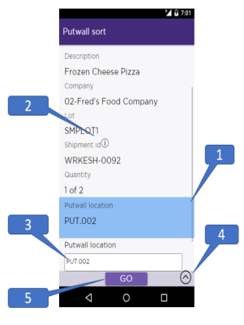

        
        <h1 data-source-node="n56">Using Warehouse Mobile </h1>
        
Warehouse mobile is modern native android application that can be used to execute the RF functions of today. The application’s layout and screen flow are driven by JSON files. This allows for easy customization of the application. See the SDK for further information on the architecture of these files. Warehouse Mobile is the modernized app for Android devices, which will eventually replace the RF functionality of today.

        
 

        <h4 data-source-node="n60">Pre-requisites</h4>
        <ul data-source-node="n61">
            <li data-source-node="n62">The mobile device should be connected to the network.</li>
            <li data-source-node="n63">Manhattan SCALE should be configured on the application server.</li>
        </ul>
        <h4 data-source-node="n64">Related Topics...</h4>
        
<a href="0a96fa01b063e3b4b10ed1be77385b0910d27b92d3927a63ea068f01784f17bf.html" data-source-node="n66">Warehouse Mobile - Sign in</a>
        

        
<a href="5ea80956b207057fdc2d841bb836a676ef62f554f56c6da1c57f1997b9f84e20.html" data-source-node="n68">Processing RF Work</a>
        

        
 

        
Warehouse Mobile screens

        <ul data-source-node="n71">
            <li data-source-node="n72"><a href="d3ded73e3c4cd4c058cf366dac2337cea31f922628ab7fb9f72351db3f110daa.html" data-source-node="n73">Assign Printer</a>
            </li>
            <li data-source-node="n74"><a href="b33a75f313a267b2873999318c8752e9ddbe07fbd8201653f8f3aa6b757253b5.html" data-source-node="n75">Close Container</a>
            </li>
            <li data-source-node="n76"><a href="4bf6394a506302ab51f0d295d2c6159739380cb3fe96ba50f65972a616dbcf87.html" data-source-node="n77">Close Putaway Group</a>
            </li>
            <li data-source-node="n78"><a href="078c69cbff5a2d878611ac79eff6e854f011cc45e4d8ecf57c913b9d268302da.html" data-source-node="n79">Cycle Count Reconciliation</a>
            </li>
            <li data-source-node="n80"><a href="838a020258ef840157ff58cbf2976040e90b5843a8ef1d4a715641e354227816.html" data-source-node="n81">Immediate Dock Transfer</a>
            </li>
            <li data-source-node="n82"><a href="a565889030eee150ec84ace9cab22bf3668bab7fb4030ad068c3021a5ab3d20c.html" data-source-node="n83">Inventory Management</a>
            </li>
            <li data-source-node="n84"><a href="2911d55cf9d9a1c1273285ae061dfab08218101065ff163248aab18e2d76f015.html" data-source-node="n85">Location Inquiry</a>
            </li>
            <li data-source-node="n86"><a href="981acc9687be090e0cd79ec204c950960d3ad374894d883e8597845e7b334789.html" data-source-node="n87">Shipping Container Nesting</a>
            </li>
            <li data-source-node="n88"><a href="21b18b42c82e530935c24cb0848bb4d666bef09aa74cbd6ce61dd8b24e457e99.html" data-source-node="n89">Receiving</a>
            </li>
            <li data-source-node="n90"><a href="c0b8a4482e4b858f753b52028b7a8e806ba5240c1d5303379719af3082ece1a0.html" data-source-node="n91">Work Execution</a>
            </li>
            <li data-source-node="n92"><a href="e9ce2d02e2d39cac6a47697cf78ba14b45aaf87d69152dc75acae644a4ca56d2.html" data-source-node="n93">Cart Picking</a>
            </li>
            <li data-source-node="n94"><a href="e9ce2d02e2d39cac6a47697cf78ba14b45aaf87d69152dc75acae644a4ca56d2.html" data-source-node="n95">Cycle Count Work</a>
            </li>
        </ul>
        
 

        <h4 data-source-node="n97">Topics Discussed</h4>
        
 

        
<a href="#Screen" data-source-node="n100">Screen Layout</a>
        

        
 

        
 

        <h4 data-source-node="n103">Screen Layout</h4>
        
Below is a diagram explaining the basic features of the Warehouse Mobile screens.

        
 

        <table style="margin-left: 0;margin-right: auto" data-source-node="n107">
            <col data-source-node="n108">
            <col data-source-node="n109">
            <tbody data-source-node="n110">
                <tr data-source-node="n111">
                    <td data-source-node="n112">
                        
                    </td>
                    <td data-source-node="n114">
                        
<b data-source-node="n116">1</b> - The field that is being validated is highlighted in Blue. Only one input field can be validated at a time.

                        
 

                        
<b data-source-node="n119">2</b> - Information  - Tap to view more information about the fields.

                        
 

                        
<b data-source-node="n123">3</b> - Field value input box. User can either manually enter the value or scan the value.

                        
 

                        
<b data-source-node="n126">4</b>- Action  (arrow) menu - Tap to view the actions that are available for the particular screen

                        
 

                        
<b data-source-node="n130">5</b>- Go button - Will be activated only after the validations is complete. Tap to submit the entered value.

                        
 

                    </td>
                </tr>
            </tbody>
        </table>
        
 

        
<b data-source-node="n134">Back Button</b>  - This button is displayed based on the scenario. Tap to navigate to the previous field or screen. The back button is available in following scenarios

        <ul data-source-node="n136">
            <li data-source-node="n137">Work unit initiation screen to work profile selection screen and vice-verse.</li>
            <li data-source-node="n138">Go to previous validated field in Pick Confirmation screen.</li>
            <li data-source-node="n139">Go to previous validated field in Putaway screen.</li>
        </ul>
        
 

        
<b data-source-node="n142">Information  Feature</b> - Tap to view more details related to the field such as quantity, location and inventory information. Tap <b data-source-node="n144">Close</b> to navigate back to the previous screen. These information screens are available for Location, Item and Quantity fields of pick and putaway screens.

        <h4 data-source-node="n145"> </h4>
        
 

    