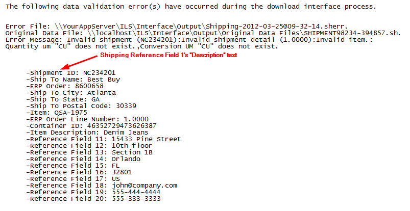

        
        <h1 data-source-node="n56">Defining Interface Validation Error Reference Fields</h1>
        
Interface error reference fields are used to identify key information about a data validation problem that the interface encountered. You can define up to twenty reference fields per interface process. Any field that is included in the XML schema is available to define as a reference field value. The system populates these values from the original interface data file (after its XML transformation), and writes them to the INTERFACE_ERROR database table as one of the twenty reference fields.

        
 

        
You can view these reference fields from three places in the system:

        <ul data-source-node="n61">
            <li data-source-node="n62"><i data-source-node="n63">Interface Error Insight Screen</i>: You can add these fields to the Interface Error Insight Screen. This allows you to use the reference fields for researching interface errors.  </li>
            <li data-source-node="n66"><i data-source-node="n67">Interface Validation Error Warehouse Alert Emails</i>: You can add these fields to the email template(s) that you use for Interface Validation Error Warehouse Alert emails. This allows you to control what field data is displayed in an alert email.  </li>
            <li data-source-node="n70"><i data-source-node="n71">Warehouse Alerts Configuration Window</i>: You can view (but not edit) the defined value for each of the reference fields for a particular interface process. This allows you to see how the reference fields are defined when you are setting up an interface error warehouse alert.</li>
        </ul>
        
 

        
 

        <h4 data-source-node="n74">Related Topics</h4>
        
<a href="178aec6d3faf8830199512924f58cf463d20acfbc6b6485c40a0948c32a1cd0e.html" data-source-node="n76">Interface Process Summary</a>
        

        
<a href="b9f415be06c542c5d9cfde6e82f215db824f5cfc894b21e3c1db55c08bdb7b3c.html" data-source-node="n78">Performance Management Process Summary</a>
        

        
<a href="b2646c9a0761f06b4186e273e8298d5a7bc5c650a4bb779facffa61f6e58af8c.html" data-source-node="n80">Interface Setup Overview</a>
        

        
<a href="2df1d49dfb1880070643c1bcfbc5da5e44f6bd99a2bd55a4c225b54c9ca12bfb.html" data-source-node="n82">Performance Management Setup Overview</a>
        

        
<a href="252431319bc8286e9bf44bb10ce5033716a5409614e26639d13ba27bb2b5448c.html" data-source-node="n84">Defining Warehouse Alerts</a>
        

        
<a href="745f612562dbd778a83b21b072e685c1cde76b6a2db4c27ae4c1c23a3a8d8c7f.html" data-source-node="n86">Researching Warehouse Alerts</a>
        

        
<a href="a9f6e64a97e675678512d2b06814566670108f15ef23c08630dba3ae0e25fe0e.html" data-source-node="n88">Researching Interface Errors</a>
        

        
<a href="457eeece9590b897398d6f0c472b8a6330575513b8ad5e7735e631ae9ef95c8d.html" data-source-node="n90">Using the Interface Error Insight Screen</a>
        

        
 

        
 

        
<a class="MCDropDownHotSpot dropDownHotspot MCDropDownHotSpot_ MCHotSpotImage" data-source-node="n95">Field Descriptions</a>
            

                
 

                
Header Fields

                
<a href="2c6ccb4a2a6f4e2bee53d5d054bae3a7a64f8ede90e41bf13d92ce55f6254d33.html" data-source-node="n101">Description</a>
                

                
<a href="922e21786b51300203e5e9fba93a35356a257f2136d22b1bc8a1ddeb97e1841a.html" data-source-node="n103">Identifier</a>
                

                
<a href="ee5c3043f3d76dd1035fe7ddb96841807f6bb66635cdef043fb861f4c69bd9bc.html" data-source-node="n105">Record Type</a>
                

                
 

                
System Defined Values Tab Fields

                
<a href="6bdf1c528ea18df31fee7af4b388ad9d04c73e41246244ba81edb641c246184f.html" data-source-node="n109">Field Name</a>
                

                
 

            

        

        
 

        
 

        <h4 data-source-node="n113">Procedures...</h4>
        <ol data-source-node="n114">
            <li value="1" data-source-node="n115">Access one of the Interface Error Reference configurations (shipping, receiving, item master, bill of materials, or work order). You can define values for up to twenty reference fields. Ten pre-defined field values (per interface process) are shipped with the system; you can choose to leave these values defined as they are, or change them to represent different values.  </li>
            <li value="2" data-source-node="n118">Use the Description Field to identify a common name for a reference field value. For example, if you have defined Reference Field 1 as a shipment ID, you would probably want the Description to say "Shipment ID" (or whatever your term for a shipment identifier is) as well. Note that this description will appear as this reference value's field label in an Interface Validation Error warehouse alert email.  For instance, below is an example of a shipping interface error email. Note that the first ten reference fields have names defined for them, which the system gets from the Description field:    </li>
            <li value="3" data-source-node="n126">Use the Field Name Field to indicate the actual code for a reference field value. To see how these are defined, see the "Reference Field Value Structure" section below.  </li>
            <li value="4" data-source-node="n129">Press OK. The system will save the record.</li>
        </ol>
        
 

        <h5 data-source-node="n131">Reference Field Value Structure  </h5>
        
Below are some examples of how to structure various levels of data for the reference field values. Note that you can just follow the "xpath" node pattern of the XML schema to define levels not listed below. You can reference any values defined in the XML schema.

        
 

        <table style="margin-left: 0;margin-right: auto" data-source-node="n134">
            <col style="width: 244px" data-source-node="n135">
            
            <col style="width: 291px" data-source-node="n136">
            
            <tbody data-source-node="n137">
                <tr data-source-node="n138">
                    <td style="font-style: italic" data-source-node="n139">
                        
SHIPPING

                        
 

                    </td>
                    <td style="font-style: italic" data-source-node="n142">
                        
<i data-source-node="n144">VALUE</i>
                        

                    </td>
                </tr>
                <tr data-source-node="n145">
                    <td data-source-node="n146">
                        
Ship To Address State (header-level)

                        
 

                    </td>
                    <td data-source-node="n149">
                        
//Shipment//Customer//ShipToAddress//State

                    </td>
                </tr>
                <tr data-source-node="n151">
                    <td data-source-node="n152">
                        
Item (detail-level)

                        
 

                    </td>
                    <td data-source-node="n155">
                        
//ShipmentDetail//Item

                    </td>
                </tr>
                <tr data-source-node="n157">
                    <td data-source-node="n158">
                        
Container ID (container level)

                        
 

                    </td>
                    <td data-source-node="n161">
                        
//ShippingContainer//ContainerId

                    </td>
                </tr>
            </tbody>
        </table>
        
 

        
 

        <table style="margin-left: 0;margin-right: auto" data-source-node="n165">
            <col style="width: 244px" data-source-node="n166">
            
            <col style="width: 293px" data-source-node="n167">
            
            <tbody data-source-node="n168">
                <tr data-source-node="n169">
                    <td style="font-style: italic" data-source-node="n170">
                        
<i data-source-node="n172">RECEIVING</i>
                        

                        
 

                    </td>
                    <td data-source-node="n174">
                        
<i data-source-node="n176">VALUE</i>
                        

                    </td>
                </tr>
                <tr data-source-node="n177">
                    <td data-source-node="n178">
                        
Receipt ID (header-level)

                        
 

                    </td>
                    <td data-source-node="n181">
                        
//Receipt//ReceiptId

                    </td>
                </tr>
                <tr data-source-node="n183">
                    <td data-source-node="n184">
                        
Item Class (detail-level)

                        
 

                    </td>
                    <td data-source-node="n187">
                        
//ReceiptDetail//ItemClass//ItemClass

                    </td>
                </tr>
                <tr data-source-node="n189">
                    <td data-source-node="n190">
                        
Locating Rule (container-level)

                        
 

                    </td>
                    <td data-source-node="n193">
                        
//ReceiptContainer//LocatingRule

                    </td>
                </tr>
            </tbody>
        </table>
        
 

        
 

        <table style="margin-left: 0;margin-right: auto" data-source-node="n197">
            <col style="width: 244px" data-source-node="n198">
            
            <col style="width: 292px" data-source-node="n199">
            
            <tbody data-source-node="n200">
                <tr data-source-node="n201">
                    <td data-source-node="n202">
                        
<i data-source-node="n204">ITEM</i>
                        

                        
 

                    </td>
                    <td data-source-node="n206">
                        
<i data-source-node="n208">VALUE</i>
                        

                    </td>
                </tr>
                <tr data-source-node="n209">
                    <td data-source-node="n210">
                        
Item

                        
 

                    </td>
                    <td data-source-node="n213">
                        
//Item//Item

                    </td>
                </tr>
                <tr data-source-node="n215">
                    <td data-source-node="n216">
                        
Storage Template

                        
 

                    </td>
                    <td data-source-node="n219">
                        
//Item//StorageTemplate//Template

                    </td>
                </tr>
            </tbody>
        </table>
        
 

        
 

        <table style="margin-left: 0;margin-right: auto" data-source-node="n223">
            <col style="width: 244px" data-source-node="n224">
            
            <col style="width: 295px" data-source-node="n225">
            
            <tbody data-source-node="n226">
                <tr data-source-node="n227">
                    <td data-source-node="n228">
                        
<i data-source-node="n230">BILL OF MATERIALS</i>
                        

                        
 

                    </td>
                    <td data-source-node="n232">
                        
<i data-source-node="n234">VALUE</i>
                        

                    </td>
                </tr>
                <tr data-source-node="n235">
                    <td style="font-weight: normal" data-source-node="n236">
                        
Build Location (header-level)

                        
 

                    </td>
                    <td data-source-node="n239">
                        
//BillOfMaterial//BuildLocation

                    </td>
                </tr>
                <tr data-source-node="n241">
                    <td data-source-node="n242">
                        
Build Sequence (detail-level)

                        
 

                    </td>
                    <td data-source-node="n245">
                        
//BillOfMaterialDetail//BuildSequence

                    </td>
                </tr>
            </tbody>
        </table>
        
 

        
 

        <table style="margin-left: 0;margin-right: auto" data-source-node="n249">
            <col style="width: 244px" data-source-node="n250">
            
            <col style="width: 294px" data-source-node="n251">
            
            <tbody data-source-node="n252">
                <tr data-source-node="n253">
                    <td data-source-node="n254">
                        
<i data-source-node="n256">WORK ORDER</i>
                        

                        
 

                    </td>
                    <td data-source-node="n258">
                        
<i data-source-node="n260">VALUE</i>
                        

                    </td>
                </tr>
                <tr data-source-node="n261">
                    <td style="font-style: normal" data-source-node="n262">
                        
Work Order ID (header-level)

                        
 

                    </td>
                    <td data-source-node="n265">
                        
//WorkOrder//WorkOrderId

                    </td>
                </tr>
                <tr data-source-node="n267">
                    <td style="font-style: normal" data-source-node="n268">
                        
Component Item (detail-level)

                        
 

                    </td>
                    <td data-source-node="n271">
                        
//WorkOrderDetail//ComponentItem

                    </td>
                </tr>
            </tbody>
        </table>
        
 

        
 

        
 

        
 

        
 

        
 

        
 

        
 

        
 

        
 

        
 

        
 

        
 

        
 

        
 

        
 

        
 

        
 

        
 

        
 

        
 

        
 

        
 

        
 

        
 

        
 

        
 

        
 

        
 

        
 

        
 

        
 

        
 

        
 

        
 

        
 

        
 

        
 

        
 

        
 

    