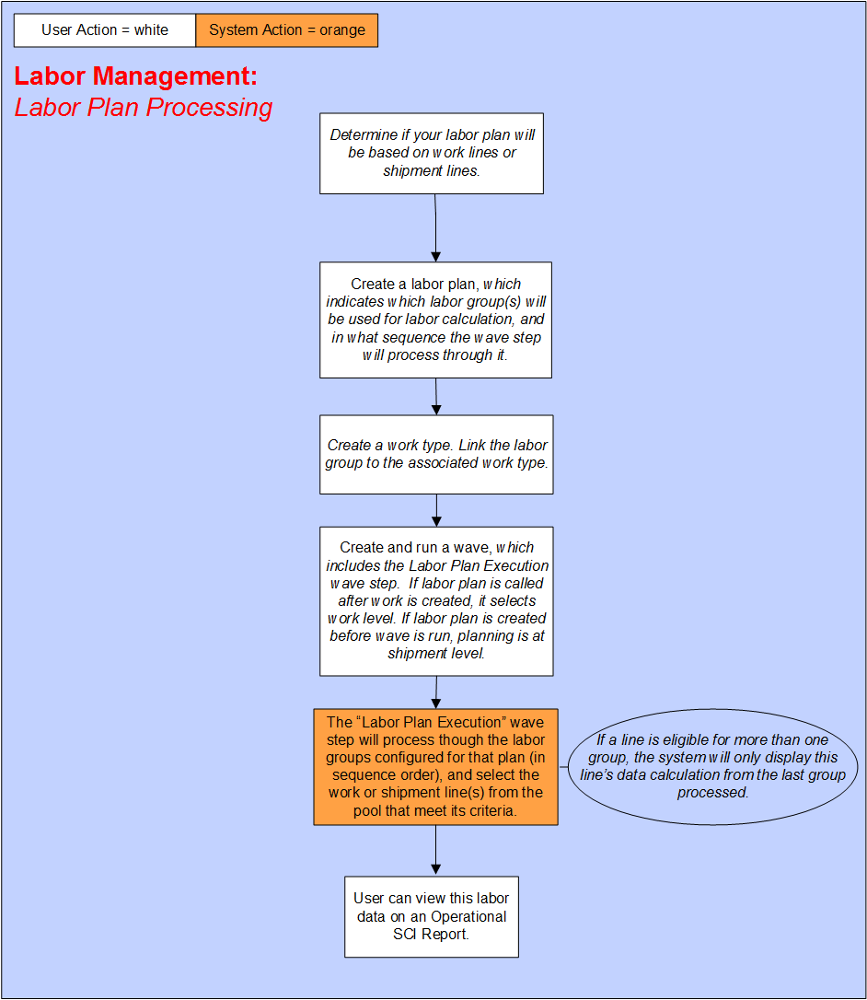

        
        <h1 data-source-node="n56">Labor Management Process Summary</h1>
        
<a href="7dd4c71c4fffda7e9ee1126c5142b92f5d6ebf82faf4a4f204c59dfe5f1bfd65.html" style="font-style: normal;color: #000000;font-weight: bold" data-source-node="n58">Functionality</a>
        

        
<a href="1577dee17cd3cea384f5b8e40cd757565dffd0a44971e2ddedcc12a2428f0a2b.html" style="color: #000000;font-style: normal;font-weight: bold" data-source-node="n60">Scenarios</a>
        

        
<b style="font-style: italic" data-source-node="n62">** Process Flows **</b>
        

        
 

        
 

        
Below is a graphical representation of the core processes of the Labor Management functionality:

        
 

        
 

        

            
        

        
 

        
 

        
 

    