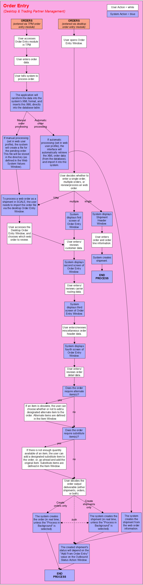

        
        <h1 data-source-node="n56">Order Entry Process Summary</h1>
        
<a href="c8560c338e6a97414b70d7033501624f7b8184c248942b1d397328383f163a04.html" style="font-style: normal;color: #000000;font-weight: bold" data-source-node="n58">Functionality</a>
        

        
<b data-source-node="n60">** Process Flows **</b>
        

        
 

        
 

        
This process diagram illustrates how SCALE manages entering of order data 
 into the system (via full screen and Trading Partner Management).

        
 

        

            
        

        
 

        
 

        
 

        
 

        
 

        
 

        
 

        
 

        
 

        
 

        
 

        
 

        
 

        
 

        
 

        
 

    