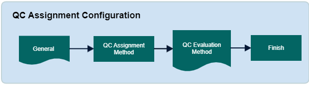

        
        <h1 style="text-align: left;font-size: 12pt" data-source-node="n56">QC Assignment Configuration
        </h1>
        <h4 data-source-node="n58">Overview</h4>
        
This record determines how to assign QC to shipping containers in the wave. The system also checks QC when the work unit starts, based on the picker (only for containers in the wave)

        <ul data-source-node="n60">
            <li data-source-node="n61">
                
Users can set QC assignment for the wave and/or work unit start.

            </li>
            <li data-source-node="n63">
                
Specify indicate how many shipping container(s) you want the system to apply QC to; for instance, 1 out of every 3 shipping containers that are evaluated by this assignment record.

            </li>
        </ul>
        <h4 data-source-node="n65"> </h4>
        <h4 data-source-node="n66">Configuration Hierarchy</h4>
        
 

        

            
        

        
 

        <h4 data-source-node="n71">Configure QC Assignment Records</h4>
        
 

        <h5 data-source-node="n73">1. QC Information </h5>
        
The QC information of QC Name, Assignment Reason, Priority, Apply to 1 of x containers and Current container count.

        
 

        <ul data-source-node="n76">
            <li data-source-node="n77">
                
Assignment Reason - This is description of the assignment method you are defining with this record. This field's value is displayed on both the QC Workbench and the Shipping Container Window's QC tab.

            </li>
        </ul>
        <ul data-source-node="n79">
            <li data-source-node="n80">
                
Priority - This indicates to the system in what order the system should process through the QC assignment records. The record with the lowest priority (that matches the appropriate criteria) will be used by the system to assign QC to the shipment's container.

            </li>
        </ul>
        <ul data-source-node="n82">
            <li data-source-node="n83">
                
Apply to 1 of x containers - indicate to the system how many container(s) using this assignment record will be eligible for QC assignment.

                <ul data-source-node="n85">
                    <li data-source-node="n86">
                        
For example

                    </li>
                    <li data-source-node="n88">
                        
1 of 1 containers indicates that the system will assign QC to all shipping containers that meet the assignment filter criteria.

                    </li>
                    <li data-source-node="n90">
                        
1 of 10 containers indicates that the system will assign QC to one out of every ten shipping containers that meet the assignment filter criteria.

                    </li>
                </ul>
            </li>
        </ul>
        
Note: That 1 of 0 and NULL are invalid values for this field.

        <ul data-source-node="n93">
            <li data-source-node="n94">
                
Current Container Count - the current count of containers that have matched this QC assignment criteria. The system will increment this count value up by one every time QC evaluation occurs and a matching container is found. Note that this field is never editable by the user.

                <ul data-source-node="n96">
                    <li data-source-node="n97">
                        
For example:

                    </li>
                    <li data-source-node="n99">
                        
For the first container, the system will increment current container count to 1. No QC will be assigned.

                    </li>
                    <li data-source-node="n101">
                        
For the second container, the system will increment the current container count to 2. No QC will be assigned.

                    </li>
                    <li data-source-node="n103">
                        
For the third container, the system will increment the current container count to 3. QC is assigned to that container, since it is the third container that used this record, which matches the 1 of 3 container application criteria.

                    </li>
                    <li data-source-node="n105">
                        
When a fourth container is evaluated using this record, the current container count is incremented to 4, and the pattern continues as described above

                    </li>
                </ul>
            </li>
        </ul>
        <h5 data-source-node="n107">2. QC Assignment Criteria</h5>
        
System identifies the rules that will determine to which containers the system assigns QC. Also, users can create new QC assignment criteria information

        
 

        <h5 data-source-node="n110">3. QC Evaluation Method.</h5>
        
 

        
Determine when the system will evaluate and assign outbound QC to shipping containers. You will have to choose at least one of these options (you can also choose both).

        
 

        <ul data-source-node="n114">
            <li data-source-node="n115">
                
Wave - The system will evaluate and assign QC to containers created in the wave, if the QC Assignment wave step is in your wave flow, and the QC assignment criteria is met.

            </li>
        </ul>
        <ul data-source-node="n117">
            <li data-source-node="n118">
                
Start Work - The system will evaluate and assign QC to containers at the time of work unit start, if the QC assignment criteria is met.

            </li>
        </ul>
        <ul data-source-node="n120">
            <li data-source-node="n121">
                
Manual - The system will assign QC when a user manually marks a container for QC using the Mark for QC action on the Shipment Insight screen or RF Shipping Container QC screen. Note that only one QC assignment record can be created that uses the "Manual" method of assignment.

            </li>
        </ul>
    