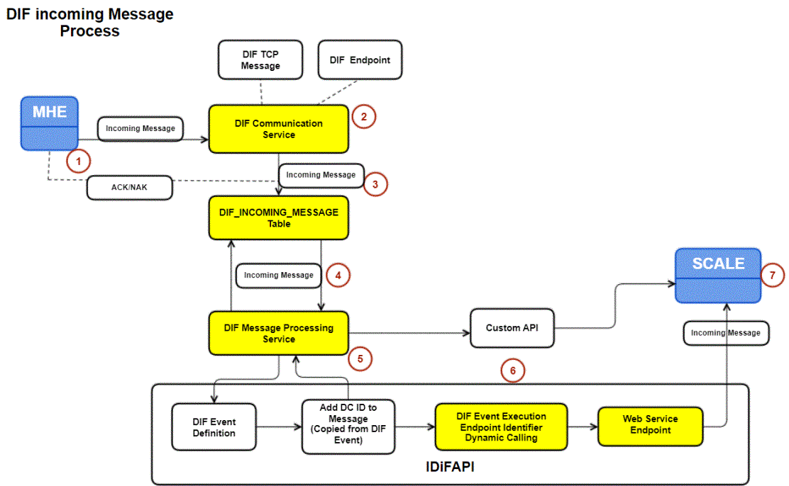
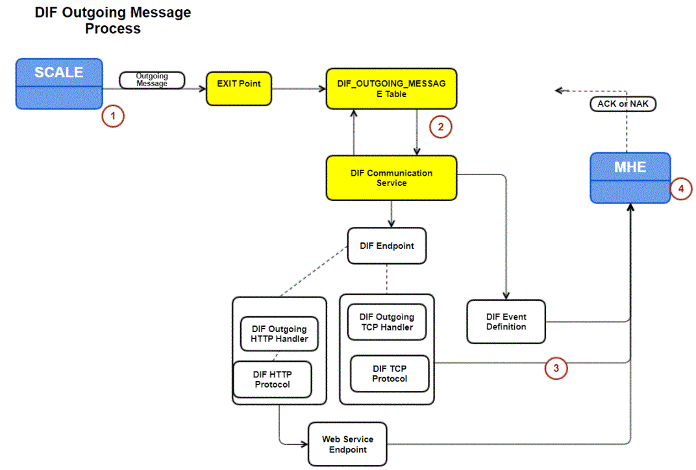

        
        <h1 data-source-node="n56">Device Integration Framework Process Summary...</h1>
        
<a href="6678efaf48f28c0a44b2e1460d2ab6c18050a333a56de1c53ba503cb274c6b60.html" style="font-style: normal;font-weight: bold" data-source-node="n58">Functionality</a>
        

        
<b style="font-style: italic" data-source-node="n60">** Process Flows **</b>
        

        
 

        
 

        
- <a href="#incoming" style="font-weight: bold" data-source-node="n64">DIF Incoming Message Process Flow</a>

        
- <a href="#outgoing" style="font-weight: bold" data-source-node="n66">DIF Outgoing Message Process Flow</a>

        
 

        

        

        

        <h4 data-source-node="n71">DIF Incoming Message Process Flow...</h4>
        
 

        <h5 data-source-node="n73">TCP</h5>
        
 

        

            
        

        
 

        
(1) The MHE sends an incoming message to the DIF Communication Service.

        
 

        
(2) The DIF Communication Service receives the incoming message (via the proper endpoint, referencing the endpoint’s TCP protocol settings).

        <ul data-source-node="n81">
            <li data-source-node="n82">(3) If the message received by DIF is a heartbeat message, then DIF simply sends an ACK (if active).
Note:   </li>
            <li data-source-node="n85">(4) If the message received by DIF is not a heartbeat message, the DIF Communication Service will attempt to write the message to the DIF_INCOMING_MESSAGE database table. If successful, the DIF Communication Service then sends an ACK (if active) back to the MHE. If not successful, the DIF Communication Service sends a NAK (if active) back to the MHE.</li>
        </ul>
        
(5) The DIF Message Processing Service checks the DIF_INCOMING_MESSAGE database table for messages. 

        <ul data-source-node="n87">
            <li data-source-node="n88">(6) If the DIF Message Processing Service finds a message, it sends the message’s data to a Custom API. Note that the DIF Message Processing Service knows what API to call because of what is defined in the DIF event.</li>
            <li data-source-node="n89">(6) SCALE provides a base IDiFAPI implementation in the application where user can  configure the API as required using the DIF event configuration identifier. The application will use the DIF event( DIF event execution identifier)  IDiFAPI to call the azure function.</li>
        </ul>
        
(7) When the Custom API or IDiFAPI is executed, the API parses the data, and executes the appropriate SCALE business logic (as defined in the DIF event). For example, suppose a container ID and weight values were sent, and the SCALE close container logic then performs the container close action (as defined in the DIF event).

        
 

        
Note: Refer the SDK for more information.

        
 

        <h5 data-source-node="n94">File Transfer</h5>
        <ol data-source-node="n95">
            <li value="1" data-source-node="n96">MHE sends/places a file in specified directory/folder with a specific file extension. Any file format is acceptable.  </li>
            <li value="2" data-source-node="n99">DIF communication services looks at the folder after specified sleep time and locates any files in folder with specified extension.  </li>
            <li value="3" data-source-node="n102">
If matching file is found, the communication service calls the specified endpoint handler (new one created called IncomingFileEndpointHandler) to process the file 3 ways depending on configuration
<ol data-source-node="n103"><li value="1" data-source-node="n104">Update the extension (to mark it as processed)
</li><li value="2" data-source-node="n105">Move the file to another directory/folder</li><li value="3" data-source-node="n106">
Add a record to the DIF Incoming message table with data field filled (Ex: 
\\&lt;&lt;ServerName&gt;&gt;\ils\interface\&lt;&lt;MHEProcess&gt;&gt;\processed\file123.rcvmhe.xml). Adding the record to the incoming message table we will include the file directory and the file name in the message field. 
</li></ol></li>
            <li value="4" data-source-node="n107">Incoming message will be processed like any other message by DIF Processing service.
</li>
        </ol>
        <h5 data-source-node="n108">Inserting Incoming DIF messages</h5>
        
MHE has the ability to insert DB records to incoming message without using the traditional DIF Communication service. 

        
Here the MHE requests the Web API (incoming message handler API) and posts the data through the API. 

        
 

        
<b data-source-node="n113">Note</b>: We need to utilize the <i data-source-node="n114">Confidential Client ID</i> – API to call the web API. This new API will enable you to get a bearer token to call the web API (for security reasons).

        
 

        

        

        

        <h4 data-source-node="n119">DIF Outgoing Message Process Flow...</h4>
        
 

        
 

        

            
        

        
 

        
(1) A custom program writes a message to the DIF OUTGOING_MESSAGE database table. An example of this could be work units created in a wave.

        
 

        
(2) The DIF Communication Service checks the DIF_OUTGOING_MESSAGE database table for messages.

        
 

        
(3) If the DIF Communication Service finds an outgoing message, the DIF Communication Service attempts to send that message to the MHE.

        
The outgoing message is precessed using TCP protocol and HTTP protocol as shown in the image.

        <ul data-source-node="n131">
            <li data-source-node="n132">(4) If the outgoing message is sent successfully, the MHE then sends an ACK (if active) back to DIF.   </li>
            <li data-source-node="n135">(4) If the outgoing message is not sent successfully, the MHE sends a NAK (if active) back to DIF. DIF would then attempt to resend the message a configured number of times.</li>
        </ul>
        
(5) If outgoing heartbeats are configured, DIF sends the heartbeat to the MHE (based on the configured interval and heartbeat type). If the MHE does not send an ACK (if active) to DIF, DIF will then shutdown the endpoint.

        
 

    