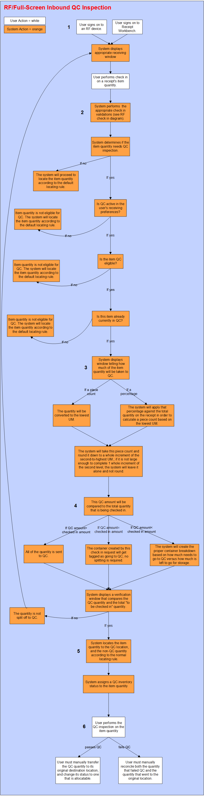

        
        <h1 data-source-node="n56">Quality Control Process Summary</h1>
        
<a href="7fee83bedacc280d73ab8604d7da77e350970595a7d54a61a63799eeb27494ff.html" style="font-style: normal;color: #000000;font-weight: bold" data-source-node="n58">Functionality</a>
        

        
<b data-source-node="n60">** Process Flows **</b>
        

        
 

        
 

        
This process diagram illustrates how an item quantity would pass though 
 the inbound quality control process.

        
 

        

            
        

        
 

        
 

        
 

        
 

        
 

        
 

        
 

        
 

        
 

        
 

        
 

        
 

        
 

        
 

        
 

        
 

        
 

        
 

        
 

        
 

        
 

        
 

        
 

        
 

        
 

        
 

        
 

        
 

        
 

        
 

        
 

        
 

        
 

        
 

        
 

        
 

    