        
        <h1 data-source-node="n56">Introduction to Insight Screens</h1>
        
You can use insight screens to search for and perform actions against data records in several functional areas. These screens are not only viewable from the SCALE Desktop, but are also optimized for mobile viewing on a device such as a tablet. The system uses a configurable framework called metadata to display the screen components, which allows you the ability to customize anything on the screen (fields can be added, taken away, moved around, etc). This topic describes the basic structure and function of insight screens.

        
 

        
 

        
 

        
The following is discussed in this topic:

        
- <a href="#Basic" data-source-node="n64">Basic Screen Structure</a>

        
- <a href="#SignInOut" data-source-node="n66">Sign In/Out of Insight Screens</a>

        
- <a href="#NavBar" data-source-node="n68">Using the Navigation Bar</a>

        
-<a href="#UsingMenu" data-source-node="n70"> Using the Menu Bar</a>

        
- <a href="#UsingSearch" data-source-node="n72">Using the Filter Pane</a>

        
- <a href="#UseListPane" data-source-node="n74">Using the List Pane</a>

        
- <a href="#UseDetailsPane" data-source-node="n76">Using the Detail Pane</a>

        
- <a href="#detailsScreen" data-source-node="n78">Using the Details Screen</a>

        
- <a href="#Custom" data-source-node="n80">Screen Customization</a>

        
- <a href="#security" data-source-node="n82">Security</a>

        
-<a href="#TouchDevice" data-source-node="n84"> Touch Device Guidance</a>

        
- <a href="#virtualKeyboard" data-source-node="n86">Using a Tablet's Virtual Keyboard</a>

        
- <a href="#fieldLengths" data-source-node="n88">Field Lengths / Decimal Positions</a>

        
 

        
 

        

        
 

        
 

        <h4 data-source-node="n94">Basic Screen Structure...</h4>
        
Each insight screen includes five primary components (as seen in the picture below): the Navigation Bar, the Menu Bar, the Filter Pane, the List Pane, and the Detail Pane. You can scroll each pane independently of each other. See the "using" sections later in this topic for more information about these screen components.

        
 

        

            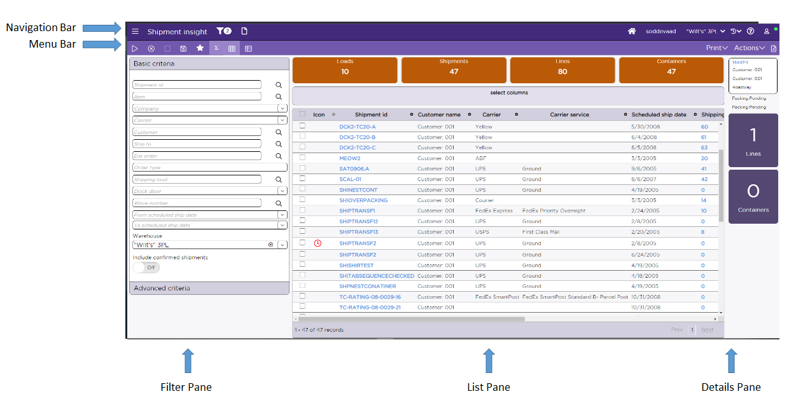
        

        
 

        

        
 

        
 

        <h4 data-source-node="n104">Sign In/Out of Insight Screens...</h4>
        
Authentication into the SCALE Insight screens is performed by an external Security Token Service (STS).

        
 

        
 STS performs authentication against an organization’s user pool. This could be Microsoft Entra ID or Active Directory Federation Services (AD FS) linked to an on-premise Active Directory. After you are authenticated by STS,  SCALE verifies that the email address is mentioned in the user profile configuration and that the user profile is active in the User Profile configuration. Upon successful verification,  access permission is granted. 

        
 

        
You can use the following URL as the generic sign-in and front page to SCALE: https://&lt;servername&gt;/scale/security/login. When you access this page, you will be navigated to the configured home page after authentication.

        
 

        
NOTE: For instructions on configuring the STS, refer to the SCALE installation guides.

        

        
 

        
 

        <h4 data-source-node="n116">Using the Navigation Bar...</h4>
        
An insight screen’s Navigation Bar (located on the top of the screen) provides you access to several important features.

        
 

        
The graphic below outlines the structure of the Navigation Bar:

        
 

        

            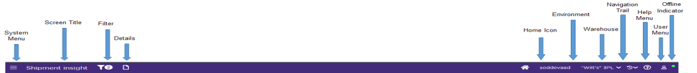
        

        
 

        <h5 data-source-node="n125">System Menu </h5>
        <ul data-source-node="n126">
            <li data-source-node="n127">This menu contains links to all of the insight/transaction/details/monitoring screens.   </li>
            <li data-source-node="n130">You can use the screen search box to select and open a screen directly from the search list. This box is available on any screen that has a system menu.   <ul data-source-node="n133"><li data-source-node="n134">When you type a value in the search field, the system will display the list of screens based on the typed value.  </li><li data-source-node="n137">The list will only display the screens that you are authorized or licensed to use.  </li><li data-source-node="n140">The list will also display the screens that you have added as Favorites.  </li><li data-source-node="n143">The screens will be displayed in the current tab only.  </li><li data-source-node="n146">You can also access non-metadata screens using the screen search.  </li></ul></li>
            <li data-source-node="n149">You can use its Favorites section to save one or more system menus.   <ul data-source-node="n152"><li data-source-node="n153">When you click on the Add icon under Favorites, the system will display 'Add a favorite' pop-up.   </li><li data-source-node="n156">Enter a suitable name for the Favorite screen and the screen gets added in the Favorites section under Add icon. You can retrieve the screen by clicking on that specified name.    </li></ul>
NOTE: If the screen currently being viewed is not either an Insight, Transaction, Details, or Monitoring screen, the Add icon disappears (For example, the security access violation page). Otherwise, the Add icon is enabled.  
</li>
            <li data-source-node="n162">You can delete the previously saved Favorites by clicking on the Edit button. A corresponding delete symbol for each of the saved Favorites allows you to complete the deletion process after you confirm the action.   </li>
            <li data-source-node="n165">When you select a different insight screen, you can choose to have the system display it in the current browser tab, in a new browser tab, or in a new browser window (by right-clicking on the link; or on a tablet, press-and-hold the link until a menu pops up).  </li>
            <li data-source-node="n168">If you collapse the system menu or navigate to a different screen, you can always traverse to the System Menu to find it in its previous state as set by you. In short, it retains the prior setting.   </li>
            <li data-source-node="n171">This menu displays all independent Insight screens grouped by their respective functional areas. The screens are segregated into different functional areas like Receiving, Order planning, Shipping, and so on. You can further click on them to find the corresponding list of Insight screens.   </li>
        </ul>
        

            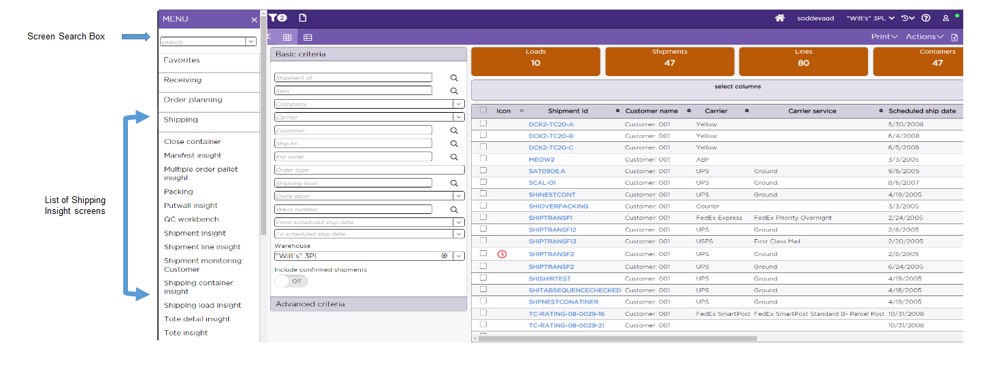
        

        
 

        
 

        
 

        

            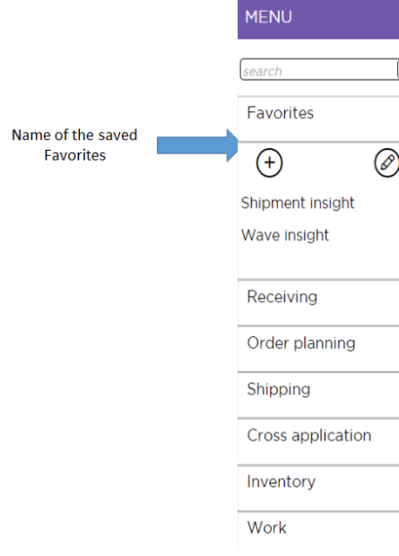
        

        
 

        
 

        <h5 data-source-node="n183">Screen Title</h5>
        <ul data-source-node="n184">
            <li data-source-node="n185">This represents the name of the current insight screen. </li>
        </ul>
        
 

        <h5 data-source-node="n188">Filter</h5>
        <ul data-source-node="n189">
            <li data-source-node="n190">This represents the filter applied on the Insight screen.   </li>
            <li data-source-node="n193">When a search is performed, the system will add a badge that indicates how many filter criteria were applied. In the above figure, since three criteria were indicated during the search, the badge has a "3" adjacent to it.    </li>
            <li data-source-node="n196">This badge will refresh its count once a new search is performed.  </li>
            <li data-source-node="n199">The system will not display the badge if a search is performed without the specified criteria.  </li>
            <li data-source-node="n202">Each row of defined advanced criteria represents 1 badge count.  </li>
            <li data-source-node="n205">Each "side" of a date/time range (i.e., from and to) represents 1 badge count.  </li>
            <li data-source-node="n208">Each multi-selection control (for example, Warehouse) represents 1 badge count, no matter how many selections are made in the control.  </li>
        </ul>
        <h5 data-source-node="n211">Display Toggle Buttons </h5>
        <ul data-source-node="n212">
            <li data-source-node="n213">These buttons will hide/show these two panes on the insight screen:   - The Filter Pane is represented by a filter icon.  - The Detail Pane is represented by a page icon. </li>
        </ul>
        
 

        <h5 data-source-node="n220">Home Icon</h5>
        <ul data-source-node="n221">
            <li data-source-node="n222">You can use this icon to return to your configured home page within the application. Any prior filter or data on the configured home page will not remain set.    </li>
            <li data-source-node="n225">If you have not configured any home page, clicking on this navigates you to the Warehouse Dashboard Screen.   </li>
            <li data-source-node="n228">You can set different home pages for each browser/device/environment. </li>
        </ul>
        <h5 data-source-node="n230"> </h5>
        <h5 data-source-node="n231">Environment</h5>
        <ul data-source-node="n232">
            <li data-source-node="n233">This represents the name of the environment that you are currently signed into. When signing on for the first time, the environment is set to one of the environments for which you have authorized access.  </li>
        </ul>
        
 

        <h5 data-source-node="n236">Warehouse</h5>
        <ul data-source-node="n237">
            <li data-source-node="n238"> This represents your user's assigned warehouse from the current session.  </li>
            <li data-source-node="n241">You can change the warehouse to any other warehouse for which you have access authorization. When you choose another warehouse, any subsequent screen will use the newly specified warehouse.  If you have specified the filter criteria, that will be retained (including the original warehouse) when returning to an insight screen from another screen after you have changed the warehouse.  If not, the warehouse in the filter criteria will be changed to the newly selected warehouse. </li>
        </ul>
        
 

        <h5 data-source-node="n244">Navigation Trail </h5>
        <ul data-source-node="n245">
            <li data-source-node="n246">This shows up to the previous 10 screens that the user has accessed within this browser tab, with the most recent starting at the top.  NOTE: If you use Cancel option to leave a screen, that screen is not added to the navigation trail.   </li>
            <li data-source-node="n251">This is unique per browser tab. If a screen is opened in a new tab, the navigation trail will start freshly in the new tab while the previous tab will maintain its trail.  </li>
            <li data-source-node="n254">Pressing (or selecting or tapping) on an entry will take the user back to that screen in its last “saved” state.  </li>
            <li data-source-node="n257">When you leave a sub-screen (displayed from a parent screen) by pressing the Cancel action, or the system completes processing on the sub-screen and returns to the parent screen, the sub-screen is removed from the navigation trail list. Therefore, the navigation trail is not maintained for the sub-screen.  </li>
            <li data-source-node="n260">Screens shown in modal dialogs are ignored. </li>
        </ul>
        
 

        <h5 data-source-node="n263">Help Menu</h5>
        <ul data-source-node="n264">
            <li data-source-node="n265"> This menu contains links to the SCALE online help, with which you can access the complete help system, or a topic specific to the insight screen you are currently viewing.   </li>
            <li data-source-node="n268">If you select the "toggle resource keys" option, the system will display the resource key ID's of text labels that the current insight screen is using. If you then select this option again, the system will hide the resource key ID's and display the text labels. Note that if the resource keys are toggled on and you navigate to a different insight screen, the system will open that new screen with the resource keys displayed as well. </li>
        </ul>
        
 

        <h5 data-source-node="n270">User Menu</h5>
        
If you click on the user menu, then  your SCALE user name will be displayed in the drop-down menu along with the following options:

        <ol style="font-weight: normal" data-source-node="n272">
            <li value="1" data-source-node="n273"><b data-source-node="n274">Restore Default Settings: </b>The "restore default settings" option will allow you to change back to the shipped default the following insight screen display settings: column grouping, column preferences (sequence, visibility, width), column sorting, mini-grid, and hierarchical mini-grid. Note that the system will prompt you to confirm this action before actually restoring these settings. While opening each insight screen, after performing a "restore default settings",  <ul style="font-weight: normal" data-source-node="n277"><li data-source-node="n278">All displayed columns show their entire column headings and data in them without data being truncated  </li><li data-source-node="n281">All displayed columns shrink to fit the data being displayed without truncating the data or the column heading. </li> </ul></li>
            <li value="2" data-source-node="n284"><b data-source-node="n285">Workstation Configuration: </b>This option enables you to set the application to the workstation identifier which will be the default machine for all document routing activities.  <ul style="font-weight: normal" data-source-node="n288"><li data-source-node="n289">Click <b data-source-node="n290">User Menu</b> &gt;&gt; <b data-source-node="n291">Workstation Configuration</b>  </li><li data-source-node="n294">In the <b data-source-node="n295">Workstation Assignment</b> pop -up window, select the workstation name from the drop down list. Click <b data-source-node="n296">Save</b>.  <b data-source-node="n299">Note</b>: The name populated in the drop-down is defined in the <b data-source-node="n300">Machine Name</b> field in the document routing configuration. Workstation name (identifier) are configured in the printer configuration section.  </li><li data-source-node="n303">Also, upon first sign in to the system, the <b data-source-node="n304">Workstation Assignment</b> pop-will be prompted to select the workstation.  </li> </ul></li>
            <li value="3" data-source-node="n308"><b data-source-node="n309">Set As Home Page: </b>Clicking on 'Set as home page' option sets the current page as your home page for that browser/device/environment. This is allowed on insight screens, transaction screens (not shown in a modal window), and monitor screens.  <ul data-source-node="n312"><li data-source-node="n313">Upon first sign in to the system without establishing a home page, the Warehouse Dashboard screen appears. After setting a home page, signing out and signing back in with the same user ID using this same device and browser takes you to the established home page.  No filters are set when the screen appears.  </li><li data-source-node="n316">After setting a home page on one browser but not another, signing in with the same user ID using a different browser takes you to the Warehouse Dashboard screen.  </li><li data-source-node="n319">After setting a home page on one device but not another, signing in with the same user ID using a different device takes you to the Warehouse Dashboard screen.  </li><li data-source-node="n322">Having different home pages for different browsers/devices, signing on with the same user ID takes you to the home page you have configured for that respective browser/device.  </li><li data-source-node="n325">When signing on to a different environment on a device/browser where the home page was established, you can establish a different home page for that environment.  </li> </ul></li>
            <li value="4" data-source-node="n329"><b data-source-node="n330">Sign Out: </b>The "sign out" option allows you to log out of the current insight screen session. </li>
        </ol>
        
NOTE: The user menu can show a generic image or your customized image  saved at  \\&lt;server name&gt;\ILS\Web\_custom\images with the file name &lt;username&gt;.png,

        
 

        <h5 data-source-node="n333">Offline Indicator</h5>
        <ul data-source-node="n334">
            <li data-source-node="n335">This graphical indicator tells the user whether the server is online (green) or offline (red). When the server is offline, the user is not able to perform any action, search for a result, or navigate to any other insight screen. All the fields will be disabled too. They will get enabled when the server comes online.</li>
        </ul>
        
 

        

        <h4 data-source-node="n338">Using the Menu Bar...</h4>
        
An insight screen’s Menu Bar (located below the Navigation Bar) provides you access to several important features.

        
 

        
The graphic below outlines the structure of the Menu Bar:

        
 

        

            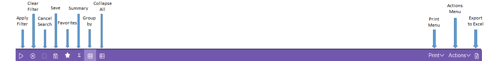
        

        
 

        <h5 data-source-node="n347">Apply Filter</h5>
        
 

        
If you provide some criteria to select specific records to be displayed, you can apply those filter with this menu. 

        
 

        <h5 data-source-node="n351">Clear Filter</h5>
        
 

        
You can delete the filter selection by clicking on this menu. The "clear" action performs several actions: any filter(s) that have been applied will be removed, the badge's count will be updated to zero, and a search action will be performed with no filters applied.

        
 

        <h5 data-source-node="n355">Cancel Search</h5>
        

             
        

        
You can stop a search that has been running for a long time by clicking on this menu. This menu will be enabled only if a record search is in progress.

        
 

        <h5 data-source-node="n360">Save</h5>
        
 

        
You can save the search criteria by clicking on this. Refer to <a href="#Search_Tips" class="MCXref xref" data-source-node="n363">Search Tips</a> and <a href="#SavingSeacrh" data-source-node="n364">Saving Search Criteria</a> for additional information. 

        
 

        <h5 data-source-node="n366">Favorites </h5>
        
 

        
Saved searches are displayed under the Favorites menu. 

        
 

        <h5 data-source-node="n370">Summary</h5>
        
 

        
If you do not need the Summary Tiles information in the <a href="#UseListPane" data-source-node="n373">List Pane</a>, you can click this Sigma (Σ) symbol to hide that information. 

        
 

        <h5 data-source-node="n375">Group by </h5>
        
 

        
You can show/hide the 'Group by Columns Area' section of the List Pane by clicking on this Group by icon. 

        
 

        <h5 data-source-node="n379">Collapse All</h5>
        
 

        
You can collapse all the records in the list pane when they are grouped by one or more fields. 

        
 

        <h5 data-source-node="n383">Save Filter Criteria as Tile</h5>
        
 

        
Click to save the set filter criteria for the insight screen as Tile. This save tile can be displayed in Warehouse Dashboard screen be enabling the tile. Read Save Filter Criteria for more information.

        
 

        
 

        <h5 data-source-node="n388">Print Menu Bar</h5>
        
 

        
 

        <h5 data-source-node="n391">Export to Excel</h5>
        
 

        
If you click on this option, a spreadsheet on your device will open with all of the rows on all pages of the grid being displayed.  On a Windows machine, this opens a spreadsheet in the Downloads directory.  On a non-Windows tablet device, it opens the spreadsheet in a new browser tab. 

        
 

        
NOTE:

        <ul data-source-node="n396">
            <li data-source-node="n397">
                
	Data is filtered by the criteria specified in the filter applied to the screen.  

            </li>
            <li data-source-node="n401">
                
 Data is sorted by the default sort set up for the screen.  If you have overridden the sort on the screen, it will not be reflected in the sorting of the spreadsheet.  

            </li>
            <li data-source-node="n405">
                
All columns from the grid, including those that are hidden from the user, are included.  

            </li>
            <li data-source-node="n409">
                
Date fields will also include the time stored in the database.  

            </li>
            <li data-source-node="n413">
                
Some Yes/No fields will display as 0/1 and some will display as False/True.  

            </li>
            <li data-source-node="n417">
                
Numeric fields will display with all of their decimal positions, even if configured to display with fewer/no decimal positions.  

            </li>
            <li data-source-node="n421">
                
When the maximum number of records (5,000) are displayed in the grid, the export includes only the records in the grid regardless of whether other records in the database meet the criteria.  

            </li>
        </ul>
        

        
 

        <h4 data-source-node="n427">Using the Filter Pane...</h4>
        
An insight screen’s Filter Pane (located on the far left of the screen) provides you multiple data search methods. Insight screens open by default with the Filter Pane collapsed.  You can expand the Filter Pane by pressing on the filter icon on the Navigation Bar.

        
 

        
The graphic below outlines the structure of the Filter Pane:

        
 

        
 

        

            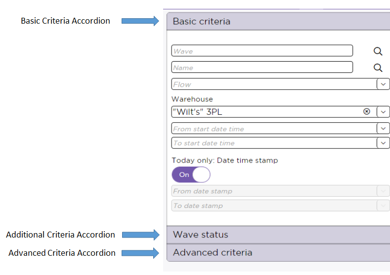
        

        
 

        <h5 data-source-node="n437">Basic Criteria Accordion</h5>
        <ul data-source-node="n438">
            <li data-source-node="n439">This includes several common fields that you will begin a search with.  </li>
            <li data-source-node="n442">The warehouse dropdown is defaulted with the user’s default warehouse.  The defaulted warehouse would be the same warehouse as displayed on the Navigation bar. </li>
        </ul>
        
 

        <h5 data-source-node="n445">Additional Criteria Accordion(s)</h5>
        <ul data-source-node="n446">
            <li data-source-node="n447">These accordions list various search criteria that you can use to further refine a search. The number of accordions displayed will depend on what type of Insight screen you are on.</li>
        </ul>
        
 

        <h5 data-source-node="n449">Advanced Criteria Accordion</h5>
        <ul data-source-node="n450">
            <li data-source-node="n451"> This accordion allows the user to  define "advanced" criteria in order to more finely define your insight screen search. This functions in the same manner as SCALE filter data configurations, in that you create data rules that will govern the search.</li>
        </ul>
        
 

        <h5 data-source-node="n453">Search Tips</h5>
        
The following are some tips to use when performing searches:

        <ul data-source-node="n456">
            <li data-source-node="n457">Search using the wildcard symbol % is supported only in text fields (not numeric field  NOTE: If you search without using the wildcard symbol, the system will still return all records that start with the characters entered.  For example, searching for "ABC" in the Item Field will return all the item records that begin with "ABC" (e.g., ABC0001, ABC-0010, and ABCDEFG).  </li>
            <li data-source-node="n462">
                
Invoke the search action by pressing the Apply button on the screen or the Enter key on your keyboard.  

            </li>
            <li data-source-node="n466">Remove all the current applied search filters by pressing the Clear button. Pressing the Clear button will not start a search.  </li>
            <li data-source-node="n469">Press the Apply button to start the search.  </li>
            <li data-source-node="n472">You can stop a search that has been running for a long time by pressing the Cancel Search button. </li>
        </ul>
        
 

        <h5 data-source-node="n475">Saving Search Criteria</h5>
        
You can save the criteria used for a search by pressing the save icon on the Filter Pane's menu bar. When you do this, the system will prompt you for a name to identify the search.

        
 

        

            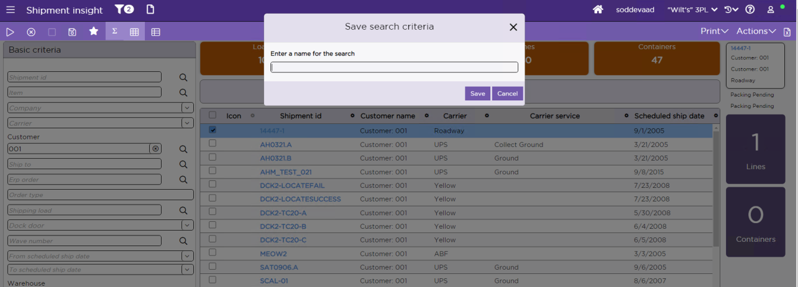
        

        
 

        
 Saved searches are displayed under the Favorites menu (indicated by a star icon, see the screenshot below). If you select a saved search, the system will perform the search, and display the resulting records. If you press the "X" button to the right of a saved search, then the system will delete it (after prompting you to confirm this action).

        
 

        

            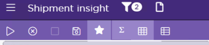
        

        
 

        
 

        

        
 

        
 

        <h4 data-source-node="n491">Using the List Pane...</h4>
        
An insight screen’s List Pane displays results from queries executed on the Filter Pane. The records are listed in a grid format, which is paginated if there are too many results to display on the screen at one time. The List Pane also includes several “summary tiles” that provide data totals related to the record(s) displayed in the grid. Opening the insight screen initially from the system menu or the home page button will display the list pane grid without any search results. You must press Apply Filter to view the results based on the filter criteria. If you open the insight screen from the navigation trail, indicator tile, monitoring screen insight button, monitoring screen chart, and so on,  the filter from the calling screen will be applied.

        
 

        
NOTE: Here columns by default are auto-sized to the maximum width of the column heading and the data being displayed. This ensures that the screen optimizes the data display without truncating anything pertinent. There are some exceptions to the rule such as description fields, which defaults to fixed length.  If the user resizes the column, then that column stays fixed at that width for that user/device/browser.

        
 

        
The graphic below outlines the structure of the List Pane:

        
 

        

            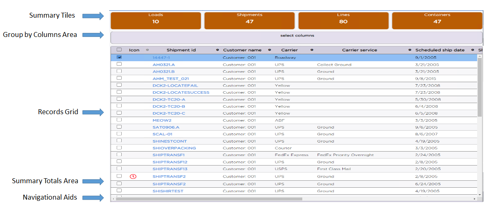
        

        
 

        <h5 data-source-node="n502">Summary Tiles </h5>
        <ul data-source-node="n503">
            <li data-source-node="n504">These present relevant "total" values related to the records displayed in the List Pane. You can hide this Summary Tiles section by clicking the  Σ ("Sigma") icon in the menu bar.</li>
        </ul>
        
 

        <h5 data-source-node="n506">Group By Columns Area </h5>
        <ul data-source-node="n507">
            <li data-source-node="n508">This allows you to manually drag grid columns in order to group the records listed by specific field(s). You can also press the "Select columns" link to perform this same action.  </li>
            <li data-source-node="n511">You can hide this section by clicking on the 'Group by' icon of the menu bar. </li>
        </ul>
        
 

        <h5 data-source-node="n513">Records Grid </h5>
        <ul data-source-node="n514">
            <li data-source-node="n515">This contains the record(s) that the system returned per your query executed in the Filter Pane:  - Opening the insight screen initially from the system menu or the home page button will display the list pane grid without any search results. You must press Apply Filter to view the results based on the filter criteria. If you open the insight screen from the navigation trail, indicator tile, monitoring screen insight button, monitoring screen chart, etc. will apply the filter saved for the screen from which the insight screen is being called.  - You use the checkboxes to select a row.  You can select multiple rows. Only actions that support multiple row selection are enabled when selecting multiple rows.  - You can navigate to other pages in the grid and also select rows from those pages.  - The checkbox at the top of the column selects all rows on that page.   If you also want to select all rows on other pages, you can navigate to those pages.   - The system will display 100 records by default on the screen, and the rest on pages, which you can navigate to by selecting the number of the page that you want to view. You can modify the initial number of displayed records through Screen Control Attributes, if needed.   - You can  choose the Advanced Filter  from the pop up bar to view the Advanced Filter screen. You can add filter criteria to the records matching either ALL or ANY of the criteria. Click Search to get the results based on the new search criteria entered.  - You can define conditional rule(s) in the database so that the system will shade grid row(s) a certain color if they meet the criteria for the rule(s). See the SDK topic "How to: Setup Colors on the List Pane Grid" for more information on how to define these rules.  - You can define conditional rule(s) in the database so that the system will display an icon on the grid row(s) if they meet the criteria for the rule(s). See the SDK topic "How to: Setup Icons on the List Pane Grid" for more information on how to define these rules.  - Note that the maximum amount of records that the system returns for a search is determined by the "Record number displayed in Quick Finds/Lookups/etc" value configured on the Technical Values Window. </li>
        </ul>
        
 

        <h5 data-source-node="n536">Summary Totals Area </h5>
        <ul data-source-node="n537">
            <li data-source-node="n538">This displays total values for numeric data columns (these are turned off by default). </li>
        </ul>
        
 

        <h5 data-source-node="n540">Navigational Aids </h5>
        <ul data-source-node="n541">
            <li data-source-node="n542">These allow you to select the grid page that you want to display, or move to the previous/next page. </li>
        </ul>
        
 

        

        
 

        
 

        <h4 data-source-node="n548">Using the Detail Pane...</h4>
        
An insight screen’s Detail Pane provides a snapshot view of a selected result record from the List Pane. The system displays data in this pane where the selected result represents a single row of inventory data. The header section will show information pertinent to that particular screen. For example, for the Shipment Insight screen, the header section of the detail pane should contain: Shipment ID, Customer Name, Ship to Name, Carrier/Carrier Service, Trailing Status/Leading Status, and Scheduled Ship Date. 

        
 

        
Also, there are Indicator Tiles indicating the total number of records associated with the selected record, and when you click on a tile, it takes you to the corresponding screen to show you the details of those records. For example, there are Indicator Tiles for the following in the Shipment Insight screen:

        
 

        <h5 data-source-node="n554">Lines:</h5>
        
 

        
 - Displays total number of shipment line records for a shipment.  

        
- Clicking on this tile takes you to Shipment Line Insight filtering by this internal shipment number.  

        <h5 data-source-node="n560">Containers: </h5>
        
 

        
- Displays total number of parent shipping containers. 

        
 - Clicking on this tile takes you to Shipping Container Insight filtering by this internal shipment number. 

        
 

        
Note that these Indicator Tiles can only be clicked if the user has the required security to access the called screen. 

        
 

        
The graphic below outlines the structure of the Detail Pane: 

        
 

        
 

        

            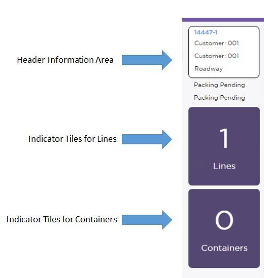
        

        
 

        
 

        <h5 data-source-node="n574">Actions Menu Bar </h5>
        <ul data-source-node="n575">
            <li data-source-node="n576">This includes a menu with links to action(s) that you can perform against the data represented in the Detail Pane. The system will typically display an appropriate success/error message after the action is invoked.</li>
        </ul>
        
 

        <h5 data-source-node="n578">Header Information Area </h5>
        <ul data-source-node="n579">
            <li data-source-node="n580">This includes important record data, specifically information that is typically used to identify a record (i.e., item/company/description for inventory records, or shipment ID/customer/carrier for shipment records).</li>
        </ul>
        
 

        <h5 data-source-node="n582">Summary Tiles </h5>
        <ul data-source-node="n583">
            <li data-source-node="n584">These present relevant "total" values related to the record represented in the Detail Pane.</li>
        </ul>
        
 

        <h5 data-source-node="n586">Data Accordions </h5>
        <ul data-source-node="n587">
            <li data-source-node="n588">These house informational fields related to the record represented in the Detail Pane. Some of the accordions are simply lists of fields. Others, however, contain a mini-grid, which lists a number of sub-records (such as lot, license plate, etc) related to the record selected in the List Pane.   </li>
            <li data-source-node="n591">You can resize columns in most mini-grids and hierarchical mini-grids. Also, note that such resizing is not possible on tablet devices without a mouse.  </li>
            <li data-source-node="n594">You can move columns in the mini-grid and hierarchical mini-grids.   </li>
            <li data-source-node="n597">You can sort columns in the mini-grid and hierarchical mini-grid.  </li>
            <li data-source-node="n600">You can hide columns in the mini-grid and hierarchical mini-grid.  </li>
            <li data-source-node="n603">This section displays 10 records on one page in the mini-grid and then the system will display navigational aids to allow you to view other data pages.</li>
        </ul>
        
 

        <h5 data-source-node="n605">Sidebar</h5>
        <ul data-source-node="n606">
            <li data-source-node="n607">This section facilitates easy navigation through the Details Pane. </li>
        </ul>
        
 

        

        
 

        
 

        <h4 data-source-node="n612">Using the Details Screen...</h4>
        
A Details Screen is displayed when you choose to edit/view a record from an insight screen. You can access the details screen from an actions menu "view" or "edit" option (depending on your security settings), or from a hyperlinked piece of information (such as the "work unit" value in the Work Insight screen). When you select this link, the system will open the Details Screen. 

        
 

        
The graphic below outlines the structure of the Details Screen:

        
 

        

            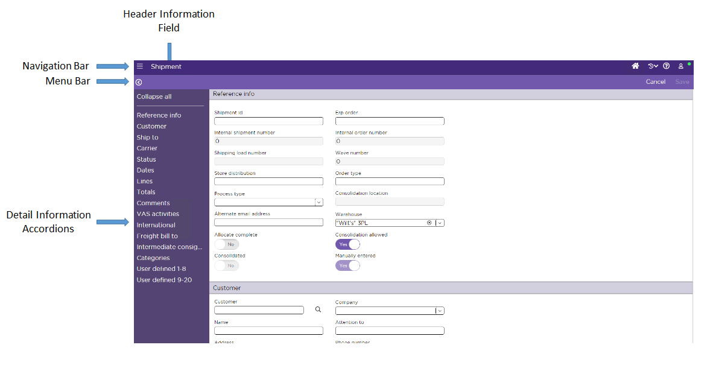
        

        
 

        <h5 data-source-node="n621">Navigation Bar</h5>
        <ul data-source-node="n622">
            <li data-source-node="n623">This includes the System Menu (Show or Hide the left pane), Screen Title, User Name Menu, Navigation Trail, Help menu (which includes the same options as the help menu on the insight screen's help menu), and the Offline Indicator. If you click on the System Menu, all independent Insight screens grouped by their respective functional areas get displayed. </li>
        </ul>
        
 

        <h5 data-source-node="n625">Menu Bar</h5>
        <ul data-source-node="n626">
            <li data-source-node="n627">This includes a Save button which allows the user to apply the changes you have made to a record.   </li>
            <li data-source-node="n630">The Cancel button cancels the screen and navigates back to the previous screen in the navigation trail.  </li>
            <li data-source-node="n633">Also, header informational field is located on this menu bar.  </li>
            <li data-source-node="n636">Adjacent to the header information field, the button with the down arrow symbol is used to expand and collapse the sidebar. </li>
        </ul>
        
 

        <h5 data-source-node="n638">Detail Information Accordions</h5>
        <ul data-source-node="n639">
            <li data-source-node="n640">This section displays a series of accordions that include the field values for the selected detail record. If a field is editable, then you can enter/select a value (if you have the appropriate security settings). This facilitates easy navigation between different sections and supports independent scrolling. </li>
        </ul>
        
 

        
NOTE: 

        
 

        
1. Click Collapse all if you want to minimize all the expanded Detail Information Accordions.   2. Columns by default are auto-sized to the maximum width of the column heading and the data being displayed.  This ensures that the screen optimizes the data display without truncating anything pertinent. There are some exceptions to the rule such as description fields, which defaults to fixed length. If the user resizes the column, then that column stays fixed at that width for that user/device/browser.

        

        
 

        <h4 data-source-node="n649">Screen Customization...</h4>
        
Insight screens can be customized to fit your specific business needs. For example, if your warehouse does not track license plates, all the license plate fields/references could be hidden from the Inventory Insight screen. This customization is done via the screen metadata. Please see the <a href="81d022a2ab379af5c9e945433d1bd3f6e09728fcfd355546989e79b3a0ecfa54.html" data-source-node="n652">SCALE SDK</a> for more information. 

        
 

        
 

        

        
 

        
 

        <h4 data-source-node="n658">Security...</h4>
        
 

        <h5 data-source-node="n661">Insight Screen Security</h5>
        
Insight screen security is governed by the following security forms:

        <ul data-source-node="n663">
            <li data-source-node="n664">"Global Security" form - Security settings defined on this form apply to ALL Insight screens. For example, security for the "toggle resources" and "restore default settings" Navigation Bar actions are configured as global security settings.  </li>
            <li data-source-node="n667">Insight screen-specific forms - Security settings defined on this form apply only to a specific Insight screen. For example, actions such as "create count" and "freeze lot" are configured on the "Inventory Insight" security form.</li>
        </ul>
        
 

        <h5 data-source-node="n669">Details Screen Security</h5>
        
Details screen security is governed by the following security forms: 

        <ul data-source-node="n672">
            <li data-source-node="n673">Details screen-specific forms - Security settings defined on this form apply only to a specific Details screen. For example, the security for the Shipping Container Details Screen is configured on the "Shipping Container" security form.</li>
        </ul>
        
 

        <h5 data-source-node="n675">Security Access Violations</h5>
        <ul data-source-node="n676">
            <li data-source-node="n677">The system will redirect a signed-in user to a "Security Access Violation" screen if you manually enter an inaccessible or invalid URL for a screen.  A URL is considered inaccessible when you do not have security access, or the application is not licensed to the screen in which you entered the URL.  A URL is considered invalid if the screen's form ID or internal detail number that you used as part of the URL does not exist.  </li>
            <li data-source-node="n680">The system will redirect a signed-in user to a "Security Access Violation" screen if you manually enter a URL for a Details screen that contains a company or warehouse for which you do not have access.  </li>
            <li data-source-node="n683">
                
The system will redirect you to the Sign-In page if you manually enter an inaccessible URL.

            </li>
        </ul>
        
 

        

        
 

        
 

        <h4 data-source-node="n689">Touch Device Guidance</h4>
        
If you need to delete a grid row on the screen, left swipe on the selected row. That will make the Delete icon ("X") appear on the grid. Touch that icon to delete that specific row. The system will delete once you confirm this action.

        
 

        
 

        

        
 

        
 

        <h4 data-source-node="n697">Using a Tablet's Virtual Keyboard</h4>
        
Typing on a tablet while using an Insight or Details screen is done using a virtual keyboard.  When you tap or focus on an editable field, the system will either automatically open the keyboard, or you will need to manually open it (depending on the tablet device/browser you are using). The keyboard then remains open as you scroll up and down on the Insight or Details screen.

        
 

        
 

        

        
        
 

        
 

        <h4 data-source-node="n705">Field Lengths / Decimal Positions</h4>
        
The field length on Insight and Details screens support up to 15 total characters (including the decimal positions and the decimal separator).  The database field, however may support more characters. For example, suppose the resource key for a field has a field length of 19,5; an Insight or Details screen will only display 15 characters (999999999.99999).  Note that the decimal separator is only counted as part of the total characters when the resource key’s field length is 15 or greater.

        
 

        
Insight screens use the Decimal Position configuration settings to manage a numeric field's decimal positions. However, numeric fields on the Details screens use the Decimal Positions settings on a field's resource for both read only and editable fields.  

        
 

        
 

        

        
        
 

    