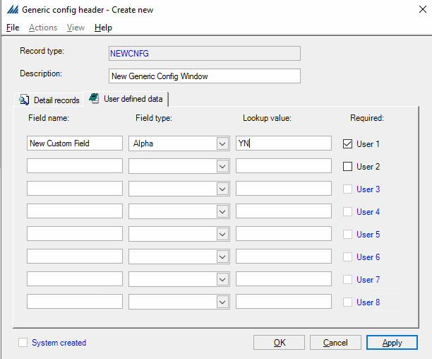
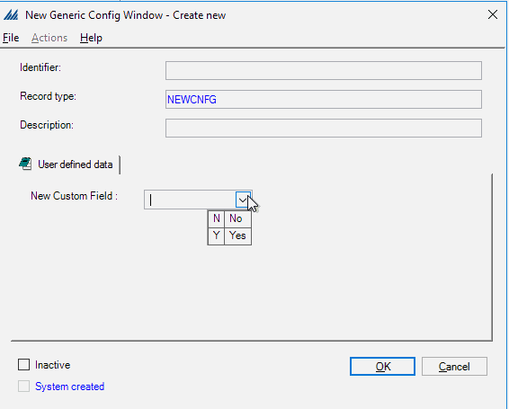

        
        <h1 data-source-node="n56">Using the Generic Config Header Window</h1>
        
The Generic Config Header Window is a listing of all the "generic 
 configuration windows" in the system. When you select the Generic 
 Config Header Window from the Configurations Explorer treeview, you can 
 access these configurations from the record list. From the Generic Config Header Window, you can perform standard record 
 processing, such as creating or deleting records. Also, this header window 
 is the only place in the system where you can create a new generic configuration 
 window. Note that the system will not recognize a new generic 
 configuration for system processing unless it is supported by programming 
 code that you supply. See your consultant for more information on creating 
 new generic configurations.

        
 

        
 

        <h4 data-source-node="n61">Related Topics...</h4>
        
<a href="62470f051ed57f24c0d7d9e59111662d32d64353aee9f242c70a9c048d6b3311.html" data-source-node="n63">Technical Process Summary</a>
        

        
 

        
 

        
The following is discussed in this topic:

        
<a href="#Creating" data-source-node="n68">Creating 
 a New Generic Configuration Window</a>
        

        
<a href="#Defining" data-source-node="n70">Defining Lookup Values</a>
        

        
<a href="#fieldLengths" data-source-node="n72">Note About Field Value Lengths</a>
        

        
 

        
 

        

        
 

        
 

        <h4 data-source-node="n78">Creating a New Generic Configuration Window...</h4>
        
You can use this window to create a completely new generic configuration 
 window. This new configuration will be listed in the Generic Config Header 
 Window and in the Configurations Explorer tree. Note that the system 
 will not recognize a new generic configuration for system processing 
 unless it is supported by programming code that you supply.

        
 

        
Use the following procedures to create a new generic configuration window:

        <ol data-source-node="n83">
            <li value="1" data-source-node="n84">Access the Generic 
 Config Header Window. Right-click on the record list and select 
 New. The system will display the Create New Generic Config Header Window.  </li>
            <li value="2" data-source-node="n87">
                
Use the Record Type Field 
 to provide the database name for the new generic configuration. This name 
 must follow database naming conventions.

                
 

            </li>
            <li value="3" data-source-node="n90">
                
Use the Description Field 
 to provide the name that will appear in the system for this configuration.

                
 

            </li>
            <li value="4" data-source-node="n93">If appropriate, 
 use the User Defined Data Tab to provide custom fields that will 
 be displayed on this configuration:  </li>
            <ul type="disc" class="ul_1" data-source-node="n96">
                <li data-source-node="n97">
                    
Provide a name for the new field in the Field Name Field.

                    
 

                </li>
                <li data-source-node="n100">
                    
Indicate the type of values that users will enter (alpha or 
 numeric) in the Field Type Field.

                    
 

                </li>
                <li data-source-node="n103">
                    
Enter a field function name in the Lookup Value Field. See <i data-source-node="n105">SDK &gt; User Interface Extensibility &gt; Dropdowns</i> for more information on filling dropdowns. For example, you could have this field populated with your customers 
 by entering the value "ConfigType|Customer", or the choices "Yes" 
 and "No" by entering the value "YN" (as seen in the 
 graphics in this topic). See your consultant for more details on how to 
 populate this field. See the Defining 
 Lookup Values section of this topic for more information on the 
 values you can have this system display using this field.

                    
 

                </li>
                <li data-source-node="n107">
                    
Check the Required Field if the user will have to provide a 
 value for this field.

                    

                         
                        
                         
                    

                </li>
            </ul>
            
 

            
 

            <li value="5" data-source-node="n115">
                
Press OK. The system will 
 save this new window and display it in Configurations Explorer tree and 
 the Generic Config Header Window (see graphic below).   NOTE: 
 You will still need to add detail records and supply the appropriate programming 
 code for this configuration to function properly.

                
 

                

                    
                

            </li>
        </ol>
        
 

        
 

        

        
 

        
 

        <h4 data-source-node="n125">Defining Lookup Values...</h4>
        
The Generic Config Header has a field for the Lookup Value. This value can either reference a generic config header or another existing configuration in the system. Please see the <a href="81d022a2ab379af5c9e945433d1bd3f6e09728fcfd355546989e79b3a0ecfa54.html" data-source-node="n128">SDK</a> topic <i data-source-node="n129">User Interface Extensibility | Drop Downs | How to: Define Dropdowns for Custom Configurations</i> for more information on filling dropdowns.  

        
 

        
 

        

        
 

        
 

        <h4 data-source-node="n135">Note About Field Value Lengths...</h4>
        
The Generic Config Header Window only allows field values up to the length that the associated field allows.  For example, the generic config detail database table allows a length of 50 characters.  However, a lot of the database fields that use these for their valid values (Receipt ID Type on the receipt, for example) are shorter than that (25 characters, in this example).  The generic configuration looks at the associated System Text Editor record to determine the length of the values that will be allowed for this field.  Therefore, if the generic config is RCPTIDTYPE, the configuration uses the "Field Length" value from the System Text Editor record with “UI_GEN” prefix (i.e., UI_GENRCPTIDTYPE in this example) to determine the number of characters the system will allow for these values.

        
 

        
 

        
 

        
 

        
 

        
 

        
 

        
 

        
 

        
 

        
 

        
 

        
 

        
 

        
 

        
 

        
 

        
 

        
 

        
 

        
 

        
 

        
 

        
 

        
 

        
 

        
 

        
 

        
 

        
 

        
 

        
 

        
 

        
 

        
 

        
 

        
 

        
 

        
 

        
 

        
 

        
 

        
 

        
 

        
 

        
 

    