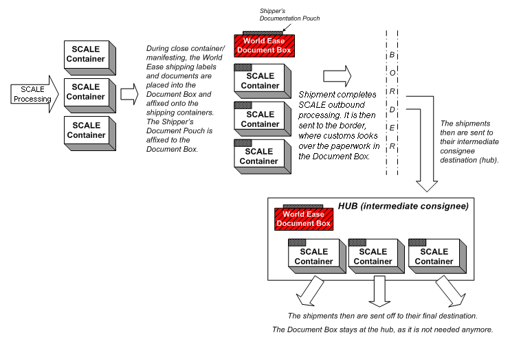

        
        <h1 data-source-node="n56">Processing UPS World Ease Shipments</h1>
        
Shipments using the UPS World Ease carrier service are packed in a different 
 manner than typical SCALE shipments. A special type of shipping label is 
 affixed to each shipping container. These labels include the ship to address 
 for both the intermediate consignee (a hub) and the final shipping destination. 
 Included with the shipping containers is a "box" which contains 
 the appropriate documents that World Ease requires to ship over the border 
 and into the hub destination. The diagram below outlines this flow:

        
 

        
 

        

            
        

        
 

        
 

        <h4 data-source-node="n65">Related Topics...</h4>
        
<a href="0f22f1f323600031ea5c3cc568dd2af321864f30780e3c575cac1c2905eaa2e4.html" data-source-node="n67">Carrier 
 Management Process Summary</a>
        

        
<a href="07edc31677cc85116035ff7f2dff1c2a3f7a1a38afdb4aaf867617691a7483ac.html" data-source-node="n69">Setup Overview</a>
        

        
<a href="74bd5050ae058ff4aba820b43b02e538e17cbe9401b27c9d2859d9d332f5eacc.html" data-source-node="n71">UPS 
 World Ease Paperwork</a>
        

        
<a href="1a68f98c95372daccf6d14d7ee27d977d03e3f3d3306c249635fecde24aa9c10.html" data-source-node="n73">Processing 
 UPS World Ease Groups</a>
        

        
<a href="58cd7d64c885a50e268db3aa2e75b949eb7eee3073552e172effec45f71968b2.html" data-source-node="n75">Using World Ease Insight Screen</a>
        

        
 

        
 

        
Discussed in this topic...

        
- <a href="#Procedures" data-source-node="n80">Procedures: UPS World Ease Shipments</a>

        
- <a href="#UsingBoxesLabels" data-source-node="n82">Using World Ease Boxes/Labels</a>

        
 

        
 

        
 

        <h4 data-source-node="n86">Procedures: UPS World Ease Shipments...</h4>
        <ol data-source-node="n88">
            <li value="1" data-source-node="n89">Process the shipment as a normal shipment through your outbound process to the point where the shipment/containers are ready to be manifested.  </li>
            <li value="2" data-source-node="n92">Initially, the container would not have the World Ease ID, World Ease Status, tracking number, and manifest state.  All four of these values will be NULL or 0.  </li>
            <li value="3" data-source-node="n95">Once the container is manifested, all the data fields listed in the previous step will be populated by the system.  If the manifest fails, the system will indicate that there is some configuration or data error.  Note that the World Ease status is Open at this stage.  </li>
            <li value="4" data-source-node="n98">Next, access the World Ease Insight from the Shipping group of the System menu..  </li>
            <li value="5" data-source-node="n101">Enter the World Ease ID that was populated on the container after manifest, and press Search.  </li>
            <li value="6" data-source-node="n104">Select the appropriate World Ease group and close it.  Note the paperwork cannot be printed until the group is closed.  </li>
            <li value="7" data-source-node="n107">In the World Ease Insight, choose the Print option to the print the required documents.  In addition to the documents printed from World Ease Insight, you will need to print the UPS shipping label.  This can be printed during the wave, during close container, or can be reprinted from the Shipment Insight screen.  </li>
            <li value="8" data-source-node="n110">Follow in the instructions provided on the back of the UPS label “01863201” or “01863202” to paste the label. See the section "Attaching Labels to the Shipment's SCALE Container(s)" below for more information.  </li>
            <li value="9" data-source-node="n113">Place all the documents in a UPS-provided document pouch. See the "Using World Ease Boxes/Labels" section below for more information.  </li>
            <li value="10" data-source-node="n116">Now your shipment is ready to be shipped out of the warehouse. Note that the UPS World Ease label part would be retained at the hub.</li>
        </ol>
        
 

        
 

        <h4 data-source-node="n119">Using World Ease Boxes/Labels...</h4>
        
 

        <h5 data-source-node="n122">Components</h5>
        
The following are used when processing UPS World Ease shipments. They 
 will be supplied by UPS.

        
 

        
- Document Box 
 (a.k.a. "Doc Box"): This is a specially-colored package 
 that includes paperwork which identifies your UPS World Ease shipment. 
 The Document Box accompanies your World Ease shipment until it leaves 
 the intermediate consignee destination.  

        
- Shipper's Documentation 
 Pouch: This plastic pouch is attached to the outside of the Document 
 Box. It contains three copies of the Master Invoice (three are required 
 per World Ease shipment), one copy of the Consolidated Invoice (a record 
 of the total number of containers in a World Ease shipment), and if required, 
 one copy of the Certificate of Origin. These documents are referred to 
 both when the shipment passes through border customs, and when it arrives 
 at the intermediate consignee destination.  

        
- Thermal Address 
 and Over-Label: This perforated label features two parts: the Address 
 and the Over-Label. It is attached to the SCALE shipping containers of a 
 World Ease shipment.  

        
- Other Paperwork: 
 See the topic    <a href="74bd5050ae058ff4aba820b43b02e538e17cbe9401b27c9d2859d9d332f5eacc.html" data-source-node="n132">UPS World Ease Paperwork</a> 
 for more information on the required documents and labels.

        
 

        
 

        <h5 data-source-node="n135">Preparing the Document Box</h5>
        
- The Document Box is always the "Lead Package" 
 of a master shipment; in other words, package one of the total number 
 of packages within a consolidation. The SCALE shipping containers represent 
 the "Child Packages."  

        
- The first step is to physically assemble the Document 
 Box in preparation for paperwork. You will attach the Shipper's Documentation 
 Pouch on the outside of the Document Box. Also, you can also place packing 
 slips or a manifest (containing detailed information about each consignee) 
 on the inside of the Document Box.

        
 

        
 

        <h5 data-source-node="n141">Generating Shipping Labels</h5>
        
- After you manifest the SCALE container (typically 
 during the close container process), Progistics will generate the Thermal 
 Address and Over-Label. 

        
 

        
 

        <h5 data-source-node="n145">Attaching Labels to the Shipment's Container(s)</h5>
        
- Remove the backing from the Address Label (upper 
 half), and attach it to the shipping container. Next, remove the backing 
 from the edges of the Over-Label (lower half), and place it on top of 
 the Address Label (ensuring that the bar code and UPS service indicators 
 are visible).   

        
- Once the shipment is cleared at the intermediate 
 consignee (hub), someone will remove the Over-Label to reveal the full 
 delivery label (which displays the final destination or consignee address 
 for that container).

        
 

        
 

        <h5 data-source-node="n151">Closing Out the Document Box</h5>
        
- Note that all the documentation in this step is 
 generated when you <a href="1a68f98c95372daccf6d14d7ee27d977d03e3f3d3306c249635fecde24aa9c10.html" data-source-node="n153">close a World 
 Ease Group</a>.  

        
- Attach the Document Box Label to the Document 
 Box.  

        
- Place three copies of the Master Invoice into 
 the Shipper's Documentation Pouch. When this is put into the pouch, be 
 sure to fold it with the printed information on the inside (to prevent 
 accidental scanning of bar codes, and conceal private data).  

        
- Place one copy of the Consolidated Invoice into 
 the Shipper's Documentation Pouch  

        
- If required, place one copy of the Certificate 
 of Origin (if shipping to Mexico, Canada, or the U.S. under the NAFTA 
 agreement) into the Shipper's Documentation Pouch.   

        
- Attach the Shipper's Documentation Pouch to the 
 outside of the Document Box. 

        
 

        
 

        
 

        
 

        
 

        
 

        
 

        
 

        
 

        
 

        
 

        
 

        
 

        
 

        
 

        
 

        
 

        
 

        
 

        
 

        
 

        
 

    