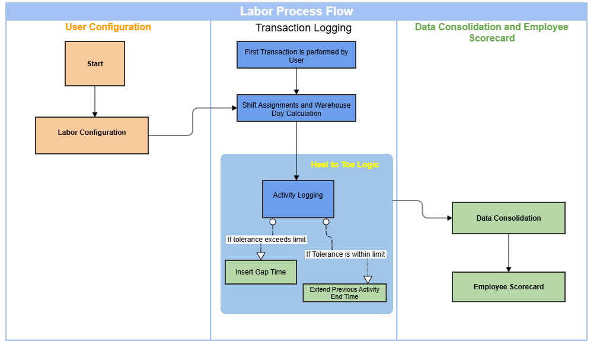

        
        <h1 data-source-node="n56">Labor Process Flow</h1>
        
Labor management monitors and evaluates user productivity across various warehouse operations. It generates labor data whenever an employee performs tasks such as work execution, packing, receiving, and other warehouse-related activities using Warehouse Mobile. Additionally, labor management helps compare actual labor performance against expected outcomes. This data becomes a valuable tool for optimizing warehouse operations and improving planning.

        
 

        
Related Topics

        <ul data-source-node="n60">
            <li data-source-node="n61">
                
<a href="0b4d4d788463e465337ddcd89b8cd80d6300446274cb809020808dc69eb74b33.html" data-source-node="n63">Labor Logging Process</a>
                

            </li>
            <li data-source-node="n64">
                
<a href="fc0abcad6a891e1949f19b38da8153b02774e5f865b88f6cf071bc35176a32e8.html" data-source-node="n66">Labor Shift Assignment Process</a>
                

            </li>
            <li data-source-node="n67">
                
<a href="e42573a30b142eb0880ede0d900d1c0c19ba7ccad359b6fc06674d77a358d869.html" data-source-node="n69">Labor Data Consolidation Process</a>
                

            </li>
            <li data-source-node="n70">
                
<a href="aa43edd4e644cf0f01941739de7714c25e79470d5f454312cdd871e8bf4b53b5.html" data-source-node="n72">Using the Labor Employee Scorecard</a>
                

            </li>
        </ul>
        
 

        <h4 data-source-node="n74">Process Flow</h4>
        
 

        

            
        

        
 

        
 

        <h4 data-source-node="n80">1. Labor Configurations</h4>
        
The following configurations are recommended to be set up to ensure accurate labor logging.

        
 

        <ul data-source-node="n83">
            <li data-source-node="n84">
                
<a href="75e5cda2f98440a3c1147b70496c8d8bd1353b2f8797e9a3df157fa77497b149.html" data-source-node="n86">Labor groups</a> configuration set the following.

                <ul data-source-node="n87">
                    <li data-source-node="n88">
                        
Activity Heel to Toe Tolerance (minutes).

                    </li>
                    <li data-source-node="n90">
                        
Expected throughput (Units/Hour)

                        
 

                    </li>
                </ul>
            </li>
            <li data-source-node="n93">
                
<a href="108021228fc36b25c0fd2f39430be767d65d796a190256fc9e621d629c294930.html" data-source-node="n95">Shift Time</a> - Configure the shift time for the Warehouse.

            </li>
        </ul>
        <ul data-source-node="n96">
            <li data-source-node="n97">
                
<a href="a0d3da00a0cb7ce0db99eeee61078a5b061022b1b1dfac923fccfde5c4ea6d8e.html" data-source-node="n99">Supervisor</a> - Associate the supervisor with the user. 

            </li>
        </ul>
        <ul data-source-node="n100">
            <li data-source-node="n101">
                
Using the <a href="435d216f7d877879265d008c99919ff3f51b433dc37de2213372f141ddcd5e49.html" data-source-node="n103">Labor</a> section in Warehouse Configuration, key thresholds can be set for 

                <ul data-source-node="n104">
                    <li data-source-node="n105">
                        
Throughput

                    </li>
                    <li data-source-node="n107">
                        
Utilization

                    </li>
                    <li data-source-node="n109">
                        
Throughput %

                    </li>
                </ul>
            </li>
        </ul>
        <ul data-source-node="n111">
            <li data-source-node="n112">
                
<a href="435d216f7d877879265d008c99919ff3f51b433dc37de2213372f141ddcd5e49.html" data-source-node="n114">Upcoming Shift Assignment Window</a> - Configure the time period before a shift starts during which an arriving user is assigned to that upcoming shift instead of the current one.

            </li>
        </ul>
        
 

        <h4 data-source-node="n116">2. Transaction Logging</h4>
        
Transaction logging is the process of recording user activity during warehouse operations.

        
 

        
Read the following to understand how the system assigns the shift and logs the labor activity in the application.

        <ul data-source-node="n120">
            <li data-source-node="n121">
                
<a href="0b4d4d788463e465337ddcd89b8cd80d6300446274cb809020808dc69eb74b33.html" data-source-node="n123">Labor Logging</a> 

            </li>
            <li data-source-node="n124">
                
<a href="fc0abcad6a891e1949f19b38da8153b02774e5f865b88f6cf071bc35176a32e8.html" data-source-node="n126">Labor Shift Assignment Process</a>
                

            </li>
        </ul>
        
Note: Using the <a href="16ac045c9b000123718b933af03aeb183921fc0324ab674e1345d4144927882e.html" data-source-node="n128">Indirect Labor Workbench</a> the supervisor can modify and enter indirect activity time for the labor records.

        
 

        <h4 data-source-node="n130">3. Data Consolidation </h4>
        
 

        
A scheduled background process  summarizes all user transactions. 

        <ul data-source-node="n133">
            <li data-source-node="n134">
                
Read <a href="e42573a30b142eb0880ede0d900d1c0c19ba7ccad359b6fc06674d77a358d869.html" data-source-node="n136">Labor Data Consolidation</a> for more details.

            </li>
        </ul>
        
 

        <h4 data-source-node="n138">4. Employee Scorecard</h4>
        
 

        
This consolidated data is then reflected in the <b data-source-node="n141">Employee Scorecard</b> screen, which displays key performance metrics such as Utilization, Throughput, and Throughput%.

        <ul data-source-node="n142">
            <li data-source-node="n143">
                
Read <a href="aa43edd4e644cf0f01941739de7714c25e79470d5f454312cdd871e8bf4b53b5.html" data-source-node="n145">Employee Scorecard</a> for more details.

            </li>
        </ul>
        
 

        
 

        

        
 

    