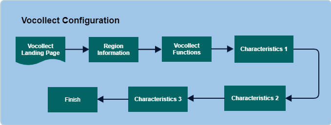

        
        <h1 style="text-align: left;font-size: 12pt" data-source-node="n56">Vocollect Configuration
        </h1>
        <h4 data-source-node="n58">Overview</h4>
        
A Vocollect region record determines how the voice picking process is managed (similar to a work profile). It includes many different values that you will need to define before you start picking using the TalkMan device.

        
 

        
Note that in many cases, Vocollect terms (not their SCALE equivalents) are used in this topic. See the topic Before You Begin: Vocollect Setup for a list of these terms and their SCALE equivalents.

        <h4 data-source-node="n62"> </h4>
        <h4 data-source-node="n63">Configuration Hierarchy</h4>
        
 

        

            
        

        
 

        <h4 data-source-node="n68">Configure Vocollect</h4>
        
 

        <h5 data-source-node="n70">1. Vocollect Region Information </h5>
        
 

        <ul data-source-node="n72">
            <li data-source-node="n73">
                
Region - A Vocollect term for the set of work to be done.

            </li>
        </ul>
        <ul data-source-node="n75">
            <li data-source-node="n76">
                
Work Profile - Select the SCALE side Work Profile.

            </li>
        </ul>
        
 

        <h5 data-source-node="n79">2. Vocollect Functions</h5>
        
This function indicates the type of picking flow that you want users of this region to use. Normal picking is the only function currently supported.

        
 

        <h5 data-source-node="n82">3. Characteristics 1</h5>
        <ul data-source-node="n83">
            <li data-source-node="n84">
                
Assignment Method - Determine whether users can enter their own work ID when starting an assignment, or the work is automatically selected them. Either system-directed or user-directed is defaulted from the first detail record of the appropriate work profile record (the one associated with a Vocollect region). Note that the group user work assignment method is not supported. 

            </li>
        </ul>
        <ul data-source-node="n86">
            <li data-source-node="n87">
                
Pick Prompt - indicates how the TalkMan gives the pick prompt to the user:

                
 

                <ul data-source-node="n90">
                    <li data-source-node="n91">
                        
Double Prompts mean that the TalkMan speaks a location prompt, after which the user speaks the check digits, and a quantity-to-pick prompt.

                        
 

                    </li>
                    <li data-source-node="n94">
                        
Always Single Prompt means that the TalkMan speaks the location and quantity to pick (no matter how many items the user should pick), before waiting for the user to speak the check digits.

                        
 

                    </li>
                    <li data-source-node="n97">
                        
Single Prompt, Omit Quantity When = 1 means that the TalkMan gives the location and, if the user should pick more than one item, the quantity to pick. The prompt may include the work ID as well (depending upon the setting of Speak Work ID Field). The slot identifier may include the slot, description, or both (depending upon the setting of pick by Location/description).

                    </li>
                </ul>
            </li>
        </ul>
        <ul data-source-node="n99">
            <li data-source-node="n100">
                
Speak Slot Description - Indicate what the TalkMan should speak to a user (the item’s slot, description, or both) when the user is picking in a particular region.

            </li>
        </ul>
        <ul data-source-node="n102">
            <li data-source-node="n103">
                
Maximum assignments - Determine the maximum number of work ID(s) that a Vocollect user can work on at one time. If it is greater than 1 (with user-directed assignment), then the user will have to speak all of the work IDs before beginning to pick. If it is greater than 1 (with system-directed assignment), the system will assign all of the work IDs first, and then the user will pick them one at a time.

            </li>
        </ul>
        
 

        
Toggle Buttons 

        <ul data-source-node="n107">
            <li data-source-node="n108">
                
<b data-source-node="n110">Skip aisle</b> - indicate whether a user can choose to skip an aisle when picking. Users may want to skip an aisle, for example, if they can see that a spill in the aisle makes picking now impossible. The terminal sends users back to pick skipped items at the end of the assignment, or the user can say, Repick skips at any point to pick those items if the Repick Skips Field is set to Yes. Keep in mind that if users can skip aisles, and they do so during base picking, they cannot repack those base items during the base pass; the skipped base items become part of the normal picking pass.

            </li>
        </ul>
        <ul data-source-node="n111">
            <li data-source-node="n112">
                
<b data-source-node="n114">Skip Slot</b> - indicate whether a user can choose to skip a slot when picking an assignment. Users may want to skip a slot, for example, if they see that it is short, but that someone will replenish it soon. The terminal sends users back to pick skipped items at the end of the assignment, or the user can say, Repick skips at any point to pick those items if the Repick Skips Field is set to Yes. Keep in mind that if users can skip slots, and they do so during base picking, they cannot repack those base items during the base pass; the skipped base items become part of the normal picking pass.

            </li>
        </ul>
        <ul data-source-node="n115">
            <li data-source-node="n116">
                
<b data-source-node="n118">Repick Skips</b> - indicate whether a user can choose to pick skipped items at any time during processing.

            </li>
        </ul>
        <ul data-source-node="n119">
            <li data-source-node="n120">
                
<b data-source-node="n122">Speak work id</b> - indicate whether the TalkMan says the work ID and location for every pick in a chase assignment.

            </li>
        </ul>
        <ul data-source-node="n123">
            <li data-source-node="n124">
                
<b data-source-node="n126">Sign off allowed</b> - indicate whether a user can choose to sign off before completing a pick.

            </li>
        </ul>
        <ul data-source-node="n127">
            <li data-source-node="n128">
                
<b data-source-node="n130">Speak entire location</b> - indicate that the complete location ID is spoken at once by the TalkMan device. Otherwise, the TalkMan will speak each location ID segment (aisle, bay, level, etc.) separately.

            </li>
        </ul>
        
 

        <h5 data-source-node="n132">4. Characteristics 2</h5>
        
 

        <ul data-source-node="n134">
            <li data-source-node="n135">
                
<b data-source-node="n137">Delivery</b> - indicate the type of delivery prompt. Prompt Delivery Location means the TalkMan prompts the operator with the delivery location and waits for the user to say Ready. The Prompt and Confirm option means the TalkMan prompts the user with the delivery location and waits for the user to confirm it by saying the delivery location and Ready. None means the TalkMan does not prompt the user with delivery information.

            </li>
        </ul>
        <ul data-source-node="n138">
            <li data-source-node="n139">
                
<b data-source-node="n141">Container Type</b> - The following selections are made

                
 

                <ul data-source-node="n143">
                    <li data-source-node="n144">
                        
For the "Picking Into Tote" and "Picking Into Shipping Container" flows (with container created on-the-fly, not in the wave), this field should be set to "Variable Full Quantity Container.”

                        
 

                    </li>
                    <li data-source-node="n147">
                        
For the "Picking Into Shipping Container" flow (with container created in wave), this field should have set to “No Container.”

                    </li>
                </ul>
            </li>
        </ul>
        <ul data-source-node="n149">
            <li data-source-node="n150">
                
<b data-source-node="n152">Work ID length</b> - Only used when a region is configured to allow manual work ID assignment. This value is used to specify how many digits of the work ID must be spoken by the user to manually request a work ID. The spoken work ID is matched to either the entire or the last &lt;number&gt; of digits of the work ID the user must speak.

            </li>
        </ul>
        <ul data-source-node="n153">
            <li data-source-node="n154">
                
<b data-source-node="n156">Lot id length</b> - used when the following occurs

                
 

                <ul data-source-node="n158">
                    <li data-source-node="n159">
                        
If the Lot ID for an item on the work instruction has length higher than configured on the Vocollect region, the system should strip the extra characters from beginning, and the user will be asked to speak last X characters of Lot ID configured on the region.

                        
 

                    </li>
                    <li data-source-node="n162">
                        
If the Lot ID length on work instruction is lesser than configured on the Vocollect region, system should check if the user spoke the entire lot ID. If the user didn’t speak the entire lot, system will display an error message. The user must then speak &amp;1 characters, else the system will accept what the user spoke.

                        
 

                    </li>
                    <li data-source-node="n165">
                        
If the Lot ID length on work instruction is equal to configured on the vocollect region, the system will allow user to speak entire lot ID.

                    </li>
                </ul>
            </li>
        </ul>
        
 

        
Toggle Buttons 

        <ul data-source-node="n169">
            <li data-source-node="n170">
                
<b data-source-node="n172">Pass Assignment</b> - indicate whether a user can choose to stop picking an in process work ID, and pass the rest of it on to another user for completion. Note that users cannot pass work during base picking or chase assignments (chase assignments are not currently supported with SCALE). Work also cannot be passed while splitting a pick.

            </li>
        </ul>
        <ul data-source-node="n173">
            <li data-source-node="n174">
                
<b data-source-node="n176">Quantity Verification</b> - indicate if you want the user to verify the quantity being picked. When you have this field set to Yes, the TalkMan will ask you to verify the quantity. When this field is set to No, the TalkMan will pick the full quantity right away, unless it is a lot-controlled item. This is because the TalkMan will ask for the quantity of a lot-controlled item.

            </li>
        </ul>
        <ul data-source-node="n177">
            <li data-source-node="n178">
                
<b data-source-node="n180">Allow reverse picking</b> - Indicate whether the user will be asked to choose the order of picking, either forward or reverse.

            </li>
        </ul>
        <ul data-source-node="n181">
            <li data-source-node="n182">
                
<b data-source-node="n184">Automatic putaway</b> - Indicates that the system will automatically putaway items during the work execution process. This value is defaulted from the first detail record of your SCALE Vocollect-related work profile record

            </li>
        </ul>
        
 

        <h5 data-source-node="n186">5. Characteristics 3</h5>
        
 

        <ul data-source-node="n188">
            <li data-source-node="n189">
                
<b data-source-node="n191">Prompt operation for container id</b> - indicate whether the TalkMan should prompt the user for the container ID when a new container is opened.

            </li>
        </ul>
        <ul data-source-node="n192">
            <li data-source-node="n193">
                
<b data-source-node="n195">Deliver container at close</b> - indicate whether the TalkMan should prompt the operator to deliver the container when it is closed.

            </li>
        </ul>
        <ul data-source-node="n196">
            <li data-source-node="n197">
                
<b data-source-node="n199">Pass Unit of measure</b> - indicate what unit of measure you want to use while picking. When this field is set to Lowest, the TalkMan will always use the lowest UM (such as Each). When it is set to Highest, the TalkMan will use the highest UM the system can convert the work detail to, for each Case, Pallet, etc.

            </li>
        </ul>
        <ul data-source-node="n200">
            <li data-source-node="n201">
                
<b data-source-node="n203">Spoken container validation length</b> - specify the number of digits a user must speak when validating a container to put, close, or reprint labels.

                
 

            </li>
            <li data-source-node="n205">
                
For example 

                <ul data-source-node="n207">
                    <li data-source-node="n208">
                        
If the Vocollect Container ID is 12345 and if the Spoken Container Validation Length is set to 3, then user should speak “345” to validate the container.

                    </li>
                    <li data-source-node="n210">
                        
If the Vocollect Container IDis 12345 and if the Spoken Container Validation Length is set to 20, then user should speak “12345” to validate the container since the Container ID Length is only 5 digits here.

                        
 

                    </li>
                    <li data-source-node="n213">
                        
NOTE: The SCALE containers are different from the Vocollect containers.

                    </li>
                </ul>
            </li>
        </ul>
        <ul data-source-node="n215">
            <li data-source-node="n216">
                
<b data-source-node="n218">Item reference</b> - Indicate how you want the TalkMan to handle item validation during the picking process. If there is no check digit assigned to the work ID, this field will be used to indicate whether the user needs to speak the last 5 digits of the item ID or its cross reference number.

            </li>
        </ul>
        <ul data-source-node="n219">
            <li data-source-node="n220">
                
<b data-source-node="n222">Allow multiple container per work id</b> - Indicate whether the user is allowed to open a new container without closing the current container. When this field is set to No, the container currently open will be closed automatically when the user tries to open a new one.

            </li>
        </ul>
    