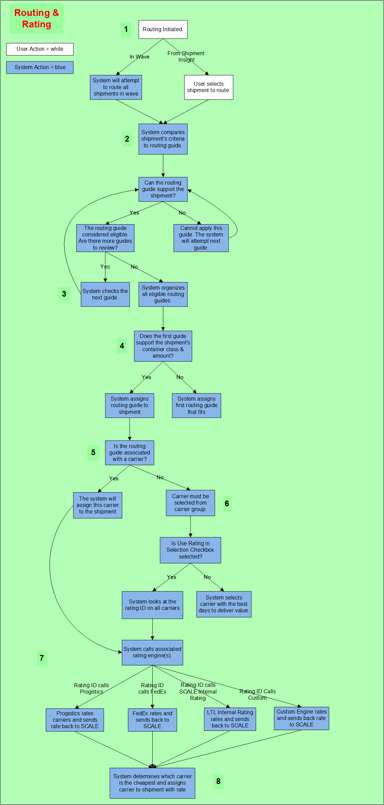

        
        <h1 data-source-node="n56">Carrier Management Process Summary</h1>
        
<a href="0f22f1f323600031ea5c3cc568dd2af321864f30780e3c575cac1c2905eaa2e4.html" style="font-style: normal;color: #000000;font-weight: bold" data-source-node="n58">Functionality</a>
        

        
<b data-source-node="n60">** Process Flows **</b>
        

        
 

        
 

        
This process diagram illustrates how a carrier and a rate are assigned 
 to a shipment. 

        
 

        

            
        

        
 

        
 

        <h4 data-source-node="n69">Rating &amp; Routing</h4>
        
Rating is the assignment of a charge levied for shipping. Routing is 
 the process of assigning a carrier to a shipment or a container.

        
 

        
 

        <h4 data-source-node="n73">Step 1: Routing is initiated from either the wave cycle or the Shipment Insight Screen.</h4>
        <ul data-source-node="n74">
            <li data-source-node="n75">
                
If routing is initiated from a 
 wave, the system will attempt to assign carriers to all shipments 
 in the wave. The system does not process the shipments in a specific order.

                
 

            </li>
            <li data-source-node="n78">If routing is 
 initiated from the Shipment Insight screen, the user will select the 
 shipment that he/she wants to route. This shipment is selected from the 
 Unassigned Shipments Node.</li>
        </ul>
        
 

        <h4 data-source-node="n80">Step 2: The system determines if this routing guide can service the 
 shipment.</h4>
        <ol class="ol_1" data-source-node="n81">
            <li value="1" data-source-node="n82">
                
To minimizes processing time, the system will use the shipment's 
 values defined on the routing guide record as filters. The values on this routing guide must match the corresponding values on a shipment; otherwise, the shipment is not considered for 
 processing. A list of these values can be found <a href="71ab7660da39122e6a53645eda09399c74eed2b00bd5ce6d74afd72d42652a9e.html" data-source-node="n84">here</a>.

            </li>
            

                
 

            

        </ol>
        
 

        <h4 data-source-node="n88">Step 3: The system organizes the eligible routing guides.</h4>
        <ol class="ol_1" data-source-node="n89">
            <li value="1" data-source-node="n90">
                
The system organizes routing guides based on the values in the following 
 fields:

                
 

            </li>
            <ul type="disc" class="ul_1" data-source-node="n93">
                <li data-source-node="n94">
                    
Customer / Ship To

                    
 

                </li>
                <li data-source-node="n97">Routing Code</li>
            </ul>
            
 

            <li value="2" data-source-node="n99">For example, assume that the system locates four 
 routing guides that it can apply to the shipment. The table below illustrates 
 how the system would organize those records, based on the order that it 
 reviews them:</li>
        </ol>
        
 

        <ul type="a" class="ul_2" data-source-node="n101">
            <table style="border-spacing: 1px 1px;margin-left: 0;margin-right: auto" cellspacing="0" data-source-node="n102">
                <col style="width: 122px" data-source-node="n103">
                <col style="width: 161px" data-source-node="n104">
                <col style="width: 120px" data-source-node="n105">
                <tr data-source-node="n106">
                    <td valign="top" class="td_13" data-source-node="n107">
                        
<i data-source-node="n109">Order 
 Reviewed</i>
                        

                    </td>
                    <td valign="top" class="td_13" data-source-node="n110">
                        
<i data-source-node="n112">Customer / Ship To</i>
                        

                    </td>
                    <td valign="top" class="td_13" data-source-node="n113">
                        
<i data-source-node="n115">Routing Code</i>
                        

                    </td>
                </tr>
                <tr data-source-node="n116">
                    <td valign="top" class="td_13" data-source-node="n117">
                        
1

                    </td>
                    <td valign="top" class="td_13" data-source-node="n119">
                        
Acme Cleaners / 100

                    </td>
                    <td valign="top" class="td_13" data-source-node="n121">
                        
Inside

                    </td>
                </tr>
                <tr data-source-node="n123">
                    <td valign="top" class="td_13" data-source-node="n124">
                        
2

                    </td>
                    <td valign="top" class="td_13" data-source-node="n126">
                        
Acme Cleaners / 100

                    </td>
                    <td valign="top" class="td_13" data-source-node="n128">
                        
--

                    </td>
                </tr>
                <tr data-source-node="n130">
                    <td valign="top" class="td_13" data-source-node="n131">
                        
3

                    </td>
                    <td valign="top" class="td_13" data-source-node="n133">
                        
--

                    </td>
                    <td valign="top" class="td_13" data-source-node="n135">
                        
Inside

                    </td>
                </tr>
                <tr data-source-node="n137">
                    <td valign="top" class="td_13" data-source-node="n138">
                        
4

                    </td>
                    <td valign="top" class="td_13" data-source-node="n140">
                        
--

                    </td>
                    <td valign="top" class="td_13" data-source-node="n142">
                        
--

                    </td>
                </tr>
            </table>
            
 

            
 

        </ul>
        <h4 data-source-node="n146">Step 4: After the routing guides are organized, the system will attempt 
 to assign one to the shipment.</h4>
        <ol class="ol_1" data-source-node="n147">
            <li value="1" data-source-node="n148">
                
The system assigns the first routing guide that supports the shipment, 
 as defined at Step 3. Here are some rules the system honors during this 
 assignment:

                
 

            </li>
            <ul type="disc" class="ul_1" data-source-node="n151">
                <li data-source-node="n152">
                    
If two or more guides share the same values defined at Step 
 3, the system will assign the record with the lowest priority number. 
 For example, assume guides ABC and DEF have the same customer/ship to 
 and routing codes. Guide ABC's priority is 1 and DEF does not have a priority 
 defined. The system would assign guide ABC.

                    
 

                </li>
                <li data-source-node="n155">
                    
If a value is defined in either the Customer/Ship To or the 
 Routing Code Field, it must also be defined on the shipment. However, 
 these values can be blank on the routing guide but defined on the shipment. 
 The system processes through the guides in the order depicted in the table 
 above (Step 3, B).

                    
 

                    
 

                </li>
            </ul>
        </ol>
        <h4 data-source-node="n159">Step 5: The system will determine if a single carrier is associated 
 with this routing guide.</h4>
        <ol class="ol_1" data-source-node="n160">
            <li value="1" data-source-node="n161">
                
To determine which carrier will transport the shipment, the system 
 will reference the Routing Selection Tab on the routing guide record.

                
 

            </li>
            <ul type="disc" class="ul_1" data-source-node="n164">
                <li data-source-node="n165">
                    
If a carrier/carrier service 
 is defined, the system will associate this carrier with the shipment. 
 It will transmit all relevant data. This information includes 
 the shipment's destination, weight, carrier, etc.   

                </li>
                <li data-source-node="n169">
                    
If a carrier group is defined, 
 the system will need to select a carrier from the group. 

                    
 

                </li>
            </ul>
        </ol>
        <h4 data-source-node="n173">Step 6: The system will determine which carrier in the group should 
 transport the product.</h4>
        <ol class="ol_1" data-source-node="n174">
            <li value="1" data-source-node="n175">
                
The system will check the Carrier Commitment record for all carriers 
 in the group. It will verify that all carriers can support the ship date 
 and the origin/destination postal code ranges. Any carriers that could 
 not support the ship date and the postal code will not be considered.

                
 

            </li>
            <li value="2" data-source-node="n178">
                
The system will look at the Rating ID on the Carrier.

                
 

            </li>
            <li value="3" data-source-node="n181">
                
From the Rating ID, it looks at the Server and Carrier Symbols to determine which rating server to transmit the data to 

            </li>
        </ol>
        
 

        <h4 data-source-node="n184">Step 7: The system calls the associated rating engines.</h4>
        <ol data-source-node="n185">
            <li value="1" data-source-node="n186">The system will transmit all relevant data to Progistics, FedEx, SCALE Internal LTL Rating or Custom Servers. This information 
 includes the shipment's destination, the origin postal code, etc.   </li>
            <li value="2" data-source-node="n189">These rating engines
 will determine the rate for the carrier.   </li>
            <li value="3" data-source-node="n192">Rates are given for all carriers that are eligible (support the ship date).  </li>
            <li value="4" data-source-node="n195">Rating engines pass back to the system the calculated rates.  </li>
        </ol>
        <h4 data-source-node="n198">Step 8: The system determines cheapest carrier.</h4>
        <ul data-source-node="n199">
            <li data-source-node="n200">The SCALE system will assign a carrier to the shipment based upon the cheapest rate between the carriers. These include parcel carriers, LTL carriers and FedEx.  </li>
            <li data-source-node="n203">The system updates the shipment with the rate.</li>
        </ul>
        
 

        
 

        
 

        
 

        
 

    