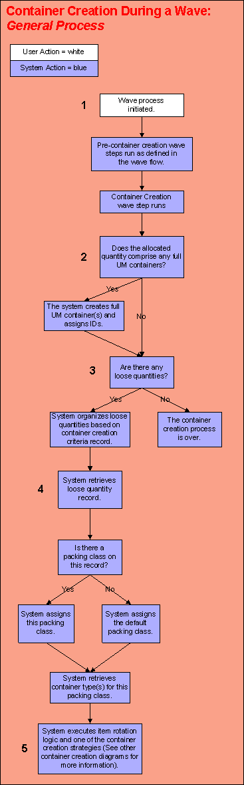
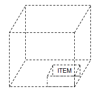
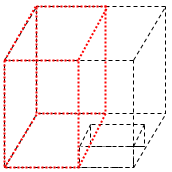
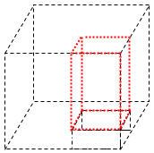
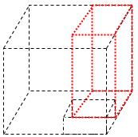
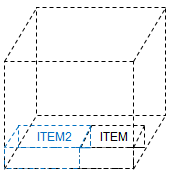
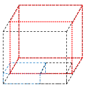
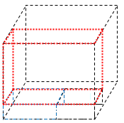
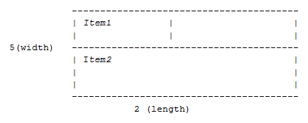

        
        <h1 data-source-node="n56">Container Creation in the Wave Process Summary</h1>
        
<a href="ac1a4d877d9ffe1b990794887848f749622dd7c2cd0a9ad41e79766deab74780.html" style="font-weight: bold" data-source-node="n60">Functionality</a>
        

        
<b data-source-node="n62">** Process Flows **</b>
        

        
 

        
 

        
 

        
The following diagrams are featured in this topic:

        
-	<a href="#generalProcess" data-source-node="n68">General Container Creation Process</a>

        
- <a href="#multiThreaded" data-source-node="n70">Multi-Threaded Container Creation</a>

        
-	<a href="#determine" data-source-node="n72">Determining The Volume Amount to Pack Into A Container</a>

        
 

        
 

        

        

        

        
 

        
 

        <h4 data-source-node="n80">General Container Creation Process...</h4>
        
 

        
Below is a diagram describing the general flow executed by the system when the container creation wave step is run:

        
 

        

            
        

        
 

        
<b style="text-decoration: underline;font-style: normal" data-source-node="n89">Step 1</b>
        

        
- During the wave, the allocation wave step generates allocation requests for a shipment. 

        
 

        
- The user then starts the wave process by choosing to run a wave.                      

        
 

        
- Note that if your wave flow includes the container creation wave step, it must be executed after the allocation wave step.

        
 

        
 

        
<b style="font-style: normal;text-decoration: underline" data-source-node="n98">Step 2</b>
        

        
The system retrieves all requests for full UM containers. The system creates one container (per full unit of measure container quantity) for product allocated as a full container. For example, if a full case is defined as 8 EA, and the system allocates 17, the system would create two full containers, and leave 1 EA for performing loose packing.

        
 

        
A) The system checks to see if either the location and/or the allocation rule detail have items with unit of measure(s) that are specified as “Treat as Loose" (set in the Item Unit of Measure Window). If this setting is activated, then the system will not create full containers when inventory is allocated for this unit of measure.For example, suppose you have an item with a CS quantity of 4 EA in its item unit of measure.  However, on either the allocation rule detail or on the location, only the unit of measure EA is selected. The system then will not create full containers for the item (even if 8 EA were allocated) because they were allocated in a unit of measure of EA. Note that if there is no item unit of measure configured, the system will reference the "Treat As Loose" value defined on the shipment line.

        
 

        
B) The system creates the containers in priority order. Priority is determined by the priority of the shipment line associated with the container. 

        
 

        
C) The system accesses the item unit of measure record for the item and UM of the new full container. The container type the system assigns to the full container is simply the quantity unit of measure (for example, CS or PL). Note that for this to occur, you need to define container types for your units of measure (CS, PL, etc.), so that the system can assign the correct container group on the containers it creates.The system also retrieves the following values from the item UM record: length, width, height, maximum weight, and empty weight.

        
 

        
D) The system generates a container ID for the container. It applies the values it obtained during Steps B and C (above) to this container.

        
 

        
E) The system completes this process (Steps B-D) for all full container quantities.

        
 

        
 

        
<b style="text-decoration: underline;font-style: normal" data-source-node="n113">Step 3</b>
        

        
A) After the system assigns container IDs to full containers, it determines if any loose quantity records need to be packed. During allocation, these loose quantities were created when the system broke lines into full container and the remaining eaches. The system organizes all of the loose quantity records based on two things: first, by packing class; and second (if needed) by the "order by" settings on the appropriate container creation criteria record. This ensures that related quantities can be packed together.

        
 

        
 

        
<b style="text-decoration: underline;font-style: normal" data-source-node="n118">Step 4</b>
        

        
A) The system retrieves the first loose quantity record and identifies its packing class. A loose quantity record represents one item allocated for one shipment. It can include multiple units of the same item.

        
 

        
B) The system determines which packing class should be used to process this record. If the packing class is defined on the shipment line record (either interfaced, or obtained from the item master), the system uses this value. If the record is not associated with a packing class, the system uses the *Default record.

        
 

        
C) The system retrieves the container group associated with this packing class.

        
 

        
 

        
<u style="font-weight: bold" data-source-node="n127">Processing Notes</u>
        

        <ul data-source-node="n128">
            <li data-source-node="n129">The following scenario is not supported: Creating containers during the wave (the work generated from allocation requests), and then executing the pick/putaway into a shipping container via RF, as the system would have no way to link the work from the allocation requests to the existing container that you would be picking into.   </li>
            <li data-source-node="n132"><i data-source-node="n133">User Defined Fields:</i> When the system creates a "loose" container, the user defined fields on the record for that container are filled from the Shipment record.  The user defined fields on the individual container detail records are filled from the corresponding shipment line.  When the system creats a "full" container, the user defined fields are filled from the shipment line.</li>
        </ul>
        
<a href="#top" style="font-style: italic" data-source-node="n135">Back To Top</a>
        

        
 

        

        

        

        
  

        <h4 data-source-node="n141">Multi-Threaded Container Creation...</h4>
        
 

        
This process involves having the system determine 
 the number of shipments that it will attempt to create containers for 
 at one time (using multiple processing threads). A value in the Technical Values 
 Window determines the number of shipments that the system will attempt 
 to create containers for simultaneously. This, in turn, determines the 
 number of threads that the system will use. For example, if this value 
 is set at 2, the system will concurrently try to create containers for 
 two shipments (each on its own separate thread). When the container creation 
 process ends for one shipment, the system will begin creating containers 
 for another shipment on the next available thread. This process continues until 
 all containers have been created. 

        
 

        
 

        
<a href="#top" style="font-style: italic" data-source-node="n148">Back To Top</a>
        

        
 

        

        

        

        
 

        <h4 data-source-node="n154">Determining the Volume Amount To Pack Into a Container...</h4>
        
 

        
 

        
To determine the amount of volume needing to be packed into a container, the system calculates the volume of the item being packed times the quantity being packed:

        <blockquote data-source-node="n159">
            
Volume to Pack = Item Length  x  Item Width  x  Item Height  x  Quantity of Item to Pack

        </blockquote>
        
 

        
The container itself can only be filled up to its fill percent.  This means if the fill percent is 80%, the container can only be packed up to 80% full.  Therefore, the usable volume of the container type is calculated as:

        <blockquote data-source-node="n163">
            
Container Type Volume = Container Length  x  Container Width  x  Container Height  x  Fill Percent of Container Type

        </blockquote>
        
 

        
To find the remaining capacity of the container, the system takes the usable volume of the container type minus the volume already used:

        <blockquote data-source-node="n167">
            
Remaining Capacity = Container Type Volume – Volume of Container Already Filled

        </blockquote>
        
 

        
If the remaining capacity is greater than or equal to the volume to pack, then the quantity will fit into the container.  If not, it cannot fit into the container.

        
 

        
 

        
<a href="#top" style="font-style: italic" data-source-node="n174">Back To Top</a>
        

        
 

        

        

        

        
 

        
 

        <h4 data-source-node="n181">Stabilization Amount/Codes...</h4>
        
Stabilization amount  refers to the amount of packing material (a single layer) between any two contact surfaces (i.e. items) in a container. This is communicated via item-specific codes are made up of character(s) in a numeric format (whole number or decimal). The maximum of these values for all items packed into a container will be used to define the amount of padding around each item in the container. These items are communicated via an “item list” (which is compiled by the 3D Cubing container creation strategy), that lists out per unit of measure each item/company and its associated stabilization code.

        
 

        
 

        
Once the stabilization code has been assigned, then 3D cubing adds the item stabilization code value to either side of the item's dimensions. For example, suppose an item's dimensions are the following:

        <blockquote data-source-node="n187">
            
Length = 2

            
Width = 3

            
Height = 4

        </blockquote>
        
And, suppose that the stabilization code that has been assigned is "0.5". This indicates that you want 0.5 spacing on all sides of 1 EA of the item. 

        
 

        
Therefore, the optimum packing dimensions for this item would be the following:

        <blockquote data-source-node="n194">
            
Length = 2 + (0.5 x 2)

            
Width = 3 + (0.5 x 2)

            
Height = 4 + (0.5 x 2)

            
 

            
Packing dimensions for this item (with stabilization code applied) = 3 x 4 x 5

        </blockquote>
        
 

        
Code Assignment Example 1 – Valid Default Stabilization Code Configured...

        
This example explains how the 3D cubing container creation strategy processes when an “valid” default stabilization code is configured in the container creation system value.

        
 

        
A) Suppose that you have a shipment that is comprised of two details:

        
 

        
<i data-source-node="n207">Item - Company - Quantity</i>
        

        
NOR0001 - Company A - 3 EA

        
NOR0002 - Company A - 2 EA

        
 

        
B) When the 3D Cubing container creation strategy begins processing, it compiles the <a href="#itemList" data-source-node="n212">item list</a>. 3D Cubing assigns each item quantity the default stabilization code as defined in the system value. For this example, this default value is configured to be a valid numeric value of “1”:

        
 

        
(3D Cubing Item List)

        
 

        
<i data-source-node="n217">Item - Company - Quantity - Stabilization Code</i>
        

        
NOR0001 - Company A - 1 EA - 1

        
NOR0001 - Company A - 1 EA - 1

        
NOR0001 - Company A - 1 EA - 1

        
NOR0002 - Company A - 1 EA - 1

        
NOR0002 - Company A - 1 EA - 1

        
 

        
C) Now, suppose that you wanted to assign specific stabilization codes to different items. The item list is then passed to the custom program, and the code would evaluate each of the items and assign them the appropriate stabilization code. Below is how the item list would appear after the items were assigned their own item-specific stabilization codes:

        
 

        
(3D Cubing Item List)

        
 

        
<i data-source-node="n229">Item - Company - Quantity - Stabilization Code</i>
        

        
NOR0001 - Company A - 1 EA - 3

        
NOR0001 - Company A - 1 EA - 3

        
NOR0001 - Company A - 1 EA - 3

        
NOR0002 - Company A - 1 EA - 12

        
NOR0002 - Company A - 1 EA - 12

        
 

        
D) The item list would then be passed back to SCALE with the correct stabilization codes, and the 3D Cubing strategy would continue processing.

        
 

        
 

        
 

        
Code Assignment Example 2 – Invalid Default Stabilization Code Configured...

        
This example explains how the 3D cubing container creation strategy processes when an “invalid” default stabilization code is configured in the container creation system value.

        
 

        
A) Suppose that you have a shipment that is comprised of two details:

        
 

        
<i data-source-node="n246">Item - Company - Quantity</i>
        

        
NOR0001 - Company A - 3 EA

        
NOR0002 - Company A - 2 EA

        
 

        
B) When the 3D Cubing container creation strategy begins processing, it compiles the item list. 3D Cubing assigns each item quantity the default stabilization code as defined in the system value. For this example, suppose this default value is configured to be an invalid alphanumeric value of “aa1a”:

        
 

        
(3D Cubing Item List)

        
 

        
<i data-source-node="n255">Item - Company - Quantity - Stabilization Code</i>
        

        
NOR0001 - Company A - 1 EA - aa1a

        
NOR0001 - Company A - 1 EA - aa1a

        
NOR0001 - Company A - 1 EA - aa1a

        
NOR0002 - Company A - 1 EA - aa1a

        
NOR0002 - Company A - 1 EA - aa1a

        
 

        
Since the default stabilization code was configured to be an invalid value (“aa1a”), 3D Cubing actually assigns a base code of “0” to each item instance. A process history message is also logged to alert the user of the invalid configuration value.

        
 

        
(3D Cubing Item List)

        
 

        
<i data-source-node="n267">Item - Company - Quantity - Stabilization Code</i>
        

        
NOR0001 - Company A - 1 EA - 0

        
NOR0001 - Company A - 1 EA - 0

        
NOR0001 - Company A - 1 EA - 0

        
NOR0002 - Company A - 1 EA - 0

        
NOR0002 - Company A - 1 EA - 0

        
 

        
C) 3D Cubing then would continue processing, either using the stabilization code of “0”, or using a different code as assigned by custom logic via the exit point (as described in step C of the first example).

        
 

        
 

        

        
 

        <h4 data-source-node="n279">Packing Algorithms...</h4>
        
 

        
The 3D cubing strategy process through several algorithms when attempting to determine if an item quantity will fit into a container type. If the item quantity is successfully packed using one of the algorithms, then the strategy will stop processing through the algorithms.

        
 

        
The algorithm processing sequence is as follows:

        <ol data-source-node="n285">
            <li value="1" data-source-node="n286"><a href="#algo1" data-source-node="n287">Same Pack</a>
            </li>
            <li value="2" data-source-node="n288"><a href="#algo3" data-source-node="n289">Default Pack</a>
            </li>
            <li value="3" data-source-node="n290"><a href="#algo4" data-source-node="n291">Two-Item Pack</a>
            </li>
            <li value="4" data-source-node="n292"><a href="#algo5" data-source-node="n293">Three-Item Pack</a>
            </li>
        </ol>
        
 

        
ALGORITHM ONE: SAME PACK

        
The “Same Pack” algorithm is the first algorithm that the 3D Cubing container creation strategy runs when it attempts to determine if an item can be geometrically packed into a container type. In essence, the “Same Pack” algorithm tries to pack the largest item that needs to be packed. Suppose there are five EA of Item1 (h=2, w=3, h=4) and five EA of Item2 (h=1, w=2, h=3). The algorithm then would try to pack a quantity of ten EA of Item1 (the item with the larger dimensions). Logically, then, any container type that could fit ten EA of the larger Item1 could therefore pack five EA of Item1 and five EA of Item2.

        
 

        
Below are the specific processing steps of the “Same Pack” algorithm:

        
 

        
(A) All items to be packed are assumed to be of the same size as this imaginary item.  This imaginary item is assumed to have the following:

        <blockquote data-source-node="n302">
            
Length = the largest length value of all the items.

            
Width = the largest width value of all the items.

            
Height = the largest height value of all the items.

        </blockquote>
        
(B) The algorithm determines which container type(s) can be considered according to the items’ packing class settings. These items are checked as to what container type(s) they would physically be able to fit in. This imaginary item quantity can fit in a container type, the algorithm assumes that all of the actual items would fit. Note that the algorithm checks the volume prior to checking the dimensions.

        
 

        
(C) The algorithm uses six different ways of aligning items in a container type:

        <blockquote data-source-node="n309">
            
I. 	- Largest dimension of the item along the largest dimension of the container

            
- Middle dimension of item along the middle dimension of the container

            
- Smallest dimension of item along the smallest dimension of the container

            
 

            
II. 	- Largest dimension of the item along the middle dimension of the container

            
- Middle dimension of the item along the smallest dimension of the container

            
- Smallest dimension of the item along the largest dimension of the container

            
 

            
III. 	- Smallest dimension of the item along the largest dimension of the container

            
- Middle dimension of the item along the middle dimension of the container

            
- Largest dimension of the item along the smallest dimension of container.

            
 

            
IV. 	- Smallest dimension of the item along the largest dimension of the container

            
- Largest dimension of the item along the middle dimension of the container

            
- Middle of the item along the smallest of the container.

            
 

            
V. 	- Middle dimension of the item along the largest dimension of the container

            
- Smallest dimension of the item along the middle dimension of the container

            
- Largest dimension of the item along the smallest dimension of the container.

            
 

            
VI. 	- Largest dimension of the item along the largest of the container

            
- Smallest dimension of the item along the middle dimension of the container

            
- Middle dimension of the item along the smallest dimension of the container.

        </blockquote>
        
(D) If the number of items that can be packed equals the number of items that were sent to the algorithm, then processing was successful, and the items are packed into the container. 

        
 

        
 

        
Same Pack Example...

        
Suppose a shipment has to be packed that has five items. The algorithm packs the first four items in the following manner:

        <ol data-source-node="n338">
            <li value="1" data-source-node="n339">The <i data-source-node="n340">dimlarge</i>, <i data-source-node="n341">dimmiddle</i> and <i data-source-node="n342">dimsmall</i> of the item should be aligned along the <i data-source-node="n343">dimlarge</i>, <i data-source-node="n344">dimmiddle</i> and <i data-source-node="n345">dimsmall</i> of the container.  </li>
            <li value="2" data-source-node="n348">However, suppose it is determined that the fifth item should be packed in the following manner:  - The <i data-source-node="n351">dimmiddle</i> of the item should be aligned along the <i data-source-node="n352">dimlarge</i> of the container. - The <i data-source-node="n354">dimsmall</i> of the item should be aligned along the <i data-source-node="n355">dimmiddle</i> of the container. - The <i data-source-node="n357">dimlarge</i> of the item should be aligned along the <i data-source-node="n358">dimsmall</i> of the container.  </li>
            <li value="3" data-source-node="n361">Then the fifth item will therefore be packed in this way.</li>
        </ol>
        
 

        
 

        
 

        
ALGORITHM TWO: DEFAULT PACK

        
The “Default Pack” algorithm is the second algorithm that the 3D Cubing container creation strategy runs when it attempts to determine if an item can be geometrically packed into a container type. This algorithm attempts to fit an item into a container, and then divides the remaining space into “cuboids.” A “cuboid” is a standard term for a rectangle in three-dimensional plane. It then tries to find the smallest cuboid into which the next item can fit. Each time an item is packed into the container, the container is divided into cuboids.

        
 

        
 

        
Below are the processing steps of the “Default Pack” algorithm:

        
 

        
(A) The algorithm determines which container type(s) can be considered according to the items’ packing class settings.

        
 

        
(B) Then the algorithm determines the first item can fit into the selected container type.  

        
 

        
(C) The algorithm analyzes the container type's dimensions to determine if any dimension is smaller than that of the item. If this is the case, then the item cannot be packed into this container type, and the algorithm will evaluate the next available container type.

        
 

        
(D) Once the algorithm chooses a container type, it then finds the best possible alignment for this item to be packed into the container (after its dimensions have been sorted).

        
 

        
(E) The algorithm then packs the item into the container (as seen in the graphic below):

        
 

        

            
        

        
 

        
(F) After the first item is packed, there very well may be some space left in the container. The algorithm considers this space in the form of three cuboids. Each of these cuboids is conceived as a separate container size (see graphic below). Note that these three container sizes overlap each other.

        
 

        
The first cuboid is to the left of the item:

        

            
        

        
 

        
The second cuboid is on top of the item:

        

            
        

        
 

        
The third cuboid is behind the item:

        

            
        

        
 

        
 

        
(G) The algorithm then determines the volume of each of these cuboids. Based on the largest cuboid, the first "container size" is determined.

        
 

        
(H) Once this container size is in place, the remaining space is conceived into two sets of two containers sizes each. Each of this set will have non-overlapping container sizes. The algorithm gets the biggest one of this set and determines the remaining two container sizes.

        
 

        
(I) There is now one item and three "container sizes" available for the remaining space.

        
 

        
(J) The algorithm sorts these container sizes using their dimensions.

        
 

        
(K) The algorithm then retrieves the next item quantity to be packed and determines the smallest container size into which it will fit.

        
 

        
(L) The algorithm then repeats the process outlined above (from step D on), until all the items are cubed. This is more of a recursive process where the algorithm tries to fit in the item quantity into the smallest available space, and splits the remaining space (within that space) into three smaller spaces. 

        
 

        
 

        
<b style="text-decoration: underline" data-source-node="n414">Second Item Cuboids</b> 

        
Suppose a second item is packed next to the first item in the example above:

        

            
        

        
 

        
 

        
The first cuboid would look like this:

        

            
        

        
 

        
The second cuboid would look like this:

        

            
        

        
 

        
 

        
 

        
ALGORITHM THREE: TWO-ITEM PACK

        
The “Two Item Pack” algorithm is the third algorithm that the 3D Cubing container creation strategy runs when it attempts to determine if an item can be geometrically packed into a container type. This algorithm is only used when the total allocation request quantity equals two items. It checks for all the combinations in which the items can be packed into the container starting with the smallest dimension. Each of the total allocation request quantity examples shown below would be eligible (note this is not a complete list):

        <ul data-source-node="n433">
            <li data-source-node="n434">2 EA of ItemA</li>
            <li data-source-node="n435">2 EA of ItemB</li>
            <li data-source-node="n436">1 EA of ItemA + 1 EA of ItemB</li>
            <li data-source-node="n437">1 CS (treat as loose) of ItemA + 1 EA of ItemB</li>
            <li data-source-node="n438">2 CS (treat as loose) of ItemA</li>
            <li data-source-node="n439">2 PL (treat as loose) of ItemB</li>
            <li data-source-node="n440">1 CS (treat as loose) of ItemA + 1 CS (treat as loose) of ItemB</li>
            <li data-source-node="n441">1 PL (treat as loose) of ItemA + 1 PL (treat as loose) of ItemB</li>
        </ul>
        
 

        
Below are the processing steps of the “Two Item Pack” algorithm:

        
 

        
(A) The algorithm determines which container type(s) can be considered, according to the packing class settings.

        
 

        
(B) The algorithm checks all the possible combinations of orientation of the dimensions of both items along any dimension of the container. It determines the most optimal packing after considering volume and critical dimensions conditions. All the combinations are checked starting from least feasible to most feasible. The sum of the items dimensions are attempted to be aligned with the following:

        <blockquote data-source-node="n448">
            
- The smaller dimension of container.

            
- The middle dimension of the container.

            
- The largest dimension of the container.

        </blockquote>
        
 

        
Two-Item Pack Example...

        
The method the algorithm uses starts by checking the smallest dimensions for both the item as well as container. Suppose you have the following:

        <blockquote data-source-node="n455">
            
Item1:

            
length=1, width=2, height=3

            
smallest dimension=1, medium dimension=2, largest dimension=3

            
 

            
Item2:

            
length=2, width=3, height=4

            
<i data-source-node="n463">smallest dimension</i>=2, <i data-source-node="n464">medium dimension</i>=3, <i data-source-node="n465">largest dimension</i>=4

            
 

            
Container1:

            
length=2, width=5, height=8

            
smallest dimension=2, medium dimension=5, largest dimension=8

        </blockquote>
        
So, the algorithm will first check whether the sum of the lengths of items are less than that of the container:

        <blockquote data-source-node="n471">
            
1+2 &lt;= 2

        </blockquote>
        
This is not true, so the algorithm will consider at other container dimensions:

        <blockquote data-source-node="n474">
            
1+2 &lt;=5

        </blockquote>
        
This is true, so the item can be potentially packed. On identifying a potential pack, the algorithm checks whether the other dimensions also match. In this example, the other dimensions are:

        <blockquote data-source-node="n477">
            
2+3 &lt;= 5

            
3+4 &lt;= 8

        </blockquote>
        
So, since the following is true…

        <blockquote data-source-node="n481">
            
2 &lt;= 8

            
3 &lt;= 8

            
1 &lt;= 2

            
2 &lt;= 2

        </blockquote>
        
…the algorithm can successfully pack the items into this container type.

        
 

        
Below is a graphic visualizing how this would look like (the item would be packed into two rows, one behind the other). Note that the graphic below represents the top view of the container:

        
 

        

            
        

        
 

        
 

        
 

        
ALGORITHM FOUR: THREE-ITEM PACK

        
The “Three Item Pack” algorithm is the fourth and final algorithm that the 3D Cubing container creation strategy runs when it attempts to determine if an item can be geometrically packed into a container type. This algorithm is only used when the total allocation request quantity equals three items. Each of the total allocation request quantity examples shown below would be eligible:

        <ul data-source-node="n498">
            <li data-source-node="n499">3 EA of ItemA</li>
            <li data-source-node="n500">2 EA of ItemA + 1 EA of ItemB</li>
            <li data-source-node="n501">1 EA of ItemA + 1 EA of ItemB + 1 EA of ItemC</li>
            <li data-source-node="n502">1 CS (treat as loose) of ItemA + 2 EA of ItemB</li>
            <li data-source-node="n503">1 CS (treat as loose) of ItemA + 1 CS (treat as loose) of ItemB + 1 EA of ItemC</li>
            <li data-source-node="n504">3 CS (treat as loose) of ItemA</li>
        </ul>
        
The basic premise for this algorithm is that the items will always fit in the same plane. The question is which plane and so we loop through each plane (or dimension of the container).It is similar to the “two item pack” algorithm and this time the combinations of the dimensions of all three items are tried to align along the various dimensions of the container and the most optimal packing is found out. Once the dimension is fit, the problem reduces to a 2D problem. The items are then tried to fit first along long dimension of container, then the middle dimension, and finally the small dimension of the container.

        
 

        
 

        
Below are the processing steps of the “Three Item Pack” algorithm:

        
 

        
(A) The algorithm checks to determine which container type(s) can be considered, according to the packing class settings of the item.

        
 

        
(B) The algorithm determines the smallest dimension onto which all the items can fit.  The algorithm first selected a dimension that it can definitely fit the all of the three items into; and then it will now check whether the other dimensions fit as well. In other words, since one dimension is now determined, the algorithm now needs to account for the other two dimensions.

        
 

        
(C) In order to fix a dimension as height, the algorithm runs through all container dimensions (smallest to biggest), checks them against the item dimensions (in order of biggest to smallest) to determine the smallest container dimension that can be set as the height.

        
 

        
 

        
Three-Item Pack Example...

        
- Suppose you have the following:

        <blockquote data-source-node="n519">
            
Item1: Length=2, Width=3, and Height=4

            
Item2: Length=3, Width=4, and Height=5

            
Item3: Length=4, Width=5, and Height=6

            
Container: Length=5, Width=6, and Height=9

        </blockquote>
        
- The algorithm will first find the dimension into which all these items can fit:

        <ul data-source-node="n525">
            <li data-source-node="n526">In this case, the algorithm would choose the planes along the dimension 9 (2+3+4 fits into this).  </li>
            <li data-source-node="n529">The other dimensions (3+4+5) or (4+5+6) do not fit into any container dimension.</li>
        </ul>
        
- Now, the algorithm considers this dimension as being fixed, and it looks for ways to fit the items into the other dimensions. Since the calculations remaining only involve two dimensions, the algorithm then processes like the Two Item Pack algorithm.

        
 

        
<a href="#top" style="font-style: italic" data-source-node="n533">Back To Top</a>
        

        

        
<b data-source-node="n537">2D Algorithm</b>
        

        
The 3D cubing container creation strategy has the ability to use a 2D packing algorithm if user specifies item orientation and stackability value of 0. 

        
 

        
The algorithm for 3D cubing in the application first checks the "Stackability" and "ItemOrientation" attributes of each item. If the item is not stackable or has a fixed orientation (length, width, and Height) the system will call the 2D packing algorithm to place it in the cube. The 2D algorithm here is now enhanced with Item rotation feature which enables system to calibrate the length/width of item to pack a greater number of items in the containers in single row.

        
 

        
<a href="#top" style="font-style: italic" data-source-node="n543">Back To Top</a>
        

    