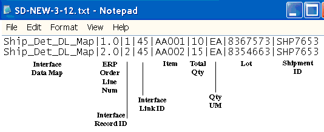
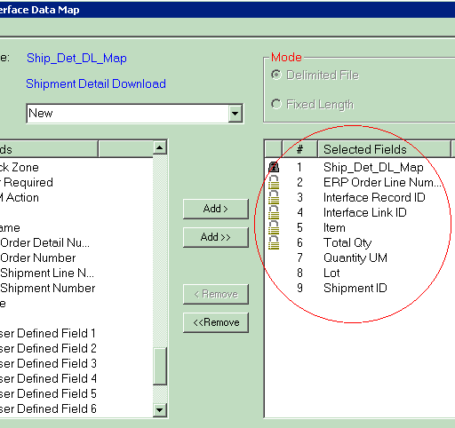

        
        <h1 data-source-node="n56">Delimited Interface Mode Overview</h1>
        <h4 data-source-node="n58">What is the Delimited Interface Mode?</h4>
        
A delimited interface involves using text files to transmit data to/from 
 the ERP. Using this method to download, your ERP places data in a text 
 file (with a user-defined file extension) in a directory on your server. 
 When the interface process is initiated, the system pulls the data from 
 the text file, parses them (based on a data map record which determines 
 the contents and structure of interfaced data), and places them into a SCALE database table. 

        
 

        
Using this method to upload, when the interface process is initiated, 
 the system places data that is eligible for uploading in a text file (with a 
 user-defined file extension) in a directory on your server. This eligible 
 data has reached a minimum user-defined status, such as "load confirmed" 
 for shipments or "closed" for receipt containers. The ERP then 
 will retrieve this text file, parse the data, and insert it into its own 
 database.

        
 

        
 

        
 

        <h4 data-source-node="n65">When are Delimited Interfaces Commonly Used?</h4>
        
You would typically use the delimited method 
 if you do not want to write directly to an interface database table. Generally, 
 this method is appealing if your ERP can export data via text files, and 
 you do not have the business need to communicate directly to the system's 
 database tables. 

        
 

        
 

        
 

        <h4 data-source-node="n70">What Actions Can a Delimited Interface Perform?</h4>
        
SCALE delimited interface mode supports four data actions (for uploads 
 and downloads):

        <ul type="disc" class="ul_1" data-source-node="n72">
            <li data-source-node="n73"><i data-source-node="n74">New Action</i>: 
 This action allows you to introduce new records to the system (downloads), 
 or provide data to the ERP (uploads). Generally, this is the action you 
 would perform using the interface.   In delimited mode, suppose your ERP generates a text file filled with 
 new data that is ready to be imported into the system. When the interface 
 is started, these "new" files are processed by the system and 
 interfaced into the SCALE database. This data then can be processed by the 
 user.  </li>
            <li data-source-node="n79"><i data-source-node="n80">Change Action</i>: 
 This action allows you to update records that were interfaced to the system 
 from the ERP. Generally, records can be changed until they reach a certain 
 processing point in the system. As a rule, change verification of interfaced 
 records follows the same standards as the change action within the system. 
 For example, you cannot change the carrier on a shipment once it's been 
 ship confirmed; therefore, you cannot change the carrier on a ship-confirmed 
 shipment via the interface. To determine when a change action is prohibited, 
 please review the help and check your own processing rules for the functional 
 area in question. Change actions can be used for downloads only.  In delimited mode, suppose your ERP generates a text file filled with 
 data meant to update records that already exist in the system. When the 
 interface is started, these "change" files are processed by 
 the system and interfaced into the SCALE database. These changes to records, 
 then, are merged into the SCALE database (which houses the existing data 
 records).  </li>
            <li data-source-node="n85"><i data-source-node="n86">Delete Action</i>: 
 This action allows you to remove records from the system that were interfaced 
 from the ERP. Like the Change action, you can delete a record until it 
 reaches a certain processing point in the system. The information provided 
 for the Change action above also applies for the Delete action. Delete 
 actions can be used for downloads only.  In delimited mode, your ERP generates a text file with data identifying 
 already-existing records that need to be deleted from the SCALE database. 
 When the interface is started, these "delete" files are processed 
 by the system and interfaced into the SCALE database. The system will interface 
 the file in, and delete the appropriate data. For example, suppose there 
 is an order that was canceled, the ERP would then send down a text file 
 identifying this order. The system would then interface this file in, 
 and make the appropriate deletion from the database.  </li>
            <li data-source-node="n91"><i data-source-node="n92">Save Action</i>: 
 This action allows you to update a current record (that the system sees 
 is a duplicate), rather than create a second record with the updated information. 
 If no matching record is found, the system will insert a new record. This 
 is helpful if your ERP system generates data that does not indicate that 
 it is new data or changed data. Save actions can be used for downloads 
 and uploads.  In delimited mode, your ERP generates a text file with data identifying 
 either new or already-existing records that need to be added/changed from 
 the SCALE database. When the interface is started, these "save" 
 files are processed by the system and interfaced into the SCALE database, 
 depending on the status of the data in the system. If 
 the data already exists, the system will handle this data record 
 as a Change action.        If the data does 
 not exist, the system will handle this as a New action. </li>
        </ul>
        
 

        
 

        <h4 data-source-node="n97">What are the Basic Steps to Implement / Use a 
 Delimited Interface?</h4>
        
The following configurations need to be addressed to process data via 
 a delimited interface:

        <ul type="disc" class="ul_1" data-source-node="n99">
            <li data-source-node="n100">First, you need to create an interface 
 process record, which determines how data will be downloaded/uploaded 
 between the system and the ERP. Each functional area has its own process 
 settings for the interface. For example, in the Receiving process record, 
 there is a separate detail record for each interface process you want 
 to use (such as "receiving delimited upload," "order XML 
 download," etc).  </li>
            <li data-source-node="n102">Next, you need to decide what specific field values 
 you want to transmit to/from SCALE. You can do this by creating an interface data map record, which lists 
 the required fields (and any other optional fields) that you want to interface 
 to/from the system.   </li>
            <li data-source-node="n104">In addition, you will need to address the various 
 interface system values. These 
 values mostly involve technical decisions that you have to address in 
 order for the system to run your interface properly, such as in what status 
 you want data to be eligible for uploading, or directories you want delimited 
 files to be downloaded from.  </li>
            <li data-source-node="n106">Finally, you will need to decide if you want to 
 run your interface manually, 
 or have the system kick it off        automatically 
 during scheduled time(s) of the day. If you decide to run it automatically, 
 you need to define a job record in the Scheduled Job Window.</li>
        </ul>
        
 

        
 

        <h4 data-source-node="n109">What Does a Typical Delimited File Look Like?</h4>
        
The following is an example of a delimited text file that is specially-formatted 
 to interface data into the system.

        
 

        

            
        

        
 

        <h5 data-source-node="n115">Notes</h5>
        
- The Interface Record ID value 
 is an unique identifier that labels each line in this delimited file. 
 This value is unique        only to 
 this particular delimited file.

        
 

        
- The Interface Link ID value 
 is an identifier that, in this case, ties these detail lines to the appropriate 
 shipment. Each line from this shipment that appears in this delimited 
 file will have the same interface link ID (45 in the example above).

        
 

        
- The Interface Data Map value 
 indicates the data map record that the system used to interface this data. 
 The following data map was used to interface the above data:

        
 

        
 

        
 

        <h4 data-source-node="n124">Where Should Delimited Files Be Placed in Order 
 for the System to Process Them?</h4>
        
You can define the directory where the system will place delimited files 
 to upload to the ERP, or already downloaded files that the ERP sent to 
 SCALE. You can define these directories (the Interface 
 Input Directory for downloads and the        Interface 
 Upload Directory for uploads) on the Interface System Values Window.

        
 

        
 

        
 

        <h4 data-source-node="n129">How Does the System Know Which Files to Download 
 to SCALE?</h4>
        
The system will attempt to process any files that have the appropriate 
 file extension. You can configure this extension on the Interface Process 
 Window, specifically the process detail record's File 
 Extension Field. For example, suppose you enter the file extension 
 "sh" for the delimited order download process detail record. 
 When the download interface process runs, the system will look in the 
 specified directory for all files that have an "sh" extension. 
 Note that it does not matter what the file is actually named, as long 
 as the matching extension exists.

        
 

        
 

        
 

        <h4 data-source-node="n134">How Does the System Know Which Data to Upload 
 to the ERP?</h4>
        
The system will attempt to upload data that has attained a certain 
 status:

        <ul data-source-node="n136">
            <li data-source-node="n137"> <i data-source-node="n138">For outbound statuses</i>, you can define what data is uploaded per status on the Functional Area Window. You can also use an upload criteria record to further define what shipment data is uploaded for a certain status. For example, 
 you could define the statuses "Load Confirm Pending" and "Closed" to include in interface uploads. When an eligible shipment's trailing status meets this status, then the system will write a record in the upload order table.  </li>
            <li data-source-node="n141"><i data-source-node="n142">For inbound statuses</i>, you can define what data is uploaded using a global setting in the Interface System Values Window. </li>
        </ul>
        
 

        
 

        <h4 data-source-node="n145">Where are Delimited Files Placed After Processing?</h4>
        
If you select the Save Processed Data 
 Checkbox on the interface process detail, the system will save 
 each "used" delimited file in the interface's Output directory, appending it with a user-configurable 
 extension. If you do not select this setting, the system will delete "used" 
 delimited files. Note, however, if a data validation error occurs with the interface, the system will place the original data file (with its original file extension) into a user-defined subfolder in the Output directory. You can indicate this directory in the Interface System Values Window.

        
 

        
 

        
 

        <h4 data-source-node="n150">Where Does Data Go When Downloaded Into SCALE?</h4>
        
The answer for this depends on what type of 
 data you are interfacing into the system. For 
 example, you could have downloaded orders to go into the pool (in the 
 Planned Shipment Insight), or as an "unassigned shipment" (in the Shipment 
 Insight). These statuses can be configured in the Interface System Values 
 Window.

        
 

        
 

        
 

        <h4 data-source-node="n155">What is a Data Map Record?</h4>
        
An important part of configuring how you will interface data is deciding 
 what fields to pass to/from the system. An interface data map record identifies 
 what fields should be included in an interfaced file, and the position 
 of each field. The system uses this information to read files it obtains 
 from the ERP or uploads to the ERP. You will need to keep in mind that 
 each data type has different field values that are required to be provided 
 when interfacing. You can also choose to interface a number of other fields, 
 which again specifically depend on what type of data is being transmitted.

        
 

        
 

        
 

        <h4 data-source-node="n160">Which Fields Should I Add to my Data Map?</h4>
        
For each type of data that you want to interface, there are fields that 
 SCALE requires you to include with each delimited file. You can indicate 
 these fields on the data map record. Examples of required values would 
 include such fields as Shipment ID for order data, Item ID for item data, 
 etc.  You 
 can also add any other field value to your data map, as long as it appears 
 on the database table for that type of data. See the table values spreadsheet 
for a list of fields 
 available.

        
 

        
 

        
 

        <h4 data-source-node="n165">Example of a Typical Data Map Record</h4>
        
The following is an example of how you could configure a data map record 
 to download order (shipment) details. In the example below, note that 
 the left pane displays all the fields that are available to add to your 
 data map. You can use the &gt; button to add a field to your data map. 
 Fields with a light-colored lock icon are required fields that can be 
 moved up/down the list, but not deleted from the map. Fields with a dark-colored 
 lock icon cannot be moved or deleted from the map. Note that data map 
 records for other touchpoints would look similar: 

        
 

        

            
        

        
 

        
 

        
 

        
 

        
 

        
 

        
 

        
 

        
 

        
 

        
 

        
 

        
 

        
 

        
 

        
 

        
 

        
 

        
 

        
 

        
 

        
 

        
 

        
 

        
 

        
 

        
 

        
 

        
 

        
 

        
 

        
 

        
 

        
 

        
 

        
 

        
 

        
 

        
 

        
 

        
 

        
 

        
 

        
 

        
 

        
 

        
 

    