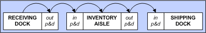

        
        <h1 data-source-node="n56">Using Pickup And Dropoff Locations</h1>
        
Pickup and dropoff (P&amp;D) locations can be used as intermediate storage areas while performing inventory movements. There are two types of P&amp;D locations: <i data-source-node="n59">incoming </i>and <i data-source-node="n60">outgoing</i>. An incoming P&amp;D location receives product that is coming "into" an area, such as from the receiving dock to an inventory aisle. An outgoing P&amp;D location houses product that is being taken "away" from an area, such as from the racks of an inventory aisle to the end of the aisle. The diagram below outlines all of the potential flows between P&amp;D locations and other areas of the warehouse:

        
 

        

            
        

        
 

        
For example, suppose you 
 have a narrow aisle that contains several inventory locations. When items 
 are picked from these locations, the picker would putaway the items 
 into an outgoing P&amp;D location (which resides at the end of the aisle). A different worker 
 would then pick these items, and take them to their next destination, such as an incoming P&amp;D location at the shipping dock).

        
 

        
NOTE: You can only perform P&amp;D location picks/putaways using an RF device.

        
 

        
 

        <h4 data-source-node="n70">Related Topics...</h4>
        
<a href="21428da0ae44e13ca2c0bcefba196f6df8418538d3c715c19189eea8ec30c5ae.html" data-source-node="n72">Location Process Summary</a>
        

        
<a href="02e047a890f390149676489cf85a56a92fc3c9b0b62ceb52a6cacdf43d5bd138.html" data-source-node="n74">Location Setup Overview</a>
        

        
<a href="76770f4602f9b9e52b4fce3fb8973ffa25b3e882ead4fd0e2faea14766f877a3.html" data-source-node="n76">Work Process Summary</a>
        

        
<a href="5ea80956b207057fdc2d841bb836a676ef62f554f56c6da1c57f1997b9f84e20.html" data-source-node="n78">Processing RF Work</a>
        

        
 

        
 

        
<a class="MCDropDownHotSpot dropDownHotspot MCDropDownHotSpot_ MCHotSpotImage" data-source-node="n83">Field Descriptions...</a>
            

                <h5 style="font-weight: normal" data-source-node="n86">Location Window 
 Fields</h5>
                
- You will create P&amp;D locations in the Location Window. See the topic <a href="0647e4eabceb836507240391e04a1529a5bb19faf3c5adf6ea08c38524dbfc8b.html" data-source-node="n88">Defining Locations</a> for links to descriptions of the fields used on this window.

                
 

            

        

        
 

        
 

        
The following is discussed in this topic:

        
- <a href="#defining" data-source-node="n94">Defining Pickup And Dropoff Locations</a>

        
- <a href="#putaway" data-source-node="n96">Picking &amp; Putting Away Product To/From Pickup And Dropoff Locations</a>

        
 

        
 

        
 

        <h4 data-source-node="n100">Defining Pickup and Dropoff Locations...</h4>
        
This section discusses how you will create a Pickup and 
 Dropoff (P&amp;D) location in the application. You will create P&amp;D locations in the Location Window.  
 See the topic <a href="0647e4eabceb836507240391e04a1529a5bb19faf3c5adf6ea08c38524dbfc8b.html" data-source-node="n103">Defining Locations</a> 
 for more information on the fields that you will use to configure your P&amp;D location. You 
 should set a P&amp;D location up in a similar manner as any other location, 
 except that you will need to choose a Location Class of P&amp;D 
 (Pickup and Dropoff Area). Additionally, you 
 can associate your P&amp;D locations with a regular location on the Location Window. When you associate a location with an incoming or outgoing P&amp;D location, then the system will know that when a pick/putaway is performed at the location, that the user will need to pick/putaway the item to the appropriate P&amp;D location.

        
 

        <h5 data-source-node="n105">P&amp;D Locations 
 and Work Zones</h5>
        
It is suggested that you associate each of your P&amp;D locations with 
 a corresponding work zone. This will ensure that the system will assign 
 the correct work to the correct users. If a P&amp;D location is not part of
 a work zone, then the wrong user may receive a work instruction that is 
 not contained in their current work zone.

        
 

        
 

        
 

        <h4 data-source-node="n110">Picking &amp; Putting Away Product To/From Pickup and Dropoff Locations...</h4>
        <ul data-source-node="n112">
            <li data-source-node="n113">You can perform picks and putaways to P&amp;D locations only with an RF device.  </li>
            <li data-source-node="n116">You can assign P&amp;D locations to inventory locations on the Location Window.  </li>
            <li data-source-node="n119">If the inventory location you are picking from has an Incoming P&amp;D location assigned to it, when you perform the putaway action for the picked product, the system will tell you to perform the putaway to that P&amp;D location.  Then, another worker would rescan this work unit, and do the pick from the P&amp;D location, and finally putaway the product to the actual destination location.  </li>
            <li data-source-node="n122">If the inventory location you are picking from has an Outgoing P&amp;D location assigned to it, when you perform a pick from that location, the system will tell you to do the putaway to that P&amp;D location.  Then, another worker has to come along and scan the work unit, and do the pick from the P&amp;D and take it to its final location. If the final destination location for an item has an Incoming P&amp;D location assigned to it, this user would do the pick from one P&amp;D and the putaway to the other P&amp;D.  </li>
            <li data-source-node="n125">You can skip putting away to a P&amp;D location by pressing the Bypass Button.  </li>
            <li data-source-node="n128">When the Automatic Putaway setting is checked for a user’s work profile (and the Outgoing P&amp;D for the pick location is a license plate-tracked location), the system will prompt for the license plate ID because the P&amp;D location is LP tracked.  </li>
            <li data-source-node="n131">When the pick location has an Outgoing P&amp;D and the destination location has an Incoming P&amp;D defined, and both the P&amp;D locations are non license plate-tracked locations, and the Automatic Putaway setting is checked for a user's work profile, then the system will skip both the Outgoing and Incoming P&amp;D locations entirely, and move the inventory from the pick location to the destination location (thus closing out the work instruction).  </li>
            <li data-source-node="n134">When the pick location has an Outgoing P&amp;D and the destination location has an Incoming P&amp;D defined, and both the P&amp;D locations are license plate-tracked locations, and the Automatic Putaway setting is checked for a user's work profile, then the system will skip both the Outgoing and Incoming P&amp;D locations entirely, and move the inventory from the pick location to the destination location (thus closing out the work instruction). The system will never ask for the license plate because the P&amp;D location is being skipped.  </li>
            <li data-source-node="n137">When you execute a work instruction that has a shipping container associated with it (such as a full case or pallet created in the wave), the system supports the putaway of this shipping container into a P&amp;D location. A picker then can later retrieve the shipping container from the P&amp;D location to complete the putaway process. For example, suppose someone picks a full pallet from a narrow aisle, and puts it away into an outgoing P&amp;D location. Another picker later would take this same pallet (which has the same license plate ID as it did when it was dropped off) and move it to the Shipping Dock.   </li>
            <li data-source-node="n140">Only a single inventory status is allowed in a non-license plate tracked P&amp;D location (which is tied to an inventory location) for a given item/company/lot combination, <i data-source-node="n141">unless</i> the To location is a shipping dock location.  If the To location is a shipping dock location, then the system will merge the inventory status at the P&amp;D location.  </li>
            <li data-source-node="n144">License plate tracked P&amp;D locations are not allowed to be associated with shipping dock locations.  </li>
            <li data-source-node="n147">Non license plate tracked P&amp;D locations which are tied to shipping dock locations assume the status that already exists for the same item/company/lot combination at the shipping dock.  If that combination does not yet exist on the shipping dock, then the first item/status there is used.</li>
        </ul>
        
 

        
 

        
 

        
 

        
 

        
 

        
 

        
 

        
 

        
 

        
 

        
 

        
 

        
 

        
 

        
 

        
 

        
 

        
 

        
 

        
 

        
 

        
 

        
 

        
 

        
 

        
 

        
 

        
 

        
 

        
 

        
 

        
 

        
 

        
 

        
 

        
 

        
 

        
 

        
 

        
 

        
 

        
 

        
 

        
 

        
 

        
 

    