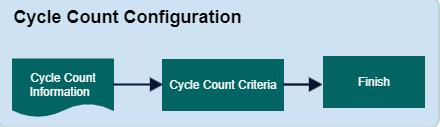

        
        <h1 style="text-align: left;font-size: 12pt" data-source-node="n56">Cycle Count Configuration
        </h1>
        <h4 data-source-node="n58">Overview</h4>
        
The purpose of a cycle count master record is to control what cycle count requests the system creates. Master records are only used in generating plan-based cycle count requests. These records are driven off of item and location criteria records.

        <h4 data-source-node="n60"> </h4>
        <h4 data-source-node="n61">Configuration Hierarchy</h4>
        
 

        

            
        

        
 

        <h4 data-source-node="n66">Configure Cycle Count Records</h4>
        
 

        <h5 data-source-node="n68">1. Cycle Count Information </h5>
        <ul data-source-node="n69">
            <li data-source-node="n70">
                
Maximum number of counts (0=No maximum) - This indicates the maximum number of cycle count requests you want the system to generate from a particular cycle count plan. Note that if you put a "0" in this field, there will be no maximum limit of requests that the system will create.

            </li>
        </ul>
        
Toggle Buttons

        <ul data-source-node="n73">
            <li data-source-node="n74">
                
Create Work - indicate how the system should process cycle count plans.

                <ul data-source-node="n76">
                    <li data-source-node="n77">
                        
If toggle is selected, the system will create work for this plan.

                    </li>
                    <li data-source-node="n79">
                        
If toggle is not selected, the system will not create work for this plan. Instead, workers will execute this plan from a cycle count list paperwork document.

                    </li>
                </ul>
            </li>
        </ul>
        <ul data-source-node="n81">
            <li data-source-node="n82">
                
Update cycle counts- the current count of containers that have matched this QC assignment criteria. The system will increment this count value up by one every time QC evaluation occurs and a matching container is found. Note that this field is never editable by the user.

            </li>
        </ul>
        
Run with scheduled job - Indicate that you want the system to execute a cycle count plan (using this master) at a certain date/time via a system scheduled job.

        
 

        
Randomize number of counts - Indicate that you want the system to create cycle count requests from a random set of locations (based on the range as defined in your Cycle Count Location Selection record for this master).

        
 

        <h5 data-source-node="n88">2. Authorized Warehouses</h5>
        
Select the warehouses authorized for the cycle count.

        <h5 data-source-node="n90"> </h5>
        <h5 data-source-node="n91">3. Cycle Count Criteria</h5>
        
 

        
Item Selection - Select an item filter record used to filter the items eligible for cycle counting

        
 

        
Location Selection - Select an location filter record used to filter the location eligible for cycle counting

        
 

    