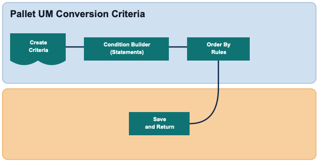

        
        <h1 style="text-align: left;font-size: 12pt" data-source-node="n56">Pallet UM Conversion Criteria
        </h1>
        <h4 data-source-node="n58">Overview</h4>
        
 

        
Pallet UM Conversion Criteria defines the filter used to identify eligible records and the ordering rules used to evaluate those records. This configuration is completed in a three-step guided flow: Create, Condition Builder, and Order By.

        
 

        <h4 data-source-node="n62">Configuration Hierarchy</h4>
        
 

        

            
        

        
 

        <h4 data-source-node="n67">Configure Pallet UM Conversion Criteria</h4>
        
 

        <h5 data-source-node="n69">1. Create Criteria</h5>
        
Define the filter identity details used by the Pallet UM Conversion Criteria configuration.

        <ul data-source-node="n71">
            <li data-source-node="n72">
                
<b data-source-node="n74">Filter Name</b> is required and validated for uniqueness in new mode.

            </li>
            <li data-source-node="n75">
                
<b data-source-node="n77">Description</b> is optional. If left blank, the value defaults to the Filter Name when you continue.

            </li>
            <li data-source-node="n78">
                
In change mode, Filter Name is read-only and can only be reviewed.

            </li>
        </ul>
        
Use <b data-source-node="n81">Back</b> to return to the criteria list, <b data-source-node="n82">Save</b> to save and return to Wave configuration, or <b data-source-node="n83">Continue</b> to define conditions.

        
 

        <h5 data-source-node="n85">2. Build Conditions</h5>
        
Define selection logic in the Condition Builder for record type <b data-source-node="n87">PALLETUMCONVERSIONCRIT</b>.

        <ul data-source-node="n88">
            <li data-source-node="n89">
                
Add condition statements to control which records are evaluated.

            </li>
            <li data-source-node="n91">
                
Use available value helpers for supported attributes, including location-based values.

            </li>
        </ul>
        
Use <b data-source-node="n94">Back</b> to return to Create, <b data-source-node="n95">Save</b> to save and return to Wave configuration, or <b data-source-node="n96">Continue</b> to define sorting.

        
 

        <h5 data-source-node="n98">3. Define Order By Rules</h5>
        
Define the sequence in which matching records are evaluated.

        <ul data-source-node="n100">
            <li data-source-node="n101">
                
Add one or more order-by rows for <b data-source-node="n103">Attribute</b> and <b data-source-node="n104">Asc/Desc</b>.

            </li>
            <li data-source-node="n105">
                
Sequence is maintained internally to preserve the configured rule order.

            </li>
        </ul>
        
Select <b data-source-node="n108">Continue</b> to save criteria details and return to the Wave Picking Group flow.

    