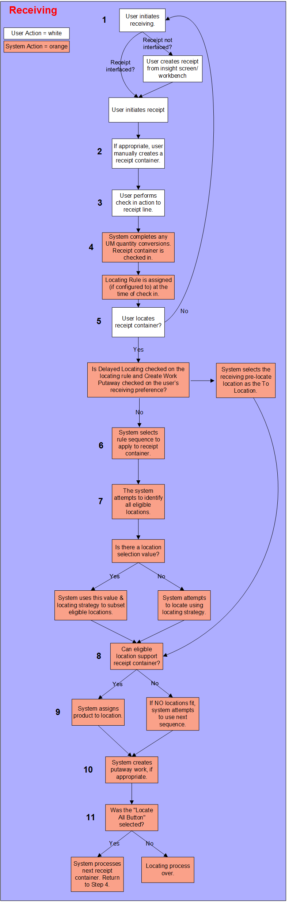
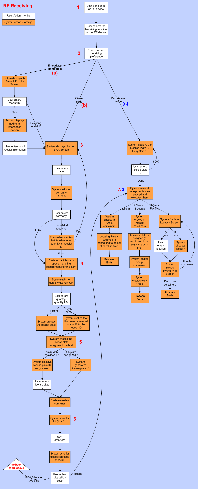

        
        <h1 data-source-node="n56">Receiving Process Summary</h1>
        
<a href="b9c3ffa9a81498cb548bdb61d00ba2dd34e5bfb79695f24b28a31d26d9eb8369.html" style="font-style: normal;color: #000000;font-weight: bold" data-source-node="n58">Functionality</a>
        

        
<b data-source-node="n60">** Process Flows **</b>
        

        
 

        
 

        
 

        
The following diagrams are featured in this topic:

        
- <a href="#nonRF" data-source-node="n66">Non-RF Receiving</a>

        
- <a href="#RF" data-source-node="n68">RF Receiving</a>

        
 

        
 

        <h4 data-source-node="n71">Non-RF Receiving...</h4>
        
 

        
This process diagram illustrates how the system receives product into the warehouse, NOT using an RF device.

        
 

        

            
        

        
 

        
 

        <h4 data-source-node="n80">non-RF receiving</h4>
        
During receiving, the system checks in (accepts as inventory) and locates 
 received product either interfaced from the ERP, defined in the system, 
 or defined in Trading Partner Management.

        
 

        
 

        <h4 data-source-node="n84">Step 1: The user initiates the receiving process.</h4>
        <ol class="ol_1" data-source-node="n85">
            <li value="1" data-source-node="n86">
                
If this receipt was interfaced, the user can initiate processing from the Receipt Workbench: the user will 
 identify the receipt and press the Arrow button.

            </li>
            

                
 

            

            <li value="2" data-source-node="n90">
                
If the receipt was NOT interfaced, the user can create it on the Receipt Insight, Receipt Workbench, the Shipment Insight ("Receipt From Shipment" action), or the Purchase Order Insight (the "Receipt from PO" action).  

                
 

            </li>
            <li value="3" data-source-node="n94">
                
After the receipt is created, the user can initiate processing from the Receipt Workbench: the user will 
 identify the receipt and press the Arrow button.  

            </li>
            <li value="4" data-source-node="n98">
                
The system will assign the locating rule (if configured to do so on the Receiving System Values Window) at the time of receipt line creation.

            </li>
            

                
 

            

        </ol>
        <h4 data-source-node="n102">Step 2: The user can manually create receipt containers, if appropriate.</h4>
        
A manually created receipt container can be created at any point during the 
 receiving process. It is identified here since you can create a container 
 manually as soon as you access the Receipt Workbench.

        
 

        
Manually created containers allow you to nest containers (generated 
 during Step 3, below) that hold different items and UMs. You can also 
 use them to consolidate multiple containers that hold the same 
 item and UM. Later, you can locate all of the contents in a manually created 
 container to one location, even if it contains multiple items and UMs.

        
 

        
 

        <h4 data-source-node="n108">Step 3: The user performs the check in action on the receipt line.</h4>
        
The user performs check in from the Receipt Workbench.

        <ol class="ol_1" data-source-node="n110">
            <li value="1" data-source-node="n111">
                
The user selects the product to check in. You can check in the 
 product in its own container, or check in it into a manually created container. 

            </li>
            
 

            <li value="2" data-source-node="n115">
                
The user will select one of the check in buttons.  

            </li>
            <ul type="disc" class="ul_1" data-source-node="n119">
                <li data-source-node="n120">
                    
To check in an entire receipt line, the user selects the Full Line button.

                </li>
                
 

                <li data-source-node="n123">To check in a partial receipt line, the user selects the Partial Line button.</li>
            </ul>
        </ol>
        
 

        <h4 data-source-node="n125">Step 4: The system checks in the quantity selected.</h4>
        
During this check in process, the system determines how much quantity 
 is introduced to the warehouse and how that quantity should be consolidated 
 and managed.

        <ul data-source-node="n127">
            <li data-source-node="n128">The system attempts to convert 
 the received quantity based on the Item's Unit of Measure. Conversions allow you to locate product in the most efficient manner. 
 The system attempts to convert the quantity to a higher UM value. The 
 system will first check the item record and then the item class record 
 to locate the item UM values. If neither the item nor the item class is 
 associated with an Item UM, the system will assume that the conversion 
 value is 1.</li>
            

                 
            

            <li data-source-node="n131">The system may display the Verify 
 Item Unit of Measure screen. This screen identifies how the received product 
 will be broken down into containers. These values are based on the system's 
 calculations, performed during the process described in the previous bullet. It will also display the 
 UM conversion quantities for that item.  i. The system will display this screen if the Verify Item Unit 
 of Measure Checkbox is selected on either of the following records: the 
 vendor record (for this receipt) or the receiving preferences record (for 
 this user).  ii. The employee can use this screen to change the received amount 
 if it does not match the amount identified on the Verify Item UM Screen. 
 In this case, the system will perform a second conversion using the new 
 receipt values amount. The system will display the new quantity UM breakdown 
 for the received quantity.  Note that any 
 changes made on the Verify Item UM Screen apply to this receipt line
 only. The system does not modify the item/item class quantity UM values.  </li>
            <li data-source-node="n140">If appropriate, 
 the system groups together containers with the same UM value. This ensures 
 that they are located together.  i. The system references the Group During Check 
 in Checkbox on the Storage Template Screen. This checkbox determines if 
 all quantities of a specific UM are located together as one unit, or located 
 separately. First, the system determines which storage template record 
 it will apply to the containers.  ii. After the system selects a storage template record, it checks 
 the Group During Check in Checkbox on the template record. This checkbox 
 determines how many containers the system will create for a receipt 
 line.  - - If the checkbox is selected 
 for a UM, the system will create one container for all the 
 items at this UM (that you are checking in). For example, if the checkbox 
 is selected on the container Case, and you process 8 cases, the system 
 will create one container which contains these 8 cases.  - - If the checkbox is not selected, 
 the system creates one container for each container that is generated during 
 conversions. In this case, the containers might not be located together. 
 For example, if the checkbox is not selected for the container Pallet, 
 and you process 3 pallets, each pallet is its own receipt container. These 
 3 pallets are located separately.  NOTE: If the system 
 could not find a storage template record to apply, it does not attempt 
 to group containers.  </li>
            <li data-source-node="n153">The system determines 
 if this item requires additional tracking confirmation data, such as lot 
 ID, serial number, and/or catch weight. 
 If this information is required to be entered by the user, the system 
 will display a prompt screen. Specifically for serial numbers, the user will need to provide the 
 major (and minor if they exist) serial number values for every each of 
 an the item that is being checked in.  </li>
            <li data-source-node="n156">The system determines if the user will 
 assign a license plate ID to the container.  i - The system references the License Plate Assignment Method Field 
 on the user's receiving preferences record. Based on the assignment method, 
 either the system or the user assigns a license plate ID to the new container. Note that the system always 
 assigns the license plate ID to a container, if the Group During Check 
 in Checkbox (on the Storage Template Screen) is selected.  ii - After the license plate ID is determined, the system creates and 
 checks in the container. All containers are system created. A container is identified by the cube icon.  </li>
            <li data-source-node="n163">The system chooses which Locating Rule it will apply to the container (if the "Locating Rule Assignment During" receiving system value is set to "receipt check in"). It searches for a locating rule in the following order:  a. The system will retrieve the locating rule from the receipt container record, if the container had been interfaced into the application. Note that if the Always Override setting is selected on the locating rule assignment record, then the system will use the locating rule from that window for the receipt container, rather than what is on the receipt line.  b. The system will retrieve the locating rule from the item record if the locating rule is NOT defined 
 on the receipt container record, and this is not a mixed item container. 
Note that mixed item containers 
 cannot reference one item record. When processing mixed item containers, 
 the system only looks for a locating rule on the receipt container record 
 (A, above). If a rule is not defined on the container, the system uses 
 the *Default record (C, below). Also note that if the Always Override setting is selected on the locating rule assignment record, then the system will use the locating rule from that window for the receipt container, rather than what is on the receipt line.  c. The system will  use the locating rule assignment and assignment criteria records if none has been assigned by the previous steps..  </li>
            <li data-source-node="n172">The check in process is complete.</li>
        </ul>
        
 

        
 

        <h4 data-source-node="n175">Step 5: The user decides to locate the container.</h4>
        <ol class="ol_1" data-source-node="n176">
            <li value="1" data-source-node="n177">
                
The user selects either the Locate 
 Button or the Locate All Button. If you press the Locate Button, 
 the system will attempt to locate only the container 
 that the user selected. If you press the Locate All Button, the system 
 will attempt to locate all containers that have 
 not yet been located.

                
 

            </li>
            <li class="li_1" value="2" data-source-node="n180">
                
For each container, 
 the system will reference the Container Locating Method 
 on the user's receiving preferences record to determine if it should locate 
 at the parent container level or the child container level. Based on your 
 security setting, the employee might be able to override the container 
 locating method defined on the receiving preferences record.  Locate By Parent Container Note: Locating by parent requires multi-item locations.  

            </li>
            <ul type="disc" class="ul_1" data-source-node="n186">
                <li data-source-node="n187">
                    
If the Container Locating Method 
 = Parent, the system will attempt to locate the highest container 
 level. For example, if a manually created container pallet nests three containers, the system will attempt to locate the manually created 
 container. It will NOT attempt to locate the containers individually. 
 Locating at the parent level is only beneficial for manually created containers.

                    
 

                </li>
                <li data-source-node="n190">
                    
If the Container Locating Method 
 = Child, the system will attempt to locate the smallest container level. For example, if a pallet nests three containers, the system will attempt to locate the containers. It 
 will never attempt to locate the pallet.

                    
 

                </li>
                
<i data-source-node="n194">When Using Delayed Locating:</i> 			If the receipt container’s locating rule has Delayed Locating checked and the user’s receiving preference has Create Work Putaway checked, then the receipt container will locate to a location with the Receiving Pre-locate location class.  The locating rule on the parent container is used when locating by parent, while the nested container’s locating rule is used when locating by child.
             

            </ul>
        </ol>
        <h2 data-source-node="n196"> </h2>
        <h4 data-source-node="n197">Step 6: The system attempts to process the container 
 through the locating rule's first sequence.</h4>
        <ol class="ol_1" data-source-node="n198">
            <li value="1" data-source-node="n199">
                
A locating rule has at least one sequence record.

                
 

            </li>
            <li value="2" data-source-node="n202">
                
The sequence record identifies how product can be located, based 
 on location strategies and location selection values. A sequence record 
 can be defined by both a strategy and a location selection; it must 
 include at least one of these values. You cannot define a sequence record 
 if both values are left blank.

                
 

            </li>
            <li value="3" data-source-node="n205">
                
Sequence records are processed in numeric order: the lower the sequence's 
 number, the sooner it is processed.

                
 

            </li>
            <li value="4" data-source-node="n208">
                
The system attempts to subset the number of locations considered 
 for locating. Locations are subset based on internal system criteria. 
 This step requires no user intervention.

                
 

            </li>
            <ul type="disc" class="ul_1" data-source-node="n211">
                <li data-source-node="n212">
                    
The internal system criteria are predefined. You cannot access 
 or modify these values. Below is a list of these values:

                    
 

                    <table style="width: 90%" cellspacing="0" width="90%" class="table_4" data-source-node="n215">
                        <tr data-source-node="n216">
                            <td style="width: 40%" valign="top" width="40%" class="td_14" data-source-node="n217">
                                
Location Class

                            </td>
                            <td style="width: 5%" valign="top" width="5%" class="td_14" data-source-node="n219">
                                
=

                            </td>
                            <td style="width: 40%" valign="top" width="40%" class="td_14" data-source-node="n221">
                                
"Inventory"

                            </td>
                        </tr>
                        <tr data-source-node="n223">
                            <td style="width: 40%" valign="top" width="40%" class="td_14" data-source-node="n224">
                                
 

                            </td>
                            <td style="width: 5%" valign="top" width="5%" class="td_14" data-source-node="n226">
                                
 

                            </td>
                            <td style="width: 40%" valign="top" width="40%" class="td_14" data-source-node="n228">
                                
 

                            </td>
                        </tr>
                        <tr data-source-node="n230">
                            <td style="width: 40%" valign="top" width="40%" class="td_14" data-source-node="n231">
                                
Location Status

                            </td>
                            <td style="width: 5%" valign="top" width="5%" class="td_14" data-source-node="n233">
                                
=

                            </td>
                            <td style="width: 40%" valign="top" width="40%" class="td_14" data-source-node="n235">
                                
Not equal to "Frozen"

                            </td>
                        </tr>
                        <tr data-source-node="n237">
                            <td style="width: 40%" valign="top" width="40%" class="td_14" data-source-node="n238">
                                
 

                            </td>
                            <td style="width: 5%" valign="top" width="5%" class="td_14" data-source-node="n240">
                                
 

                            </td>
                            <td style="width: 40%" valign="top" width="40%" class="td_14" data-source-node="n242">
                                
 

                            </td>
                        </tr>
                        <tr data-source-node="n244">
                            <td style="width: 40%" valign="top" width="40%" class="td_14" data-source-node="n245">
                                
Location Warehouse

                            </td>
                            <td style="width: 5%" valign="top" width="5%" class="td_14" data-source-node="n247">
                                
=

                            </td>
                            <td style="width: 40%" valign="top" width="40%" class="td_14" data-source-node="n249">
                                
Receipt Container Warehouse

                            </td>
                        </tr>
                    </table>
                </li>
            </ul>
            
 

            <ul type="disc" class="ul_1" data-source-node="n252">
                <li data-source-node="n253">
                    
If the location is a single item location, it contains product 
 and the locating strategy is Consolidate with Existing Inventory, the 
 system will also check the following field values:

                    
 

                    <table style="width: 90%" cellspacing="0" width="90%" class="table_4" data-source-node="n256">
                        <tr data-source-node="n257">
                            <td style="width: 40%" valign="top" width="40%" class="td_14" data-source-node="n258">
                                
Location Company

                            </td>
                            <td style="width: 5%" valign="top" width="5%" class="td_14" data-source-node="n260">
                                
=

                            </td>
                            <td style="width: 40%" valign="top" width="40%" class="td_14" data-source-node="n262">
                                
Receipt Container Company

                            </td>
                        </tr>
                        <tr data-source-node="n264">
                            <td style="width: 40%" valign="top" width="40%" class="td_14" data-source-node="n265">
                                
 

                            </td>
                            <td style="width: 5%" valign="top" width="5%" class="td_14" data-source-node="n267">
                                
 

                            </td>
                            <td style="width: 40%" valign="top" width="40%" class="td_14" data-source-node="n269">
                                
 

                            </td>
                        </tr>
                        <tr data-source-node="n271">
                            <td style="width: 40%" valign="top" width="40%" class="td_14" data-source-node="n272">
                                
Location Item

                            </td>
                            <td style="width: 5%" valign="top" width="5%" class="td_14" data-source-node="n274">
                                
=

                            </td>
                            <td style="width: 40%" valign="top" width="40%" class="td_14" data-source-node="n276">
                                
Receipt Container Item

                            </td>
                        </tr>
                    </table>
                </li>
            </ul>
        </ol>
        
 

        <h4 data-source-node="n279">Step 7: The system identifies all eligible locations.</h4>
        
The system will use the sequence's 
 values to identify the optimum location.

        <ul type="disc" class="ul_1" data-source-node="n281">
            <li data-source-node="n282">
                
If the sequence includes both a 
 locating strategy and a location selection value, the system will 
 use both values to select a location. To minimize processing time, both 
 values are applied against the locations at once.

                
 

            </li>
            <li data-source-node="n285">
                
If sequence includes only a locating 
 strategy, the system will apply that value against the locations. To 
 review the valid locating strategies, see the Locating Strategies field topic.      

            </li>
        </ul>
        
 

        
<i data-source-node="n289">When Using Delayed Locating</i>
        

        
If the receipt container’s locating rule has Delayed Locating checked and the user’s receiving preference has Create Work Putaway checked, then the receipt container will locate to a location with the Receiving Pre-locate location class.  If either flag is unchecked, then the system locates based on the receipt container’s locating rule details.  The locating rule on the parent container is used when locating by parent, while the nested container’s locating rule is used when locating by child.

        
 

        
 

        <h4 data-source-node="n293">Step 8: It identifies which locations are eligible to store the container and selects the 1st one that can accommodate the product.</h4>
        
The system organizes 
 the locations based on the order defined on the Order By Tab on the Location 
 Selection Screen. If an order is not defined there, the system just retrieves 
 the locations from the database: they are not organized in any particular 
 order. The system always 
 selects the first location that can accommodate the product. Below is the 
 process that the system uses to determine if a location can support a 
 container.

        
 

        
If the system is locating a container, it performs the following activity:

        <ol class="ol_1" data-source-node="n297">
            <li value="1" data-source-node="n298">
                
It accesses the Item Location Capacity 
 record to determine how many units this location can hold. It will reference 
 the Maximum Quantity Field on this screen.  Note on locating to multi-item 
 locations: The locating process does a volumetric validation when 
 locating an item to a multi-item location. When locating to a multi-item 
 location, the system compares the current volume of the location's items 
 to the total volume of the location to determine if a receipt container 
 will fit. For example, suppose a receipt container has 10 of Item A in 
 it, for a total volume of 100. Location AA001 currently contains Item 
 A and Item B, with a total volume of 250. Also, location AA001 has a total 
 volume capacity (using location type dimensions) of 500. The system, then, 
 would successfully locate the receipt container to the multi-item location. 
 

                
 

                
The system performs this volume check only when there is no item 
 location capacity records defined for the item you are trying to locate. 
 If an item location capacity record exists for the item/item class and 
 location/location type, the system would use it to determine the amount 
 of the item that can be placed into the location.    

            </li>
            <ul type="disc" class="ul_1" data-source-node="n305">
                <li data-source-node="n306">
                    
If the Maximum Quantity is 
 defined, the system uses it (and the UM Field) to determine how 
 many units this location can hold.

                    
 

                </li>
                <li data-source-node="n309">
                    
If the Maximum Quantity is 
 not defined, the system calculates how many units the location 
 can hold. It performs this calculation by completing the following:

                    
 

                </li>
                <ul data-source-node="n312">
                    <li data-source-node="n313">
                        
It compares the location's dimensions to the item's dimensions. 
 The location dimensions are stored on the location type record. The item 
 dimensions are stored for either the item or its item class on the item 
 unit of measure record.

                        
 

                    </li>
                    <li data-source-node="n316">
                        
Maximum Quantity = (Location Length / Item Length) x (Location 
 Width / Item Width) x (Location Height / Item Height) or (Location Length 
 / Item Width) x (Location Width / Item Length) x (Location Height / Item 
 Height), whichever is greater. <a class="MCToggler MCTogglerHead MCTogglerHotSpot MCToggler_Open toggler MCTogglerHotSpot_ MCHotSpotImage" data-source-node="n318">Example?</a>

                        

                            
 

                            
<i data-source-node="n323">How the System Calculates Maximum Quantity 
 based on Dimensions.</i>
                            

                            <ol data-source-node="n324">
                                
 

                                
The example below describes how the system will calculate maximum 
 quantity based on item and location dimensions. For this example, suppose 
 the location's dimensions are 40 x 20 x 10. The item's dimensions are 
 7 x 4 x 8.

                                
 

                                
The system will calculate how many units can be stored in this location 
 by comparing the item's dimensions to the locations's dimensions.

                                
 

                                
This will tell the system how many units can fit across the location 
 per dimension. The system will always round down and arrive at a whole 
 number for each calculation.

                                
 

                                <table style="width: 100%" cellspacing="0" width="100%" class="table_2" data-source-node="n332">
                                    <tr data-source-node="n333">
                                        <td style="width: 8%" valign="top" width="8%" class="td_14" data-source-node="n334">
                                            
<b data-source-node="n336">Dimension</b>
                                            

                                        </td>
                                        <td style="width: 8%" valign="top" width="8%" class="td_14" data-source-node="n337">
                                            
<b data-source-node="n339">Location's 
 value</b>
                                            

                                        </td>
                                        <td style="width: 5%" valign="top" width="5%" class="td_14" data-source-node="n340">
                                            
<b data-source-node="n342">Divided 
 by</b>
                                            

                                        </td>
                                        <td style="width: 10%" valign="top" width="10%" class="td_14" data-source-node="n343">
                                            
<b data-source-node="n345">Item's 
 value</b>
                                            

                                        </td>
                                        <td style="width: 5%" valign="top" width="5%" class="td_14" data-source-node="n346">
                                            
<b data-source-node="n348">Equals</b>
                                            

                                        </td>
                                        <td style="width: 30%" valign="top" width="30%" class="td_14" data-source-node="n349">
                                            
<b data-source-node="n351"># of 
 units</b>
                                            

                                        </td>
                                    </tr>
                                    <tr data-source-node="n352">
                                        <td style="width: 8%" valign="top" width="8%" class="td_14" data-source-node="n353">
                                            
Length:

                                        </td>
                                        <td style="width: 8%" valign="top" width="8%" class="td_14" data-source-node="n355">
                                            
40

                                        </td>
                                        <td style="width: 5%" valign="top" width="5%" class="td_14" data-source-node="n357">
                                            
/

                                        </td>
                                        <td style="width: 10%" valign="top" width="10%" class="td_14" data-source-node="n359">
                                            
7

                                        </td>
                                        <td style="width: 5%" valign="top" width="5%" class="td_14" data-source-node="n361">
                                            
=
                                            

                                        </td>
                                        <td style="width: 30%" valign="top" width="30%" class="td_14" data-source-node="n364">
                                            
 5

                                        </td>
                                    </tr>
                                    <tr data-source-node="n366">
                                        <td style="width: 8%" valign="top" width="8%" class="td_14" data-source-node="n367">
                                            
Width

                                        </td>
                                        <td style="width: 8%" valign="top" width="8%" class="td_14" data-source-node="n369">
                                            
20

                                        </td>
                                        <td style="width: 5%" valign="top" width="5%" class="td_14" data-source-node="n371">
                                            
/

                                        </td>
                                        <td style="width: 10%" valign="top" width="10%" class="td_14" data-source-node="n373">
                                            
4

                                        </td>
                                        <td style="width: 5%" valign="top" width="5%" class="td_14" data-source-node="n375">
                                            
=
                                            

                                        </td>
                                        <td style="width: 30%" valign="top" width="30%" class="td_14" data-source-node="n378">
                                            
 5

                                        </td>
                                    </tr>
                                    <tr data-source-node="n380">
                                        <td style="width: 8%" valign="top" width="8%" class="td_14" data-source-node="n381">
                                            
Height

                                        </td>
                                        <td style="width: 8%" valign="top" width="8%" class="td_14" data-source-node="n383">
                                            
10

                                        </td>
                                        <td style="width: 5%" valign="top" width="5%" class="td_14" data-source-node="n385">
                                            
/

                                        </td>
                                        <td style="width: 10%" valign="top" width="10%" class="td_14" data-source-node="n387">
                                            
8

                                        </td>
                                        <td style="width: 5%" valign="top" width="5%" class="td_14" data-source-node="n389">
                                            
=

                                        </td>
                                        <td style="width: 30%" valign="top" width="30%" class="td_14" data-source-node="n391">
                                            
 1

                                        </td>
                                    </tr>
                                    <tr data-source-node="n393">
                                        <td style="width: 8%" valign="top" width="8%" class="td_14" data-source-node="n394">
                                            
Total

                                        </td>
                                        <td style="width: 8%" valign="top" width="8%" class="td_14" data-source-node="n396">
                                            
 

                                        </td>
                                        <td style="width: 5%" valign="top" width="5%" class="td_14" data-source-node="n398">
                                            
 

                                        </td>
                                        <td style="width: 10%" valign="top" width="10%" class="td_14" data-source-node="n400">
                                            
 

                                        </td>
                                        <td style="width: 5%" valign="top" width="5%" class="td_14" data-source-node="n402">
                                            
 

                                        </td>
                                        <td style="width: 30%" valign="top" width="30%" class="td_14" data-source-node="n404">
                                            
25

                                        </td>
                                    </tr>
                                </table>
                                
 

                                
Second, 
 the system calculates how many units can fit if the item is placed in 
 sideways.

                                
 

                                <table style="width: 100%" cellspacing="0" width="100%" class="table_2" data-source-node="n409">
                                    <tr data-source-node="n410">
                                        <td style="width: 20%" valign="top" width="20%" class="td_14" data-source-node="n411">
                                            
<b data-source-node="n413">Location's 
 Dimension</b>
                                            

                                        </td>
                                        <td style="width: 10%" valign="top" width="10%" class="td_14" data-source-node="n414">
                                            
<b data-source-node="n416">Divided 
 by</b>
                                            

                                        </td>
                                        <td style="width: 20%" valign="top" width="20%" class="td_14" data-source-node="n417">
                                            
<b data-source-node="n419">Item's 
 Dimension</b>
                                            

                                        </td>
                                        <td style="width: 10%" valign="top" width="10%" class="td_14" data-source-node="n420">
                                            
<b data-source-node="n422">Equals</b>
                                            

                                        </td>
                                        <td style="width: 25%" valign="top" width="25%" class="td_14" data-source-node="n423">
                                            
<b data-source-node="n425"># of 
 units</b>
                                            

                                        </td>
                                    </tr>
                                    <tr data-source-node="n426">
                                        <td style="width: 20%" valign="top" width="20%" class="td_14" data-source-node="n427">
                                            
Location Length: 40

                                        </td>
                                        <td style="width: 10%" valign="top" width="10%" class="td_14" data-source-node="n429">
                                            
/

                                        </td>
                                        <td style="width: 20%" valign="top" width="20%" class="td_14" data-source-node="n431">
                                            
Item Width: 4

                                        </td>
                                        <td style="width: 10%" valign="top" width="10%" class="td_14" data-source-node="n433">
                                            
=
                                            

                                        </td>
                                        <td style="width: 25%" valign="top" width="25%" class="td_14" data-source-node="n436">
                                            
10

                                        </td>
                                    </tr>
                                    <tr data-source-node="n438">
                                        <td style="width: 20%" valign="top" width="20%" class="td_14" data-source-node="n439">
                                            
Location Width: 20

                                        </td>
                                        <td style="width: 10%" valign="top" width="10%" class="td_14" data-source-node="n441">
                                            
/

                                        </td>
                                        <td style="width: 20%" valign="top" width="20%" class="td_14" data-source-node="n443">
                                            
Item Length: 7

                                        </td>
                                        <td style="width: 10%" valign="top" width="10%" class="td_14" data-source-node="n445">
                                            
=
                                            

                                        </td>
                                        <td style="width: 25%" valign="top" width="25%" class="td_14" data-source-node="n448">
                                            
 2

                                        </td>
                                    </tr>
                                    <tr data-source-node="n450">
                                        <td style="width: 20%" valign="top" width="20%" class="td_14" data-source-node="n451">
                                            
Location Height:10

                                        </td>
                                        <td style="width: 10%" valign="top" width="10%" class="td_14" data-source-node="n453">
                                            
/

                                        </td>
                                        <td style="width: 20%" valign="top" width="20%" class="td_14" data-source-node="n455">
                                            
Item Height: 8

                                        </td>
                                        <td style="width: 10%" valign="top" width="10%" class="td_14" data-source-node="n457">
                                            
=

                                        </td>
                                        <td style="width: 25%" valign="top" width="25%" class="td_14" data-source-node="n459">
                                            
 1

                                        </td>
                                    </tr>
                                    <tr data-source-node="n461">
                                        <td style="width: 20%" valign="top" width="20%" class="td_14" data-source-node="n462">
                                            
Total

                                        </td>
                                        <td style="width: 10%" valign="top" width="10%" class="td_14" data-source-node="n464">
                                            
 

                                        </td>
                                        <td style="width: 20%" valign="top" width="20%" class="td_14" data-source-node="n466">
                                            
 

                                        </td>
                                        <td style="width: 10%" valign="top" width="10%" class="td_14" data-source-node="n468">
                                            
 

                                        </td>
                                        <td style="width: 25%" valign="top" width="25%" class="td_14" data-source-node="n470">
                                            
20

                                        </td>
                                    </tr>
                                </table>
                                
 

                                
The system compares these two calculations and accepts the largest 
 one, 25. It will consider 25 the maximum number of units for this item/location.

                                
 

                            </ol>
                        

                        
 

                    </li>
                </ul>
            </ul>
            <li value="2" data-source-node="n476">
                
The system will reference the Maximum 
 Weight Field on the Location Type record associated with this location. 
 It will compare the location's maximum weight with the logical grouping's 
 weight. If 
 this is a multi-item location, the system will NOT compare the location 
 and the logical grouping's weight. It will only compare the capacity values 
 (see A above).

            </li>
        </ol>
        
 

        
If the system is locating a container, 
 it performs the following activity:

        <ul data-source-node="n480">
            <li data-source-node="n481">It calculates how many units a location can hold. 
 It performs this calculation by comparing the location's dimensions to 
 the container's dimensions. The location dimensions are stored on the 
 location type record. The container dimensions are defined on the Container 
 Type Screen.</li>
        </ul>
        
 

        <h4 data-source-node="n483">Step 9: The system assigns the First location that can accommodate the 
 container and its contents. If no location works, the 
 system checks for another sequence on the locating rule.</h4>
        
The location must be able to support all of the containers 
 that should be located together. The system will not separate a container from its contents if they should be located together.

        <ul type="disc" class="ul_1" data-source-node="n485">
            <li data-source-node="n486">
                
A location can accommodate the 
 container and its contents 
 if neither its maximum quantity nor its maximum weight are exceeded. If 
 either maximum is exceeded, the system will not consider this location.

                
 

            </li>
            <li data-source-node="n489">
                
If none of the eligible locations 
 can accommodate the container and its contents, 
 the system will check the locating rule for additional sequences.

                
 

            </li>
            <ul type="disc" class="ul_1" data-source-node="n492">
                <li data-source-node="n493">
                    
If this 
 locating rule includes additional sequence records, the 
 system will attempt to apply the next one to this request. The sequence 
 records are processed in order, based on their sequence number: the lower 
 the number, the sooner the sequence record is used.

                    
 

                </li>
                <li data-source-node="n496">
                    
If this 
 locating rule does not include additional sequence records, the system cannot locate this container.

                    
 

                </li>
            </ul>
        </ul>
        <h4 data-source-node="n499">Step 10: If appropriate, the system will create putaway work instructions.</h4>
        
The system will reference the Create Putaway Work Checkbox on the user's 
 receiving preferences record.

        <ul type="disc" class="ul_1" data-source-node="n501">
            <li data-source-node="n502">
                
If the checkbox is selected, 
 the system will attempt to create putaway work requests for the container. The product will be Allocated from the receiving doc 
 and In Transit to its location.

                
 

            </li>
            <li data-source-node="n505">If the checkbox 
 is not selected, the system will not create putaway work instructions. 
 During locating, the system automatically adds this container 
 to the location's On Hand quantity. Someone will need to physically transport 
 the product to the location.</li>
        </ul>
        
 

        <h4 data-source-node="n507">Step 11: If appropriate, the system will attempt to locate all other 
 containers on the Receipt Workbench. Return 
 to Step 5.</h4>
        <ul data-source-node="n508">
            <li data-source-node="n509">
                
If the user selected the Locate 
 All Button to initiate the locating process, the system will attempt 
 to locate all other unlocated containers on the workbench.

                
 

            </li>
            <li data-source-node="n512">If the user selected 
 the Locate Button to initiate the locating process, the system 
 will not attempt to locate any other containers.</li>
        </ul>
        
 

        
 

        

        
 

        
 

        <h4 data-source-node="n518">RF Receiving...</h4>
        
 

        
This process diagram illustrates how the system uses the check in/locating 
 processes and RF devices to receive items into your warehouse.

        
 

        

            
        

        
 

        
 

        <h4 data-source-node="n527">RF receiving</h4>
        
Receiving has two key components, which can be performed on an RF device 
 as well as from the full-screen application: check in and locating. Check 
 in is the process of making received product inventory. During check in, 
 the system creates a receipt container to support the quantity on a receipt 
 line; the container can include either the entire detail 
 line's quantity or part of the quantity. Locating is the process of selecting 
 the appropriate storage location(s) for the checked in product. 

        
 

        
 

        <h5 data-source-node="n531">GS1 Processing Note </h5>
        
When checking into your warehouse product that uses GS1 barcodes, the 
 RF receipt processing flow will be somewhat different than it is when 
 scanning typical barcodes. See the GS1 RF Processing topic  for more information on how this affects the default 
 receiving RF flow as diagrammed above.

        
 

        
 

        <h4 data-source-node="n535">Step 1: User signs on to an RF device.</h4>
        
New product arrives into the warehouse's receiving dock. This quantity 
 then needs to be checked in to the warehouse and located to a particular 
 inventory location. A warehouse employee signs on to an RF device in order 
 to rectify the situation.

        
 

        
 

        <h4 data-source-node="n539">Step 2: User determines initiation method for receipts.</h4>
        
The user will have to choose how they want the application to initiate 
 the receipts that they process. This is done via a receiving preference 
 record. Below are the four types of initiation methods (as depicted in 
 the diagram) and their consequences:

        <ol class="ol_3" data-source-node="n541">
            <li value="1" data-source-node="n542">(red) Header Item: In this method, the system 
 will ask for receipt information (a receipt ID), and allow the 
 user to process any existing item on the receipt.  (red) Header Container: 
 In this method, the system will ask for receipt information (a 
 receipt ID), and allow the user to process any existing container on the 
 receipt.  (red) Blind: In this 
 method, the system will create the receipt and line and allow 
 the RF user to quickly put the product away.   </li>
            <li value="2" data-source-node="n548">(red) Item: In this method, the system will 
 ask for an item, and then the user will choose the receipt they want to 
 receive against.  </li>
            <li value="3" data-source-node="n551">(blue) Container: In this method, the system 
 will ask for a license plate ID, and then the user can check in and locate 
 or check in and use quick receiving. This will only allow the processing 
 of unlocated receipt containers. This mode is typically used to process 
 interfaced-in containers.</li>
        </ol>
        
 

        <h4 data-source-node="n553">Step 3 (red): User enters check 
 in information.</h4>
        
The system will prompt the user to enter the item that they want to 
 check in. If an item has a cross-reference, the user will additionally 
 have to select the item that they want to check in. If configured to do 
 so, the system will also ask for what company this item is associated 
 with. The user also will need to choose which receipt ID their item appears 
 on, if the item being checked in appears only on more than one receipt. 
 

        
 

        
In turn, the system will:

        <ul type="disc" class="ul_1" data-source-node="n557">
            <li data-source-node="n558">If not using 
 blind receiving, the system will attempt to verify if this item 
 has open quantity on the receipt ID. If it does, the system will continue 
 to process the check in. If it does not, the system will return to the 
 item entry screen.  </li>
            <li data-source-node="n560">If using blind 
 receiving, the system will ask for the quantity that you want to 
 check in (continue to step 4 below).</li>
        </ul>
        
 

        <h4 data-source-node="n562">Step 4 (red): System applies any 
 special handling requirements to item, and verifies quantity to be checked 
 in.</h4>
        
The system will reference any work special handling record, in order 
 to identify any unique handling requirements of this item. A special handling 
 record defines processing validations or restrictions required for a certain 
 item. In receiving, typically one would use this type of record to assign 
 a quantity verification to an item.

        
 

        
The system will then ask for the user to enter the quantity that they 
 want to check in. After the user enters this quantity, the system will:

        <ul type="disc" class="ul_1" data-source-node="n566">
            <li data-source-node="n567">If using blind 
 receiving, the system will create the receipt line.  </li>
            <li data-source-node="n569">If not using 
 blind receiving, the system will verify that the quantity entered 
 is a valid for the receipt ID.</li>
        </ul>
        
 

        <h4 data-source-node="n571">Step 5 (red): System assigns a 
 license plate ID.</h4>
        
The system then will make a decision as to how it will assign an ID 
 to the receipt container. The license plate assignment method (on the user's 
 preference record) determines how the license plate ID will be assigned, either 
 manually or system-generated:

        <ul type="disc" class="ul_1" data-source-node="n573">
            <li data-source-node="n574">Manually-Created: 
 The system will display a screen asking the user to enter a license plate ID. Once entered, the system will create the container.  </li>
            <li data-source-node="n576">System-Generated: 
 The system will automatically generate a license plate ID and create the container.</li>
        </ul>
        
 

        <h4 data-source-node="n578">Step 6 (red): System verifies 
 special information tracking values &amp; disposition code.</h4>
        
The system determines if this item requires special tracking confirmation 
 data, such as lot ID, serial number, and/or catch weight. If this information 
 is required to be entered by the user, the system will display the a special 
 Information entry screen. Specifically for serial numbers, the user will 
 need to provide the major (and minor if they exist) serial number values for every each of an the item that 
 is being checked in. Also, if necessary, the system will ask for the disposition code that 
 is associated with this particular receipt container. 

        <ul type="disc" class="ul_1" data-source-node="n580">
            <li data-source-node="n581">If using the 
 Header Item/Container or Blind initiation method, the system will 
 display the Item Entry Screen again (seen as step 2b in the diagram above).  </li>
            <li data-source-node="n584">If using the 
 Item or Container initiation method, the system will display the 
 container ID Entry Screen (seen as step           7/3 in the diagram above).</li>
        </ul>
        
 

        <h4 data-source-node="n586">Step 7 (red) &amp;                  Step 
 3 (blue): System executes all containers.</h4>
        
Finally, the system will begin to execute the receipt container, based 
 on the execution method of the user's preference. Note that the system will assign the locating rule at the time of check in (if configured to do so in the Receiving System Values Window). Additionally, you could also have had this rule assigned at the time of receipt line creation.

        <ul type="disc" class="ul_1" data-source-node="n588">
            <li data-source-node="n589">If only checking 
 in, the system will check in the container. The receiving process 
 ends.  </li>
            <li data-source-node="n592">If checking in 
 and locating, the system will check in the container, and subsequently 
 locate them as well. If configured to do so, the system will also create 
 work for the locating portion of this transaction. The receiving process 
 ends.  </li>
            <li data-source-node="n595">If checking in 
 and locating (immediate), the system will check in and locate the 
 container(s) that you enter, using the appropriate locating rule. The 
 system will perform this action immediately, in "real-time." 
 The system will also create work for the putaway actions (if the Create 
 Putaway Work for this window is checked) generated from the locating process.  </li>
            <li data-source-node="n598">If using "quick 
 receiving," the system will display the Location Screen, so 
 the user can enter a location (if this value is user-driven). The system 
 will then locate the container to the location indicated. If there is 
 another container pending, the system will return to the Location Screen. 
 However, if there are no more containers to be processed, the receiving 
 process ends. Pressing the Skip button will skip the locating process.  The user won't be prompted again to locate the skipped receipt container.  The user will need to use either the Receipt Workbench, or RF Receiving with a Receiving Preference configured with the License Plate initiation method to locate a skipped receipt container.</li>
        </ul>
        
 

        
 

        
 

        
 

        
 

        
 

        
 

        
 

        
 

        
 

        
 

        
 

        
 

        
 

        
 

        
 

        
 

        
 

        
 

        
 

        
 

        
 

        
 

        
 

        
 

        
 

        
 

        
 

        
 

        
 

    