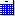

        
        <h1 data-source-node="n56">Maintaining Billing Management Trigger Detail Maps</h1>
        
Trigger detail map records determine exactly what the system fields 
 map to exactly what Billing Management fields. The system will present 
 the list of fields that the XML schema can accept, and then you will be 
 able to link what field in the system should be populated there. The system 
 retrieves the list of the system fields from the Billing Management data 
 query record that is tied to this particular detail map record. The system 
 provides default detail maps for all Billing Management trigger details. 
 You can manipulate these (by adding or subtracting fields) in order to 
 meet your business needs. Note that the particular XML schema 
 fields that are available to choose from depend on the schema being used.

        
 

        <h5 data-source-node="n60">Window 
 Access</h5>
        
You can access 
 this window using three different methods:

        <ul type="disc" class="ul_1" data-source-node="n62">
            <li class="li_10" data-source-node="n63">Select 
 the "Maintain Trigger Detail Map" option from the Actions Menu 
 in the Billing Management Trigger Detail Window.  </li>
            <li class="li_10" data-source-node="n65">Right-click 
 a detail record on the Detail Records Tab of the Billing Management Trigger 
 Header Window and choose the "Maintain Trigger Detail Map" option.  </li>
            <li class="li_10" data-source-node="n67">Create 
 a new Billing Management Trigger Detail record, or update an existing 
 detail that does not have a mapping created.</li>
        </ul>
        
 

        
 

        <h4 data-source-node="n70">Related Topics...</h4>
        
<a href="07dfda3003b2e06f5c5ab468f983c79caca43080bedaf1f3d7554f6321715a41.html" data-source-node="n72">Billing Management Process Summary</a>
        

        
<a href="2a16be86b28407502240ceb7b4e938a760446b2e587bba7519e9a33e570ab14d.html" data-source-node="n74">Billing Management Setup Overview</a>
        

        
 

        
 

        
<a class="MCDropDownHotSpot dropDownHotspot MCDropDownHotSpot_ MCHotSpotImage" data-source-node="n79">Field Descriptions...</a>
            

                
 

                
<a href="d3062742078b59e50300696be26831a9c42aa56d5c586ea23888a4556dd8b04b.html" data-source-node="n84">Add Button</a>
                

                
<a href="9e116ac7d17b93d5d0c924adc4a9de5ff9486af4f1556efb7e4b21d114def486.html" data-source-node="n86">Available Fields For Mapping</a>
                

                
<a href="59f70b3f265f5625d082a290063ea24cbe748000762a152bcb3fa0668418cae4.html" data-source-node="n88">Current Mappings</a>
                

                
<a href="d06bf65cef7bc24e6d015f58d8f73bdcd013fe2a748b064a7dbcaa9ebf7e2bb0.html" data-source-node="n90">Element</a>
                

                
<a href="06377ef7fb002b8bd731f4233fe7c8715ef6b97396693766d4a31d2b7bebb9cf.html" data-source-node="n92">Event ID</a>
                

                
<a href="72a1d0cabfbc9e588caea37cb05edd4bd0ccd709b495238392dbf52546bd4ae2.html" data-source-node="n94">Header Key</a>
                

                
 

            

        

        
 

        
 

        <h4 data-source-node="n98">Procedures...</h4>
        <ol class="ol_1" data-source-node="n99">
            <li value="1" data-source-node="n100">The Event ID Field corresponds to Billing Management's MsgId field.  </li>
            <li value="2" data-source-node="n103">Use the Element 
 Field to identify the system element that was defined for this 
 trigger on the Billing Management Trigger Detail Window.  </li>
            <li value="3" data-source-node="n105">Use the Available 
 Fields For Mapping Fields to identify each system field you want 
 to pass to Billing Management. Select the appropriate field from the "system" 
 list on the left, and select its corresponding Billing Management field 
 in the "Billing Management" list on the right.  Possible Field Combinations:  Alpha → Alpha, 
 Numeric → Numeric, 
 Numeric → Alpha, Date → Date  Icon Descriptions: -  This icon represents a field that uses alphabetic 
 values. -  This icon represents a field that uses numeric values. -  This icon represents a field that uses date values.  NOTE:Red icons indicate 
 that this is a required field in Billing Management.  </li>
            <li value="4" data-source-node="n120">Press the Add 
 Button to add your system-Billing Management field combination 
 to the Current Mappings list.  </li>
            <li value="5" data-source-node="n122">Use the Current 
 Mappings Field identifies the system attributes that the system 
 will send to Billing Management when the trigger is executed. These attributes 
 will be sent by grabbing the corresponding system attribute data and passing 
 it to Billing Management as a value for the corresponding mapped Billing 
 Management attribute.  </li>
            <li value="6" data-source-node="n124">Use the Remove 
 Button to remove a field combination from the Current Mappings 
 list.  </li>
            <li value="7" data-source-node="n126">Press OK to close 
 this window and save your changes.</li>
        </ol>
        
 

        
 

        
 

        
 

        
 

        
 

        
 

        
 

        
 

        
 

        
 

        
 

        
 

        
 

        
 

        
 

        
 

        
 

        
 

        
 

        
 

        
 

        
 

        
 

        
 

        
 

        
 

        
 

        
 

        
 

        
 

        
 

        
 

        
 

        
 

        
 

        
 

        
 

        
 

        
 

        
 

        
 

        
 

        
 

    