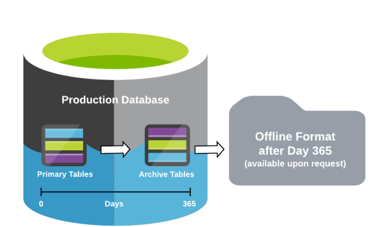

        
        <h1 data-source-node="n56">Active SCALE Data Retention Policy</h1>
        
The data retention period defines the total number of days (past the current date) that data will be kept online in SQL

        
Databases. This data may be retained in the Primary DB Active tables (visible in SCALE and in SCI) or the Primary DB

        
Archive Tables (visible in SCI). The data retention period for the tables mentioned above is 1 year (365 days). Data that

        
has exceeded the retention period can be made available offline before being purged. The amount of data retained in

        
the Primary DB Active tables, before being archived or purged (non-reportable data), will be managed by Manhattan to

        
ensure optimal system performance.

        
 

        <ul data-source-node="n64">
            <li data-source-node="n65">
                
Not all data is available in SCI (Supply Chain Intelligence), certain data conditions or retrieval limits may apply

            </li>
        </ul>
        <ul data-source-node="n67">
            <li data-source-node="n68">
                
 Non-reportable data will be flagged to be purged prior to the retention period.

            </li>
        </ul>
        

            
        

    