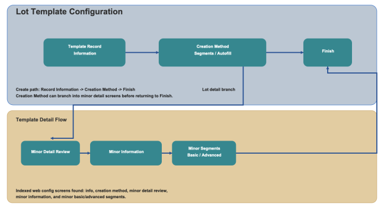

        
        <h1 style="text-align: left;font-size: 12pt" data-source-node="n57">Lot Template Configuration
        </h1>
        <h4 data-source-node="n59">Overview</h4>
        
 

        
Lot Template configuration defines how lot values are structured and generated for lot controlled inventory. You can create templates with fixed segments or use auto fill rules that populate lot content using date patterns.

        <h4 data-source-node="n62"> </h4>
        <h4 data-source-node="n63">Configuration Hierarchy</h4>
        
 

        

            
        

        
 

        
 

        <h4 data-source-node="n69">Configure Lot Template</h4>
        
 

        <h5 data-source-node="n71">1. Lot Information</h5>
        
 

        
<b data-source-node="n74">Lot Description</b>: Enter the template description that identifies the lot template record.

        
 

        <h5 data-source-node="n76">2. Creation Method</h5>
        
 

        
Select one of the following methods to define lot values:

        <ul data-source-node="n79">
            <li data-source-node="n80">
                
<b data-source-node="n82">Segment</b>: Build the lot value by defining one or more segment records. Segment creation supports both <b data-source-node="n83">Basic</b> and <b data-source-node="n84">Advanced</b> modes. Use <b data-source-node="n85">Basic</b> mode to define standard segments and lengths, and use <b data-source-node="n86">Advanced</b> mode to define pattern-based segment rules.

            </li>
            <li data-source-node="n87">
                
<b data-source-node="n89">Autofill</b>: Generate lot values based on date format and date type selections.

            </li>
        </ul>
        
 

        <h5 data-source-node="n91">Autofill Options</h5>
        <ul data-source-node="n92">
            <li data-source-node="n93">
                
<b data-source-node="n95">Date Format</b>: Select the required date format for generated lot values, such as MMDDYYYY, DDMMYYYY, YYYYMMDD, or a custom format.

            </li>
            <li data-source-node="n96">
                
<b data-source-node="n98">Date Type</b>: Choose whether the generated value uses Today's Date or Expiration Date.

            </li>
            <li data-source-node="n99">
                
<b data-source-node="n101">Custom Format</b>: Provide a custom format when the Custom option is selected.

            </li>
        </ul>
        
 

        <h5 data-source-node="n103">3. Lot Attributes</h5>
        
 

        
Use this step to define and maintain lot attributes associated with the template.

        <ul data-source-node="n106">
            <li data-source-node="n107">
                
<b data-source-node="n109">Add New Lot Attribute</b>: Create a new attribute record.

            </li>
            <li data-source-node="n110">
                
<b data-source-node="n112">Edit/Delete</b>: Update or remove the selected lot attribute record.

            </li>
        </ul>
        
 

        <h5 data-source-node="n114">Lot Attribute Segments</h5>
        
 

        
Each lot attribute can contain one or more segments that define the final lot value structure.

        <ul data-source-node="n117">
            <li data-source-node="n118">
                
<b data-source-node="n120">Segment Type</b>: Define the segment behavior (for example, Alpha).

            </li>
            <li data-source-node="n121">
                
<b data-source-node="n123">Length</b>: Set the number of characters used by the segment.

            </li>
            <li data-source-node="n124">
                
<b data-source-node="n126">Value</b>: Define the segment value when applicable.

            </li>
            <li data-source-node="n127">
                
<b data-source-node="n129">Advanced Mode</b>: Use a pattern expression to define segment behavior and validate with test data.

            </li>
        </ul>
        
 

        
Use Save to preserve your progress and Continue to move through the configuration steps.

        
 

    