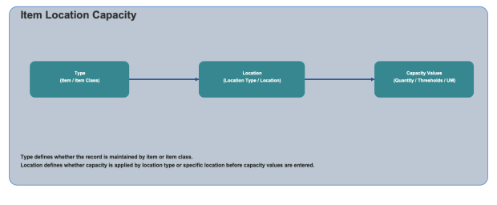

        
        <h1 style="text-align: left;font-size: 12pt" data-source-node="n57">Item Location Capacity
        </h1>
        <h4 data-source-node="n59">Overview</h4>
        
 

        
Item Location Capacity configuration defines capacity limits and replenishment thresholds for item and location combinations. You can configure capacity by item or item class, then apply values by location type or specific location.

        <h4 data-source-node="n62"> </h4>
        <h4 data-source-node="n63">Configuration Hierarchy</h4>
        
 

        

            
        

        
 

        <h4 data-source-node="n68">Configure Item Location Capacity</h4>
        
 

        <h5 data-source-node="n70">1. Select Item Location Capacity Type</h5>
        
 

        
Choose how the capacity record is scoped.

        <ul data-source-node="n73">
            <li data-source-node="n74">
                
<b data-source-node="n76">Item</b>: Select a specific item to configure capacity for that item only.

            </li>
            <li data-source-node="n77">
                
<b data-source-node="n79">Item Class</b>: Select an item class to apply capacity settings to all applicable items in that class.

            </li>
        </ul>
        
 

        <h5 data-source-node="n81">2. Select Location Option</h5>
        
 

        
Choose where the capacity definition is applied.

        <ul data-source-node="n84">
            <li data-source-node="n85">
                
<b data-source-node="n87">Location Type</b>: Apply capacity settings to all locations matching the selected location type.

            </li>
            <li data-source-node="n88">
                
<b data-source-node="n90">Location</b>: Apply capacity settings to a specific location record.

            </li>
        </ul>
        
 

        <h5 data-source-node="n92">3. Capacity Values</h5>
        
 

        
<b data-source-node="n95">Maximum Quantity</b>: Enter the maximum quantity allowed for the selected scope.

        
<b data-source-node="n97">Unit of Measure</b>: Select the unit of measure used for capacity quantity.

        
<b data-source-node="n99">Minimum Replenishment Threshold Percent</b>: Enter the percentage that triggers replenishment activity.

        
<b data-source-node="n101">Top Off Minimum Replenishment Threshold Percent</b>: Enter the threshold used for top-off replenishment behavior.

        
<b data-source-node="n103">Maximum Replenishment Fill Percent</b>: Enter the maximum allowed fill percentage during replenishment.

        
 

        
Use Continue to move through each screen and Finish to save the item location capacity configuration.

        
 

    