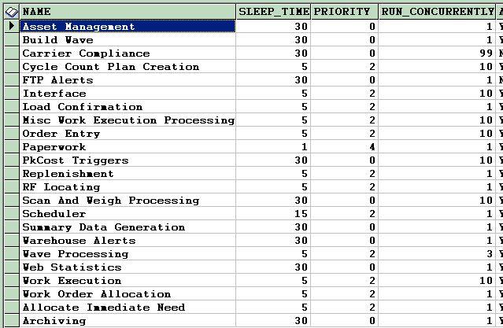

        
        <h1 data-source-node="n56">Using the Process Queue</h1>
        
The system includes a service called the Process Queuing Service. This 
 service writes requests to the Process Queuing Request table (QUEUE_PROCESS_REQUEST) 
 in real-time for all batch processes. Then, the service will process these 
 requests in the background, according to the priority that you have given 
 the procedure (such as replenishment). You can manage these settings in the QUEUE_PROCESS database table. This table manages the way the requests are handled when they reach the queue.

        
 

        <h5 data-source-node="n60">How 
 the Process Queuing Service Works</h5>
        
 

        
The queue service checks for records  at periodic intervals (every 'x' number of seconds) in the QUEUE_PROCESS_REQUEST table. It looks at the number of jobs with a particular job type for the environment that is currently running.  The number of jobs a particular process type can run simultaneously is determined by the RUN_CONCURRENTLY setting for that process type in the QUEUE_SERVICE table.  This is specific to each database environment. When a request is processed, if the number of jobs already running is less than the configured RUN_CONCURRENTLY setting for that job type, the service runs the job and marks the request as "In Process".  Otherwise, the job will be left in the "Ready" status until the next time the service wakes up and checks the records. When the job completes, the request is deleted.  

        
 

        
  For example, if Wave Processing is set as RUN_CONCURRENTLY = 3, and there are 2 database environments configured, each environment can have up to 3 waves running at the same time.  If an additional wave is submitted in one of the environments, the wave will wait in the Ready status until one of the waves running in that specific environment is completed.

        
 

        
 

        
This topic will discuss all you will need to do to properly manage the 
 Process Queuing Service:

        
<a href="#settings" data-source-node="n69">Changing a Thread's Priority 
 on the Process Queue Config Table</a>
             <a href="#research" data-source-node="n71">Researching Current Queue 
 Conditions</a>
        

        
 

        
 

        
 

        <h4 data-source-node="n75">Changing a Thread's Priority on the Process Queue Config Table</h4>
        
The Process Queue uses priority settings in order to determine what 
 thread to devote processing power to. You can define these thread priorities 
 on the Process Queue Config table, which you can access on your database 
 server. This table includes all the types of process threads that are 
 eligible for submission into the queue. 

        <ol class="ol_1" data-source-node="n78">
            <li value="1" data-source-node="n79">Access your application server.  </li>
            <li value="2" data-source-node="n81">Access SCALE Utilities in the application directory.  </li>
            <li value="3" data-source-node="n83">Choose SCALE Worksheet from the Environment Utilities 
 Tab.  </li>
            <li value="4" data-source-node="n85">In the lower pane, enter an SQL statement that 
 will display the Process Queue config table. For example, enter the statement 
 "select * from Q_PROCESS order 
 by name," and press the Execute Command button. The system 
 will display something similar to the following results:    </li>
            <li value="5" data-source-node="n90">Use the "Record 
 Type" values to indicate a process thread of the application 
 that you want to prioritize.  </li>
            <li value="6" data-source-node="n92">Use the "Run 
 Concurrently" values to indicate how many instances of a thread 
 you want to run at the same time. For example, if you wanted to allow 
 the application to run two waves simultaneously, you would enter a "2" 
 for this value. Note that if, in the above example, you ran three waves 
 concurrently in the application, all three would appear to the user to 
 be running. However, the system would only process two at a time. When 
 one of those finished, then the third wave would be processed.  </li>
            <li value="7" data-source-node="n94">Use the "Priority" 
 values to indicate the order in which you want the system to execute 
 a particular thread. The valid values are from "0" (lowest priority) 
 to "4" (highest priority).  </li>
            <li value="8" data-source-node="n96">Use the "Sleep 
 Time" values (not shown 
 in graphic above) to indicate how often the Process Queuing Service 
 will look for requests of a particular type. For example, if the Paperwork 
 process has a sleep time of "1", the service will check for 
 new requests every second. Suppose also that the Archiving process has 
 a sleep time of 30 seconds. Therefore, according to sleep time, the paperwork 
 requests will get picked up faster than the archiving requests.    </li>
            <li value="9" data-source-node="n98">When finished, 
 choose File | Exit. The system will save your changes.</li>
        </ol>
        
 

        
 

        <h4 data-source-node="n101">Researching Current Queue Conditions</h4>
        
 

        
You can also use the Background Job Queue Insight Screen to research what thread(s) 
 are currently in the queue. You can use this information to better prioritize 
 your process threads. See the topic <a href="a007abffcb6ac40efcc49cce65fafa13da9232c8f48a7805e3098dbce99608bc.html" data-source-node="n105">Researching 
 Background Job Queue Processes</a> for more information.

        
 

        
 

        
 

        
 

        
 

        
 

        
 

        
 

        
 

        
 

        
 

        
 

        
 

        
 

        
 

        
 

        
 

        
 

        
 

        
 

        
 

        
 

        
 

        
 

        
 

        
 

        
 

        
 

        
 

        
 

        
 

        
 

        
 

        
 

        
 

        
 

        
 

        
 

        
 

        
 

        
 

        
 

        
 

    