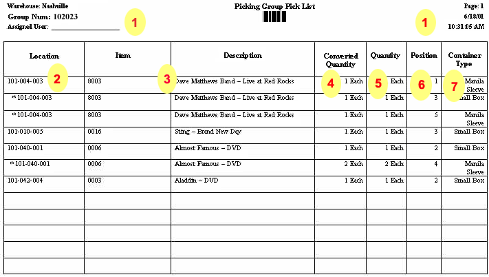

        
        <h1 data-source-node="n56">Performing a Group Pick (Paper-Based)</h1>
        
During the pick group creation wave step, the system organizes eligible 
 containers into pick groups and creates a picking group pick list for 
 each pick group. After the wave is released, group picking is performed 
 against the Picking Group Pick List; it is not completed on either the 
 Work Insight Screen or on an RF Device.

        
 

        
 

        <h4 data-source-node="n61">Related Topics...</h4>
        
<a href="76770f4602f9b9e52b4fce3fb8973ffa25b3e882ead4fd0e2faea14766f877a3.html" data-source-node="n63">Work Functional Process Summary</a>
        

        
<a href="63fce052573d8abfe6a45fd191ff6881a7d4e4dc8d037ecdc124418e157ec3fb.html" data-source-node="n65">Work Execution Setup Overview</a>
        

        
<a href="d114e048049d66584a42a020611a6659f5b2950e0912f87d395e30d98dbed9c0.html" data-source-node="n67">Non-RF Work Execution Process 
 Diagram</a>
        

        
<a href="1a75d6a66c308c9a7c8aa7ace1121d4ccbd75226aab7bf5a08209b9a5fdfa3c5.html" data-source-node="n69">Identifying a Quality Measures Reason Code</a>
        

        
<a href="cd3741887f8caeefd25da429127f48789337e8470ee9bf0b3d304849b963314c.html" data-source-node="n71">Assigning/Unassigning an Instruction 
 to a Team/User</a>
        

        
<a href="5b89491720e798c06ed1da2542cf04bdb137db52f5d20e794ddd87a79ea3c360.html" data-source-node="n73">Releasing Work Units</a>
        

        
<a href="00ca466d783430afb255a0d1a294cd97aefa4bd773b8306b0ba3b966ce55a529.html" data-source-node="n75">Processing Picking Management Work</a>
        

        
<a href="5ea80956b207057fdc2d841bb836a676ef62f554f56c6da1c57f1997b9f84e20.html" data-source-node="n77">Processing RF Work</a>
        

        
<a href="2a849da2c18bc5244f4e44f5346f871a765c86c96d43a011314a5857cfea60c5.html" data-source-node="n79">Processing Work</a>
        

        
 

        
 

        
<a class="MCDropDownHotSpot dropDownHotspot MCDropDownHotSpot_ MCHotSpotImage" data-source-node="n84">Field Descriptions...</a>
            

                
 

                
<a href="aa3d226cfce757e66f98a6efa05bc9a636c8abd8b5d4f52c76e4c3f568330378.html" data-source-node="n89">Container ID Field</a>
                

                
<a href="6f4f8d71510e37bd008101c0977428794261e35a4a15339d1e644267e136844f.html" data-source-node="n91">Container Type Field</a>
                

                
<a href="a4f7fd8ef1c5f8f29e72e7380b330b7e401235ad991c9a64d6a7b3e88cc832a6.html" data-source-node="n93">Group Number Field</a>
                

                
<a href="5296829a02306e6e2be7de90b1bdd5a86e7cdd206a3ad36326f2f2a82d034492.html" data-source-node="n95">Group Position Field</a>
                

                
 

            

        

        
 

        
 

        
The following is discussed in this topic:

        
- <a href="#1" data-source-node="n101">Performing a Paper-Based Group 
 Pick</a>

        
- <a href="#2" data-source-node="n103">Reading the Picking Group 
 Pick List Document</a>

        
 

        
 

        <h4 data-source-node="n106">Performing a Paper-Based Group Pick...</h4>
        
 

        <h5 data-source-node="n109">Prerequisites</h5>
        
These procedures assume that:

        <ul data-source-node="n111">
            <li data-source-node="n112">
                
Your organization supplies users with preprinted labels of barcoded 
 container ID values. These values are arbitrary until they're applied 
 to containers in the system.

                
 

            </li>
            <li data-source-node="n115">
                
 

            </li>
            <li data-source-node="n117">The Picking Group Pick List is included on the 
 document master record associated with the wave.</li>
        </ul>
        
 

        <h5 data-source-node="n119">Procedures</h5>
        <ol data-source-node="n120">
            <li value="1" data-source-node="n121">
                
Retrieve the tote/cart that 
 the pick group represents. Note that this also could represent a forklift 
 or other piece of equipment that the containers will be placed on.

                
 

            </li>
            <li value="2" data-source-node="n124">
                
Obtain the Picking Group Pick List. 
 Also retrieve the empty containers needed, based on the container type/location 
 fields. The location fields identify when a new container is needed. If 
 this field contains an * and a location number, it means that you are 
 picking the same item, from the same location, as the preceding line on 
 the document.

                
 

            </li>
            <li value="3" data-source-node="n127">Open the Shipping 
 Container Identification Window.  </li>
            <li value="4" data-source-node="n130">Enter the value 
 of the group that is identified on the Picking Group Pick List. 
 The system will display all of the container IDs associated with this 
 group number. These IDs were assigned by the system during the container 
 creation wave step.  </li>
            <li value="5" data-source-node="n133">Highlight the 
 container ID that you want to change.  </li>
            <li value="6" data-source-node="n136">
                
Affix the new container ID's barcode 
 label on the container and scan it. The system will replace highlighted 
 barcode with this new one. You will now be able to track this container 
 through the system by scanning the barcode.

                
 

            </li>
            <li value="7" data-source-node="n139">
                
Complete Steps 4 - 5 for all containers 
 on the group.

                
 

            </li>
            <li value="8" data-source-node="n142">
                
Mark the container's position number 
 on the inner flap. This value is defined on the Picking Group Pick List, 
 next to the Container Type Field. It identifies where on the pick group the container should be placed.

                
 

            </li>
            <li value="9" data-source-node="n145">
                
Place each container in its correct 
 position on the pick group.

                
 

            </li>
            <li value="10" data-source-node="n148">Visit the locations 
 identified on the Picking Group Pick List, in the order that the 
 appear on this document. Place the picked items in the appropriate containers, 
 based on their position on the group.  </li>
            <li value="11" data-source-node="n150">After all items 
 have been picked, take the group to the quick close station. Close 
 each container.</li>
        </ol>
        
 

        
 

        <h4 data-source-node="n153">Reading the Picking Group Pick List Document...</h4>
        
Group picking is performed off of the Picking Group Pick List Document. 
 This topic provides some general information about using this document.

        
 

        <h5 data-source-node="n157">Document Graphic</h5>
        
The graphic below is a basic example of a Picking Group Pick List Document. 
 Each 'area' of the document is denoted with a number. These numbers are 
 referenced in the section below the graphic, Using this Document. Note 
 that the actual layout of your pick list may vary slightly from this example.

        
 

        

            
            
        

        
 

        
 

        <h5 data-source-node="n164">Using This Document</h5>
        
Below is some basic information about how to use this document during 
 group picking. It includes references to the graphic above.

        
 

        <h3 class="h3_1" data-source-node="n167">- Use the Position Fields (6) and the Container 
 Type Fields (7) to determine which containers to retrieve, and how many.</h3>
        <ul data-source-node="n168">
            <li data-source-node="n169">
                
Review the Position Column to determine how many positions are on 
 the pick group. You will need to obtain one container for each position.

                
 

            </li>
            <li data-source-node="n172">
                
For each position, obtain the container identified in the Container 
 Type Field. Place the containers in their positions on the pick group.

                
 

            </li>
            <li data-source-node="n175">
                
Note: a position is identified more than once on this pick list 
 if you need to visit multiple locations to fill it. You only need one 
 container per position.

                
 

            </li>
            <li data-source-node="n178">
                
According 
 to the document example below, you 
 need to obtain 5 containers (5 positions noted in the Position Column). 
 You need 3 Manila Sleeves (positions 1, 4, 5) and 2 Small Boxes (positions 
 2, 3).

                
 

            </li>
        </ul>
        <h3 class="h3_1" data-source-node="n181">- Retrieve the product from the first location 
 on the document. Place it in the correct container(s), based on container 
 position.</h3>
        <ul data-source-node="n182">
            <li data-source-node="n183">
                
Take the picking group to the location specified in the Location 
 Field (2).

                
 

            </li>
            <li data-source-node="n186">
                
Retrieve the item identified in the Item and Description Fields 
 (3). Pick the number of units/units of measure identified in the Converted 
 Quantity Field (4).

                
 

            </li>
            <li data-source-node="n189">
                
Place the picked product in the container at the correct position 
 (6).

                
 

            </li>
            <li data-source-node="n192">
                
Look at the next entry on the list. If it includes an asterisk (*), 
 you need to pick this same item, from this location, for a different container 
 in the picking group.

                
 

            </li>
            <li data-source-node="n195">For example, in the document example above, 
 the first location that you visit is 101-004-003. There are three entries 
 for the same item at this first location (the original entry and the following 
 two entries denoted with an asterisk *). At location 101-004-003, you 
 will retrieve three eaches of item 8003. You will place one each in the 
 containers in the following positions: 1, 3, 5.</li>
        </ul>
        
 

        
- Transport the pick group to all the locations 
 identified on the picking group pick list. Fill the containers with the 
 appropriate products.

        
 

        
 

        <h5 data-source-node="n200">More Information About This 
 Document</h5>
        <ul data-source-node="n201">
            <li data-source-node="n202">
                
The header fields (1), provide basic information about this picking 
 group. It includes the Group Number barcode (directly under the document 
 title, Picking Group Pick List). NOTE: 
 The Group Number value will never be less than 100000. This ensures that 
 the corresponding barcode is readable to an RF device.

                
 

            </li>
            <li data-source-node="n205">
                
The picks on this document are organized based on location number: 
 the lowest location number in the group appears first on document. This 
 ensures that group picking is efficient.

                
 

            </li>
            <li data-source-node="n208">
                
The location asterisk is only included if the following occurs: 
 you are visiting the same location for multiple entries and you are retrieving 
 the same item each time. It is the same location/same item combination 
 that warrants the asterisk. If you visit a multi-item location for multiple 
 entries, but need to pick different items from that location, the asterisk 
 is not displayed for the location once the item changes.

                
 

            </li>
            <li data-source-node="n211">The graphic above represents a pick group for 
 loose pick containers. If the document is for a full case picking group, 
 the Quantity Field will identify how many single units are in the unit 
 of measure identified in the Converted Quantity Field. For example, suppose 
 there are 12 units in a case and the Converted Quantity Field contains 
 the value 1 Case. The Quantity Field would contain the value 12 Each.</li>
        </ul>
        
 

        
 

        
 

        
 

        
 

        
 

        
 

        
 

        
 

        
 

        
 

        
 

        
 

        
 

        
 

        
 

        
 

        
 

        
 

        
 

        
 

        
 

        
 

        
 

        
 

        
 

        
 

        
 

        
 

        
 

        
 

        
 

        
 

        
 

        
 

        
 

        
 

        
 

        
 

        
 

        
 

        
 

        
 

    