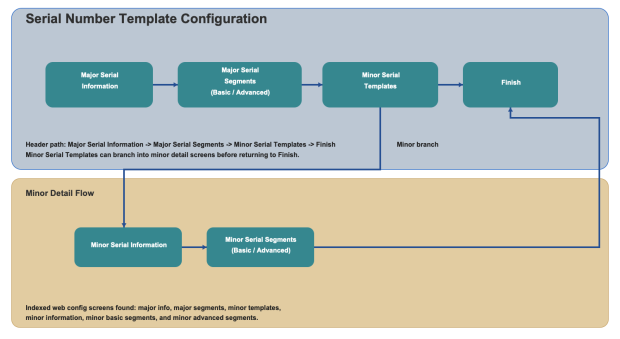

        
        <h1 style="text-align: left;font-size: 12pt" data-source-node="n57">Serial Number Template Configuration
        </h1>
        <h4 data-source-node="n59">Overview</h4>
        
 

        
Serial Number Template configuration defines the structure used to capture and validate major and minor serial number values. You can configure fixed segment definitions and use advanced pattern validation for segment entry.

        <h4 data-source-node="n62"> </h4>
        <h4 data-source-node="n63">Configuration Hierarchy</h4>
        
 

        

            
        

        
 

        
 

        <h4 data-source-node="n69">Configure Serial Number Template</h4>
        
 

        <h5 data-source-node="n71">1. Major Serial Information</h5>
        
 

        
<b data-source-node="n74">Major Serial Number Description</b>: Enter the description for the major serial number template.

        <ul data-source-node="n75">
            <li data-source-node="n76">
                
<b data-source-node="n78">Allow Range Entry</b>: Enable this option if users should enter serial numbers as a range when supported.

            </li>
            <li data-source-node="n79">
                
<b data-source-node="n81">Allow Duplicates</b>: Enable this option if duplicate serial numbers are allowed for this template.

            </li>
        </ul>
        
 

        <h5 data-source-node="n83">2. Major Serial Segments</h5>
        
 

        
Define major serial number segments using Segment Type, Length, and Value.

        <ul data-source-node="n86">
            <li data-source-node="n87">
                
<b data-source-node="n89">Basic Mode</b>: Use basic segment setup for standard segment definitions.

            </li>
            <li data-source-node="n90">
                
<b data-source-node="n92">Advanced Mode</b>: Use pattern-based configuration with Pattern and Test Data to validate segment rules.

            </li>
        </ul>
        
 

        <h5 data-source-node="n94">3. Minor Serial Templates</h5>
        
 

        
Review and maintain minor serial number template records linked to the selected major template.

        <ul data-source-node="n97">
            <li data-source-node="n98">
                
<b data-source-node="n100">Add New Minor Serial Number</b>: Create a minor template record.

            </li>
            <li data-source-node="n101">
                
<b data-source-node="n103">Edit/Delete</b>: Update or remove the selected minor template.

            </li>
        </ul>
        
 

        <h5 data-source-node="n105">A. Minor Serial Information</h5>
        
 

        
<b data-source-node="n108">Minor Serial Number Description</b>: Enter the description for the minor serial template.

        
<b data-source-node="n110">Allow Duplicates</b>: Enable when duplicate values are allowed for minor serial numbers.

        
 

        <h5 data-source-node="n112">B. Minor Serial Segments</h5>
        
 

        
Define minor serial number segments using Segment Type, Length, and Value.

        <ul data-source-node="n115">
            <li data-source-node="n116">
                
<b data-source-node="n118">Basic Mode</b>: Configure standard segment definitions.

            </li>
            <li data-source-node="n119">
                
<b data-source-node="n121">Advanced Mode</b>: Configure pattern-based validation with Pattern and Test Data.

            </li>
        </ul>
        
 

        
Use Save to preserve your progress and Continue to move through the configuration steps.

        
 

    