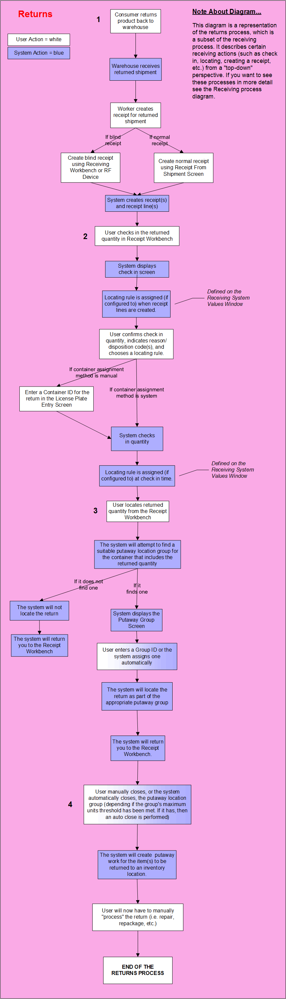

        
        <h1 data-source-node="n56">Returns Process Summary</h1>
        
<a href="c8560c338e6a97414b70d7033501624f7b8184c248942b1d397328383f163a04.html" style="font-style: normal;color: #000000;font-weight: bold" data-source-node="n58">Functionality</a>
        

        
<b data-source-node="n60">** Process Flows **</b>
        

        
 

        
 

        
This process diagram illustrates how the system handles product that 
 is returned to your warehouse. 

        
 

        

            
        

        
 

        
 

        <h4 data-source-node="n69">Step 1: Product returned to warehouse; receipt created for returned 
 shipment.</h4>
        
The returns process starts when a consumer returns product that they 
 have purchased to your warehouse. SCALE can process returns from the moment 
 they arrive at the receiving dock to the point at which the returned item 
 is ready to be putaway into an inventory location.

        
 

        
The first step in processing a return is to create a receipt from the 
 shipment that includes the returned item(s). This can be done using one 
 of two methods: creating a receipt from the shipment itself or creating 
 a blind receipt. 

        <ul type="disc" class="ul_1" data-source-node="n73">
            <li data-source-node="n74">Receipt from 
 a Shipment: The dock worker would use the Shipment Insight screen to 
 create a receipt directly from the returned shipment. They will enter 
 the receipt's pertinent data in the Receipt From Shipment Window.  </li>
            <li data-source-node="n76">Blind Receipt: 
 The dock worker would use the Receipt Workbench (or an RF device) to 
 create a new "blind" receipt. This type of receipt allows a 
 user to create a receipt "on the fly" without having to enter 
 a receipt into the system. Blind receipts help workers process 
 returns in a timely manner.</li>
        </ul>
        
Regardless of the receipt creation method, the system will create the 
 receipt/receipt line(s) according to information on the shipment, and/or 
 other data that you provide.

        
 

        
 

        <h4 data-source-node="n80">Step 2: User checks in returned product.</h4>
        
For the next step, the dock worker will have to check in the returned 
 item quantity that is now included on a receipt. They will perform this 
 action on the Receipt Workbench. When the system begins executing the 
 check in action, the user will have to provide the following information:

        <ul type="disc" class="ul_1" data-source-node="n82">
            <li data-source-node="n83">Confirm the quantity 
 of the returned items that you want to check in.  </li>
            <li data-source-node="n85">Enter the condition 
 codes of the returned items: a reason code and/or a disposition 
 code. These values are not mandatory; however, if your warehouse supports 
 them, they can help give further information about the condition of the 
 returned items. Also, they can help the system find a suitable location, 
 as the locating rule can be affected by these values.  </li>
            <li data-source-node="n87">Choose a locating 
 rule for the returned item quantity. This rule typically would 
 define a location that returns are taken for manual processing (see step 
 4 of this text). Note that the rule used can be determined automatically 
 by the reason/disposition code, as each code has a locating rule associated 
 with it.  </li>
            <li data-source-node="n89">Assign a license plate ID, if the user's receiving preference dictates that they are required 
 to manually assign a license plate ID. If not, the system will automatically 
 assign this value.  </li>
            <li data-source-node="n92">If active, the user will have to verify the putaway group ID.</li>
        </ul>
        
 

        <h4 data-source-node="n94">Step 3: User locates returned product.</h4>
        
After check in, the worker will now need to locate the returned quantity 
 using the Receipt Workbench. During the locating process, the system 
 will attempt to find a suitable putaway location group for the return. 
 A putaway location group allows a series of received items to be putaway 
 as one group. These groups are defined on the Putaway Location Group Window.

        <ul type="disc" class="ul_1" data-source-node="n96">
            <li data-source-node="n97">If the system 
 finds a group, it will display the Putaway Group Window, where 
 the user can confirm which containers were assigned to which putaway groups. 
   </li>
            <li data-source-node="n99">If the system 
 does not find a group, it will not locate the return.  </li>
            <li data-source-node="n102">Note that the user may have to verify the putaway group ID if defined to do so in the putaway group configuration.</li>
        </ul>
        
 

        <h4 data-source-node="n104">Step 4: Putaway location group is closed; user manually processes returned 
 item(s).</h4>
        <ul type="disc" class="ul_1" data-source-node="n105">
            <li data-source-node="n106">A worker will need to close the putaway group 
 in the Putaway Workbench Window. This will indicate that work has finished 
 on this return, and the item(s) are ready to be putaway in an inventory 
 location. The system can automatically close a putaway group, if the group's 
 maximum units threshold has been met. If it has, then an auto close is 
 performed. Note that one can also reopen or remove containers from a putaway group 
 using this window.   </li>
            <li data-source-node="n108">After a group is closed, the system will create 
 the putaway work for the item(s) to be returned to an inventory location.  </li>
            <li data-source-node="n110">The final step then in the SCALE returns process 
 begins after the returned quantity has been checked in and located, and 
 the putaway location group has been closed. A worker then will take the 
 returned quantity from the receiving dock (typically in a tote/bin with 
 other related return items) to a special area for manual processing. These 
 manual activities include such actions as (but not limited to):  - Taking the returned item out of its shipping container  - Fixing/assessing damaged items  - Repackaging/shrink wrapping the item  After the manual processing is complete, the item quantity will now 
 reside in the returns area with other items from its putaway group. The 
 items then will await a worker, who will execute the putaway work instruction 
 and place the item in its intended inventory location.</li>
        </ul>
        
 

        
 

        
 

        
 

        
 

    