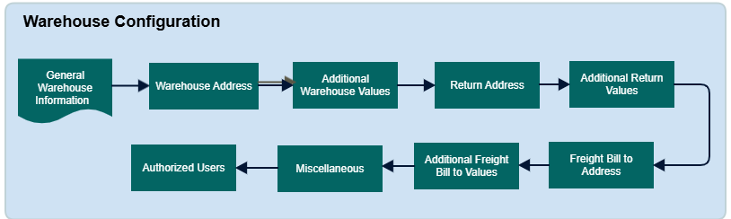

        
        <h1 style="text-align: left;font-size: 12pt" data-source-node="n56">Warehouse Configuration
        </h1>
        <h4 data-source-node="n58">Overview</h4>
        
Enables user to  set up and manage key warehouse parameters.

        <h4 data-source-node="n60"> </h4>
        <h4 data-source-node="n61">Configuration Hierarchy</h4>
        
 

        

            
        

        
 

        <h4 data-source-node="n66">Configure User Profile</h4>
        
 

        <h5 data-source-node="n68">General Warehouse Information </h5>
        
 

        
<b data-source-node="n71">Warehouse</b>: This field identifies the warehouse linked to a user, data entity (such as shipment, receipt, item, etc.), or any process, procedure, or activity associated with the warehouse.

        
 

        
<b data-source-node="n74">Warehouse Name</b>: The name of the warehouse.

        
 

        
<b data-source-node="n77">Time Zone</b>: Choose the appropriate time zone for the warehouse. The system will use this time zone when defaulting date-only fields to determine the correct date.

        
 

        
<b data-source-node="n80">UCC/EAN Number</b>:

        
 

        
This field holds the UCC/EAN identifier assigned to the warehouse or shipping entity (such as a company).

        
If the system generates container IDs during packing, the UCC/EAN number will occupy positions 4-10 of the ID.

        
For codes longer than 7 characters, three flexible positions are available.

        
 

        
If a vendor-compliant label is produced for a container linked to this number, and it includes a UCC-128 barcode, the UCC/EAN number will appear in positions 4-10 of the barcode.

        
 

        <h5 data-source-node="n88">Warehouse Address </h5>
        
 

        
This section defines the address associated with the warehouse. The following fields can be used to provide the complete address:

        <ul data-source-node="n91">
            <li data-source-node="n92">
                
City

            </li>
            <li data-source-node="n94">
                
Country

            </li>
            <li data-source-node="n96">
                
Postal Code

            </li>
            <li data-source-node="n98">
                
State

            </li>
        </ul>
        
Address Fields 1-3: These fields can be used to enter the name, street, and suite address. At least Address Field 1 must contain a value.

        
These address fields are also used for the Return Address and Freight Bill Address

        
 

        
The address fields are the same for the <b data-source-node="n104">Warehouse Address</b>, <b data-source-node="n105">Return Address</b>, and <b data-source-node="n106">Freight Bill-To Address</b> sections.

        
 

        <h5 data-source-node="n108">Additional Warehouse Values</h5>
        
 

        
<b data-source-node="n111">Attention To</b>: This field specifies the individual who should receive correspondence, invoices, shipments, or any other items related to receipts sent to or shipments sent from the warehouse.

        <ul data-source-node="n112">
            <li data-source-node="n113">
                
Phone Number

            </li>
            <li data-source-node="n115">
                
Fax Number

            </li>
            <li data-source-node="n117">
                
Email Address

            </li>
        </ul>
        
The fields at Additional Return Values, Additional Freight Bill to Values are same as above.

        
 

        <h5 data-source-node="n121">Labor</h5>
        
Configure the labor values. Read <a href="435d216f7d877879265d008c99919ff3f51b433dc37de2213372f141ddcd5e49.html" data-source-node="n123">Labor</a>  for more information.

        <h5 data-source-node="n124"> </h5>
        <h5 data-source-node="n125">Miscellaneous</h5>
        
 

        
<b data-source-node="n128">Interface</b>
        

        <ul data-source-node="n129">
            <li data-source-node="n130">
                
<a href="5a77b0822aea16be5c29024ad3695a1b24f10e3042af5b7e38522e2512aeceaa.html" data-source-node="n132">Upload Receipt Lines with 0 Quantity Received </a>
                

            </li>
            <li data-source-node="n133">
                
<a href="c6101864a5efdadf60ea1fa4dbfe90f5a16521304a7290dc1a90d8d72a2f73a8.html" data-source-node="n135">Upload Closed Receipts with 0 Quantity Received</a>
                

            </li>
            <li data-source-node="n136">
                
<a href="952ad0480fe0266cf7d147257dd3d8134801dae6dbaf43dc2baebaf6e7f301a9.html" data-source-node="n138">Split Consolidated Shipment on Upload</a>
                

            </li>
        </ul>
        
 

        
<b data-source-node="n141">SQL Server Reporting Services</b>
        

        
 

        
<b data-source-node="n144">Rendered Document PDF File Directory</b>: This field specifies where SQL Server Reporting Services should save rendered PDF files. Note that these files are not automatically deleted after being printed by the default PDF reader application

        
.

        
This field is part of the Warehouse and Document Type Configurations. The document type path is appended to the warehouse path to form the full path for the PDF directory. For example, if the warehouse path is \\Localhost\ILS\Reporting\SSRS and the document type path is Allocation Pick List, the full path will be \\Localhost\ILS\Reporting\SSRS\Allocation Pick List.

        
 

        
<b data-source-node="n149">Note</b>: If the document type path is left blank, the document will be printed using the warehouse path. If the warehouse path is blank, the document type path must be a valid path

        
 

        <h5 data-source-node="n151">8. Authorized Users</h5>
        
Select the users authorized for the warehouse.

        
 

        
 

        
 

        
 

    