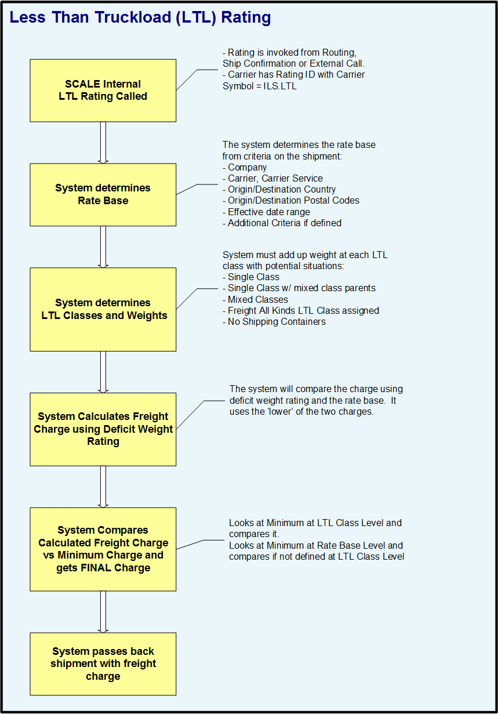

        
        <h1 data-source-node="n56">Less Than Truckload Rating Process Summary</h1>
        
<a href="66f522d9ea61a79265d4f554eefaa3cf9eb580ca5083eb1e4a3282e7a7c55376.html" style="font-style: normal;font-weight: bold" data-source-node="n58">Functionality</a>
        

        
<a href="dc00c5fc10d6dcd7c8ab0f4764c6a743bff2853b818ec60bcaee60e39a1280f9.html" style="font-style: normal;font-weight: bold" data-source-node="n60">Scenarios</a>
        

        
<b style="font-style: italic" data-source-node="n62">** Process Flows **</b>
        

        
 

        
 

        
Below is a graphical representation of the processes for Less Than Truckload (LTL) functionality:

        
 

        

            
        

        
 

        
 

        
 

        
 

        
 

        
 

        
 

        
 

        
 

        
 

        
 

        
 

        
 

        
 

        
 

        
 

        
 

    