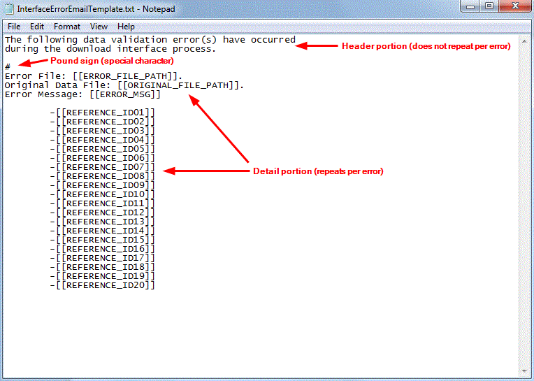

        
        <h1 data-source-node="n56">Creating a Custom Email Template</h1>
        
You can use email templates to define the structure of an alert 
 email. You can create these templates in any text editor (for instance, 
 Windows Notepad). The system does provide several default templates which 
 should meet most of your needs. Note that you will only need to create 
 a new template if you wish to send an alert with a specific information 
 layout. 

        
 

        
 

        <h4 data-source-node="n61">Modifying a Default Email Template...</h4>
        <ul data-source-node="n62">
            <li data-source-node="n63">We recommend that you do not modify the default email templates. Future 
 releases may include template updates, which will override your modified 
 template. Instead, copy an existing template and modify the copy.</li>
        </ul>
        
 

        
 

        <h4 data-source-node="n66">Interface Validation Warehouse Alert Email Template Notes...</h4>
        <ul data-source-node="n67">
            <li data-source-node="n68">In the shipped template for the Interface Validation warehouse alert, there is a pound sign (#) that is used for a special character, that indicates that all the information after it will repeat for each error listed in the alert email. If this # character is removed, the system will still send an email to the recipient that lets the user know that this character needs to be added back to the template.   </li>
        </ul>
        
 

        
 

        <h4 data-source-node="n75">Procedures...</h4>
        <ol data-source-node="n76">
            <li value="1" data-source-node="n77">
                
Open Windows Notepad (or 
 another text editor), and create a new text document.

                
 

            </li>
            <li value="2" data-source-node="n80">
                
Enter any text and/or field references 
 required for this email.

                
 

            </li>
            <ul type="disc" class="ul_1" data-source-node="n83">
                <li data-source-node="n84">
                    
Plain Text: You can 
 place any type of text on an email template.

                    
 

                </li>
                <li data-source-node="n87">Field References: 
 You can import a database value for any field appearing on the shipment 
 or shipping container table. To insert a field value...  From the shipment header table: Place the field's database 
 name surrounded by two square brackets on your template. You do not need 
 to specify which database you are getting this value from, as the system 
 will default to the shipment header table. For example, if you wanted 
 to include the shipment ID, then you would reference the field in the 
 template like this:    [[shipment_id]]  From the shipping container table: Place the database table's 
 name AND the field's database name surrounded by two square brackets on 
 your template. For example, if you wanted to include the company associated 
 with a container, then you would reference the field in the template like 
 this:    [[shipping_container.company]]  Note that the system can only display values from one randomly-chosen container, regardless of the number of containers actually on the shipment. This means that this functionality would best be used in a situation where the desired container field is common to all containers.   To get a value (such as tracking number) to repeat (i.e. list all of the values in a comma delimited list), you need to put an @ in front of the field (in this example, [[@shipping_container.tracking_number]]).  See your database administrator or consultant for a list of field 
 code words for the source table fields.</li>
            </ul>
            
 

            <li value="3" data-source-node="n97">Save the template 
 in the Printing Directory on the application server. The system 
 will only reference templates stored in this directory.</li>
        </ol>
        
 

        
 

        
 

        
 

        
 

        
 

        
 

        
 

        
 

        
 

        
 

        
 

        
 

        
 

        
 

        
 

        
 

        
 

        
 

        
 

        
 

        
 

        
 

        
 

        
 

        
 

        
  

    