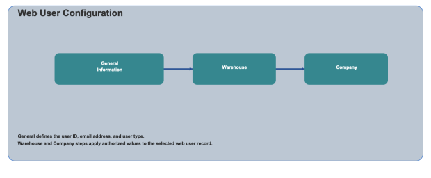

        
        <h1 style="text-align: left;font-size: 12pt" data-source-node="n57">Web User Configuration
        </h1>
        <h4 data-source-node="n59">Overview</h4>
        
 

        
Web User configuration is used to create and maintain web user records for SCALE web access. You can define the user type, then associate the user to one or more warehouses and companies.

        <h4 data-source-node="n62"> </h4>
        <h4 data-source-node="n63">Configuration Hierarchy</h4>
        
 

        

            
        

        
 

        <h4 data-source-node="n68">Configure Web User</h4>
        
 

        <h5 data-source-node="n70">1. Web User</h5>
        
The Review Web Users screen displays existing records and allows record maintenance.

        <ul data-source-node="n72">
            <li data-source-node="n73">
                
<b data-source-node="n75">Review Web Users</b>: View existing users with Web User, Type, and Email Address columns.

            </li>
            <li data-source-node="n76">
                
<b data-source-node="n78">Add New Web User</b>: Create a new web user record.

            </li>
            <li data-source-node="n79">
                
<b data-source-node="n81">Edit/Delete</b>: Update or remove the selected web user record.

            </li>
        </ul>
        
 

        <h5 data-source-node="n83">1. General</h5>
        
Enter core web user details.

        <ul data-source-node="n85">
            <li data-source-node="n86">
                
<b data-source-node="n88">Web User</b>: Enter the web user ID.

            </li>
            <li data-source-node="n89">
                
<b data-source-node="n91">Email Address</b>: Enter the email address for the web user.

            </li>
            <li data-source-node="n92">
                
<b data-source-node="n94">Type</b>: Select either <b data-source-node="n95">Internal</b> or <b data-source-node="n96">External</b>.

            </li>
        </ul>
        
 

        <h5 data-source-node="n98">2. Warehouse</h5>
        
Select one or more warehouses that will be applied to the web user.

        <ul data-source-node="n100">
            <li data-source-node="n101">
                
<b data-source-node="n103">All/List</b>: Toggle selection behavior for warehouse records.

            </li>
            <li data-source-node="n104">
                
<b data-source-node="n106">Show Selected</b>: Filter the display to selected warehouses.

            </li>
            <li data-source-node="n107">
                
<b data-source-node="n109">Search</b>: Search warehouse values before selection.

            </li>
        </ul>
        
 

        <h5 data-source-node="n111">3. Company</h5>
        
Select one or more companies that will be applied to the web user.

        <ul data-source-node="n113">
            <li data-source-node="n114">
                
<b data-source-node="n116">All/List</b>: Toggle selection behavior for company records.

            </li>
            <li data-source-node="n117">
                
<b data-source-node="n119">Show Selected</b>: Filter the display to selected companies.

            </li>
            <li data-source-node="n120">
                
<b data-source-node="n122">Search</b>: Search company values before selection.

            </li>
        </ul>
        
 

        
Use Back, Continue, and Finish to move through the configuration steps and save the Web User record.

    