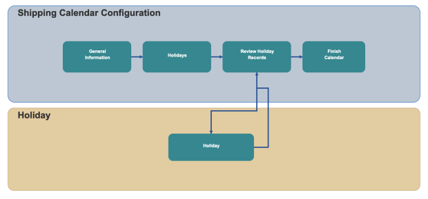

        
        <h1 style="text-align: left;font-size: 12pt" data-source-node="n56">Shipping Calendar Configuration
        </h1>
        <h4 data-source-node="n58">Overview</h4>
        
 

        
Shipping Calendar configuration defines carrier no-ship days used by routing and delivery commitment calculations. You can manage weekend exclusions and holiday dates, then associate the calendar to carrier records.

        <h4 data-source-node="n61"> </h4>
        <h4 data-source-node="n62">Configuration Hierarchy</h4>
        
 

        

            
        

        
 

        
 

        <h4 data-source-node="n68">Configure Shipping Calendar</h4>
        
 

        <h5 data-source-node="n70">1. Shipping Calendar</h5>
        
 

        
Select or create the shipping calendar record from the Shipping Calendar step.

        <ul data-source-node="n73">
            <li data-source-node="n74">
                
<b data-source-node="n76">Create New</b>: Create a new calendar record.

            </li>
            <li data-source-node="n77">
                
<b data-source-node="n79">View All</b>: Review and select an existing calendar record.

            </li>
            <li data-source-node="n80">
                
<b data-source-node="n82">Current Selection</b>: Displays the selected shipping calendar record used by the carrier.

            </li>
        </ul>
        
 

        <h5 data-source-node="n84">A. General</h5>
        
 

        
<b data-source-node="n87">Shipping Calendar</b>: Enter the calendar identifier.

        
<b data-source-node="n89">Description</b>: Enter a description for the calendar.

        
<b data-source-node="n91">Exclude All Saturdays</b>: Enable to mark Saturday as a no-ship day.

        
<b data-source-node="n93">Exclude All Sundays</b>: Enable to mark Sunday as a no-ship day.

        
 

        <h5 data-source-node="n95">B. Holidays</h5>
        
 

        
Review and maintain holiday entries linked to the selected calendar.

        <ul data-source-node="n98">
            <li data-source-node="n99">
                
<b data-source-node="n101">Add New Holiday</b>: Create a new holiday date record.

            </li>
            <li data-source-node="n102">
                
<b data-source-node="n104">Edit</b>: Update the selected holiday record.

            </li>
            <li data-source-node="n105">
                
<b data-source-node="n107">Delete</b>: Remove the selected holiday record.

            </li>
        </ul>
        
 

        <h5 data-source-node="n109">B1. Define Holiday</h5>
        
 

        
<b data-source-node="n112">Date</b>: Enter the no-ship holiday date.

        
<b data-source-node="n114">Description</b>: Enter the holiday description.

        
<b data-source-node="n116">Apply To All Calendars</b>: Enable to apply the holiday to all shipping calendars.

        
 

        
Use Back, Save, and Continue through the configuration steps, then Finish to complete shipping calendar setup.

        
 

    