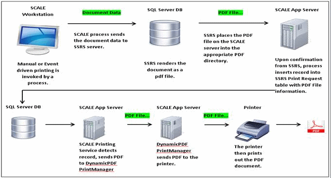

        
        <h1 data-source-node="n56">Paperwork Process Summary</h1>
        
<a href="55af77d15ea086df1525f231a6b3792823d2c0be73ad904b830fb751012a0e56.html" style="font-style: normal;font-weight: bold" data-source-node="n59">Functionality</a>
        

        
<b data-source-node="n61">** Process Flows **</b>
        

        
 

        
 

        
Below is a diagram that describes the high-level flow of SCALE printing using SQL Server Reporting Services:

        
 

        
 

        

            
        

        
 

        
 

        
 

        
 

        
 

        
 

        
 

        
 

        
 

    