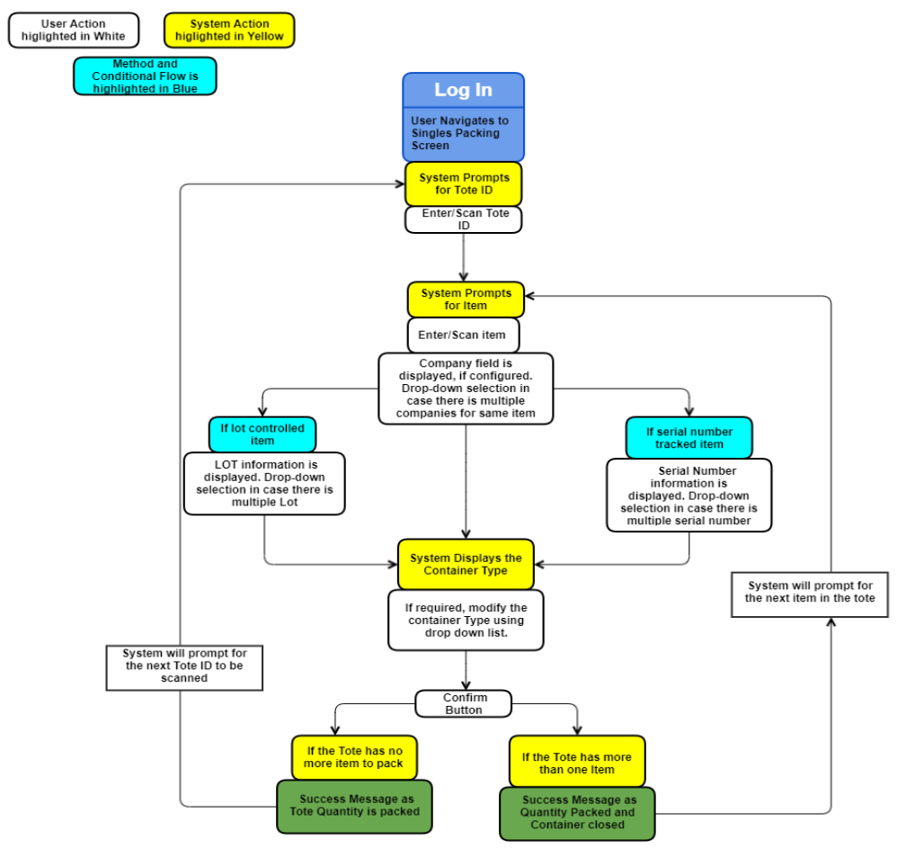

        
        <h1 data-source-node="n57">Single Unit Packing - Process Flow</h1>
        
Single Unit Packing process flow is discussed in the document.

        
 

        
 

        <h4 data-source-node="n61">Related Topics...</h4>
        
<a href="f992a81240ef21071a0c60e111f7a41770da3bcd1ad4ca55d2f3db634e255a7f.html" data-source-node="n63">Closing a 
 Container</a>
        

        
<a href="dea9460d5d20c3a94c680eb9a0874d5d51fad31c0aea9f133fa482c1f91acf1a.html" data-source-node="n65">Closing a Container (RF)</a>
        

        
<a href="7b4a6ef1c835af34ee3893ec7445fc39b81925227dcfef1fff39adfb2392e9e9.html" data-source-node="n67">Nesting a Container (RF)</a>
        

        
<a href="07edc31677cc85116035ff7f2dff1c2a3f7a1a38afdb4aaf867617691a7483ac.html" data-source-node="n69">Packing Setup Overview</a>
        

        
<a href="5ac29e4a274425e27625988f719182ef57034ce6339602c8fa1afa288cacbe66.html" data-source-node="n71">Packing/Shipping Process Summary</a>
        

        
<a href="09d7c55151bc58dc95828462b1416f5a5602599e5d202d3b02ed61a2f191f2f1.html" data-source-node="n73">Serial Number Entry Screen</a>
        

        
 

        
 

        <h4 data-source-node="n76">Process Flow</h4>
        
 

        

             
            
        

        
 

        <ol data-source-node="n83">
            <li value="1" data-source-node="n84">Access the Single Unit Packing 
 Screen. 
  </li>
            
 

            <li value="2" data-source-node="n87">Identify the Tote for which single packing need to be performed. </li>
            
 

            <li value="3" data-source-node="n90">Enter/Scan the Tote ID click the initiation (arrow) button.   </li>
            <li value="4" data-source-node="n92">Enter/Scan the Item ID or Item cross reference value. If company is configured, then the system will display or prompt user to choose the Company from the drop-down.  </li>
            <li value="5" data-source-node="n94"> Lot Controlled items - When Lot controlled Items are scanned, the system will display the Lot information and then user can select the container type as required.  </li>
            <li value="6" data-source-node="n97">Serial number items - When serial number Items are scanned, the system will display the serial number drop-down list. User can choose the serial number if there are multiple configured for the item.</li>
            <li value="7" data-source-node="n98">Use the Container Type Field 
 to identify the type of container you are packing into.  The container types available for packing can be authorized by company and warehouse. See the <a href="b8520236e77bf1d9729a56d56a398123183351403f9a3eff7e86595795483b9e.html" data-source-node="n99">Defining Container Types</a> for more details.  </li>
            <li value="8" data-source-node="n102">
                
Select the <b data-source-node="n104">Confirm</b> Button. 
 The system will pack the tote item into the container. The success message will be based if the item in Tote is packed or all items in the tote is packed. 

            </li>
        </ol>
        
 

    