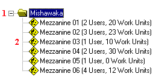

        
        <h1 data-source-node="n56">Picking Management Explorer Node/Level Descriptions</h1>
        
The Picking Management Explorer contains one node: the Warehouse Node. 
 This node provides a treeview level that allows you to drill through them 
 to reach the amount of detail required for your research. This topic provides 
 descriptions of this node and its level.

        
 

        
 

        <h4 data-source-node="n61">Related Topics...</h4>
        
<a href="76770f4602f9b9e52b4fce3fb8973ffa25b3e882ead4fd0e2faea14766f877a3.html#pickMan" data-source-node="n63">Work Process Summary</a>
        

        
<a href="63fce052573d8abfe6a45fd191ff6881a7d4e4dc8d037ecdc124418e157ec3fb.html" data-source-node="n65">Picking Management Setup Overview</a>
        

        
<a href="d114e048049d66584a42a020611a6659f5b2950e0912f87d395e30d98dbed9c0.html" data-source-node="n67">Picking Management Process 
 Diagram</a>
        

        
<a href="1a75d6a66c308c9a7c8aa7ace1121d4ccbd75226aab7bf5a08209b9a5fdfa3c5.html" data-source-node="n69">Identifying a Quality Measures Reason Code</a>
        

        
<a href="cd3741887f8caeefd25da429127f48789337e8470ee9bf0b3d304849b963314c.html" data-source-node="n71">Assigning/Unassigning an Instruction 
 to a Team/User</a>
        

        
<a href="5b89491720e798c06ed1da2542cf04bdb137db52f5d20e794ddd87a79ea3c360.html" data-source-node="n73">Releasing Work Units</a>
        

        
<a href="2a849da2c18bc5244f4e44f5346f871a765c86c96d43a011314a5857cfea60c5.html" data-source-node="n75">Processing Work</a>
        

        
<a href="5ea80956b207057fdc2d841bb836a676ef62f554f56c6da1c57f1997b9f84e20.html" data-source-node="n77">Processing RF Work</a>
        

        
<a href="af12a877ef6e18f7b653ab2e0bacbd54768b13e3f6be1c6103a1f3990d10bd5a.html" data-source-node="n79">Performing a Group Pick (Paper-Based)</a>
        

        
 

        
 

        

            
        

        
 

        <h4 data-source-node="n85">Graphic Descriptions...</h4>
        
To 
 find a specific description, match the red node/level number in the graphic 
 above with its corresponding number in the table below. This table contains 
 every possible treeview level that could appear under a Picking Management 
 Explorer Node. For this reason, every level described below does not necessarily 
 appear in every node. The graphic above displays a completely-expanded 
 node for the Warehouse Node.

        
 

        <table style="margin-left: 0;margin-right: auto" data-source-node="n88">
            <col data-source-node="n89">
            <col style="width: 118px" data-source-node="n90">
            <col style="width: 367px" data-source-node="n91">
            <col style="width: 388px" data-source-node="n92">
            <tbody data-source-node="n93">
                <tr data-source-node="n94">
                    <td data-source-node="n95">
                        
 

                        
 

                    </td>
                    <td data-source-node="n98">
                        
<i data-source-node="n100">Node/Level</i>
                        

                        
 

                    </td>
                    <td data-source-node="n102">
                        
<i data-source-node="n104">Special Icons?</i>
                        

                        
 

                    </td>
                    <td data-source-node="n106">
                        
<i data-source-node="n108">Description</i>
                        

                        
 

                    </td>
                </tr>
                <tr data-source-node="n110">
                    <td data-source-node="n111">
                        
1

                    </td>
                    <td data-source-node="n113">
                        
Warehouse Node

                    </td>
                    <td data-source-node="n115">
                        
none

                    </td>
                    <td data-source-node="n117">
                        
This node organizes the currently-active 
 work zones by name. 

                        
 

                    </td>
                </tr>
                <tr data-source-node="n120">
                    <td data-source-node="n121">
                        
2

                        
 

                    </td>
                    <td data-source-node="n124">
                        
Zone Level

                        
 

                    </td>
                    <td data-source-node="n127">
                        

                             (work zone that has picking management activated)

                    </td>
                    <td data-source-node="n130">
                        
This level provides summary-level data about each work zone. This level 
 provides the following information: zone, the number of users, and the 
 number of work units open. 

                        
 

                    </td>
                </tr>
                <tr data-source-node="n133">
                    <td data-source-node="n134">
                        
 

                    </td>
                    <td data-source-node="n136">
                        
Record List

                    </td>
                    <td data-source-node="n138">
                        

                             (open, unassigned work instruction)

                        

                             (work instruction that is on hold)

                        

                             (work instruction that is assigned to a user)

                        
 

                    </td>
                    <td data-source-node="n146">
                        
The record list (located on the right side of the explorer window), 
 displays detail-level data about each work zone.

                    </td>
                </tr>
            </tbody>
        </table>
        
 

        
 

        
 

        
 

        
 

        
 

        
 

        
 

        
 

        
 

        
 

        
 

        
 

        
 

        
 

        
 

        
 

        
 

        
 

        
 

        
 

        
 

        
 

        
 

        
 

        
 

        
 

    