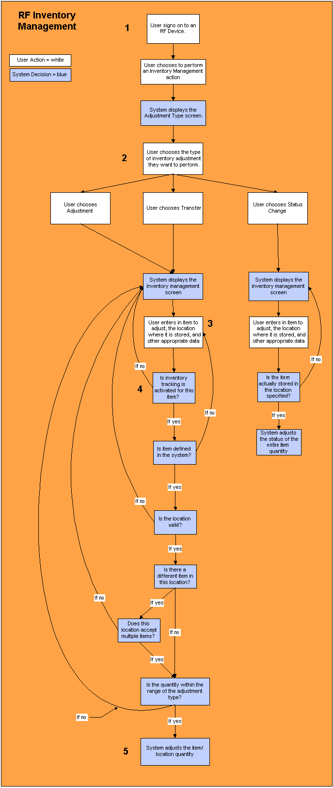

        
        <h1 data-source-node="n56">Inventory Management Process Summary</h1>
        
<a href="9c9b2f34d8c2aeee8291236b7db3a8d7712db3a3188eda0681cc00157c1ccdfe.html" style="font-style: normal;color: #000000;font-weight: bold" data-source-node="n58">Functionality</a>
        

        
<b style="font-style: italic" data-source-node="n60">** Process Flows **</b>
        

        
 

        
 

        
 

        
This process diagram illustrates how the system uses inventory management 
 to adjust inventory quantities in the warehouse.

        
 

        

            
        

        
 

        <h4 data-source-node="n69">RF inventory management</h4>
        
Inventory management represents several processes, all of which concern 
 adjusting item quantities at inventory locations in the warehouse: positive 
 &amp; negative adjustments, status changes, and transfers from one location 
 to another. 

        
 

        <h4 data-source-node="n72">Step 1: The user signs on to the RF device.</h4>
        
A situation arises in the warehouse where a quantity of inventory needs 
 to be adjusted. A warehouse employee signs on to an RF device in order 
 to rectify the situation.

        
 

        
 

        <h4 data-source-node="n76">Step 2: The user chooses which type of adjustment to perform.</h4>
        
The user chooses to perform an inventory management action from the 
 RF main menu. The system will display the user and warehouse authorized adjustment types. 
 The specific fields that the system displays will depend on the adjustment 
 type chosen.

        
 

        
 

        <h4 data-source-node="n80">Step 3: The user enters the item they want to adjust.</h4>
        
<i data-source-node="n82">Item Adjustment / Location Transfer:</i> 
 The user enters into the RF device the item that they want to adjust, 
 and the location where this item resides. Also entered is such data as 
 company and lot number. 

        
 

        
<i data-source-node="n85">Status Adjustment:</i> The user 
 enters into the RF device the item that they want to change the status 
 of, and the location where it is stored. Also entered is such data as 
 company and lot number. You can change the status of an item quantity in one location, or all location(s) in the warehouse which contain a quantity of this item. 

        
 

        
 

        <h4 data-source-node="n88">Step 4: The system performs several validations to the item and location 
 that you want to adjust.</h4>
        
<i data-source-node="n90">Item Adjustment / Location Transfer:</i> 
 The system will need to determine if this item is eligible for inventory 
 tracking. Items can only be adjusted if the system is currently tracking 
 its inventory. Inventory tracking is defined per item on the Item Window. 
 If this item has inventory tracking active, the system will continue with 
 the adjustment process. If it is not, the system will alert you of this 
 fact, and ask you for another item.

        
 

        
Other validations the system will need to perform include the following: 
 

        <ol data-source-node="n93">
            <li type="1" class="li_6" value="1" data-source-node="n94"><i data-source-node="n95">Is the item 
 defined in the system?</i> The system will determine if the item you 
 are trying to adjust is defined on the item master. If it is, the system 
 will continue with the adjustment processing. If it is not, the system 
 will ask the user for a different item. This system decision is defined 
 by configuring the "Validate Item" flag on the Inventory Control 
 Values Window.  </li>
            <li type="1" class="li_6" value="2" data-source-node="n97"><i data-source-node="n98">Is the location 
 valid?</i> The system will determine if the location you are trying 
 to adjust to/from is defined on the location configuration window. If 
 it is, the system will continue with the adjustment processing. If it 
 is not, the system will ask the user for a different item. This system 
 decision is defined by configuring the "Validate Location" flag 
 on the Inventory Control Values Window.  </li>
            <li type="1" class="li_6" value="3" data-source-node="n100"><i data-source-node="n101">What item(s) 
 does this location contain?</i> The system will determine if the location 
 you are trying to adjust to/from already contains item(s), or if it is 
 empty. If it already contains the same item you are trying to adjust        OR 
 if it is empty, the system will continue with the adjustment processing. 
 If it contains a different item or items, the system will continue with 
 the validation outlined in step 4 below.  </li>
            <li type="1" class="li_6" value="4" data-source-node="n103"><i data-source-node="n104">Does this location 
 accept multiple items?</i> If the validation in step 3 above is met, 
 this means that you want to adjust an item into a location that already 
 contains an item. Before it can perform this adjustment, the system will 
 first need to determine if the location can accept multiple items. If 
 it can, the adjustment processing will continue. If it cannot, the system 
 will ask the user for a different item.</li>
        </ol>
        
 

        
<i data-source-node="n107">Status Adjustment:</i> The system 
 will perform a validation to make sure that the item actually resides 
 in the location that you specified. If it does, the system will adjust 
 the item's status. If it is not, the system will ask you for another item/location 
 combination.        This is 
 the end of the status adjustment process.

        
 

        
 

        <h4 data-source-node="n110">Step 5: The system adjusts the item quantity.</h4>
        
After the system has performed all the appropriate validation steps 
 outlined above, the system will adjust the item quantity. 

        
 

    