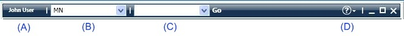
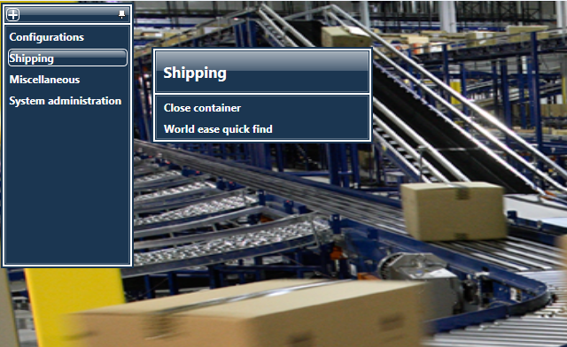
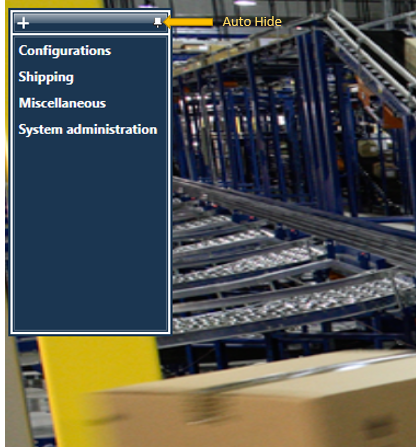
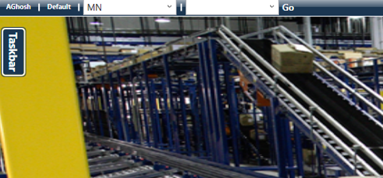
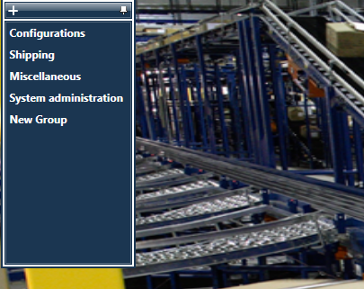
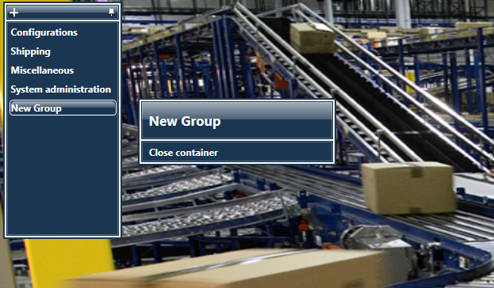
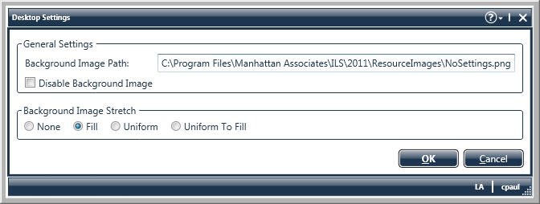

        
        <h1 data-source-node="n56">Using the Desktop</h1>
        
The 
 Desktop will appear when you start the application. You will use the Desktop for configurations and some system administration functions. Also, the Desktop has such interactive features as user-defined groups for screen shortcuts, and configurable <a href="c53141cc7bb6a9fa71cc07ddfedfe862e527a7b3f9cb1b028b6df9eb40031bd5.html" data-source-node="n59">gadgets</a> that can display a wide range of warehouse-related data. Also, the system then will perform a security check to assess what functional components the user logging in
 has permission to access.

        
 

        
NOTE: For information regarding Desktop gadgets, please see the topic <a href="c53141cc7bb6a9fa71cc07ddfedfe862e527a7b3f9cb1b028b6df9eb40031bd5.html" data-source-node="n62">Using Gadgets</a>.

        
 

        
 

        <h4 data-source-node="n65">Related Topics...</h4>
        
<a href="85149c7693291207b2c43b2565198094a6af1ad3eaa3cb03fe2dfa28c7a351d1.html" data-source-node="n67">General System Concepts Process Summary</a>
        

        
<a href="63fce052573d8abfe6a45fd191ff6881a7d4e4dc8d037ecdc124418e157ec3fb.html" data-source-node="n69">Desktop Setup Overview</a>
        

        
<a href="c53141cc7bb6a9fa71cc07ddfedfe862e527a7b3f9cb1b028b6df9eb40031bd5.html" data-source-node="n71">Using Gadgets</a>
        

        
 

        
 

        
The following subjects are discussed in this topic:

        <blockquote data-source-node="n75">
            
- <a href="#titlebar" data-source-node="n77">Using the Titlebar</a>

            
- <a href="#taskbar" data-source-node="n79">Using the Taskbar</a>

            
- <a href="#desktopSettings" data-source-node="n81">Defining Desktop Settings</a>

            
- <a href="#custom" data-source-node="n83">Adding a Custom Desktop Logo</a>

            
- <a href="#security" data-source-node="n85">Securing the Desktop</a>

        </blockquote>
        
 

        <h4 data-source-node="n87">Using the Titlebar...</h4>
        
The Titlebar is comprised of the space at the top of the Desktop, which includes several menus and the standard Windows minimize/maximize/close buttons. The following graphic outlines the different parts of the Titlebar:

        
 

        

            
        

        
 

        
 

        
(A) User Name: This area displays the name of the current user that is logged into the system. Note that the name displayed here is the Description value of your user profile record.

        
 

        
(B) Warehouse: Your current warehouse is displayed as a drop-down menu on 
 the Titlebar. The warehouse that initially displays is the default on your user profile record. You can change the warehouse that you are currently viewing data from by selecting a different one from this menu.

        
 

        
(C) Quick Launch Menu: You can quickly access any system window from the Titlebar. When you choose a window from the drop-down list and press the Go button (or the keyboard's Enter button), the system will display the selected window.

        
 

        
(D) Help Menu: You can access the online help and the SCALE informational screen using the Titlebar. 

        
 

        

        
 

        
 

        <h4 data-source-node="n106">Using the Taskbar...</h4>
        
The Desktop's Taskbar includes the shortcuts that you can use to access the windows defined on the desktop.  Note that if you do not have security to access a certain window, it will appear inactivated. 

        
 

        
 

        

            
        

        
 

        <h4 data-source-node="n114">Docking the Taskbar...</h4>
        
You can dock the Taskbar to the left-hand side of the screen. This is helpful if you need extra room on the screen.

        
 

        
1. Press the Push Pin button on the top right corner of the Taskbar.

        
 

        

            
        

        
 

        
2. The system will then dock the Taskbar to the left side of the Desktop.

        
 

        

            
        

        
 

        
3. To have the Taskbar reappear, hover the mouse over the Taskbar button.

        
 

        
 

        <h4 data-source-node="n130">Shortcut Groups</h4>
        
You can create custom menu shortcut groups on the Taskbar. These groups can contain 
 any number of links to various application windows. Also, these shortcut groups are user-specific, 
 so different users can maintain their own separate groups. In addition to creating groups, you can also delete/edit the existing groups as well.

        
 

        
 

        <h5 data-source-node="n134">To Creating A New Shortcut Group</h5>
        <ol class="ol_1" data-source-node="n135">
            <li value="1" data-source-node="n136">Right-click the Desktop Taskbar, and select Add Group. The system will 
 add a new shortcut group to the bottom of the Taskbar menu.  </li>
            <li value="2" data-source-node="n138">Right-click the 
 name of the new group and choose Rename Group. Provide text for 
 the name and press the Enter button. The system will now display the group's new name on the Taskbar.</li>
        </ol>
        

            
        

        
 

        <h5 data-source-node="n142">To Add Window Shortcuts To An Existing Shortcut Group</h5>
        <ol class="ol_1" data-source-node="n143">
            <li value="1" data-source-node="n144">Access the shortcut that you want to add to your shortcut group.  </li>
            <li value="2" data-source-node="n147">With the mouse, drag and drop the shortcut to your group.  </li>
            <li value="3" data-source-node="n150">The system will then add the shortcut to your group. </li>
        </ol>
        

            
        

        
- You can also move shortcuts back to their original group, and move them around in order on a jumplist.

        
 

        
- You cannot delete a shortcut group that contains link(s) in it. You will first need to remove the links, and then the system will allow deletion of the group.

        
 

        
- You cannot create a group name using the character ^ .

        
 

        
 

        

        
 

        
 

        <h4 data-source-node="n164">Defining Desktop Settings...</h4>
        
 

        <h5 data-source-node="n167">Changing the Background Image</h5>
        
By default, the Desktop displays a warehouse image in the background. You can choose to add a custom graphic image as the background of the Desktop.

        
 

        
1. On the Desktop, right-click the Desktop area and choose Desktop Settings. The system will display the Desktop Settings Window:

        
 

        

            
        

        
 

        
2. Use the Background Image Path Field to indicate where the image that you want to use as a background is located. Note that the image file must be located in a local directory of the machine that you are using (provide a local path, as seen in the above example). The type of image files that are supported are .bmp, .gif, .jpeg, .jpg, and .png.

        
 

        
3. Select the Disable Background Image Checkbox if you want the system to not display an image on the Desktop (the background will appear completely white).

        
 

        
4. Use the Background Image Stretch Field to indicate how you want the system to display your image on the Desktop: 

        <ul data-source-node="n181">
            <li data-source-node="n182">None - Indicates that the image will be displayed in its original size (without any stretching).  </li>
            <li data-source-node="n185">Fill - Indicates that the image will completely fill the current dimensions of the Desktop.  </li>
            <li data-source-node="n188">Uniform - Indicates that the image will be resized to fit in the Desktop's dimensions while it preserves its native aspect ratio.  </li>
            <li data-source-node="n191">Uniform To Fill - Indicates that the image will be resized to fill the Desktop's dimensions while it preserves its native aspect ratio. If the aspect ratio of the destination rectangle differs from the source, the source content is clipped to fit in the Desktop's dimensions.</li>
        </ul>
        
5. Press OK to save your settings. The image you defined will now display as the Desktop background.

        
 

        

        
 

        
 

        <h4 data-source-node="n197">Adding a Custom Desktop Logo...</h4>
        
You can also add your company's logo to the bottom of the Desktop screen.

        
 

        
1. Place the logo's graphic file in the Resource/Images folder on your application server. Note that if you have multiple application servers, this file will need to be present on each of these servers.

        
 

        
2. In the application's System Text Editor, search for the Images BMP_INSERTLOGO  key. Update this resource key with the name of the image.  

        
 

        
3. To view the new logo on the Desktop, you will need to commit the Image resource by clicking Apply from the System Text Editor, and restart the application.

        
 

        
 

        

        
 

        
 

        <h4 data-source-node="n211">Securing the Desktop...</h4>
        
The Security Permissions Window includes a security checkpoint that is used to secure what users can configure the Desktop. The security setting listed below pertains to the general use of the Desktop. To learn about security settings specifically related to Desktop gadgets, please see the topic "Using Gadgets".

        
 

        
 

        <h4 data-source-node="n216">SCALE Desktop Security Checkpoint</h4>
        <ul data-source-node="n217">
            <li data-source-node="n218">Modify Desktop Settings: Determines if you can access the Desktop Settings windows.</li>
        </ul>
        
 

        
 

        
 

        
 

        
 

        
 

        
 

        
 

        
 

        
 

        
 

        
 

        
 

        
 

        
 

        
 

        
 

        
 

        
 

        
 

        
 

        
 

        
 

        
 

        
 

        
 

        
 

        
 

        
 

        
 

        
 

        
 

        
 

        
 

        
 

        
 

        
 

        
 

        
 

        
 

        
 

        
 

        
 

        
 

        
 

        
 

        
 

        
 

        
 

        
 

        
 

        
 

        
 

        
 

        
 

        
 

        
 

        
 

        
 

        
 

        
 

        
 

        
 

    