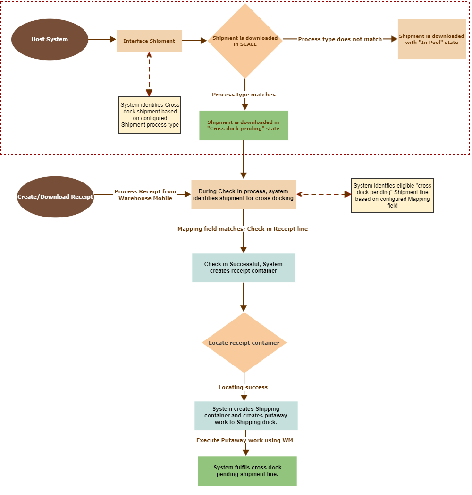

        
        <h1 data-source-node="n56">Cross Dock Process Flow</h1>
        
The Cross Dock Process Flow is illustrated below.

        
 

        <h4 data-source-node="n59">Related Topics...</h4>
        <ul data-source-node="n60">
            <li data-source-node="n61">
                
 <a href="844de4836dceadc6912694d8ab57060be0a80ac55ab4289205c14e2449caeb90.html" data-source-node="n63">Cross Dock</a>

            </li>
        </ul>
        
 

        
 

        
 

        

            
        

    