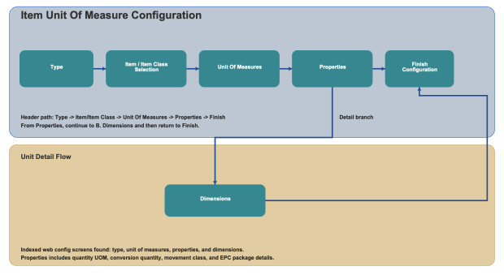

        
        <h1 style="text-align: left;font-size: 12pt" data-source-node="n57">Item Unit Of Measure Configuration
        </h1>
        <h4 data-source-node="n59">Overview</h4>
        
 

        
Item Unit Of Measure configuration defines unit conversion, movement handling, and dimensional values used during inventory and execution operations. You configure the record by selecting item scope, maintaining unit properties, and defining physical dimensions.

        <h4 data-source-node="n62"> </h4>
        <h4 data-source-node="n63">Configuration Hierarchy</h4>
        
 

        

            
        

        
 

        
 

        <h4 data-source-node="n69">Configure Item Unit Of Measure</h4>
        
 

        <h5 data-source-node="n71">1. Type</h5>
        
 

        
Select whether the Unit Of Measure record is maintained by individual item or by item class.

        <ul data-source-node="n74">
            <li data-source-node="n75">
                
<b data-source-node="n77">Item</b>: Configure unit values for a specific item.

            </li>
            <li data-source-node="n78">
                
<b data-source-node="n80">Item Class</b>: Configure unit values shared by items in the selected class.

            </li>
        </ul>
        
 

        <h5 data-source-node="n82">2. Unit Of Measures</h5>
        
 

        
Review and maintain the Unit Of Measure records for the selected item or class.

        
From this screen, select a record to continue into Properties and Dimensions details.

        
 

        <h5 data-source-node="n87">A. Properties</h5>
        
 

        
<b data-source-node="n90">Quantity Unit of Measure</b>: Select the unit used for quantity entry and conversion.

        
<b data-source-node="n92">Conversion Quantity</b>: Enter the conversion quantity value for the selected unit.

        
<b data-source-node="n94">Movement Class</b>: Select the movement class associated with this unit definition.

        
<b data-source-node="n96">Treat As Full Percent</b>: Define the percent value used to treat the unit as full.

        
<b data-source-node="n98">EPC Package ID</b>: Enter the EPC package identifier when required.

        
<b data-source-node="n100">Treat As Loose in Container Creation</b>: Enable when this unit should be treated as loose during container creation.

        
 

        <h5 data-source-node="n102">B. Dimensions</h5>
        
 

        
<b data-source-node="n105">Length</b>: Enter the unit length.

        
<b data-source-node="n107">Width</b>: Enter the unit width.

        
<b data-source-node="n109">Height</b>: Enter the unit height.

        
<b data-source-node="n111">Weight</b>: Enter the unit weight.

        
<b data-source-node="n113">Dimension Unit of Measure</b>: Select the UOM for length, width, and height values.

        
<b data-source-node="n115">Weight Unit of Measure</b>: Select the UOM for weight.

        
 

        
Use Back and Continue to move through screens, and Finish to save the Item Unit Of Measure configuration.

        
 

    