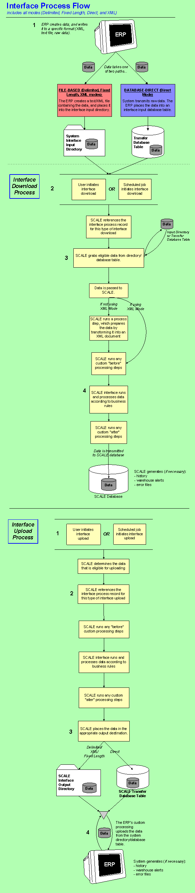

        
        <h1 data-source-node="n56">Interface Process Summary</h1>
        
<a href="178aec6d3faf8830199512924f58cf463d20acfbc6b6485c40a0948c32a1cd0e.html" style="font-style: normal;color: #000000;font-weight: bold" data-source-node="n58">Functionality</a>
        

        
<b data-source-node="n60">** Process Flows **</b>
        

        
 

        
 

        
This topic includes a process diagram that describes both the download 
 and upload processes for both file-based interfacing (delimited, fixed 
 length, and XML) and direct-to-database interfacing. 

        
 

        

            
        

        
 

        <h4 data-source-node="n68">Download interface process </h4>
        
Below are steps describing how the download interface process works 
 in all interface modes (including delimited, fixed length, direct, and 
 XML). The numbered steps below correspond with the steps in the graphic 
 above. In the discussion below, the ERP is identified as the entity responsible 
 for communicating with the system. In reality, the ERP, a custom tool, 
 a shipping program, or many other agents might be responsible for transmitting 
 and accepting data. The help uses one name, ERP, to streamline the example 
 and minimize confusion.

        
 

        
NOTE: The steps below 
 pertain to all interface modes (delimited, fixed length, direct, and XML), 
 unless otherwise noted.

        
 

        
 

        <h4 data-source-node="n74">Step 1: The ERP transmits data to the appropriate destination.</h4>
        <ul type="disc" class="ul_1" data-source-node="n75">
            <li data-source-node="n76">In delimited, 
 fixed length, and XML mode, the ERP creates a text/XML file containing 
 the data records to interface. It then transmits this file to the appropriate 
 interface input directory. This directory is defined in the system on 
 the Interface System Values Window, and will store the data files temporarily 
 until processed by the SCALE interface.  </li>
            <li data-source-node="n78">In direct mode, 
 custom processing retrieves data from the ERP and transmits it 
 to the "transfer" interface database tables (where the data 
 temporarily resides until it is interfaced into the system).</li>
        </ul>
        
 

        <h4 data-source-node="n80">Step 2: Download initiated; the interface attempts to create values 
 from the interface records.</h4>
        <ol class="ol_2" data-source-node="n81">
            <li value="1" data-source-node="n82">
                
The user accesses the Interface Data Window, selects the Download 
 Button, and the functional area associated with the data they want to 
 interface. Alternatively, one can create a scheduled job that tells the 
 system to kick off the interface download automatically at a certain time 
 of day.

                
 

            </li>
            <li value="2" data-source-node="n85">The system will reference the interface process 
 record, which provides the interface with the following key information:  - the type of data is to be interfaced.  - the maximum number of transactions that the interface can process 
 per event.  - In delimited, fixed length, and 
 XML mode, the file extension that the interfaced text/XML file 
 will have. This extension identifies what type of data is included in 
 the file. For example, the extension ".RCT" could represent 
 receipt values.</li>
        </ol>
        
 

        <h4 data-source-node="n93">Step 3: System retrieves data and readies it for processing.</h4>
        <ol class="ol_2" data-source-node="n94">
            <li class="li_5" value="1" data-source-node="n95">The system first will 
 retrieve all eligible data from either the transfer database tables (for 
 direct mode) or from the interface input directory (for delimited/fixed 
 length/XML modes).   </li>
            <li class="li_5" value="2" data-source-node="n98">The data, then, is 
 passed to SCALE, and how it is handled depends on the interface mode:  In direct mode, the data  will 
 first be transformed into XML by converting it to a "legacy" 
 XML document.             In XML mode, no special preparations are needed, as the data 
 is already in the required XML format.  In delimited and fixed length modes, 
 SCALE will first transform the data into XML by converting it to 
 a "legacy" XML document, based on the appropriate interface 
 data map record.   </li>
            <li class="li_5" value="3" data-source-node="n106">In any mode, the system will run any custom process steps 
 that are defined to run before the interface is started.  </li>
        </ol>
        <h4 data-source-node="n108">Step 4: The interface retrieves the data.</h4>
        <ol class="ol_2" data-source-node="n109">
            <li value="1" data-source-node="n110">The SCALE interface retrieves the XML data document.  </li>
            <li value="2" data-source-node="n112">The interface will process 
 through the records in the order that they appear in the file. It retrieves 
 the appropriate SCALE interface data map record and uses it to parse the 
 record (for delimited files, 
 the system looks at the first position on each record to identify the 
 correct data map). The values in the file are all assigned a position 
 by the ERP. These correspond to the positions defined on the data map. 
 The system matches the positions, thus arriving at the values to interface. 
 The interface will perform validations as it parses, based on values defined 
 in system configurations.   </li>
            <li value="3" data-source-node="n114">The interface will then transmit the processed 
 data to the appropriate SCALE database table. The interface also writes 
 all of the valid records to the production tables. These records will 
 appear in the appropriate system windows.   </li>
            <li value="4" data-source-node="n116">Next, the interface generates a process text file, 
 which it places in the output directory. This file identifies all values 
 that were interfaced properly. It also creates an error XML file, which 
 it places in the output directory. This file identifies all of the records 
 that could not be interfaced. The error message indicating what went wrong 
 during the interface process will be in a separate node. One can review 
 this information and make the appropriate changes. Note that someone in 
 your organization should purge these process and error files at regular 
 intervals.  </li>
            <li value="5" data-source-node="n118">In SCALE, process history records are generated, 
 which indicate if any problems occurred during the interfacing process. 
 Warehouse alerts will be generated if any problems occurred during the 
 interface process.  </li>
            <li value="6" data-source-node="n120">In any mode, the system will run any custom process steps that are defined to 
 run after the interface has finished.  </li>
        </ol>
        
 

        

        
        
 

        
 

        <h4 data-source-node="n126">Upload interface process</h4>
        
Below are steps describing how the upload interface process works in 
 all interface modes (direct, delimited, fixed length, and XML).

        
 

        <h4 data-source-node="n129">Step 1: Upload initiated.</h4>
        <ol class="ol_2" data-source-node="n130">
            <li value="1" data-source-node="n131">The user accesses the Interface Data Window, selects 
 the Upload Button, the upload output (tables, delimited file, XML), and 
 the functional area whose data they want to interface. Alternatively, 
 one can create a scheduled job that tells the system to kick off the interface 
 upload automatically at a certain time of day. Note that the user can 
 perform an upload for multiple functional areas.  </li>
            <li value="2" data-source-node="n133">SCALE will then need to determine the data that 
 is eligible to be uploaded to the ERP (i.e. the data is in the correct 
 status to be uploaded by the interface).</li>
        </ol>
        
 

        <h4 data-source-node="n135">Step 2: System reviews interface process record.</h4>
        <ol class="ol_2" data-source-node="n136">
            <li value="1" data-source-node="n137">The system will reference the interface process 
 record, which provides the interface with the following key information:  - the type of data is to be interfaced  - the maximum number of transactions that the interface can process 
 per event  - In delimited/fixed length/XML mode, 
 the file extension that the interfaced text/XML file will have. This extension 
 identifies what type of data is included in the file. For example, the 
 extension ".RCT" could represent receipt values.  </li>
            <li class="li_1" value="2" data-source-node="n145">The system will generate 
 the SCALE data in the format specified in the interface process record.  </li>
            <li class="li_1" value="3" data-source-node="n147">In any mode, the system will run any custom process steps 
 that are defined to run before the interface is started.  </li>
            <li class="li_1" value="4" data-source-node="n150">The interface can filter the data being uploaded using the upload criteria for the item balance, inventory transactions, receiving, or shipping processes. </li>
        </ol>
        
 

        <h4 data-source-node="n153">Step 3: Interface places data file in upload directory.</h4>
        <ol class="ol_2" data-source-node="n154">
            <li value="1" data-source-node="n155">The interface will transmit 
 the file(s) to the appropriate directory. The upload directory is defined either in the process detail or the interface system value.  If the upload directory is not defined in the upload process detail, then the interface will use the directory in the interface system value upload. This directory is where all data files 
 will be stored until uploaded to the ERP.  </li>
            <li value="2" data-source-node="n157">In any mode, the system will run any custom process steps that are defined to 
 run after the interface has finished.</li>
        </ol>
        
 

        <h4 data-source-node="n159">Step 4: The ERP's custom processing will retrieve the data uploaded 
 from the system.</h4>
        <ol class="ol_2" data-source-node="n160">
            <li value="1" data-source-node="n161">Custom processing, written for your ERP, is invoked 
 to retrieve the data from the SCALE Interface Transfer Database tables. 
 This processing will also need to parse the data file(s), based on the 
 ERP's needs and requirements. In delimited 
 files, the system looks at the first position on each record to 
 identify the correct data map that should be used to parse it. Finally, 
 the custom processing will need to upload the parsed values from the interface 
 to the ERP. Someone in your organization should purge these files at regular 
 intervals.</li>
        </ol>
        
 

        
 

        
 

        
 

        
 

        
 

        
 

        
 

    