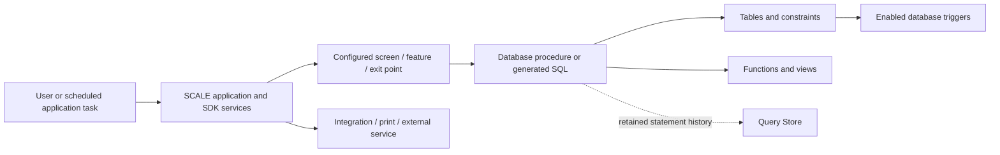

# How the observed database supports SCALE processes

These dossiers join selected deployed SQL behavior with captured vendor documentation. They explain a bounded set of workflows; the generated dictionary does not imply every routine has received this level of review. No process was executed. All SQL links are redacted reading copies, with source fingerprints in their object records.

## The execution layers

The diagram combines vendor-documented application responsibilities with observed database objects. It is conceptual; it does not prove that each deployment activates every arrow. In particular, configuration values and application assemblies were not collected.

## 1. Shipment detail in an Insight screen

The SDK [DetailPane data-retrieval example](../SDK/reading/35cdfcbe2823f6394fe2644f35985b4dd4c0b5f9cf4e66f1d6d0d8f7fa5b8339.md) names `SHP_InsightDetailPaneData` (article SHA `6c46ec3389ead3049deb0ff074e7dad5e36fa23163455fd4aa8613a44804200a`, nodes `n47`, `n80`, `n414`). The procedure exists in the replica: [contract](objects/1633753223.md), [implementation](sql/1633753223.sql).

Its inputs are internal shipment number and culture. It returns four SELECT result sets: shipment/header information from `SHIPMENT_HEADER_VIEW`, parent-container count from `SHIPPING_CONTAINER`, dock-door information through `SHIPPING_LOAD` and `LOCATION`, and detail-derived scalar values. The intervening variable-assignment SELECT emits no result set. Status-name functions provide display-oriented values. The SDK explains binding scalar and tabular results into the DetailPane; this ties a database contract to a user-facing screen without assuming current screen configuration.

One bounded review item: the captured assignment to `@dockDoorInternalNum` selects from the shipment view joined to shipping load without a shipment WHERE filter in that statement. The input filters other statements. Record this as a source observation requiring functional review; no incorrect screen result was reproduced, and no vendor code was changed.

## 2. Work-monitor chart and counts

The SDK [Monitor example](../SDK/reading/2f1e464b919bbe6d9db8cf9f7a2eb6d5cfd5866b662fd85c0ef3c9c02005b000.md) names `WRK_MonitorWorkGroupChartData` and its filter parser (SHA `8ffbb7c80b927b1c7e10e600060b6bf4e40ee562531deb705745193a32d6fd60`, nodes `n59`, `n97`). The deployed [procedure](objects/1082799265.md) and [SQL](sql/1082799265.sql) accept filter criteria and culture.

The procedure parses criteria through `fn_GetMonitorFilterParameters`, derives a warehouse filter, groups distinct work units by work group, joins configuration descriptions and emits chart data. It also calculates total work units/instructions/estimated time and condition-dependent counts. A separate closed-work count uses `WORK_INSTRUCTION_VIEW` with a last-hour timestamp condition. Those are database-defined summary calculations; the labels and exact condition strings are omitted from the sanitized SQL and remain supported by the vendor example/private source review.

The input filters and current work records determine actual displayed values. No actual warehouse counts, user filters or active monitor configuration were read.

## 3. Selecting work for execution

`WRK_GetWorkInstructionsForExecution` has the largest statement-execution total among currently resolved stored procedures in this retained Query Store extract (99,418). Some unresolved historical object IDs have larger totals. That is a prioritization signal, not its number of user tasks. See [contract](objects/51843597.md) and [SQL](sql/51843597.sql).

The visible implementation uses work profile, zone authorization, user/warehouse authorization, system configuration, container/work-unit inputs, grouping/sequence information and feature checks. It constructs and executes dynamic SQL through `sp_executesql`; some branches probe candidate work before constructing further selection. The exact runtime query and eligible work depend on supplied arguments and configuration values.

An intelligence answer can explain those selection dimensions and cite the source. It cannot explain why a particular operator sees a particular task from schema alone. The static dependency catalog does not fully enumerate identifiers embedded in the redacted dynamic strings.

## 4. Inventory adjustment coordinates several operations

`INV_AdjustInv` is an orchestration routine inside the database: [contract](objects/1128703419.md), [SQL](sql/1128703419.sql). The visible code validates required inputs, records an audit branch, determines transaction effects, optionally validates/picks serial numbers, conditionally calls `INV_PickFromLocation` and `INV_PutIntoLocation`, then conditionally places serial numbers. It propagates nonzero return codes and checks SQL errors at several call boundaries.

The [pick-side implementation](objects/1400704388.md) includes location-inventory lookup/creation, quantity-effect calculations, serial archival, container/location-related handling, catch-weight branches and inventory-change history. It calls `sp_getapplock` with an unbounded lock wait in one source branch; that is a property of the stored implementation, not a lock taken by this assessment. Exact lock ownership/release and caller transaction scope need the broader caller review before concurrency guarantees can be stated.

This explains why an inventory change can affect more than one quantity or history object. It does not establish which flags apply to a particular warehouse transaction. Inventory process summaries are available in the [vendor process index](PROCESS_INDEX.md).

## 5. Ship confirmation updates a hierarchy of statuses

`SHP_SetStatusesAtShipConfirm` takes shipment number, load number, new status and status limit: [contract](objects/1809753850.md), [SQL](sql/1809753850.sql).

The captured implementation:

1. Creates qualifying warehouse-alert requests when the shipment advances, with a duplicate-request existence check.
2. Reads the shipment warehouse, sets header leading/trailing status and ship timestamp, and derives local status dates through the warehouse-timezone function.
3. Rearranges detail status/quantity slots according to the status limit, preserving the code's special exclusion for status `995`.
4. Sets shipping-container status for that shipment.
5. Updates the load's leading status and calculates trailing status from the minimum trailing shipment status on the load.

This is a static SQL sequence, not proof of the complete Ship Confirm application transaction. The source does not establish carrier calls, paperwork, shipment-interface delivery or caller-level commit/rollback. Status meanings must come from the relevant documented process/configuration; this guide does not invent the meaning of `995`.

## 6. Printing configuration is returned before external printing

The SDK [transaction-page example](../SDK/reading/b3abb86eef566392ab2aa6ce2b5f576ef52ba0a341213b3ff03625d30c4a5a7b.md) describes `MetaTrans_GetPrintSelectedDocuments` (SHA `08d6d2caff7838953e546693c975e85ced3dd716046be663dd9a300de12931fe`, nodes `n61`, `n89`, `n138`). The deployed [contract](objects/901226611.md) accepts an internal number, print-process code, culture and username; [SQL](sql/901226611.sql) reads the user's default document/label printer and branches by process code to return suitable records.

Returning printer/document information does not itself prove that a printer received a job. The application and print service own further steps. Actual printer names, user records and documents were not collected; no print command was issued.

## 7. Triggers add behavior to receiving and work creation

`RECEIPT_HEADER_A_I` runs AFTER INSERT on receipt headers: [SQL](sql/720057651.sql). When an inserted receipt has a trailer ID, it links the header to `TRAILER_YARD_STATUS` using warehouse/trailer and status zero, and propagates stamp fields. A direct application insert can therefore cause an additional update without an explicit separate application call.

`work_instruction_outgoing_pd` runs AFTER INSERT on work instructions: [SQL](sql/800057936.sql). It first checks whether any inserted row meets its type/location predicates; if so, its UPDATE joins all inserted instruction IDs and sets the outgoing pickup/drop location from `to_templ_field1`. The triggering condition and update scope are distinct in the source. That is a static behavior observation, not a reproduced operational defect.

All six observed triggers were enabled. The remaining receipt-update, shipment-accessorial, container-tree and trailer-yard triggers have [individual references](OBJECT_INDEX.md). No DML was performed to test trigger behavior.

## 8. Queues and scheduled jobs require deployment reconciliation

AIM [Using the Process Queue](../AIM/reading/a7f6d1beac7f307465dbfb76e05f48fbaa42e8389f635aa78fa14836c814ab11.md) documents polling, priority, environment-specific concurrency, Ready → In Process, and removal on completion (SHA `026fcc97acd153bda0f5e652d7528f5ae06d492af4214ad2d327df22b4e63e36`, nodes `n58`, `n62`, `n64`, `n85`). Its text uses `QUEUE_PROCESS`/`QUEUE_SERVICE`, while an example names `Q_PROCESS`. The [queue management article](../AIM/reading/a007abffcb6ac40efcc49cce65fafa13da9232c8f48a7805e3098dbce99608bc.md) describes `QUEUE_PROCESS_REQUEST` and Failed → Ready reset (SHA `73d6f7354d892ce894d6d10b24b0c71f837bcf057ebeb9631574589821b944dd`, nodes `n58`, `n68`).

None of those four exact queue identifiers is present in the observed replica. Do not invent aliases or query another database. `SCHEDULED_JOBS` and `BATCH_SUBMISSION_CONFIG` are present and the [AIM scheduling article](../AIM/reading/89cd7c907a14ac69519371eda239e33c8578f7f1e4049b7feebd15cb21bfc537.md) documents application job parameters and operations, including Build Wave and Ship Confirm All. Matching schema names do not identify which jobs are active or their configured schedule. Application scheduled jobs are not SQL Server Agent jobs.

## 9. UI metadata and integration extend beyond routines

The SDK [UI metadata example](../SDK/reading/2947132cd4956ea18b05a31ba95ea4781245188fab631288551ad3e8094e543a.md) identifies forms, security checkpoints, screen groups/controls/events and parameters (SHA `305e062b35ffcbb58dd17f2df965781a8a2a31d55b66690102ec6650bf69b6e1`, nodes `n101`, `n115`, `n119`, `n123`, `n124`, `n168`, `n175`). `SCREEN_CONTROL` and related objects exist, but their active records were not read. An app must not infer the current screen layout from table structure alone.

SDK [batch runtime configuration](../SDK/reading/8414582bde78311a1f3d5fc4126c501487cab8fcfd17b79cc2cf7ca91d59cdf1.md) and [.NET integration endpoints](../SDK/reading/151fb685ffa48d0988636095b3af7881bab2d21e6ea0f1f1f260a337c40eebce.md) describe application configuration/assemblies outside database metadata. AIM [interface functionality](../AIM/reading/178aec6d3faf8830199512924f58cf463d20acfbc6b6485c40a0948c32a1cd0e.md) and [Direct Interface Mode](../AIM/reading/61af67b120854906f19efe85e28b244803c58bfa586ae250f2bdc37eb4870fac.md) supply the user/integration lifecycle. Use them as documentary evidence and retain the explicit deployment/runtime gaps.
