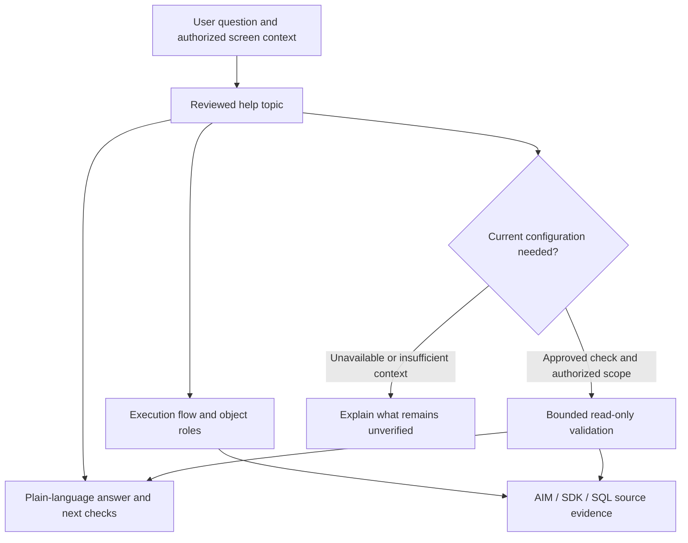

# SCALE functionality and help framework

The primary reporting unit is a question about a SCALE task: what the user is doing, what SCALE does next, which rules change the outcome, and what the user can check. Tables and stored procedures supply the implementation evidence underneath that explanation.

The intended reader is a person with little or no SCALE experience and limited time, including people with visual impairments. This knowledge base is the foundation of a central SCALE “brain”: it must explain the system quickly in accessible language while preserving enough reviewed evidence to answer follow-up questions accurately. Complete functionality and execution behavior remain the target; the current help topics are the first reviewed slice.

The initial [help topics](HELP_TOPICS.md) contain concrete answers and execution flows. The [functional role register](FUNCTIONAL_ROLES.md) distinguishes transactional state, configuration, master/reference information, reporting, orchestration, history and integration. The [configuration validation report](CONFIGURATION_VALIDATION.md) records the separately authorized, bounded replica checks. These are inputs for the help section; an interactive help application has not been deployed.

All **1,138 captured eligible modules**, including **921 stored procedures**, have bounded static contracts. Functional roles cover **1,655/1,656 objects**; the remaining table purpose is unestablished. All **34 captured process families** have documentary review and their 130 refinements are available in local help. Five configuration observations retain their original capture time; no family has full deployment reconciliation. Current help, SDD and HTTP evaluation counts come from the hash-bound [section progress report](../_project/COMPLETION_REPORT.md).

## What a user should receive

| User's question | The help answer must provide |
| --- | --- |
| What does this function do? | Business purpose, when it applies, required inputs and expected result. |
| What happens when I select it? | Ordered application/database/service steps, including conditional branches and effects. |
| Why does the result differ? | Relevant rules, configuration scope and prerequisites; distinguish possible causes from a checked cause. |
| What can I validate? | An available approved configuration check, its exact scope and observation time. |
| Why is it taking time? | Known processing stages and any applicable measurements; distinguish statement statistics from elapsed task duration. |
| What do I do next? | Documented checks or UI actions appropriate to the question, with permission and deployment limits retained. |

The main answer should be understandable without opening AIM or SDK. Source citations remain available in an expandable evidence area. Object names, hashes and implementation caveats belong there unless they help resolve the user's question. If two sources disagree, the answer explains the practical uncertainty instead of silently choosing one.

## Accessible help for novice users

Use a short first answer: what the function does, why it matters, and the next useful check. Define terms such as allocation, work unit and ship confirmation when first needed. Let the user ask for more detail without losing the current task context.

The interface must support keyboard navigation, visible focus, meaningful control labels, logical headings, screen-reader reading order, text resizing and sufficient contrast. Status and evidence confidence must have text labels rather than color alone. Every flow diagram needs equivalent ordered text. Expandable detail must expose its name and expanded state; validation results and errors must be announced without unexpectedly moving focus. Do not make hover, icons, position on a screen or visual inspection the only route to information.

Keep the answer order consistent: **What it does → What happens → What can affect it → What you can check → More detail and sources**. Numbered instructions use one action per step and describe the expected result. The current Markdown topics and native HTML prototype support this content structure; they do not establish accessibility conformance. Current JAWS and broader display owner acceptance are closed (C14/C17), with bounded browser/keyboard observations and no captured local JAWS session or full technical accessibility matrix. Check future changes for regressions without reopening those accepted gates.

## Source roles in the central knowledge base

| Source | Contribution | Boundary |
| --- | --- | --- |
| AIM | Business purpose, terminology, process flows and scenarios | Vendor behavior must be reconciled with this deployment. |
| SDK | Extension points, application contracts and implementation examples | Examples do not prove an installed customization or enabled feature. |
| Replica schema and SQL | Observed implementation, table roles, effects and branch logic | Static source alone does not prove a particular execution or current transaction. |
| Reviewed configuration observations and configuration guide | Explain settings and validate the permitted scope | Configuration guides and effective values require their own provenance, version and scope. |
| SDD samples from other deployments | Design patterns, requirements and implementation choices worth comparing | A sample design is not evidence of configuration in this SCALE deployment. Eight unique bodies are extracted; selected claims, settings and diagrams have bounded review. Product/version conflicts and remaining fidelity/applicability gaps are explicit in the SDD review. |
| Future Insight screen register and SOPs | Verified screen/function/navigation associations, task steps and expected results | Screen navigation/capture is a future separately requested task; no screen paths or completed SOPs are invented here. |

Connect sources by reviewed functional claims and deployment/version identity. Preserve contradictions and uncertainty. A future SOP should reuse the reviewed explanation and add verified navigation, permissions, steps and recovery paths; it must not silently replace the explanation with a sequence of clicks.

## Context at the point of work

The future help entry point should carry the screen/function identifier, selected help action, culture and the user's authorized warehouse/company context. Ask only for missing context that changes the answer. A profile, job or configuration key is not interchangeable with an order, inventory or work record: this assessment authorizes selected configuration reads only.

For example, “Why do my work tasks appear grouped?” should first explain the work-profile grouping and selection rules. If the user has permission and a reviewed profile-specific check exists, the app can report the observed setting for that profile with a timestamp. The initial aggregate checks cannot identify an individual operator's profile or prove which rule affected a task.

## Four linked records

1. **Help topic:** business question, short answer, prerequisites, expected result, troubleshooting paths and source claims.
2. **Execution flow:** initiating UI/service/event, ordered steps, READS/WRITES/CALLS effects, branches, transaction/error boundaries and external handoffs. Unknown callers and dynamic targets remain explicit.
3. **Object role:** domain and purpose are separate, and an object can have several roles. A procedure that reads configuration and updates shipments is transactional orchestration; it is not simply “configuration” because it contains a status or configuration reference.
4. **Configuration check:** fixed reviewed query identity, permitted fields and scope, bounded result, observation time, interpretation and freshness limits. A configuration observation supports only its stated claim.

This is the proposed retrieval and validation design. The current tools produce evidence artifacts, not a model-controlled SQL endpoint.

## Runtime reporting

Report runtime in three independent dimensions:

| Dimension | Meaning | Evidence needed |
| --- | --- | --- |
| Execution behavior | What runs, in what order, under which conditions, and which objects change. | Reviewed source and application/process documentation; conditional and external steps marked. |
| Configuration observation | Which reviewed settings exist or apply within the queried scope. | Approved query, parameters, replica identity/read-only check, timestamp and bounded result. |
| Elapsed execution | How long a particular operation or stage took. | Start/end/correlation evidence from the application and services, or clearly scoped DB telemetry. |

The existing Query Store extract covers statement aggregates associated with 154 currently matching object IDs and nine historical unresolved IDs. It cannot establish full process duration. An application's initiation, waiting, printing, carrier requests and completion can fall outside the observed SQL interval. Replica freshness has not been established as a guaranteed bound, so even a new configuration observation is a replica observation rather than proof of the current primary value.

## Documentation sequence and completion

The [functional coverage ledger](mappings/functional-coverage.json) preserves all 34 process-summary families from the captured AIM corpus. These are the known indexed families, not a claim that AIM's summary headings enumerate every SCALE capability. The [help topics](mappings/help-topics.json) and [role register](mappings/functional-roles.json) carry their own reviewed scope.

| Pass | Scope | Completion evidence |
| --- | --- | --- |
| 1 | Work selection/monitoring, inventory adjustment, receiving effects, shipment/ship confirmation, printing and queue limits | Reviewed initial help topics, object roles, cited flows and narrow configuration checks. |
| 2 | Receiving/locating/putaway, inventory tracking/counting, allocation, waves, replenishment and work orders | Full condition/effect/error review, status meaning and configuration dependencies for each flow. |
| 3 | Packing/carriers/paperwork, interfaces/devices, yard/dock, labor/performance and billing | Application and external-service handoffs, supported configuration validation and version reconciliation. |
| 4 | Remaining process families, customization, cross-cutting administration and security | Explicit coverage closure, unresolved evidence decisions and SME-reviewed help answers. |
| 5 | Help integration and acceptance | Retrieval evaluation, correct context/permission handling, denied and stale checks, accessibility and intended-user acceptance. |

A topic is complete only when its claimed behavior, exceptions, configuration dependencies and user-facing answer have been reviewed. A table/SP role review does not complete the entire routine contract. A help draft does not count as user acceptance. The denominator for all processes with end-to-end measured runtime remains unestablished; no overall completion percentage is invented from the structural inventory.

## Help acceptance cases

Evaluate each answer for correctness, useful brevity, supporting citations, applicability to this deployment and handling of missing evidence. Include these failure cases:

- A user asks about a task they cannot access: retain the help explanation but do not disclose restricted configuration or operational records.
- A setting is absent, duplicated, unexpected or stale: report that state; do not substitute a default unless the applicable code/documentation establishes it.
- A configuration query times out or the replica is unavailable: retain the general explanation and label current validation unavailable.
- A vendor example names an object missing from this replica: preserve that mismatch; do not invent an equivalent object.
- A user asks to reset, update or execute a process: the help framework supplies the documented explanation; a separate authorized operational workflow would be needed for effects.
- An answer has only a table-name match: keep it a discovery candidate until the functional claim is reviewed.

These criteria are documented and locally checked where artifacts permit. Live app authorization, user acceptance and complete process timings remain future evidence requirements.
